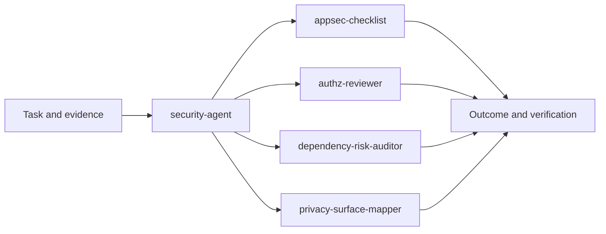

# Security Agent

`security-agent` helps select methods for security agent work. The plugin provides 5 directly usable skills for the specialist tasks below. The assistant combines this knowledge to complete the requested outcome.

> [!NOTE]
> [Architecture](../../docs/architecture.md) · [Documentation Guide](../../docs/AGENTS.md) · [中文](./README_zh.md)

## Quick Facts

| Item | Details |
| --- | --- |
| Role guide | `security-agent` |
| Specialist and composition skills | 4 |
| Main inputs | Code, entry points, trust boundaries, dependency locks, configuration, and findings |
| Main outputs | Evidence-backed findings, impact assessments, remediation, and verification |

## Skills

| Skill | When to use | Main output |
| --- | --- | --- |
| [security-agent](./skills/security-agent/SKILL.md) | Security capability guide | Review scope and actionable findings |
| [appsec-checklist](./skills/appsec-checklist/SKILL.md) | Application security review | Reachable application-security findings |
| [authz-reviewer](./skills/authz-reviewer/SKILL.md) | Identity and authorization review | Permission matrix and access findings |
| [dependency-risk-auditor](./skills/dependency-risk-auditor/SKILL.md) | Dependency risk review | Advisory applicability and upgrade guidance |
| [privacy-surface-mapper](./skills/privacy-surface-mapper/SKILL.md) | Privacy and data-flow mapping | Data inventory, flow map, handling gaps |

## Choosing a Capability

- Use `appsec-checklist` for input handling, sensitive sinks, uploads, remote requests, secrets, and configuration.
- Use `authz-reviewer` for identity, sessions, roles, object ownership, and tenant isolation.
- Use `dependency-risk-auditor` for resolved versions, advisories, reachability, maintenance, and provenance.
- Use `privacy-surface-mapper` for collection, storage, sharing, retention, deletion, and user controls.

## Installation and Use

```text
/plugin marketplace add Neplich/dev-agent-skills
/plugin install security-agent@dev-agent-skills
```

For Codex personal and project installations, see the [installation guide](../../docs/README.codex.md). From the repository root, install all capabilities into the selected target:

```bash
python3 scripts/install_codex_skills.py --target /path/to/skills
```

Describe the goal directly or select a skill through the host, for example:

```text
/authz-reviewer "Check whether ordinary users can access another tenant’s exports."
```

## Inputs and Artifacts

A useful finding names the location, attacker preconditions, reachable path, existing defenses, impact, and correction. Severity reflects demonstrated conditions and assets; confidence reflects evidence quality. Protect sensitive values and use sanitized reproductions.

For durable artifacts, use the project’s existing locations or adapt this layout:

```text
docs/security/{feature}/
  appsec-checklist.md
  authz-review.md
  dependency-audit.md
  privacy-map.md
```

Choose the useful files for the task. Existing documents, code, and tests jointly support expectations and verification.

## Review Evidence

| Review | Evidence to preserve |
| --- | --- |
| Application security | Controlled input, transformations, sensitive sink, defenses |
| Authorization | Principal, action, resource, ownership/tenant context, enforcement |
| Dependencies | Resolved version, advisory date, affected range, runtime use |
| Privacy | Data category, purpose, storage/recipient, retention/deletion, source |

Reports identify reviewed scope, confirmed findings, hypotheses, and unavailable
evidence. Remediation guidance names the responsible path and a concrete
verification. A review can be useful even when it finds no actionable defect;
its conclusion still describes the scope actually inspected.

## Typical Workflow

Define surface → trace evidence → validate impact → report or remediate → verify


```mermaid
flowchart LR
    Context["Task and evidence"] --> Work["security-agent"]
    Work --> S0["appsec-checklist"]
    S0 --> Result["Outcome and verification"]
    Work --> S1["authz-reviewer"]
    S1 --> Result["Outcome and verification"]
    Work --> S2["dependency-risk-auditor"]
    S2 --> Result["Outcome and verification"]
    Work --> S3["privacy-surface-mapper"]
    S3 --> Result["Outcome and verification"]
```

## Combining Capabilities

Combine review with requested code, dependency, configuration, and documentation changes. Verify legitimate behavior alongside the repaired failure mode. Distinguish technical observations from legal interpretation when reviewing privacy obligations.

The assistant continues within existing authorization and identifies concrete decisions when a material product choice or additional operation permission is needed.

## Local Maintenance

Capability sources live under `skills/` in this directory. Update relevant descriptions and installation data with content changes; see the [maintenance guide](../../docs/cookbook/maintain-skills.md) for verification.
