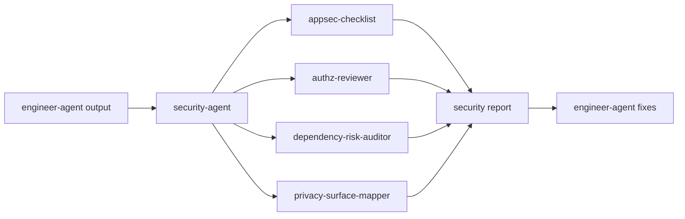

# Security Agent

`security-agent` 是安全审查角色的 dispatcher skill，负责把发布前安全 gate、应用安全检查、认证授权审查、依赖风险和隐私数据流请求路由到合适的安全 specialist skill。

> [!NOTE]
> 其他语言：[English](./README.md)

> [!NOTE]
> Security Agent 的目标是输出证据化风险判断和可执行修复建议。它不替代 Engineer 直接修代码，也不替代 PM 改需求边界。

## 快速信息

| 项目 | 内容 |
| --- | --- |
| 入口 skill | `security-agent` |
| Specialist skills | 4 个 |
| 主要输入 | 代码库、依赖清单、PM 文档、工程文档、QA 反馈 |
| 主要输出 | `docs/security/{feature-name}/` 下的安全报告 |
| 触发时机 | 敏感功能完成后、发布前、专项风险复审时 |

## Skill 清单

| Skill | 适用场景 | 主要产物 |
| --- | --- | --- |
| `security-agent` | 安全请求入口与路由 | 下游 skill 选择与执行路径 |
| `appsec-checklist` | 泛应用安全检查、发布前安全 gate、常见漏洞扫描 | 应用安全检查报告 |
| `authz-reviewer` | 登录、session、角色权限、租户隔离、越权风险 | 认证授权审查报告 |
| `dependency-risk-auditor` | 依赖漏洞、废弃包、供应链风险 | 依赖风险审计报告 |
| `privacy-surface-mapper` | PII、consent、retention、data sharing、GDPR/CCPA 风险 | 隐私数据流映射 |

## 路由规则

- 泛安全 review 或发布前 gate：使用 `appsec-checklist`
- 认证、授权、角色、租户隔离、session：使用 `authz-reviewer`
- 依赖、漏洞、废弃包、供应链风险：使用 `dependency-risk-auditor`
- PII、隐私数据流、consent、retention、GDPR/CCPA：使用 `privacy-surface-mapper`

默认规则：没有明确聚焦 auth、deps 或 privacy 的安全请求，先使用 `appsec-checklist`。

## 输出目录

```text
docs/
└── security/
    └── {feature-name}/
        ├── appsec-checklist.md
        ├── authz-review.md
        ├── dependency-audit.md
        └── privacy-map.md
```

## 典型工作流



## 协作边界

- Security 输出风险分级、证据、影响范围和修复建议。
- Security 不直接做业务实现或部署变更。
- 需要修改代码、依赖或配置时，交由 Engineer 或 DevOps 接手。
- 风险来自需求设计时，交由 PM 重新确认约束。

## 本地维护

```bash
# 安装某个 Security skill 到当前项目运行时
npx skills add ./agents/security/skills/appsec-checklist

# 查看安全 eval 定义
find agents/security/test -path '*/evals/evals.json' -print
```
