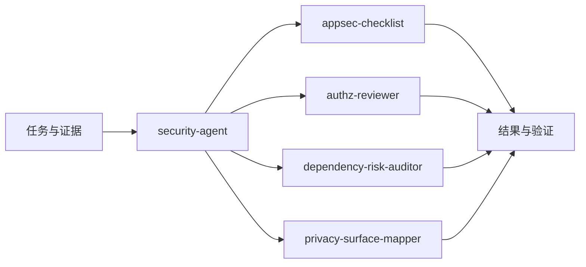

# Security Agent

`security-agent` 帮助选择安全能力相关方法。本插件提供 5 个可直接使用的 Skill，覆盖下表中的专项任务。助手根据用户目标组合专业知识，并持续完成请求范围内的工作。

> [!NOTE]
> [仓库架构](../../docs/architecture.md) · [文档说明](../../docs/AGENTS.md) · [English](./README.md)

## 快速信息

| 项目 | 详情 |
| --- | --- |
| 角色导航 | `security-agent` |
| 专项与组合 Skill | 4 |
| 主要输入 | 代码、入口、信任边界、依赖锁文件、配置与已有发现 |
| 主要产物 | 有证据支持的发现、影响评估、修复与验证 |

## Skill 清单

| Skill | 适用场景 | 主要产物 |
| --- | --- | --- |
| [security-agent](./skills/security-agent/SKILL.md) | 安全能力导航 | 审查范围与可处理发现 |
| [appsec-checklist](./skills/appsec-checklist/SKILL.md) | 应用安全审查 | 可达应用安全问题 |
| [authz-reviewer](./skills/authz-reviewer/SKILL.md) | 身份与授权审查 | 权限矩阵与访问问题 |
| [dependency-risk-auditor](./skills/dependency-risk-auditor/SKILL.md) | 依赖风险审查 | 公告适用性与升级建议 |
| [privacy-surface-mapper](./skills/privacy-surface-mapper/SKILL.md) | 隐私与数据流梳理 | 数据清单、流向与处理缺口 |

## 能力选择

- 输入处理、敏感操作、上传、远端请求、凭据和配置使用 `appsec-checklist`。
- 身份、会话、角色、对象归属和租户隔离使用 `authz-reviewer`。
- 解析版本、漏洞公告、可达性、维护状态和来源使用 `dependency-risk-auditor`。
- 数据收集、存储、共享、保留、删除和用户控制使用 `privacy-surface-mapper`。

## 安装与使用

```text
/plugin marketplace add Neplich/dev-agent-skills
/plugin install security-agent@dev-agent-skills
```

Codex 的个人级和项目级安装见 [安装指南](../../docs/README.codex.md)。从仓库根目录安装全部能力到已选目标：

```bash
python3 scripts/install_codex_skills.py --target /path/to/skills
```

直接描述目标，或通过宿主的 Skill 选择器调用，例如：

```text
/authz-reviewer "检查普通用户能否访问其他租户的导出内容"
```

## 输入与产物组织

有用的发现包含位置、攻击前提、可达路径、现有防护、影响和修正方法。严重性依据实际条件和资产，置信度依据证据质量；敏感值放在受保护的位置，复现材料使用脱敏内容。

需要持久化资料时，可沿用项目现有位置或参考下列布局：

```text
docs/security/{feature}/
  appsec-checklist.md
  authz-review.md
  dependency-audit.md
  privacy-map.md
```

具体文件按任务价值选用；已有资料、代码和测试共同支持预期与验证。

## 审查证据

| 审查类型 | 保留的证据 |
| --- | --- |
| 应用安全 | 可控输入、转换、敏感操作、现有防护 |
| 权限 | 主体、动作、资源、归属或租户上下文、执行位置 |
| 依赖 | 解析版本、公告日期、受影响范围、运行用途 |
| 隐私 | 数据类别、目的、存储或接收方、保留与删除、来源 |

报告说明已检查范围、确认发现、假设和不可用证据。修复建议指向责任路径及具体验证。审查结论对应实际检查范围，即使没有发现可处理的缺陷，也保留有用的覆盖说明。

## 典型工作方式

确定范围 → 追踪证据 → 验证影响 → 报告或修复 → 核验


```mermaid
flowchart LR
    Context["任务与证据"] --> Work["security-agent"]
    Work --> S0["appsec-checklist"]
    S0 --> Result["结果与验证"]
    Work --> S1["authz-reviewer"]
    S1 --> Result["结果与验证"]
    Work --> S2["dependency-risk-auditor"]
    S2 --> Result["结果与验证"]
    Work --> S3["privacy-surface-mapper"]
    S3 --> Result["结果与验证"]
```

## 与其他能力组合

结合请求完成代码、依赖、配置和文档修改，同时验证修复后的正常使用行为。涉及隐私义务时，区分技术观察与法律解释。

助手在已有授权内贯穿相关工作；涉及关键产品选择或新增操作权限时，明确需要用户决定的具体事项。

## 本地维护

能力源码位于本目录的 `skills/`。修改专业内容后，同步相关说明和安装数据；验证方法见 [维护指南](../../docs/cookbook/maintain-skills.md)。
