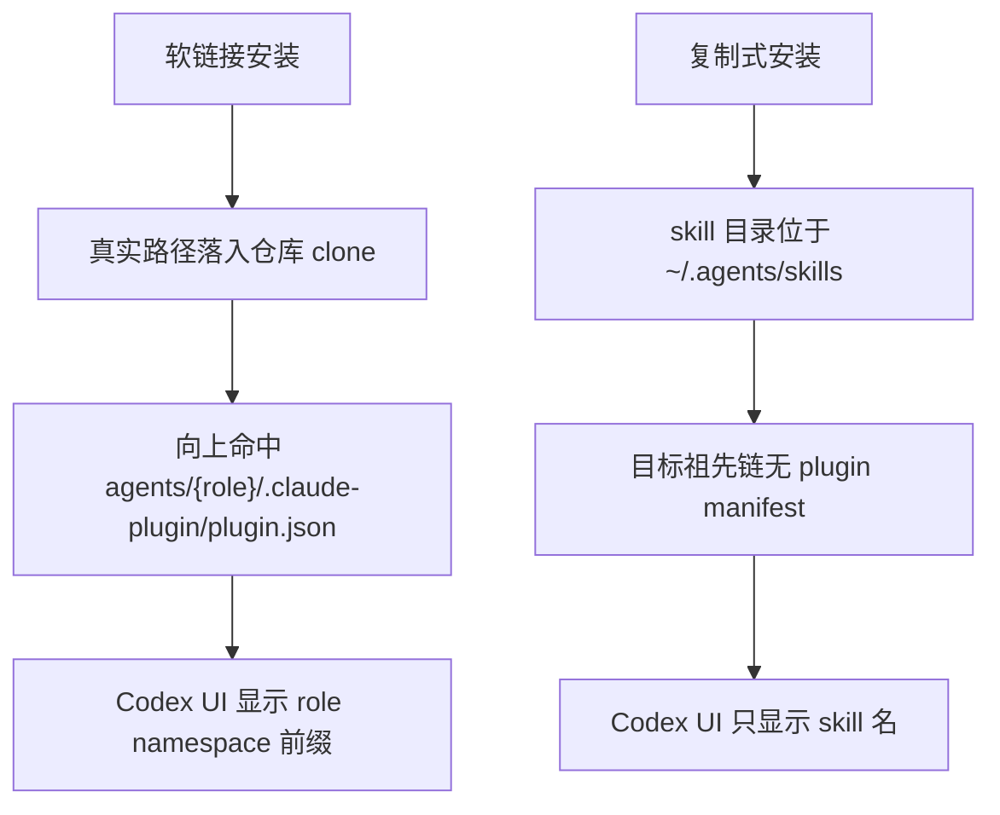

# Dev Agent Skills for Codex

通过 Codex 的原生 skill 发现机制安装本仓库的 Agent skills。Codex 侧使用复制式安装，不使用指向仓库 clone 内部 skill 目录的软链接。

## 快速安装

在 Codex 中输入：

```text
Fetch and follow instructions from https://raw.githubusercontent.com/Neplich/dev-agent-skills/refs/heads/main/.codex/INSTALL.md
```

Codex 会先确认两个问题：

1. 安装范围是 `personal` 还是 `project`
2. 默认安装全部 skills，还是使用受限的 `routers-only` 模式

默认全量安装包含这些 role routers：

- `pm-agent`：直接用户入口，负责需求分类、范围确认、文档产出、GitHub 状态读取和下游 handoff
- `engineer-agent`：PM handoff 后的下游工程能力，承接已确认范围内的代码分析、TRD、实现、测试、调试和交付
- `qa-agent`：PM handoff 后的下游 QA 能力，承接已确认预期下的探索测试、规范测试、Bug 分析和回归验证
- `devops-agent`：PM handoff 后的下游 DevOps 能力，承接已确认运维范围内的部署规划、CI/CD、环境审计和故障处理
- `designer-agent`：PM handoff 后的下游设计能力，承接已确认设计范围内的 UI/UX、视觉系统和界面规范
- `security-agent`：PM handoff 后的下游安全能力，承接已确认安全范围内的应用安全、权限审查、依赖风险和隐私映射

默认全量安装同时包含全部 specialist skills，确保 `pm-agent` 和 role router 编排流程可以调用下游 specialist。只有在明确只需要入口分类的最小场景下才使用 `routers-only`；该模式不会安装 specialist skills，因此 PM 和 role router 编排无法调用下游 specialist。

## 为什么不用软链接

Codex 会先把 skill 软链接解析到真实路径，再从该真实路径向上查找 `.codex-plugin/plugin.json` 或 `.claude-plugin/plugin.json`。本仓库为了兼容 Claude marketplace，必须保留 `agents/{role}/.claude-plugin/plugin.json`。

如果 `~/.agents/skills/<skill-name>` 软链接到仓库 clone 内的 `agents/{role}/skills/<skill-name>`，Codex 会在祖先目录命中该 role 的 `plugin.json`，并给 skill 名加上 `Pm Agent:` 这类 namespace 前缀。复制式安装会把 skill 目录复制到目标 skill root 下，避免目标目录祖先链包含这些 plugin manifest。详见 [issue #95](https://github.com/Neplich/dev-agent-skills/issues/95)。



## 安装层级

### Personal

适合希望在所有项目里复用这些 Agent 的场景。

- 仓库 clone 到 `~/.agents/dev-agent-skills`
- selected skills 复制到 `~/.agents/skills/<skill-name>`

### Project

适合只想在当前项目里启用这些 Agent 的场景。

- 仓库 clone 到 `<project>/.agents/dev-agent-skills`
- selected skills 复制到 `<project>/.agents/skills/<skill-name>`

两种安装方式都保持仓库内的 `agents/*/skills/*` 目录不变，用于兼容 Claude marketplace。

## 手动安装

### 1. 选择安装层级

Personal:

```bash
CLONE_ROOT="$HOME/.agents/dev-agent-skills"
SKILL_ROOT="$HOME/.agents/skills"
```

Project，需要在项目根目录执行：

```bash
PROJECT_ROOT="$PWD"
CLONE_ROOT="$PROJECT_ROOT/.agents/dev-agent-skills"
SKILL_ROOT="$PROJECT_ROOT/.agents/skills"
```

### 2. clone 或更新仓库

```bash
if [ -d "$CLONE_ROOT/.git" ]; then
  git -C "$CLONE_ROOT" pull --ff-only
else
  mkdir -p "$(dirname "$CLONE_ROOT")"
  git clone https://github.com/Neplich/dev-agent-skills.git "$CLONE_ROOT"
fi
```

### 3. 复制 skills

默认复制全部 skills：

```bash
uv run --directory "$CLONE_ROOT" scripts/install_codex_skills.py --target "$SKILL_ROOT"
```

受限模式，只复制 6 个 role routers：

```bash
uv run --directory "$CLONE_ROOT" scripts/install_codex_skills.py --target "$SKILL_ROOT" --routers-only
```

`--routers-only` 会输出警告，因为该模式不会安装 specialist skills，`pm-agent` / role router 编排无法调用下游 specialist 工作流，只适合入口分类最小安装。如果目标目录已存在本仓库管理的 specialist skills，`--routers-only` 会阻断并给出清理指引；使用 `--force` 才会删除未选中的受管 skills。

目标 skill 已存在时，脚本默认跳过并提示。需要替换已有目录时使用 `--force`：

```bash
uv run --directory "$CLONE_ROOT" scripts/install_codex_skills.py --target "$SKILL_ROOT" --force
```

脚本会输出 installed、replaced 或 skipped 清单，并检查目标目录祖先链中是否存在 `.claude-plugin/plugin.json` 或 `.codex-plugin/plugin.json`。

## 按路径禁用单个 skill

如需保留已复制目录但让 Codex 不加载某个 skill，可在 `~/.codex/config.toml` 中添加：

```toml
[[skills.config]]
path = "/Users/you/.agents/skills/debugger"
enabled = false
```

`path` 使用本机真实复制路径。
