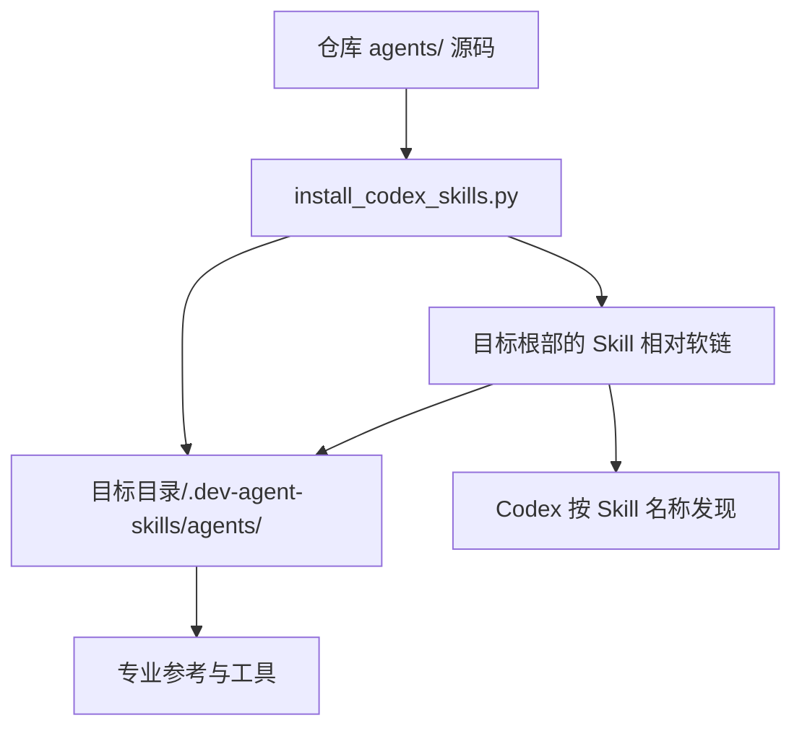

# Dev Agent Skills for Codex

通过 Codex 的原生 Skill 发现机制使用本仓库的 37 个能力。安装器采用隐藏镜像和根部相对软链，保留专业资料之间的引用，并为每个 Skill 提供稳定入口。

[完整安装步骤](../.codex/INSTALL.md) · [仓库架构](./architecture.md) · [维护指南](./cookbook/maintain-skills.md)

## 快速安装

在 Codex 中输入：

```text
Fetch and follow instructions from https://raw.githubusercontent.com/Neplich/dev-agent-skills/refs/heads/main/.codex/INSTALL.md
```

安装范围沿用用户指定或上下文中已有的选择。个人级安装适合跨项目使用，项目级安装适合一个仓库。

默认安装包括全部 37 个 Skill，以及六个帮助选择方法的角色导航：

| 导航 | 主要内容 |
| --- | --- |
| `pm-agent` | 需求、功能目录、研究、路线图、版本沟通、GitHub 状态、写作 |
| `engineer-agent` | 代码分析、技术设计、实现、测试、调试、交付 |
| `qa-agent` | 行为验收、探索测试、缺陷分析、回归 |
| `devops-agent` | 部署、CI/CD、配置审计、故障手册 |
| `security-agent` | 应用安全、权限、依赖、隐私数据流 |
| `docs-agent` | 文档站、事实同步、图文手册、发布说明、审查 |

直接描述目标或点名专项 Skill，例如 `debugger`、`test-writer`、`github-reader`。助手按任务选择资料，在已有授权内持续推进。

## 镜像与发现原理

Codex 解析 Skill 软链后的真实路径，并读取相关插件信息。本仓库的源码保留 `agents/{role}/.claude-plugin/plugin.json`，用于 Claude marketplace 分发。

Codex 安装器将 `agents/` 复制到目标目录下的 `.dev-agent-skills/`，保留 Skill 和内部参考，复制时排除插件 manifest 与 Agent 测试目录。目标根部的相对软链指向这个隐藏镜像，使每个 Skill 以自身名称被发现。仓库内的引用关系随目录结构保留。


```mermaid
flowchart TD
    Source["仓库 agents/ 源码"] --> Installer["install_codex_skills.py"]
    Installer --> Mirror["目标目录/.dev-agent-skills/agents/"]
    Installer --> Links["目标根部的 Skill 相对软链"]
    Links --> Mirror
    Mirror --> References["专业参考与工具"]
    Links --> Discovery["Codex 按 Skill 名称发现"]
```

例如：

```text
<target>/debugger
  -> .dev-agent-skills/agents/engineer/skills/debugger
```

## 安装层级

### Personal

适合在多个项目复用能力：

- checkout：`~/.agents/dev-agent-skills`
- 隐藏镜像：`~/.agents/skills/.dev-agent-skills/`
- 可见入口：`~/.agents/skills/<skill-name>`

### Project

适合只在当前项目中使用：

- checkout：`<project>/.agents/dev-agent-skills`
- 隐藏镜像：`<project>/.agents/skills/.dev-agent-skills/`
- 可见入口：`<project>/.agents/skills/<skill-name>`

两种方式都使用同一个安装器。镜像中的 `.dev-agent-skills-mirror.json` 记录安装归属，源码目录继续用于插件分发和维护。

## 手动安装

### 1. 选择路径

个人级：

```bash
CLONE_ROOT="$HOME/.agents/dev-agent-skills"
SKILL_ROOT="$HOME/.agents/skills"
```

项目级，在项目根目录执行：

```bash
PROJECT_ROOT="$PWD"
CLONE_ROOT="$PROJECT_ROOT/.agents/dev-agent-skills"
SKILL_ROOT="$PROJECT_ROOT/.agents/skills"
```

### 2. 获取目标版本

首次安装可克隆仓库：

```bash
git clone https://github.com/Neplich/dev-agent-skills.git "$CLONE_ROOT"
```

已有 checkout 时，先保留本地修改，再切到目标分支并更新。默认来源为 `main`；需要固定发布版本时，使用实际 release tag 对应的提交。

`.codex/INSTALL.md` 提供完整的更新与固定版本命令，包括远端 tag 存在性、提交身份核对，以及从固定版本回到 `main` 的更新步骤。

### 3. 安装全部能力

```bash
python3 "$CLONE_ROOT/scripts/install_codex_skills.py" --target "$SKILL_ROOT"
```

`--target` 指定可见软链所在目录，默认值为 `~/.agents/skills`。隐藏镜像放在 `<target>/.dev-agent-skills/`。更新 checkout 后再次执行同一命令，安装器会比较并刷新相应内容。

## 更新与归属保护

安装器管理可证明属于本仓库的入口：

- 解析到 `<target>/.dev-agent-skills/` 内的软链。
- 解析到带有本仓库 marketplace 标识的 checkout 内的旧软链。

旧 checkout 软链会迁移到隐藏镜像。升级时，已从注册表移除的 Skill 对应的镜像软链会自动清理。可证明归属的 `<target>/dev-agent-skills` 聚合入口也会按安装器规则迁移。其他目录与软链保持原状，并在结果中说明跳过或冲突。

已有真实隐藏镜像使用 `.dev-agent-skills-mirror.json` 标记归属。需要重建已归属的镜像和入口时，可使用：

```bash
python3 "$CLONE_ROOT/scripts/install_codex_skills.py" --target "$SKILL_ROOT" --force
```

`--force` 用于重建镜像并替换本安装器管理的软链。存在独立用户目录或同名外部 Skill 时，安装器先报告冲突，保留这些内容；根据报告为它们选择合适位置后再执行安装。

## 结果与排查

输出中的 `installed`、`updated`、`migrated`、`replaced` 和 `skipped` 表明每个入口的处理结果。排查时检查：

1. 目标路径是否对应期望的个人级或项目级范围。
2. Skill 软链是否指向目标内的隐藏镜像。
3. 镜像的 ownership marker 是否存在，目标内容是否与 checkout 一致。
4. 同名入口是否属于其他安装或用户目录。
5. 目标祖先目录是否含插件 manifest；安装器会提示这类发现上下文。

有需要时使用 [维护指南](./cookbook/maintain-skills.md) 中的安装与仓库检查，并保留实际错误输出供定位。

## 按路径禁用单个 Skill

保留安装内容、调整发现状态时，在 `~/.codex/config.toml` 中添加：

```toml
[[skills.config]]
path = "/Users/you/.agents/skills/debugger"
enabled = false
```

`path` 使用目标根目录下的可见 Skill 软链路径。恢复时将同一条目的 `enabled` 设为 `true`。
