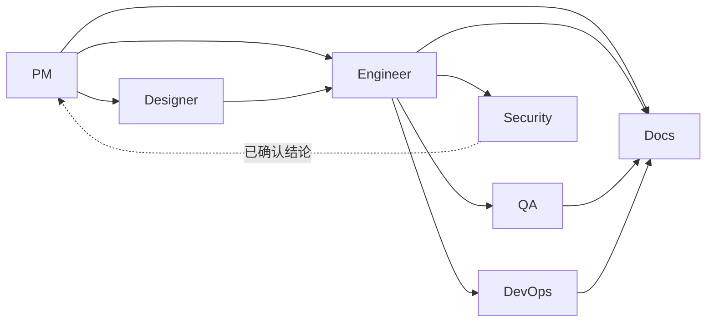

# 仓库架构

## 当前系统

本仓库发布七个按角色组织的 Agent 插件。`pm-agent` 是默认研发入口；其余六个 Router
消费已确认的 PM handoff 或等效已接受文档链。



| 插件 | Router | Specialist 范围 |
| --- | --- | --- |
| Product Manager | `pm-agent` | 需求、产品文档、功能目录、研究、changelog、GitHub Release、roadmap、仓库状态 |
| Designer | `designer-agent` | UX/信息架构与视觉系统文档 |
| Engineer | `engineer-agent` | 仓库分析、TRD/API/ADR、实现、测试、调试、交付 |
| QA | `qa-agent` | 规格验收、探索测试、缺陷分析、回归 |
| DevOps | `devops-agent` | 部署、CI/CD、环境审计、故障手册 |
| Security | `security-agent` | AppSec、权限、依赖、隐私与数据流审查 |
| Docs | `docs-agent` | 正式站点初始化、当前事实同步、图文手册、Release Notes、审计 |

Router 只拥有入口凭据、路由表、阻塞条件和 Specialist 指针。Specialist 的
`SKILL.md` 拥有专属执行协议。跨角色 handoff、closeout、Security escalation 和正式
文档消费契约只在 `agents/product_manager/skills/idea-to-spec/_internal/_shared/`
人工维护一次；六个下游插件消费生成的本地副本。

## 仓库布局

```text
agents/{role}/skills/{skill}/    Skill 源文件与私有指令
agents/{role}/test/              持久化 eval 定义与 comparison
docs/pm/{feature_path}/          产品需求与决策
docs/engineer/{feature_path}/    技术设计与活跃实施计划
docs/qa/e2e/{feature_path}/      持久化 E2E 用例与结果
scripts/                         契约、安装、eval 与生成工具
```

文档树与生命周期规则见 [docs/AGENTS.md](./AGENTS.md)。

## 分发方式

- Claude Code 从 marketplace 注册的 `source` 安装每个插件。
- Codex 通过 `scripts/install_codex_skills.py` 把完整 Agent 树复制到隐藏镜像，再暴露
  Skill 目录供发现。
- Kimi Code 通过 `.kimi-plugin/plugin.json` 消费单一插件。

插件内生成契约保证跨角色引用不逃出插件复制边界。使用
`uv run scripts/generate_shared_contracts.py` 生成，并用 `--check` 验证新鲜度。

## 扩展入口

- 新增、修改或重命名 Role Skill：使用仓库 `maintain-skills` Skill 和
  [Skill 维护 cookbook](./cookbook/maintain-skills.md)。
- 编写或运行 Skill eval：使用 `skill-eval-runner` 和
  [eval cookbook](./cookbook/run-skill-evals.md)。
- 准备发布：使用 [release cookbook](./cookbook/release.md)。
