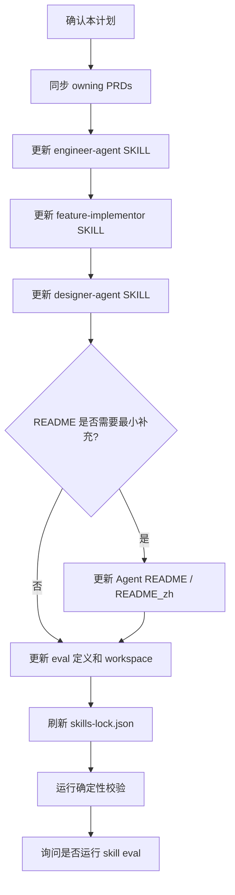

# 前端 UI 更新路由契约实施计划

## 1. 实施上下文

本计划承接 GitHub issue #35、`docs/pm/agent-collaboration/frontend-ui-routing-contract/PRD.md` 和 `docs/engineer/agent-collaboration/frontend-ui-routing-contract/TRD.md`。目标是在不修改外部 `ui-ux-pro-max` 的前提下，把“前端 UI 更新由 Engineer 编排 Designer 后再实现”的内部路由契约固化到本仓库。

当前问题不是 `ui-ux-design` 或 `visual-design` 本身失效，而是本仓库入口边界不够明确：本地项目的前端代码更新、UI 实现、界面优化和设计落地应先由 `engineer-agent` 承接，再按 PRD/TRD 和设计交付物状态决定是否 handoff 到 `designer-agent`。

### 1.1 当前门禁状态

| Gate | Status | Evidence |
| --- | --- | --- |
| PRD alignment | 已补齐 issue 级 PRD | `docs/pm/agent-collaboration/frontend-ui-routing-contract/PRD.md` |
| TRD alignment | 已补齐 issue 级 TRD | `docs/engineer/agent-collaboration/frontend-ui-routing-contract/TRD.md` |
| Implementation plan | 已确认并实施 | 本文件已更新为 `status: "Implemented"` |
| Code / skill edits | 已完成 | PRD、SKILL.md、README、eval fixture 和 `skills-lock.json` 已更新 |
| Eval execution | 已完成 | 3 组 fresh Codex subagent validation 均 PASS，见对应 durable `comparison.md` |

### 1.2 成功标准

- `engineer-agent` 能把“更新前端代码 / 改 UI / 落地界面设计”识别为 Engineering 入口。
- `engineer-agent` 能在设计交付缺失、过期或不覆盖当前变更时 handoff 到 `designer-agent`。
- `designer-agent` 能处理来自 Engineer 的 UI maintenance / frontend-update design request，并在设计交付后明确回交 Engineer。
- `feature-implementor` 的实施计划能引用已确认设计交付物；设计交付物缺失或冲突时不会直接进入实现。
- 外部 `ui-ux-pro-max` 不在 diff 范围内。
- skill 文档变更后同步 `skills-lock.json`。
- 受影响 eval 覆盖新路由契约；若实际执行 eval，则同步更新 durable `comparison.md`。

## 2. 范围

### 2.1 必改文件

| Path | Operation | Change |
| --- | --- | --- |
| `docs/pm/agents/engineer-agent/PRD.md` | Modify | agent 级产品契约补充前端 UI 更新由 Engineer 入口承接。 |
| `docs/pm/agents/engineer-agent/skills/engineer-agent/PRD.md` | Modify | dispatcher skill PRD 补充 frontend / UI routing、设计交付物检查和 Designer handoff。 |
| `docs/pm/agents/engineer-agent/skills/feature-implementor/PRD.md` | Modify | Feature Implementor PRD 补充 UI design handoff gate。 |
| `docs/pm/agents/designer-agent/PRD.md` | Modify | Designer agent PRD 补充来自 Engineer 的 UI maintenance design request。 |
| `docs/pm/agents/designer-agent/skills/designer-agent/PRD.md` | Modify | Designer dispatcher PRD 补充设计完成后回交 Engineer 的产品契约。 |
| `agents/engineer/skills/engineer-agent/SKILL.md` | Modify | 将前端 UI 更新归入 Engineering request，并固化设计检查和 handoff 规则。 |
| `agents/engineer/skills/feature-implementor/SKILL.md` | Modify | 在 Phase 0 / Phase 1 前固化 UI design handoff check。 |
| `agents/designer/skills/designer-agent/SKILL.md` | Modify | 增加 Engineer 来源 UI 维护设计请求和回交边界。 |
| `agents/engineer/test/engineer-agent/evals/evals.json` | Modify | 增加或扩展 Engineer routing eval。 |
| `agents/engineer/test/feature-implementor/evals/evals.json` | Modify | 增加或扩展 UI design gate eval。 |
| `agents/designer/test/designer-agent/evals/evals.json` | Modify | 增加或扩展 Designer handoff eval。 |
| `skills-lock.json` | Modify | 同步受影响 skill metadata/hash。 |

### 2.2 按需修改

| Path | Condition |
| --- | --- |
| `agents/engineer/README.md` / `README_zh.md` | 如果当前 README 无法让用户看出前端 UI 更新由 Engineer 入口承接。 |
| `agents/designer/README.md` / `README_zh.md` | 如果当前 README 无法让用户看出 Designer 完成设计后回交 Engineer。 |
| `AGENTS.md` | 只有当项目级规则需要补充该边界时，优先扩展现有角色边界句子。 |
| `agents/*/test/*/evals/workspace/.../comparison.md` | 新增 eval workspace 或实际执行 eval 后更新。 |

### 2.3 非目标

- 不修改外部 `ui-ux-pro-max`。
- 不新增新的 Agent 或 specialist skill。
- 不让 Designer 进入代码实现。
- 不重写 README 协作模型。
- 不提交模型 eval 运行期产物。

## 3. 实施流程



## 4. 文件级步骤

### Step 1: 同步 owning PRDs

修改以下 PRD，先把产品契约写清楚，再进入 skill 行为文件：

1. `docs/pm/agents/engineer-agent/PRD.md`
   - 增加：前端代码更新、UI 实现、设计落地属于 Engineer 入口。
   - 验证：FR-A04 / FR-A05 的 handoff 和 feature path 语义仍成立。

2. `docs/pm/agents/engineer-agent/skills/engineer-agent/PRD.md`
   - 增加：frontend / UI implementation routing 信号。
   - 增加：设计交付物缺失或过期时 handoff 到 `designer-agent`。
   - 验证：FR-S01 / FR-S06 / FR-S08 能覆盖新路由。

3. `docs/pm/agents/engineer-agent/skills/feature-implementor/PRD.md`
   - 增加：UI design handoff gate。
   - 增加：实施计划必须引用设计交付物，或说明无需 Designer 更新。
   - 验证：FR-S04 / FR-S06 / FR-S09 不被削弱。

4. `docs/pm/agents/designer-agent/PRD.md`
   - 增加：Designer 可以接收 Engineer 来源的 UI maintenance / frontend-update design request。
   - 验证：FR-A04 仍然要求需要实现时只停在 design handoff。

5. `docs/pm/agents/designer-agent/skills/designer-agent/PRD.md`
   - 增加：处理 Engineer 来源设计请求后明确 handoff 回 `engineer-agent`。
   - 验证：FR-S04 / FR-S06 仍然禁止调用 Engineer 内部 skill 或继续实现。

### Step 2: 更新 `engineer-agent` 路由规则

修改 `agents/engineer/skills/engineer-agent/SKILL.md`：

- 在 Role Boundary 或 Existing Feature Alignment Gate 附近加入前端 UI 更新规则。
- 明确以下 wording 属于 Engineering request：
  - 更新前端代码
  - 改 UI
  - 优化界面实现
  - 落地设计
  - design-to-code
- 保留现有 PRD/TRD alignment gate。
- 增加设计交付物检查：
  - `docs/design/{feature_path}/ui-ux-spec.md`
  - `docs/design/{feature_path}/visual-system.md`
- 当设计交付缺失、过期或不覆盖当前变化时，输出 handoff 给 `designer-agent`，并说明需要补齐的设计范围。

验证：

- Engineer routing 不建议修改或调用外部 `ui-ux-pro-max`。
- Engineer 不替代 Designer 做 UX / visual decision。
- Engineer 仍然只在 PM/TRD 对齐后进入 `feature-implementor` 或 `debugger`。

### Step 3: 更新 `feature-implementor` 计划门禁

修改 `agents/engineer/skills/feature-implementor/SKILL.md`：

- 在 Phase 0 / Phase 1 前增加 UI design handoff check。
- 涉及页面结构、交互流程、视觉系统、组件规范、可用性、信息层级变化时，实施计划必须包含：
  - 相关设计交付物路径；或
  - 不需要 Designer 更新的明确理由。
- 如果设计交付物缺失、过期或与当前需求冲突：
  - 停止创建或继续执行 `IMPLEMENTATION_PLAN.md`。
  - handoff 回 `engineer-agent -> designer-agent` 补齐设计。
- 保持现有规则：小 UI 改动也不能跳过实施计划和用户确认。

验证：

- `feature-implementor` 不直接开始实现缺少设计依据的 UI 变化。
- 不把设计缺口隐藏到 implementation plan 内部。
- 不削弱 PRD/TRD feature path gate。

### Step 4: 更新 `designer-agent` 回交流程

修改 `agents/designer/skills/designer-agent/SKILL.md`：

- 增加来自 Engineer 的 UI maintenance / frontend-update design request 场景。
- 明确 Designer 只更新：
  - `docs/design/{feature_path}/ui-ux-spec.md`
  - `docs/design/{feature_path}/visual-system.md`
- 明确禁止：
  - 写应用代码
  - 写测试
  - 写部署配置
  - 输出工程实现清单或 shell 命令
- 输出时必须说明 handoff 回 `engineer-agent`，由 Engineer 负责 TRD / `IMPLEMENTATION_PLAN.md` / code / test。

验证：

- Designer 不直接选择 `feature-implementor`。
- Designer 不把 PM / Engineer 文档当作实现授权。
- Designer 的 Feature Path Gate 仍然消费已确认 `feature_path`，不自建同义目录。

### Step 5: 最小 README / AGENTS 补充

先检查以下文件是否已有足够边界说明：

- `agents/engineer/README.md`
- `agents/engineer/README_zh.md`
- `agents/designer/README.md`
- `agents/designer/README_zh.md`
- `AGENTS.md`

只在现有文字不足以表达 #35 边界时做最小补充：

- Engineer README：前端代码更新由 Engineer 入口承接，必要时 handoff Designer 补设计。
- Designer README：Designer 只产设计交付物，完成后回交 Engineer，不实现代码。
- AGENTS：只有项目级角色边界需要补充时，扩展现有角色边界句子，不新增长段落。

验证：

- README 不重复展开 SKILL.md 的完整门禁。
- 中英文 README 信息一致。
- AGENTS 仍是项目指导唯一来源，CLAUDE.md 不单独编辑。

### Step 6: 更新 eval 定义和 durable comparison

新增或扩展以下 eval：

1. `agents/engineer/test/engineer-agent/evals/evals.json`
   - 覆盖：“更新前端代码 / 改 UI / 优化界面实现”进入 `engineer-agent`，不是外部 UI skill。
   - 断言 Engineer 先做 PRD/TRD alignment，再检查设计交付物。

2. `agents/engineer/test/feature-implementor/evals/evals.json`
   - 覆盖：UI 变化进入 implementation planning 前必须引用设计文档或说明无需更新。
   - 断言设计缺失或冲突时 blocked 并 handoff 回 Engineer / Designer。

3. `agents/designer/test/designer-agent/evals/evals.json`
   - 覆盖：Designer 接收 Engineer 来源 UI maintenance request。
   - 断言只产 `docs/design/{feature_path}/...`，并明确回交 `engineer-agent`。

如新增 eval workspace：

- 使用 schema version `1.0`。
- 每个 eval item 必须有显式 `workspace`。
- assertions 使用 lower snake_case `id`，并包含 `description` 和语义化 `text`。
- workspace 中保留 durable `comparison.md`。
- 不提交运行期目录或文件，例如 `with_skill/`、`without_skill/`、`outputs/`、`transcript.md`、`diagnostics/`。

### Step 7: 刷新 `skills-lock.json`

修改 skill 文档后运行仓库现有 lock 更新方式，刷新受影响 skill metadata/hash：

- `engineer-agent`
- `feature-implementor`
- `designer-agent`

如果仓库没有单独 lock 更新命令，则按现有维护脚本或 registry 生成方式执行，并用 repository contract 校验结果。

### Step 8: 验证

确定性检查：

```bash
git diff --check
uv run scripts/check_repository_contract.py
uv run scripts/check_eval_contract.py
uv run scripts/check_eval_artifacts.py
uv run --with pytest pytest agents/test_eval_contract.py
```

模型 eval：

- 因为本计划会修改 skill 行为和 eval，实施完成后必须询问是否运行对应 skill eval。
- 用户确认后，默认执行 `engineer-agent`、`feature-implementor`、`designer-agent` 相关 eval 或 fresh Codex subagent validation。
- 只要实际执行，就同步更新对应 durable `comparison.md`。
- 如果 runner、凭据或外部服务阻塞，记录 blocked 原因，不静默降级成只读校验。

## 5. Sub-Agent 分工

本次后续实施触及多个 skill 文档、PRD、README、eval 和 lockfile，属于多文件、跨角色契约变更。建议在用户确认本计划后采用分工：

| Role | Scope | Output |
| --- | --- | --- |
| Implementation worker | 更新 PRD、SKILL.md、README、eval、lockfile；不得修改外部 `ui-ux-pro-max`。 | 变更文件清单、执行过的确定性校验、未决问题。 |
| Validation worker | 对照 PRD/TRD/issue #35 检查 routing、handoff、design-only、plan gate、eval artifact policy。 | pass/fail 结论、阻塞项、残余风险。 |
| Main process | 保留 issue、PRD/TRD、仓库规则和交付判断；整合结果并决定是否请求运行 skill eval。 | 最终交付说明和下一步。 |

如果当前运行环境或用户指令不允许 sub-agent，主流程按同一文件顺序串行执行，并保留独立自检清单。

## 6. 风险与处理

| Risk | Impact | Mitigation |
| --- | --- | --- |
| 将本地 UI 实现请求误判为纯设计请求 | 继续被外部 UI skill 或 Designer 吸走 | Engineer SKILL 和 eval 明确“前端代码更新”属于 Engineering entry。 |
| 设计检查过度阻塞小 UI 修复 | 降低小修效率 | 允许 implementation plan 明确说明无需 Designer 更新，但必须有理由。 |
| Designer 输出实现清单 | 角色越界 | Designer SKILL 和 eval 明确禁止工程实现清单、代码和 shell 命令。 |
| README 过度展开 | 形成第二事实源 | README 只写入口边界，完整细则留在 SKILL.md 和 eval。 |
| Eval 未更新 durable comparison | PR 结论与长期证据不一致 | 实际执行 eval 后同步更新 `comparison.md`；未执行则明确说明。 |

## 7. 确认点

确认本计划后，下一步进入 PRD / SKILL / eval 修改。实施前不修改外部 `ui-ux-pro-max`，不跳过 PRD/TRD alignment，不跳过 `IMPLEMENTATION_PLAN.md` 确认门禁。

## 8. 实施结果

本计划已按确认范围实施：

- 已同步 Engineer / Feature Implementor / Designer 相关 PRD。
- 已更新 `engineer-agent`、`feature-implementor`、`designer-agent` 的 public skill routing / gate 文档。
- 已最小补充 Engineer / Designer README 和 README_zh 的入口边界。
- 已新增 Engineer routing、Feature Implementor UI design gate、Designer Engineer-handoff 三组 eval 和 durable `comparison.md`。
- 已刷新 `skills-lock.json` 中受影响 skill 的 computed hash。
- 未修改外部 `ui-ux-pro-max`。

已完成确定性校验：

```bash
git diff --check
uv run scripts/check_repository_contract.py
uv run scripts/check_eval_contract.py
uv run scripts/check_eval_artifacts.py
uv run --with pytest pytest agents/test_eval_contract.py
```

受影响 skill eval 已完成 fresh Codex subagent validation，并已更新对应 durable `comparison.md`：

- `agents/engineer/test/engineer-agent/evals/workspace/eval-004-frontend-ui-routing-contract/comparison.md`
- `agents/engineer/test/feature-implementor/evals/workspace/eval-009-ui-design-handoff-gate/comparison.md`
- `agents/designer/test/designer-agent/evals/workspace/eval-003-engineer-ui-maintenance-handoff/comparison.md`

CLI transcript diagnostics 只作为运行期材料保存在 `tmp/eval-runs/manual-issue35/`，不提交到 git。
