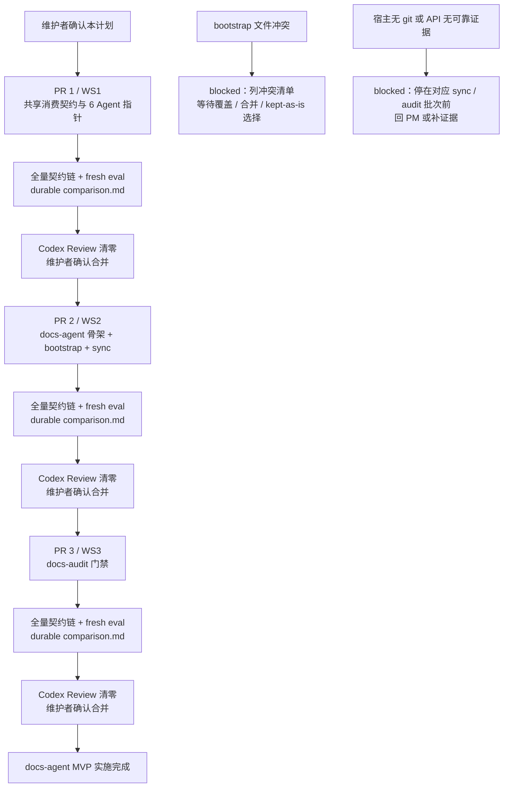

# docs-agent 实施计划

## 1. 背景

现有 6 个角色 Agent 已覆盖产品、设计、工程、QA、DevOps 与安全协作，但宿主项目中描述系统当前状态的正式文档仍缺少专属维护角色。issue #105 与已批准 PRD 因此定义第 7 个角色 Agent `docs-agent`，负责正式文档站初始化、同步、存量回填和发版前审计，并为现有 6 个 Agent 增加以 change-map 为入口的消费契约。

本计划把 `docs/engineer/agents/docs-agent/TRD.md`（版本以 frontmatter 为准，当前 0.1.11）展开为三个独立 PR 的文件级执行顺序、验证门禁、回滚点和维护者确认点。计划只展开 marketplace 仓库内的实现触点；宿主项目中的 `docs/site/**` 仍是 skill 运行输出，不作为本仓库预置文件。

## 2. 前置对齐结论

- PRD：`docs/pm/agents/docs-agent/PRD.md`，版本以 frontmatter 为准（当前 1.2.7），状态为 `Approved`。
- TRD：`docs/engineer/agents/docs-agent/TRD.md`，版本以 frontmatter 为准（当前 0.1.11）；其 frontmatter 当前仍为 `Draft`，维护者已在本任务中确认该版本作为本计划的技术输入契约。
- 需求来源：GitHub issue #105；PRD 已确认的 8 项决议逐项沿用，不在计划中改写。
- Feature path：PRD 与 TRD 均为 `agents/docs-agent`，`parent_feature: agents`、`feature_level: "2"` 一致。
- 变更分级：`change_tier: major`。新增 Agent、skill、marketplace 注册、跨角色消费契约与 contract/eval 触点，维持完整计划确认流程。
- 固定实施顺序：WS1 → WS2 → WS3，分别对应三个独立 PR；每个 PR 均单独完成验证、Codex Review 和维护者合并确认，不合并成一次 major 确认。本分支 `feat/docs-agent-ws1` 承载本实施计划与后续 WS1。
- 实施分工：本功能跨角色、多模块且有 durable eval 要求，实施时按每个 PR 划定文件范围；由 fresh implementation sub-agent 承担明确文件范围，另由 fresh validation sub-agent 基于同一 fixture 生成 with-skill 与 without-skill 结果并验收，主进程保留 PRD/TRD、仓库契约与合并判断上下文。

TRD 第 13 节的两个 Open Question 在本计划中落定如下：

1. **回填单批粒度默认值**：默认按 feature-catalog 模块切分；无 catalog 时按 API surface（顶级路由组）切分；单批建议上限为一个业务模块或约 5 个 API 页面，由首个 fixture 校准后固化到 skill 文档；无论粒度如何，每批保留维护者确认。
2. **bootstrap 冲突处理语义**：冲突默认 blocked 并列出清单；用户明确选择「保留现有文件」时在生成 manifest 中登记 `kept-as-is` 状态，后续幂等检查对该文件跳过模板一致性要求；不提供静默保留路径。

## 3. 目标

- 先建立现有 6 个 Agent 的正式文档消费契约，在有 change-map 时精准读取映射文档并回代码验证关键判断，无站点时静默保持既有探索行为。
- 新增 docs-agent router、`docs-site-bootstrap` 与 `formal-docs-sync`，完成 4-skill 注册结构、完整双站点骨架、feature API 同步和存量 API 回填 MVP。
- 新增 `docs-audit`，按确定性层与事实层输出 `verified` / `stale` / `mismatch`，仅在全部 verified 后统一盖章。
- 三个 PR 均具备确定性契约检查、对应 fresh Codex subagent eval、durable `comparison.md`、Codex Review 和独立维护者确认记录。

## 4. 非目标

- 不修改 PRD（版本以 frontmatter 为准，当前 1.2.7）的产品范围或 TRD（版本以 frontmatter 为准，当前 0.1.11）的技术设计；除第 2 节两个 Open Question 外不新增设计决策。
- 不修改或复制参考实现，不把参考项目的专有路径、模块名或品牌内容写入 marketplace 模板。
- 不在本 marketplace 仓库预置宿主项目 `docs/site/**`；该目录只由宿主显式执行 bootstrap 后生成。
- 不把 database、design、ops、release-notes 或产品手册自动同步描述为 MVP 已完成能力；MVP 同步与回填验收仅覆盖 api 链路。
- 不改变 `changelog-generator` 的输出路径；版本归档继续写入 `docs/changelog/changelog-v{version}.md`。
- 不自动创建 tag、GitHub Release，不新增 Release CI，也不在任一 PR 通过前越过维护者确认执行下一 workstream。

## 5. 文件变更清单

### 5.1 PR 1 / WS1 消费契约

| 操作 | 路径 | 目的 |
| --- | --- | --- |
| 新增 | `agents/docs/skills/docs-agent/_internal/_shared/consumption-contract.md` | 建立任务落点、change-map 反查、精准读取、代码回证、新鲜度与分歧输出的权威消费协议。 |
| 修改 | `agents/product_manager/skills/{feature-catalog,github-reader,idea-to-spec}/SKILL.md` | 为执行代码或项目探索的 PM specialist 增加一行消费契约指针。 |
| 修改 | `agents/engineer/skills/{codebase-analyzer,trd-gen,feature-implementor,debugger,test-writer}/SKILL.md` | 为执行代码或项目探索的 Engineer specialist 增加一行消费契约指针。 |
| 修改 | `agents/qa/skills/{spec-based-tester,exploratory-tester,bug-analyzer,regression-suite}/SKILL.md` | 为 4 个 QA specialist 增加一行消费契约指针。 |
| 修改 | `agents/devops/skills/{deployment-planner,env-config-auditor,incident-playbook-writer}/SKILL.md` | 为执行项目配置或运行面探索的 DevOps specialist 增加一行消费契约指针。 |
| 修改 | `agents/designer/skills/ui-ux-design/SKILL.md` | 为需要读取现有产品与界面事实的 Designer specialist 增加一行消费契约指针。 |
| 修改 | `agents/security/skills/{appsec-checklist,authz-reviewer,dependency-risk-auditor,privacy-surface-mapper}/SKILL.md` | 为 4 个 Security specialist 增加一行消费契约指针。 |
| 修改 | `agents/engineer/skills/debugger/SKILL.md` | 在通用指针之外，把命中的 API contract 纳入 expected-behavior 依据来源之一，并保留与 Approved PRD/TRD、测试和代码证据的一致性门禁。 |
| 修改 | `agents/product_manager/skills/release-notes-generator/SKILL.md` | 仅按 `docs/site/release-notes/` 存在性切换 release-notes 输出目标；站点不存在时保持原路径和行为。 |
| 修改 | `agents/product_manager/test/{feature-catalog,github-reader,idea-to-spec,release-notes-generator}/evals/evals.json`、`agents/engineer/test/{codebase-analyzer,trd-gen,feature-implementor,debugger,test-writer}/evals/evals.json`、`agents/qa/test/{spec-based-tester,exploratory-tester,bug-analyzer,regression-suite}/evals/evals.json`、`agents/devops/test/{deployment-planner,env-config-auditor,incident-playbook-writer}/evals/evals.json`、`agents/designer/test/ui-ux-design/evals/evals.json`、`agents/security/test/{appsec-checklist,authz-reviewer,dependency-risk-auditor,privacy-surface-mapper}/evals/evals.json` | 为上述消费侧 skill 增补命中 change-map、无站点、旧版本三类语义 assertions；这些 eval 定义当前均存在。 |
| 新增 | 上述 eval 目录各自的 `workspace/<新增消费回归用例>/**`（含 durable `comparison.md`） | 为三类消费行为建立隔离 fixture；新用例编号在 PR 1 依据各 `evals.json` 的现有最大编号顺延，避免覆盖既有 workspace。 |
| 修改 | `skills-lock.json` | 刷新 PR 1 中所有被修改 skill 的 `computedHash`。 |
| 修改（按硬编码情况） | `scripts/check_repository_contract.py`、`scripts/check_eval_contract.py`、`agents/test_eval_contract.py` | 仅在现有校验硬编码 Agent、router、skill 数量或路径时扩展 contract 及其测试；动态兼容时不改。 |

WS1 适用 specialist 指针初步清单如下，已与 `agents/*/skills/` 实际目录核对；最终是否需要该指针的判断标准是该 specialist 是否执行代码或项目探索，PR 1 评审时可据实际协议边界调整：

- product_manager：`feature-catalog`、`github-reader`、`idea-to-spec`
- engineer：`codebase-analyzer`、`trd-gen`、`feature-implementor`、`debugger`、`test-writer`
- qa：`spec-based-tester`、`exploratory-tester`、`bug-analyzer`、`regression-suite`
- devops：`deployment-planner`、`env-config-auditor`、`incident-playbook-writer`
- designer：`ui-ux-design`
- security：`appsec-checklist`、`authz-reviewer`、`dependency-risk-auditor`、`privacy-surface-mapper`

专属规则另有两处：`debugger` 增加 API contract expected-behavior 依据规则；`release-notes-generator` 增加站点存在性输出切换。`changelog-generator` 不增加消费指针，也不修改输出路径。

### 5.2 PR 2 / WS2 Agent 骨架、bootstrap 与 sync

| 操作 | 路径 | 目的 |
| --- | --- | --- |
| 新增 | `agents/docs/README.md` | 说明第 7 个角色 Agent 的边界、router 与三个 specialist 能力。 |
| 新增 | `agents/docs/skills/docs-agent/SKILL.md` | 建立第 6 个下游 role router，只负责入口凭据检查、分流与 specialist gate 指针。 |
| 新增 | `agents/docs/.claude-plugin/plugin.json` | 按现有 Agent manifest 模式登记 `docs-agent`，name、version、description 与 marketplace 对齐。 |
| 新增 | `agents/docs/skills/docs-site-bootstrap/SKILL.md`、`agents/docs/skills/docs-site-bootstrap/_internal/INSTRUCTIONS.md` | 实现显式 opt-in、生成 manifest、幂等冲突协议，并集中内置完整站点骨架、5 类模板、脚本、VitePress 与 Mermaid 渲染模板文本；依赖集包含 `mermaid`，standards 页面使用 `doc_type: standard`，`related_code` 按 doc_type 分级必填。 |
| 新增 | `agents/docs/skills/formal-docs-sync/SKILL.md`、`agents/docs/skills/formal-docs-sync/_internal/INSTRUCTIONS.md` | 实现三节点同步协议与 api 存量回填 MVP，保持 latest-state 与每批确认门禁。 |
| 新增 | `agents/docs/test/docs-agent/evals/evals.json`、`workspace/**` | 验证 router 的 handoff、等效文档链、无凭据回 PM 与共享契约识别。 |
| 新增 | `agents/docs/test/docs-site-bootstrap/evals/evals.json`、`workspace/**` | 验证空 workspace、完整 bootstrap、冲突 blocked、显式 opt-in、幂等与 `kept-as-is` manifest 语义。 |
| 新增 | `agents/docs/test/formal-docs-sync/evals/evals.json`、`workspace/**` | 验证 feature API 同步、catalog 回填、无 catalog 回填、批次确认与 change-map 生长。 |
| 新增 | `agents/docs/test/run_all_evals.py`、`agents/docs/test/test_docs_run_eval.py` | 按现有 Agent eval runner 模式提供手动 workflow 诊断入口与可被 CI 显式收集的确定性测试；运行期产物只写入隔离 scratch。 |
| 修改 | `agents/engineer/skills/trd-gen/SKILL.md`、`agents/engineer/skills/trd-gen/_internal/trd-schema.md` | 同步增强 TRD 输出与 schema 契约，增加可选 frontmatter `related_code`；缺省时 sync 继续按 TRD 影响模块、已确认计划 scope 与实际 diff 回退。 |
| 修改 | `.claude-plugin/marketplace.json`、`skills-lock.json` | 注册 router、bootstrap、sync、audit 四个 skill 路径，并写入各 skill metadata、path 与 `computedHash`。 |
| 修改 | `AGENTS.md` | 更新协作流图、文档依赖、当前 Agent / specialist 数量三处权威说明，并登记 docs-agent 的角色边界。 |
| 修改 | `README.md`、`README_zh.md` | 暴露 docs-agent plugin 与协作说明，中英文保持一致。 |
| 修改 | `.codex/INSTALL.md`、`docs/README.codex.md` | 增加 docs-agent 的 Codex 安装、暴露与协作说明。 |
| 修改 | `.github/workflows/evals.yml` | 新增由本 PR 创建的 `docs` target 与 docs-agent eval job，使 4 个 skill 的手动 eval 可触发。 |
| 修改 | `.github/workflows/ci.yml` | 将由本 PR 创建的 `agents/docs/test` 确定性测试路径显式加入 python-tests 清单。 |
| 修改（按硬编码情况） | `scripts/check_repository_contract.py`、`scripts/check_eval_contract.py`、`agents/test_eval_contract.py` | 扩展 docs-agent、plugin manifest、router、skill、eval 路径硬编码检查；不重写已有动态兼容逻辑。 |

### 5.3 PR 3 / WS3 docs-audit

| 操作 | 路径 | 目的 |
| --- | --- | --- |
| 新增 | `agents/docs/skills/docs-audit/SKILL.md`、`agents/docs/skills/docs-audit/_internal/INSTRUCTIONS.md` | 实现 diff × change-map 确定性层、声明与代码证据事实层、三态报告、统一盖章与无版本锚行为；将纯文档变更页面纳入 audit 影响域。 |
| 新增 | `agents/docs/test/docs-audit/evals/evals.json`、`workspace/**` | 覆盖 mismatch、stale、纯重构 verified、全部一致、仅文档变更且声明有误、无 release tag 六组 fixture 与 durable `comparison.md`。 |
| 修改 | `skills-lock.json` | 刷新 docs-audit skill 的 metadata 与 `computedHash`。 |
| 修改（按硬编码情况） | `scripts/check_repository_contract.py`、`scripts/check_eval_contract.py`、`agents/test_eval_contract.py` | 若校验硬编码 audit skill 或 eval 路径则同步扩展，否则保持不变。 |

本实施计划文件是 TRD 第 9 节的“交接文档”触点，由当前本地提交新增；宿主项目中的 `docs/site/**` 不进入以上三张 marketplace PR 变更表。

## 6. 目标流程图



## 7. 实施顺序

### 7.1 PR 1 / WS1 消费契约

1. **建立共享消费契约**
   - 操作 → 新增 `consumption-contract.md`，写入适用条件、读取协议、信任模型、新鲜度和分歧输出约定，不在 specialist 中复制权威协议。
   - 验证 → 对照 TRD 第 8 节逐项回读；确认 change-map 不存在时静默降级，关键判断始终回代码或测试验证。

2. **增加 6 个 Agent 的适用 specialist 指针**
   - 操作 → 按第 5.1 节初步清单逐个修改实际存在的 `SKILL.md`，只增加一行共享契约指针；PR 评审根据“是否做代码/项目探索”调整最终集合。
   - 验证 → 用 `ls agents/*/skills/` 与 diff 核对没有修改 role router、无关 specialist 或不存在的 skill，且各处没有复制共享协议正文。

3. **落实两处专属规则**
   - 操作 → 在 `debugger` expected-behavior gate 增加 API contract 条件依据；在 `release-notes-generator` 增加站点存在性输出切换；不修改 `changelog-generator`。
   - 验证 → 检查 debugger 不会以文档覆盖 Approved PRD/TRD、测试或代码证据；检查无站点时 release-notes 行为不变，changelog 路径保持原契约。

4. **补消费回归 eval、lock hash 与必要 contract 适配**
   - 操作 → 为受影响 skill 增加命中 change-map、无站点、旧版本 fixture、语义 assertions 与 durable `comparison.md`；刷新所有被修改 skill 的 `skills-lock.json` hash；仅在脚本硬编码时扩展 contract 及其测试。
   - 验证 → 对照 TRD 第 11.1 节“6 Agent 消费回归”fixture 组，执行 schema 1.0 与 runtime artifact 策略检查，并由 repository contract 校验 lock hash 一致。

5. **跑全量契约链**
   - 操作 → 按第 8.1 节固定顺序运行 repository、eval、artifact、doc 与当前 CI 显式 pytest 清单。
   - 验证 → 所有命令退出码为 0；失败项在本 PR 内修复并从失败命令起重跑，最终再顺序跑完整链。

6. **执行并更新对应 eval 与 durable `comparison.md`**
   - 操作 → 由当前会话 fresh Codex subagent 对同一 prompt/fixture 先生成 with-skill，再生成新的 without-skill baseline，并更新受影响 workspace 的 `comparison.md`。
   - 验证 → 对照 TRD 第 11.1 节的消费回归 fixture 组确认结论；不得复用历史 baseline，运行期 transcript、verdict、timing 与 diagnostics 不提交。

7. **提交 PR**
   - 操作 → 在本分支完成 WS1 后提交 PR 1，并在 PR 说明中列出范围、验证证据、comparison 结论与回滚点。
   - 验证 → PR diff 只含 WS1 表内文件和本实施计划，CI 全部通过，评论结论与 durable `comparison.md` 一致。

8. **处理 Codex Review 至清零**
   - 操作 → 逐条处理所有 Codex Review 内容；修复使用新 commit 普通 push，并重新触发 `@codex review`。
   - 验证 → latest-head Codex Review 明确无问题，所有 actionable thread 已解决。

9. **维护者独立确认合并**
   - 操作 → 展示 PR 1 的 latest-head review、CI、eval 与回滚证据，等待维护者明确确认后才合并。
   - 验证 → 优先 squash merge；未获确认不合并，也不开始 WS2。

**PR 1 回滚点**：PR 1 可整体普通 revert，移除共享 contract、specialist 增量指针、两处专属规则与消费回归 eval，使现有 6 个 Agent 恢复原行为。

### 7.2 PR 2 / WS2 Agent 骨架、bootstrap 与 sync

1. **建立 Agent 骨架**
   - 操作 → 新增 `agents/docs/README.md` 和 router `SKILL.md`；router 只做入口凭据检查、目标分流与 specialist gate 指针。
   - 验证 → 对照 TRD 第 3.1、3.2 节检查目录与 gate 边界；缺 PM handoff、等效文档链或 specialist entry basis 时必须回 PM。

2. **增加 plugin manifest 与注册**
   - 操作 → 新增 `agents/docs/.claude-plugin/plugin.json`，在 marketplace 注册 4 个 skill，在 `skills-lock.json` 写入 path、metadata 与 hash。
   - 验证 → 对照 TRD 第 3.3 节和现有 Agent manifest，检查 name、version、description、author 与 marketplace 一致，4 个路径全部可解析。

3. **实现 bootstrap 模板**
   - 操作 → 新增 bootstrap `SKILL.md` 与单一 `_internal/INSTRUCTIONS.md`，内置 7 个目录、npm 依赖（`vitepress`、`fast-glob`、`gray-matter`、`picomatch`、`yaml`、`mermaid`）、6 个脚本及 helper、三份 VitePress config、theme 与 Mermaid 渲染组件、双首页、standards、5 类模板、change-map 与 release metadata 文本；frontmatter 的 `doc_type` 枚举含 `standard`，`related_code` 按 doc_type 分级必填。
   - 验证 → 按 manifest 逐路径核对 TRD 第 4、5.1 节生成清单；空 workspace 一次生成完整、二次零差异、未 opt-in 不写入；冲突默认 blocked，显式保留时写 `kept-as-is` 且无静默保留。

4. **实现 sync 协议**
   - 操作 → 新增 sync `SKILL.md` 与单一 `_internal/INSTRUCTIONS.md`，落实三节点协议、证据优先级、latest-state 纪律及 feature / 回填 api MVP；按第 2 节默认批次粒度保留逐批确认。
   - 验证 → feature 模式只更新影响 API 与映射；回填优先 catalog、无 catalog 时按顶级路由组圈定并先确认；无可靠 API 证据时 unresolved 且停在该批次前。

5. **新增 router、bootstrap、sync eval**
   - 操作 → 为三个 skill 创建 schema 1.0 的 `evals.json`、最小 workspace fixture 与 durable `comparison.md`；新增 `run_all_evals.py` 与 `test_docs_run_eval.py`，并同步必要的 contract 适配。
   - 验证 → 对照 TRD 第 11.1 节的 router、bootstrap、sync feature、sync 回填四组 fixture 检查所有语义 assertions 与产物策略；确认 workflow 诊断写入隔离 scratch，且 `uv run --with pytest pytest agents/docs/test` 能收集由本步骤创建的确定性测试。

6. **完成文档与工作流联动**
   - 操作 → 同步修改 `trd-gen/SKILL.md` 与 `_internal/trd-schema.md`；更新 `AGENTS.md`、README × 2、Codex 安装文档 × 2；在 evals workflow 创建 `docs` target，在 ci.yml 创建 `agents/docs/test` 显式 pytest 路径。
   - 验证 → `related_code` 是增强项而非 gate，缺省时保留证据链回退；中英文说明一致，docs-agent 不被描述为默认入口，AGENTS 计数与目录一致；workflow 可触发 4 个 skill，CI 显式路径能收集新增测试。

7. **跑全量契约链**
   - 操作 → 按第 8.1 节固定顺序运行 repository、eval、artifact、doc 与 PR 2 扩充后的显式 pytest 清单。
   - 验证 → 所有命令退出码为 0；失败项在本 PR 内修复并从失败命令起重跑，最终再顺序跑完整链。

8. **执行并更新对应 eval 与 durable `comparison.md`**
   - 操作 → 由当前会话 fresh Codex subagent 对同一 prompt/fixture 分别生成新的 with-skill 与 without-skill baseline，覆盖 router、bootstrap、sync feature 与 sync 回填，并更新 durable `comparison.md`。
   - 验证 → 最终结论来自 fresh subagent；由本 PR 创建的 `docs` workflow target 落地前，以当前会话 fresh validation 作为等效门禁，不提交运行期产物。

9. **提交 PR**
   - 操作 → 仅在 PR 1 已合并后从最新 `main` 创建 WS2 工作分支，提交 PR 2，并附验证、eval、注册与回滚证据。
   - 验证 → PR diff 只含 WS2 表内文件及脚本硬编码所需最小适配，CI 全部通过。

10. **处理 Codex Review 至清零**
    - 操作 → 逐条处理所有 Codex Review 内容；修复使用新 commit 普通 push，并重新触发 `@codex review`。
    - 验证 → latest-head Codex Review 明确无问题，所有 actionable thread 已解决。

11. **维护者独立确认合并**
    - 操作 → 展示 PR 2 的 latest-head review、CI、eval、bootstrap 幂等与 sync 证据，等待维护者明确确认后才合并。
    - 验证 → 优先 squash merge；未获确认不合并，也不开始 WS3。

**PR 2 回滚点**：PR 2 可整体普通 revert，移除 docs-agent 骨架、注册、bootstrap、sync、工作流与文档联动。若此时需要回滚 docs-agent，必须同批移除 PR 1 留下的悬空消费指针；不得自动删除宿主已生成的 `docs/site/**`。

### 7.3 PR 3 / WS3 docs-audit

1. **实现 docs-audit specialist**
   - 操作 → 新增 audit `SKILL.md` 与单一 `_internal/INSTRUCTIONS.md`，落实 base/target、diff × change-map、纯文档变更页面影响域、`.meta/` 排除、事实核对、三态报告、release handoff 与统一盖章。
   - 验证 → 对照 TRD 第 7 节逐项检查：frontmatter 无效为 stale，未同 diff 更新仅为 suspect，事实冲突为 mismatch，纯文档错误不能绕过事实层，只有全部 verified 才更新版本锚。

2. **补 docs-audit eval 与必要 contract 适配**
   - 操作 → 新增 mismatch、stale、纯重构 verified、全部一致、仅文档变更且声明有误、无 release tag 六组 fixture、语义 assertions 与 durable `comparison.md`；仅在硬编码时调整 contract 及测试，并刷新 lock hash。
   - 验证 → 对照 TRD 第 11.1 节的 docs-audit fixture 组；前两类输出 blocked，纯文档错误由事实层拦截，无版本锚只写 `version_anchor: unavailable` 且不伪造版本。

3. **跑全量契约链**
   - 操作 → 按第 8.1 节固定顺序运行 repository、eval、artifact、doc 与 PR 2 已扩充的显式 pytest 清单。
   - 验证 → 所有命令退出码为 0；失败项在本 PR 内修复并从失败命令起重跑，最终再顺序跑完整链。

4. **执行并更新对应 eval 与 durable `comparison.md`**
   - 操作 → 由当前会话 fresh Codex subagent 在相同 fixture 上生成新的 with-skill 与 without-skill baseline，完成六组审计场景判断并更新 `comparison.md`。
   - 验证 → comparison 记录来源、行为摘要、失败项、下一步与 runtime artifact policy；最终判断不使用 CLI transcript 作为 pass/fail 事实源。

5. **提交 PR**
   - 操作 → 仅在 PR 2 已合并后从最新 `main` 创建 WS3 工作分支，提交 PR 3，并附验证、eval、审计门禁与回滚证据。
   - 验证 → PR diff 只含 WS3 表内文件及脚本硬编码所需最小适配，CI 全部通过。

6. **处理 Codex Review 至清零**
   - 操作 → 逐条处理所有 Codex Review 内容；修复使用新 commit 普通 push，并重新触发 `@codex review`。
   - 验证 → latest-head Codex Review 明确无问题，所有 actionable thread 已解决。

7. **维护者独立确认合并**
   - 操作 → 展示 PR 3 的 latest-head review、CI、eval 与审计三态证据，等待维护者明确确认后才合并。
   - 验证 → 优先 squash merge；未获确认不合并，不自动进入 tag 或 GitHub Release。

**PR 3 回滚点**：PR 3 可整体普通 revert，移除 docs-audit 与对应 eval，使已合并的消费、bootstrap 和 sync 能力保持不变。

三个 PR 共同遵守 TRD 第 12 节回滚约束：新 Agent 可通过普通 revert 回滚 marketplace 条目、`agents/docs/`、lock 与文档清单；消费契约可单独 revert，但若回滚 docs-agent，必须同批移除 WS1 悬空指针。宿主 bootstrap 已生成的数据归宿主项目，卸载 plugin 不自动删除；回滚宿主骨架须由维护者确认具体文件，禁止自动清空正式文档或 change-map。

## 8. 验证方式

### 8.1 契约链

每个 PR 均按 TRD 第 11.2 节的固定顺序运行。PR 1 使用当前 `.github/workflows/ci.yml` 的完整显式清单：

```bash
uv run scripts/check_repository_contract.py
uv run scripts/check_eval_contract.py
uv run scripts/check_eval_artifacts.py
uv run scripts/check_doc_contract.py
uv run --with pytest pytest \
  agents/product_manager/test/idea-to-spec \
  agents/product_manager/test/pm-agent \
  agents/qa/test/test_qa_run_eval.py \
  agents/designer/test/test_designer_run_eval.py \
  agents/devops/test/test_devops_run_eval.py \
  agents/test_doc_contract.py \
  agents/test_eval_contract.py \
  scripts/test_install_codex_skills.py
```

PR 2 从同一清单扩充由第 7.2 节第 5 步创建、并在 `.github/workflows/ci.yml` 同批登记的 `agents/docs/test` 显式路径；PR 2 和 PR 3 使用以下清单：

```bash
uv run scripts/check_repository_contract.py
uv run scripts/check_eval_contract.py
uv run scripts/check_eval_artifacts.py
uv run scripts/check_doc_contract.py
uv run --with pytest pytest \
  agents/product_manager/test/idea-to-spec \
  agents/product_manager/test/pm-agent \
  agents/qa/test/test_qa_run_eval.py \
  agents/designer/test/test_designer_run_eval.py \
  agents/devops/test/test_devops_run_eval.py \
  agents/docs/test \
  agents/test_doc_contract.py \
  agents/test_eval_contract.py \
  scripts/test_install_codex_skills.py
```

不得用隐式全库收集替代 CI 的显式路径契约。每次修复失败项后，最终必须按以上顺序重新运行完整链。

### 8.2 Eval 映射

完整 fixture、PRD AC 与语义 assertions 映射以 TRD 第 11.1 节为权威，本计划不复制全表。各 PR 必须通过的 fixture 组为：

| PR | 必须通过的 fixture 组 |
| --- | --- |
| PR 1 / WS1 | 6 Agent 消费回归：命中 change-map、无站点、过期版本。 |
| PR 2 / WS2 | docs-agent router；docs-site-bootstrap；formal-docs-sync feature 模式；formal-docs-sync 回填模式。 |
| PR 3 / WS3 | docs-audit：mismatch、stale、纯重构 verified、全部一致、仅文档变更且声明有误、无 release tag。 |

PR 1 执行现有受影响 skill eval；PR 2 在 `.github/workflows/evals.yml` 创建 `docs` target 与 docs-agent eval job，PR 3 复用该 target 执行 audit eval。由 PR 2 创建的 target 在落地前必须明确记为尚不存在，并由当前会话 fresh validation 作为等效门禁，不能假装已可触发。

### 8.3 Fresh Sub-Agent 门禁

- 每个 PR 涉及 skill 行为、routing 或 fixture，合并前必须执行对应 fresh Codex subagent validation。
- 同一 prompt 与 fixture 先生成新的 with-skill，再在不读取或应用该 skill / Agent README 的条件下生成新的 without-skill baseline；不得复用历史 baseline。
- 最终可用性判断必须来自当前会话 fresh subagent；CLI transcript 只作为诊断证据。
- 实际执行 eval 后必须在同一 PR 更新对应 durable `comparison.md`；comparison 需记录 evaluation target、test set / fixture version、latest result、with-skill / without-skill 来源与行为摘要、failures、next steps 和 runtime artifact policy。
- `with_skill/`、`without_skill/`、transcript、verdict、timing、run status 与 diagnostics 等运行期产物只写入隔离 scratch，不提交到 git。

## 9. 风险与处理

| 风险 / 假设 | 计划内处理 | 停点 |
| --- | --- | --- |
| bootstrap 目标路径已存在且内容与模板不同 | 默认列出完整冲突清单并 blocked；等待用户逐文件选择覆盖、合并或 `kept-as-is`。选择保留时只登记 manifest 状态并在后续幂等检查跳过该文件的模板一致性要求；无静默保留。 | blocking 未解锁时，停在 PR 2 的 bootstrap 模板步骤前，不继续写冲突文件或部分覆盖。 |
| 宿主不使用 git，或 `docs/site/` 不能作为正式文档根 | 按 TRD 第 13 节返回 PM 重新确认产品范围，不在 MVP 内自适配 diff 或根路径。 | blocking 未解锁时，停在 PR 2 对应 sync 批次或 PR 3 audit 步骤前。 |
| API 事实无法从路由、schema、handler 或 contract test 取得可靠证据 | 页面标记 unresolved，不生成猜测内容，也不进入 verified；由维护者补证据或调整该批范围。 | blocking 未解锁时，停在 PR 2 对应回填 / 同步批次前；不得扩展到其他批次掩盖缺口。 |
| PR 2 要求注册 4 个 skill，但 `docs-audit/**` 按 TRD 第 9、10 节到 PR 3 才新增 | 这是源 TRD 的实施顺序张力：当前 repository contract 会拒绝 marketplace / lock 中不存在的 skill source。本计划不擅自提前创建 stub，也不把注册延后到 PR 3。 | PR 1 不受影响；进入 PR 2 的 plugin manifest / 注册步骤前，必须回 `engineer-agent:trd-gen` 明确修订触点或拆分，修订前不得提交无法通过全量契约链的 PR 2。 |
| related_code 太宽或 change-map glob 重叠 | sync 输出每个 glob 的命中样本，每批确认范围；audit 报告展示条目来源与 exclude。 | 命中范围无法稳定时暂停当前批次，先收敛映射，不影响已确认的其他批次。 |
| docs-agent 回滚后 WS1 指针悬空 | 回滚 docs-agent 时同批移除所有悬空消费指针；单 plugin 安装场景仍验证无 change-map 时静默降级。 | 回滚提交未覆盖悬空指针时不得合并。 |

## 10. 确认点

- 本计划保持 `Draft`；只有维护者确认本计划后，才开始 PR 1 / WS1 代码实施。
- 维护者确认本计划只放行 PR 1；第 9 节记录的 PR 2 注册顺序张力必须先由 `trd-gen` 修订 TRD 并再次确认，不能用本计划确认替代该技术契约修复。
- PR 1、PR 2、PR 3 均在 latest-head Codex Review 清零、CI 全绿、对应 fresh eval 与 durable `comparison.md` 更新完成后，分别等待维护者独立确认；不得把三个 workstream 合并成一次 major 确认。
- 每个 PR 可整体 revert；跨 PR 回滚必须遵守第 7 节引用的 TRD 第 12 节约束，尤其是回滚 docs-agent 时同批移除 WS1 悬空指针。
- 若 MVP 收窄边界（api 链路）发生变化，停止实施并回 `pm-agent` 重新确认产品范围与 `change_tier`，不得在实施计划内自行扩大或收缩验收面。
