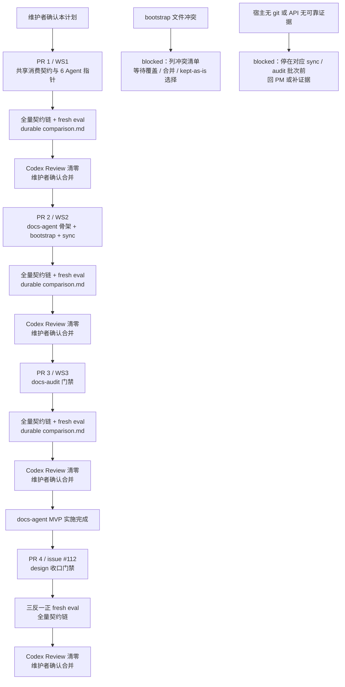

# docs-agent 实施计划

## 1. 背景

现有 6 个角色 Agent 已覆盖产品、设计、工程、QA、DevOps 与安全协作，但宿主项目中描述系统当前状态的正式文档仍缺少专属维护角色。issue #105 与已批准 PRD 因此定义第 7 个角色 Agent `docs-agent`，负责正式文档站初始化、同步、存量回填和发版前审计，并为现有 6 个 Agent 增加以 change-map 为入口的消费契约。

本计划把 `docs/engineer/agents/docs-agent/TRD.md`（版本以 frontmatter 为准，当前 0.4.1）展开为四个独立 PR 的文件级执行顺序、验证门禁、回滚点和维护者确认点，并追加 issue #118 frontmatter 契约统一 scope 与 issue #117 `two-phase-audit` scope。计划只展开 marketplace 仓库内的实现触点；宿主项目中的 `docs/site/**` 仍是 skill 运行输出，不作为本仓库预置文件。

## 2. 前置对齐结论

- PRD：`docs/pm/agents/docs-agent/PRD.md`，版本以 frontmatter 为准（当前 1.3.0），状态为 `Approved`。
- TRD：`docs/engineer/agents/docs-agent/TRD.md`，版本以 frontmatter 为准（当前 0.4.1）；状态为 `Approved`。
- 需求来源：GitHub issue #105、issue #112、issue #117 与 issue #118；PRD 已确认的 8 项决议逐项沿用，issue #112 追加 design 交付链收口门禁，issue #118 追加 frontmatter 契约统一 scope，issue #117 追加双阶段版本审计 scope。
- Feature path：PRD 与 TRD 均为 `agents/docs-agent`，`parent_feature: agents`、`feature_level: "2"` 一致。
- 变更分级：`change_tier: major`。新增 Agent、skill、marketplace 注册、跨角色消费契约与 contract/eval 触点，维持完整计划确认流程。
- 固定实施顺序：WS1 → WS2 → WS3 → PR 4 design 收口门禁，分别对应四个独立 PR；每个 PR 均单独完成验证、Codex Review 和维护者合并确认，不合并成一次 major 确认。本分支 `feat/design-sync-closeout-gate` 承载 issue #112 的文档修订与后续 PR 4 实施。
- 实施分工：本功能跨角色、多模块且有 durable eval 要求，实施时按每个 PR 划定文件范围；由 fresh implementation sub-agent 承担明确文件范围，另由 fresh validation sub-agent 基于同一 fixture 生成 with-skill 与 without-skill 结果并验收，主进程保留 PRD/TRD、仓库契约与合并判断上下文。

TRD 第 13 节的两个 Open Question 在本计划中落定如下：

1. **回填单批粒度默认值**：默认按 feature-catalog 模块切分；无 catalog 时按 API surface（顶级路由组）切分；单批建议上限为一个业务模块或约 5 个 API 页面，由首个 fixture 校准后固化到 skill 文档；无论粒度如何，每批保留维护者确认。
2. **bootstrap 冲突处理语义**：冲突默认 blocked 并列出清单；用户明确选择「保留现有文件」时在生成 manifest 中登记 `kept-as-is` 状态，后续幂等检查对该文件跳过模板一致性要求；不提供静默保留路径。

## 3. 目标

- 先建立现有 6 个 Agent 的正式文档消费契约，在有 change-map 时精准读取映射文档并回代码验证关键判断，无站点时静默保持既有探索行为。
- 新增 docs-agent router、`docs-site-bootstrap` 与 `formal-docs-sync`，完成 router / bootstrap / sync 注册（docs-audit 注册随 WS3 达成 4-skill 终态）、完整双站点骨架、feature API 同步和存量 API 回填 MVP。
- 新增 `docs-audit`，按确定性层与事实层输出 `verified` / `stale` / `mismatch`；在 pre-tag 阶段仅当完整受影响页面集合全部 verified 且版本证据一致时，使用维护者确认的 `target_release_version` 统一盖章并返回 `ready_for_tag`，实际 tag 创建后再以 post-tag audit 返回 `release_verified` 或 `blocked`。
- 四个 PR 均具备确定性契约检查、对应 fresh Codex subagent eval、durable `comparison.md`、Codex Review 和独立维护者确认记录。

## 4. 非目标

- 不修改 PRD（版本以 frontmatter 为准，当前 1.3.0）或 TRD（版本以 frontmatter 为准，当前 0.4.1）已经确认的范围；除第 2 节两个 Open Question、issue #112 明确要求的 design 收口门禁、issue #118 frontmatter 契约统一与 issue #117 双阶段审计外不新增设计决策。
- 不修改或复制参考实现，不把参考项目的专有路径、模块名或品牌内容写入 marketplace 模板。
- 不在本 marketplace 仓库预置宿主项目 `docs/site/**`；该目录只由宿主显式执行 bootstrap 后生成。
- 不把 database、design、ops、release-notes 或产品手册自动同步描述为 MVP 已完成能力；MVP 同步与回填验收仅覆盖 api 链路。
- 不改变 `changelog-generator` 的输出路径；版本归档继续写入 `docs/changelog/changelog-v{version}.md`。
- 不自动创建 tag、GitHub Release，不新增 Release CI，也不在任一 PR 通过前越过维护者确认执行下一 workstream。

## 5. 文件变更清单

### 5.1 PR 1 / WS1 消费契约

| 操作 | 路径 | 目的 |
| --- | --- | --- |
| 新增 | `agents/product_manager/skills/idea-to-spec/_internal/_shared/consumption-contract.md` | 建立任务落点、change-map 反查、精准读取、代码回证、新鲜度与分歧输出的权威消费协议，随 pm-agent 入口插件分发。 |
| 修改 | `agents/product_manager/skills/{feature-catalog,github-reader,idea-to-spec}/SKILL.md` | 为执行代码或项目探索的 PM specialist 增加一行消费契约指针。 |
| 修改 | `agents/engineer/skills/{codebase-analyzer,trd-gen,feature-implementor,debugger,test-writer}/SKILL.md` | 为执行代码或项目探索的 Engineer specialist 增加一行消费契约指针。 |
| 修改 | `agents/qa/skills/{spec-based-tester,exploratory-tester,bug-analyzer,regression-suite}/SKILL.md` | 为 4 个 QA specialist 增加一行消费契约指针。 |
| 修改 | `agents/devops/skills/{deployment-planner,env-config-auditor,incident-playbook-writer,cicd-bootstrap}/SKILL.md` | 为执行项目配置或运行面探索的 DevOps specialist 增加一行消费契约指针。 |
| 修改 | `agents/designer/skills/ui-ux-design/SKILL.md` | 为需要读取现有产品与界面事实的 Designer specialist 增加一行消费契约指针。 |
| 修改 | `agents/security/skills/{appsec-checklist,authz-reviewer,dependency-risk-auditor,privacy-surface-mapper}/SKILL.md` | 为 4 个 Security specialist 增加一行消费契约指针。 |
| 修改 | `agents/engineer/skills/debugger/SKILL.md` | 在通用指针之外，把命中的 API contract 纳入 expected-behavior 依据来源之一，并保留与 Approved PRD/TRD、测试和代码证据的一致性门禁。 |
| 修改 | `agents/product_manager/skills/release-notes-generator/SKILL.md` | 仅按 `docs/site/release-notes/` 存在性切换 release-notes 输出目标；站点不存在时保持原路径和行为。 |
| 修改 | `agents/product_manager/test/{feature-catalog,github-reader,idea-to-spec,release-notes-generator}/evals/evals.json`、`agents/engineer/test/{codebase-analyzer,trd-gen,feature-implementor,debugger,test-writer}/evals/evals.json`、`agents/qa/test/{spec-based-tester,exploratory-tester,bug-analyzer,regression-suite}/evals/evals.json`、`agents/devops/test/{deployment-planner,env-config-auditor,incident-playbook-writer,cicd-bootstrap}/evals/evals.json`、`agents/designer/test/ui-ux-design/evals/evals.json`、`agents/security/test/{appsec-checklist,authz-reviewer,dependency-risk-auditor,privacy-surface-mapper}/evals/evals.json` | 为上述消费侧 skill 增补命中 change-map、无站点、旧版本三类语义 assertions；这些 eval 定义当前均存在。 |
| 新增 | 上述 eval 目录各自的 `workspace/<新增消费回归用例>/**`（含 durable `comparison.md`） | 为三类消费行为建立隔离 fixture；新用例编号在 PR 1 依据各 `evals.json` 的现有最大编号顺延，避免覆盖既有 workspace。 |
| 修改 | `skills-lock.json` | 刷新 PR 1 中所有被修改 skill 的 `computedHash`。 |
| 修改（按硬编码情况） | `scripts/check_repository_contract.py`、`scripts/check_eval_contract.py`、`agents/test_eval_contract.py` | 仅在现有校验硬编码 Agent、router、skill 数量或路径时扩展 contract 及其测试；动态兼容时不改。 |

WS1 适用 specialist 指针初步清单如下，已与 `agents/*/skills/` 实际目录核对；最终是否需要该指针的判断标准是该 specialist 是否执行代码或项目探索，PR 1 评审时可据实际协议边界调整：

- product_manager：`feature-catalog`、`github-reader`、`idea-to-spec`
- engineer：`codebase-analyzer`、`trd-gen`、`feature-implementor`、`debugger`、`test-writer`
- qa：`spec-based-tester`、`exploratory-tester`、`bug-analyzer`、`regression-suite`
- devops：`deployment-planner`、`env-config-auditor`、`incident-playbook-writer`、`cicd-bootstrap`
- designer：`ui-ux-design`
- security：`appsec-checklist`、`authz-reviewer`、`dependency-risk-auditor`、`privacy-surface-mapper`

专属规则另有两处：`debugger` 增加 API contract expected-behavior 依据规则；`release-notes-generator` 增加站点存在性输出切换。`changelog-generator` 不增加消费指针，也不修改输出路径。

### 5.2 PR 2 / WS2 Agent 骨架、bootstrap 与 sync

| 操作 | 路径 | 目的 |
| --- | --- | --- |
| 新增 | `agents/docs/README.md` | 说明第 7 个角色 Agent 的边界、router 与三个 specialist 能力。 |
| 新增 | `agents/docs/skills/docs-agent/SKILL.md` | 建立第 6 个下游 role router，只负责入口凭据检查、分流与 specialist gate 指针；WS2 中间态只分流 bootstrap 与 sync，审计请求明确告知 docs-audit 随 WS3 交付并 blocked，不 handoff 到不存在的 skill。 |
| 新增 | `agents/docs/.claude-plugin/plugin.json` | 按现有 Agent manifest 模式登记 `docs-agent`，name、version、description 与 marketplace 对齐。 |
| 新增 | `agents/docs/skills/docs-site-bootstrap/SKILL.md`、`agents/docs/skills/docs-site-bootstrap/_internal/INSTRUCTIONS.md` | 实现显式 opt-in、生成 manifest、幂等冲突协议，并集中内置完整站点骨架、5 类模板、脚本、VitePress 与 Mermaid 渲染模板文本；依赖集包含 `mermaid`，standards 页面使用 `doc_type: design`，所有页面的 `related_code` 均必填非空。 |
| 新增 | `agents/docs/skills/formal-docs-sync/SKILL.md`、`agents/docs/skills/formal-docs-sync/_internal/INSTRUCTIONS.md` | 实现三节点同步协议与 api 存量回填 MVP，保持 latest-state 与每批确认门禁。 |
| 修改 | `agents/product_manager/skills/pm-agent/SKILL.md`、`agents/product_manager/skills/idea-to-spec/_internal/_shared/skill-map.md` | PM 入口增加 formal-docs 请求分类与 downstream_owner: Docs 路由，使 docs-agent 经默认 PM-first 路径可达。 |
| 新增 | `agents/docs/test/docs-agent/evals/evals.json`、`workspace/**` | 验证 router 的 handoff、等效文档链、无凭据回 PM、共享契约识别，及 WS2 中间态审计请求 blocked。 |
| 新增 | `agents/docs/test/docs-site-bootstrap/evals/evals.json`、`workspace/**` | 验证空 workspace、完整 bootstrap、冲突 blocked、显式 opt-in、幂等与 `kept-as-is` manifest 语义。 |
| 新增 | `agents/docs/test/formal-docs-sync/evals/evals.json`、`workspace/**` | 验证 feature API 同步、catalog 回填、无 catalog 回填、批次确认与 change-map 生长。 |
| 新增 | `agents/docs/test/run_all_evals.py`、`agents/docs/test/test_docs_run_eval.py` | 按现有 Agent eval runner 模式提供手动 workflow 诊断入口与可被 CI 显式收集的确定性测试；运行期产物只写入隔离 scratch。 |
| 修改 | `agents/engineer/skills/trd-gen/SKILL.md`、`agents/engineer/skills/trd-gen/_internal/trd-schema.md` | 同步增强 TRD 输出与 schema 契约，增加可选 frontmatter `related_code`；缺省时 sync 继续按 TRD 影响模块、已确认计划 scope 与实际 diff 回退。 |
| 修改 | `.claude-plugin/marketplace.json`、`skills-lock.json` | 注册 router、bootstrap、sync 三个 skill 路径并写入对应 metadata、path 与 computedHash；docs-audit 由 PR 3 追加注册 |
| 修改 | `AGENTS.md` | 更新协作流图、文档依赖、当前 Agent / specialist 数量三处权威说明，并登记 docs-agent 的角色边界。 |
| 修改 | `README.md`、`README_zh.md` | 暴露 docs-agent plugin 与协作说明，中英文保持一致。 |
| 修改 | `.codex/INSTALL.md`、`docs/README.codex.md` | 增加 docs-agent 的 Codex 安装、暴露与协作说明。 |
| 修改 | `.github/workflows/evals.yml` | 新增由本 PR 创建的 `docs` target 与 docs-agent eval job，使 router / bootstrap / sync 三个 skill 的手动 eval 可触发；docs-audit 覆盖由 PR 3 接入。 |
| 修改 | `.github/workflows/ci.yml` | 将由本 PR 创建的 `agents/docs/test` 确定性测试路径显式加入 python-tests 清单。 |
| 修改（按硬编码情况） | `scripts/check_repository_contract.py`、`scripts/check_eval_contract.py`、`agents/test_eval_contract.py` | 扩展 docs-agent、plugin manifest、router、skill、eval 路径硬编码检查；不重写已有动态兼容逻辑。 |

### 5.3 PR 3 / WS3 docs-audit

| 操作 | 路径 | 目的 |
| --- | --- | --- |
| 新增 | `agents/docs/skills/docs-audit/SKILL.md`、`agents/docs/skills/docs-audit/_internal/INSTRUCTIONS.md` | 原 WS3 实现 diff × change-map 确定性层、声明与代码证据事实层、三态报告与统一盖章；issue #117 A1 在此基础上增加维护者确认的 `target_release_version` 必要输入和双阶段协议，将缺少该输入的 release audit 统一改为 blocked。 |
| 新增 | `agents/docs/test/docs-audit/evals/evals.json`、`workspace/**` | 原 WS3 覆盖 mismatch、stale、纯重构 verified、全部一致、纯文档错误和无 release tag 六组 fixture；issue #117 A2 负责按新模型调整冲突断言，并新增双阶段四类 fixture 与 durable `comparison.md`。 |
| 修改 | `.claude-plugin/marketplace.json`、`skills-lock.json` | 追加 docs-audit 注册达成 4-skill 终态，刷新 metadata 与 computedHash |
| 修改（按硬编码情况） | `scripts/check_repository_contract.py`、`scripts/check_eval_contract.py`、`agents/test_eval_contract.py` | 若校验硬编码 audit skill 或 eval 路径则同步扩展，否则保持不变。 |
| 修改（按需） | `.github/workflows/evals.yml` | docs job 若显式枚举 skill eval 路径则追加 docs-audit；动态收集 `agents/docs/test` 时只验证 audit eval 被覆盖，不重复新增 target。 |
| 修改 | `agents/docs/skills/docs-agent/SKILL.md`、`agents/docs/test/docs-agent/evals/{evals.json,workspace/**}` | 启用 router 审计分流并移除 WS2 中间态 blocked 文案；router eval 的审计断言由 blocked 改为 handoff docs-audit。 |

### 5.4 PR 4 / design 收口门禁

| 操作 | 路径 | 目的 |
| --- | --- | --- |
| 修改 | `docs/pm/agents/docs-agent/PRD.md`、`docs/engineer/agents/docs-agent/TRD.md`、`docs/engineer/agents/docs-agent/IMPLEMENTATION_PLAN.md` | 登记 issue #112 的产品要求、技术契约和独立实施 scope。 |
| 修改 | `agents/docs/skills/formal-docs-sync/SKILL.md`、`agents/docs/skills/formal-docs-sync/_internal/INSTRUCTIONS.md` | 落地同 feature_path 的七项完成态门禁、证据复用、blocked 输出、design/map 原子性与 current-state 回读。 |
| 新增/修改 | `agents/docs/test/formal-docs-sync/evals/**` | 持久化实现未完成、测试失败或缺失、feature_path 不一致、全部通过四组 fixture 与 durable `comparison.md`。 |
| 修改 | `skills-lock.json` | 刷新 `formal-docs-sync` 的 metadata 与 `computedHash`。 |

本实施计划文件是 TRD 第 9 节的“交接文档”触点；宿主项目中的 `docs/site/**` 不进入以上四张 marketplace PR 变更表。

## 6. 目标流程图



## 7. 实施顺序

### 7.1 PR 1 / WS1 消费契约

1. **建立共享消费契约**
   - 操作 → 新增 `consumption-contract.md`，写入适用条件、读取协议、信任模型、新鲜度和分歧输出约定，不在 specialist 中复制权威协议。
   - 验证 → 对照 TRD 第 8 节逐项回读；确认 change-map 不存在时静默降级，关键判断始终回代码或测试验证。

2. **增加 6 个 Agent 的适用 specialist 指针**
   - 操作 → 按第 5.1 节初步清单逐个修改实际存在的 `SKILL.md`，只增加一行共享契约指针；PR 评审根据“是否做代码/项目探索”调整最终集合。
   - 验证 → 用 `ls agents/*/skills/` 与 diff 核对没有修改 role router、无关 specialist 或不存在的 skill，且各处没有复制共享协议正文。

3. **落实两处专属规则**
   - 操作 → 在 `debugger` expected-behavior gate 增加 API contract 条件依据；在 `release-notes-generator` 增加站点存在性输出切换；不修改 `changelog-generator`。
   - 验证 → 检查 debugger 不会以文档覆盖 Approved PRD/TRD、测试或代码证据；检查无站点时 release-notes 行为不变，changelog 路径保持原契约。

4. **补消费回归 eval、lock hash 与必要 contract 适配**
   - 操作 → 为受影响 skill 增加命中 change-map、无站点、旧版本 fixture、语义 assertions 与 durable `comparison.md`；刷新所有被修改 skill 的 `skills-lock.json` hash；仅在脚本硬编码时扩展 contract 及其测试。
   - 验证 → 对照 TRD 第 11.1 节“6 Agent 消费回归”fixture 组，执行 schema 1.0 与 runtime artifact 策略检查，并由 repository contract 校验 lock hash 一致。

5. **跑全量契约链**
   - 操作 → 按第 8.1 节固定顺序运行 repository、eval、artifact、doc 与当前 CI 显式 pytest 清单。
   - 验证 → 所有命令退出码为 0；失败项在本 PR 内修复并从失败命令起重跑，最终再顺序跑完整链。

6. **执行并更新对应 eval 与 durable `comparison.md`**
   - 操作 → 由当前会话 fresh Codex subagent 对同一 prompt/fixture 先生成 with-skill，再生成新的 without-skill baseline，并更新受影响 workspace 的 `comparison.md`。
   - 验证 → 对照 TRD 第 11.1 节的消费回归 fixture 组确认结论；不得复用历史 baseline，运行期 transcript、verdict、timing 与 diagnostics 不提交。

7. **提交 PR**
   - 操作 → 在本分支完成 WS1 后提交 PR 1，并在 PR 说明中列出范围、验证证据、comparison 结论与回滚点。
   - 验证 → PR diff 只含 WS1 表内文件和本实施计划，CI 全部通过，评论结论与 durable `comparison.md` 一致。

8. **处理 Codex Review 至清零**
   - 操作 → 逐条处理所有 Codex Review 内容；修复使用新 commit 普通 push，并重新触发 `@codex review`。
   - 验证 → latest-head Codex Review 明确无问题，所有 actionable thread 已解决。

9. **维护者独立确认合并**
   - 操作 → 展示 PR 1 的 latest-head review、CI、eval 与回滚证据，等待维护者明确确认后才合并。
   - 验证 → 优先 squash merge；未获确认不合并，也不开始 WS2。

**PR 1 回滚点**：PR 1 可整体普通 revert，移除共享 contract、specialist 增量指针、两处专属规则与消费回归 eval，使现有 6 个 Agent 恢复原行为。

### 7.2 PR 2 / WS2 Agent 骨架、bootstrap 与 sync

1. **建立 Agent 骨架**
   - 操作 → 新增 `agents/docs/README.md` 和 router `SKILL.md`；router 只做入口凭据检查、目标分流与 specialist gate 指针。
   - 验证 → 对照 TRD 第 3.1、3.2 节检查目录与 gate 边界；缺 PM handoff、等效文档链或 specialist entry basis 时必须回 PM；审计请求在 WS2 中间态返回 blocked 与交付说明，而非 handoff 缺失 skill。

2. **增加 plugin manifest 与注册**
   - 操作 → 新增 `agents/docs/.claude-plugin/plugin.json`，在 marketplace 注册 router、bootstrap、sync 三个 skill 路径，在 `skills-lock.json` 写入 path、metadata 与 hash。
   - 验证 → 对照 TRD 第 3.3 节和现有 Agent manifest，检查 name、version、description、author 与 marketplace 一致，3 个路径全部可解析，docs-audit 不提前注册。

3. **实现 bootstrap 模板**
   - 操作 → 新增 bootstrap `SKILL.md` 与单一 `_internal/INSTRUCTIONS.md`，内置 7 个目录、npm 依赖（`vitepress`、`fast-glob`、`gray-matter`、`picomatch`、`yaml`、`mermaid`）、6 个脚本及 helper、三份 VitePress config、theme 与 Mermaid 渲染组件、双首页、standards、5 类模板、change-map 与 release metadata 文本；frontmatter 的 `doc_type` 枚举不含 `standard`，standards 页面使用 `design`，所有页面的 `related_code` 均必填非空。
   - 验证 → 按 manifest 逐路径核对 TRD 第 4、5.1 节生成清单；空 workspace 一次生成完整、二次零差异、未 opt-in 不写入；冲突默认 blocked，显式保留时写 `kept-as-is` 且无静默保留。

4. **实现 sync 协议**
   - 操作 → 新增 sync `SKILL.md` 与单一 `_internal/INSTRUCTIONS.md`，落实三节点协议、证据优先级、latest-state 纪律及 feature / 回填 api MVP；按第 2 节默认批次粒度保留逐批确认。
   - 验证 → feature 模式只更新影响 API 与映射；回填优先 catalog、无 catalog 时按顶级路由组圈定并先确认；无可靠 API 证据时 unresolved 且停在该批次前。

5. **新增 router、bootstrap、sync eval**
   - 操作 → 为三个 skill 创建 schema 1.0 的 `evals.json`、最小 workspace fixture 与 durable `comparison.md`；新增 `run_all_evals.py` 与 `test_docs_run_eval.py`，并同步必要的 contract 适配。
   - 验证 → 对照 TRD 第 11.1 节的 router、bootstrap、sync feature、sync 回填四组 fixture 检查所有语义 assertions 与产物策略；确认 workflow 诊断写入隔离 scratch，且 `uv run --with pytest pytest agents/docs/test` 能收集由本步骤创建的确定性测试。

6. **完成文档与工作流联动**
   - 操作 → 同步修改 `trd-gen/SKILL.md` 与 `_internal/trd-schema.md`；更新 `AGENTS.md`、README × 2、Codex 安装文档 × 2；在 evals workflow 创建 `docs` target，在 ci.yml 创建 `agents/docs/test` 显式 pytest 路径。
   - 验证 → `related_code` 是增强项而非 gate，缺省时保留证据链回退；中英文说明一致，docs-agent 不被描述为默认入口，AGENTS 计数与目录一致；workflow 可触发 router / bootstrap / sync 三个 skill 的 eval，CI 显式路径能收集新增测试。

7. **跑全量契约链**
   - 操作 → 按第 8.1 节固定顺序运行 repository、eval、artifact、doc 与 PR 2 扩充后的显式 pytest 清单。
   - 验证 → 所有命令退出码为 0；失败项在本 PR 内修复并从失败命令起重跑，最终再顺序跑完整链。

8. **执行并更新对应 eval 与 durable `comparison.md`**
   - 操作 → 由当前会话 fresh Codex subagent 对同一 prompt/fixture 分别生成新的 with-skill 与 without-skill baseline，覆盖 router、bootstrap、sync feature 与 sync 回填，并更新 durable `comparison.md`。
   - 验证 → 最终结论来自 fresh subagent；由本 PR 创建的 `docs` workflow target 落地前，以当前会话 fresh validation 作为等效门禁，不提交运行期产物。

9. **提交 PR**
   - 操作 → 仅在 PR 1 已合并后从最新 `main` 创建 WS2 工作分支，提交 PR 2，并附验证、eval、注册与回滚证据。
   - 验证 → PR diff 只含 WS2 表内文件及脚本硬编码所需最小适配，CI 全部通过。

10. **处理 Codex Review 至清零**
    - 操作 → 逐条处理所有 Codex Review 内容；修复使用新 commit 普通 push，并重新触发 `@codex review`。
    - 验证 → latest-head Codex Review 明确无问题，所有 actionable thread 已解决。

11. **维护者独立确认合并**
    - 操作 → 展示 PR 2 的 latest-head review、CI、eval、bootstrap 幂等与 sync 证据，等待维护者明确确认后才合并。
    - 验证 → 优先 squash merge；未获确认不合并，也不开始 WS3。

**PR 2 回滚点**：PR 2 可整体普通 revert，移除 docs-agent 骨架、注册、bootstrap、sync、工作流与文档联动。若此时需要回滚 docs-agent，必须同批移除 PR 1 留下的悬空消费指针；不得自动删除宿主已生成的 `docs/site/**`。

### 7.3 PR 3 / WS3 docs-audit

1. **实现 docs-audit specialist 并启用 router 分流**
   - 操作 → 原 WS3 新增 audit `SKILL.md` 与单一 `_internal/INSTRUCTIONS.md`，落实 base/target、diff × change-map、纯文档变更页面影响域、`.meta/` 排除、事实核对、三态报告、release handoff 与统一盖章；同批更新 router `SKILL.md` 启用审计分流、移除中间态 blocked 文案，并把 router eval 审计断言改为 handoff docs-audit。issue #117 A1 将 base/target 明确为 `base_ref` / `target_ref`，并新增独立的 `target_release_version`。
   - 验证 → 对照 TRD 第 7 节逐项检查：frontmatter 无效为 stale，未同 diff 更新仅为 suspect，事实冲突为 mismatch，纯文档错误不能绕过事实层；issue #117 生效后，只有完整受影响页面集合全部 verified 才用维护者确认的 `target_release_version` 统一盖章。

2. **补 docs-audit eval 与必要 contract 适配**
   - 操作 → 原 WS3 新增 mismatch、stale、纯重构 verified、全部一致、仅文档变更且声明有误、无 release tag 六组 fixture、语义 assertions 与 durable `comparison.md`；仅在硬编码时调整 contract 及测试，在 marketplace 追加 docs-audit 注册并刷新 lock hash。issue #117 A2 才更新与双阶段模型冲突的既有 assertion，并新增四类双阶段 eval。
   - 验证 → 对照 TRD 第 11.1 节的 docs-audit fixture 组；前两类输出 blocked，纯文档错误由事实层拦截。issue #117 生效后，release audit 缺少维护者确认的 `target_release_version` 必须 blocked 且不盖章；tag 尚不存在但该输入明确时可以通过 pre-tag。4-skill 注册终态全部路径可解析，docs-audit eval 可经 evals.yml 的 `docs` target 触发。

3. **跑全量契约链**
   - 操作 → 按第 8.1 节固定顺序运行 repository、eval、artifact、doc 与 PR 2 已扩充的显式 pytest 清单。
   - 验证 → 所有命令退出码为 0；失败项在本 PR 内修复并从失败命令起重跑，最终再顺序跑完整链。

4. **执行并更新对应 eval 与 durable `comparison.md`**
   - 操作 → 由当前会话 fresh Codex subagent 在相同 fixture 上生成新的 with-skill 与 without-skill baseline，完成六组审计场景判断并更新 `comparison.md`。
   - 验证 → comparison 记录来源、行为摘要、失败项、下一步与 runtime artifact policy；最终判断不使用 CLI transcript 作为 pass/fail 事实源。

5. **提交 PR**
   - 操作 → 仅在 PR 2 已合并后从最新 `main` 创建 WS3 工作分支，提交 PR 3，并附验证、eval、审计门禁与回滚证据。
   - 验证 → PR diff 只含 WS3 表内文件及脚本硬编码所需最小适配，CI 全部通过。

6. **处理 Codex Review 至清零**
   - 操作 → 逐条处理所有 Codex Review 内容；修复使用新 commit 普通 push，并重新触发 `@codex review`。
   - 验证 → latest-head Codex Review 明确无问题，所有 actionable thread 已解决。

7. **维护者独立确认合并**
   - 操作 → 展示 PR 3 的 latest-head review、CI、eval 与审计三态证据，等待维护者明确确认后才合并。
   - 验证 → 优先 squash merge；未获确认不合并，不自动进入 tag 或 GitHub Release。

**PR 3 回滚点**：PR 3 可整体普通 revert，移除 docs-audit 与对应 eval，使已合并的消费、bootstrap 和 sync 能力保持不变。

### 7.4 PR 4 / design 收口门禁

1. **修订并确认文档契约**
   - 操作 → 以 issue #112 为权威同步 PRD 1.3.0、TRD 0.2.0 与本计划 0.2.0，确认七项门禁、完成态证据复用、blocked 原子性和写入规则语义一致。
   - 验证 → 逐项对照同一 `feature_path` 的 Approved PRD、含可追踪影响域的 Confirmed TRD、已确认计划、范围全部完成、代码/diff 覆盖、测试全部通过与既有范围确认七项，无遗漏或自行扩展。

2. **实现 sync 收口门禁**
   - 操作 → 修改 `formal-docs-sync` 入口与内部指令，在 feature delivery 的功能级 design 写入前核验七项门禁；完成态证据直接复用计划 scope 状态、实际 diff 和测试执行记录。
   - 验证 → 缺少或冲突证据时输出缺失项、当前 owner 与下一步；不采信过程文档自我宣称，不写暂定设计、未来态或部分正文。

3. **落实原子写入与回读**
   - 操作 → 把功能级 design 页面与对应 design change-map 条目作为同一原子范围；门禁全部通过且维护者确认候选范围后才同批写入，并回读核对关键声明。
   - 验证 → 任一门禁失败时两者零变化；成功写入只陈述最终代码与通过测试共同证明的 current state，`last_verified_version` 保持 `unverified` 等待 docs-audit 盖章。

4. **新增四组持久化 eval**
   - 操作 → 为实现未完成、测试失败或缺失、证据与 `feature_path` 不一致三类反向场景及全部通过的正向场景新增 fixture、语义 assertions 与 durable `comparison.md`。
   - 验证 → 反向场景均断言 blocked 且 design 正文/map 零变化；正向场景只进入既有候选范围确认，未获维护者确认不写入。

5. **执行 fresh validation**
   - 操作 → 由当前会话 fresh Codex subagent 对同一 prompt/fixture 生成新的 with-skill 与 without-skill baseline，并更新 durable `comparison.md`。
   - 验证 → 三反一正场景全部由 fresh judge 给出结论；不复用历史 baseline，不提交 transcript、verdict、timing 或 diagnostics。

6. **跑全量契约链**
   - 操作 → 按第 8.1 节顺序执行 repository、eval、artifact、doc 与显式 python-tests。
   - 验证 → 全部命令退出码为 0；修复后从失败命令起重跑，并最终顺序重跑完整链。

7. **提交独立 PR**
   - 操作 → 提交独立 PR 4，附七项门禁、四组 eval、原子性、契约链与回滚证据。
   - 验证 → PR diff 只包含第 5.4 节触点及必要的契约适配，CI 全绿，PR 结论与 durable `comparison.md` 一致。

8. **处理 Codex Review 至清零**
   - 操作 → 逐条处理所有 Codex Review 内容；修复使用新 commit 普通 push，并重新触发 `@codex review`。
   - 验证 → latest-head Codex Review 明确无问题，所有 actionable thread 已解决。

9. **等待维护者独立确认合并**
   - 操作 → 展示 latest-head review、CI、fresh eval 与原子性证据，等待维护者明确确认后才合并。
   - 验证 → 优先 squash merge；未获确认不合并。

**PR 4 回滚点**：PR 4 可整体普通 revert，移除 design 收口门禁、四组 fixture 与 lock 更新，不影响已交付的 docs-agent MVP 消费、bootstrap、API sync/backfill 和 docs-audit 能力。

四个 PR 共同遵守 TRD 第 12 节回滚约束：新 Agent 可通过普通 revert 回滚 marketplace 条目、`agents/docs/`、lock 与文档清单；消费契约可单独 revert，但若回滚 docs-agent，必须同批移除 WS1 悬空指针。宿主 bootstrap 已生成的数据归宿主项目，卸载 plugin 不自动删除；回滚宿主骨架须由维护者确认具体文件，禁止自动清空正式文档或 change-map。

## 8. 验证方式

### 8.1 契约链

每个 PR 均按 TRD 第 11.2 节的固定顺序运行。PR 1 使用当前 `.github/workflows/ci.yml` 的完整显式清单：

```bash
uv run scripts/check_repository_contract.py
uv run scripts/check_eval_contract.py
uv run scripts/check_eval_artifacts.py
uv run scripts/check_doc_contract.py
uv run --with pytest pytest \
  agents/product_manager/test/idea-to-spec \
  agents/product_manager/test/pm-agent \
  agents/qa/test/test_qa_run_eval.py \
  agents/designer/test/test_designer_run_eval.py \
  agents/devops/test/test_devops_run_eval.py \
  agents/test_doc_contract.py \
  agents/test_eval_contract.py \
  scripts/test_install_codex_skills.py
```

PR 2 从同一清单扩充由第 7.2 节第 5 步创建、并在 `.github/workflows/ci.yml` 同批登记的 `agents/docs/test` 显式路径；PR 2 和 PR 3 使用以下清单：

```bash
uv run scripts/check_repository_contract.py
uv run scripts/check_eval_contract.py
uv run scripts/check_eval_artifacts.py
uv run scripts/check_doc_contract.py
uv run --with pytest pytest \
  agents/product_manager/test/idea-to-spec \
  agents/product_manager/test/pm-agent \
  agents/qa/test/test_qa_run_eval.py \
  agents/designer/test/test_designer_run_eval.py \
  agents/devops/test/test_devops_run_eval.py \
  agents/docs/test \
  agents/test_doc_contract.py \
  agents/test_eval_contract.py \
  scripts/test_install_codex_skills.py
```

不得用隐式全库收集替代 CI 的显式路径契约。每次修复失败项后，最终必须按以上顺序重新运行完整链。

### 8.2 Eval 映射

完整 fixture、PRD AC 与语义 assertions 映射以 TRD 第 11.1 节为权威，本计划不复制全表。各 PR 必须通过的 fixture 组为：

| PR | 必须通过的 fixture 组 |
| --- | --- |
| PR 1 / WS1 | 6 Agent 消费回归：命中 change-map、无站点、过期版本。 |
| PR 2 / WS2 | docs-agent router；docs-site-bootstrap；formal-docs-sync feature 模式；formal-docs-sync 回填模式。 |
| PR 3 / WS3 | docs-audit 既有事实层：mismatch、stale、纯重构 verified、全部一致、仅文档变更且声明有误、无 release tag；其中与 issue #117 双阶段模型冲突的版本断言由 A2 更新。 |
| PR 4 / issue #112 | formal-docs-sync design 收口门禁：实现未完成、测试失败或缺失、证据与 `feature_path` 不一致、全部通过四组 fixture。 |

PR 1 执行现有受影响 skill eval；PR 2 在 `.github/workflows/evals.yml` 创建 `docs` target 与 docs-agent eval job，PR 3 复用该 target 执行 audit eval。由 PR 2 创建的 target 在落地前必须明确记为尚不存在，并由当前会话 fresh validation 作为等效门禁，不能假装已可触发。

### 8.3 Fresh Sub-Agent 门禁

- 每个 PR 涉及 skill 行为、routing 或 fixture，合并前必须执行对应 fresh Codex subagent validation。
- 同一 prompt 与 fixture 先生成新的 with-skill，再在不读取或应用该 skill / Agent README 的条件下生成新的 without-skill baseline；不得复用历史 baseline。
- 最终可用性判断必须来自当前会话 fresh subagent；CLI transcript 只作为诊断证据。
- 实际执行 eval 后必须在同一 PR 更新对应 durable `comparison.md`；comparison 需记录 evaluation target、test set / fixture version、latest result、with-skill / without-skill 来源与行为摘要、failures、next steps 和 runtime artifact policy。
- `with_skill/`、`without_skill/`、transcript、verdict、timing、run status 与 diagnostics 等运行期产物只写入隔离 scratch，不提交到 git。

## 9. 风险与处理

| 风险 / 假设 | 计划内处理 | 停点 |
| --- | --- | --- |
| bootstrap 目标路径已存在且内容与模板不同 | 默认列出完整冲突清单并 blocked；等待用户逐文件选择覆盖、合并或 `kept-as-is`。选择保留时只登记 manifest 状态并在后续幂等检查跳过该文件的模板一致性要求；无静默保留。 | blocking 未解锁时，停在 PR 2 的 bootstrap 模板步骤前，不继续写冲突文件或部分覆盖。 |
| 宿主不使用 git，或 `docs/site/` 不能作为正式文档根 | 按 TRD 第 13 节返回 PM 重新确认产品范围，不在 MVP 内自适配 diff 或根路径。 | blocking 未解锁时，停在 PR 2 对应 sync 批次或 PR 3 audit 步骤前。 |
| API 事实无法从路由、schema、handler 或 contract test 取得可靠证据 | 页面标记 unresolved，不生成猜测内容，也不进入 verified；由维护者补证据或调整该批范围。 | blocking 未解锁时，停在 PR 2 对应回填 / 同步批次前；不得扩展到其他批次掩盖缺口。 |
| PR 2 注册时 docs-audit 尚不存在 | 已由 TRD 0.1.12 增量注册设计解决：PR 2 注册 3 个 skill 路径，PR 3 追加 docs-audit；repository contract 始终校验已注册路径存在 | 无停点；PR 3 未追加注册前不得声称 4-skill 终态 |
| related_code 太宽或 change-map glob 重叠 | sync 输出每个 glob 的命中样本，每批确认范围；audit 报告展示条目来源与 exclude。 | 命中范围无法稳定时暂停当前批次，先收敛映射，不影响已确认的其他批次。 |
| docs-agent 回滚后 WS1 指针悬空 | 回滚 docs-agent 时同批移除所有悬空消费指针；单 plugin 安装场景仍验证无 change-map 时静默降级。 | 回滚提交未覆盖悬空指针时不得合并。 |

## 10. 确认点

- 本计划保持 `Draft`；新增 PR 4 scope 获维护者确认后，才开始 design 收口门禁实现。
- 维护者确认新增 scope 后按 PR 4 第 7.4 节推进；既有 WS1 → WS2 → WS3 顺序与 TRD 0.1.12 的增量注册设计保持不变。
- PR 1、PR 2、PR 3 与 PR 4 均在 latest-head Codex Review 清零、CI 全绿、对应 fresh eval 与 durable `comparison.md` 更新完成后，分别等待维护者独立确认；不得把四个 workstream 合并成一次 major 确认。
- 每个 PR 可整体 revert；跨 PR 回滚必须遵守第 7 节引用的 TRD 第 12 节约束，尤其是回滚 docs-agent 时同批移除 WS1 悬空指针。
- 若 MVP 收窄边界（api 链路）发生变化，停止实施并回 `pm-agent` 重新确认产品范围与 `change_tier`，不得在实施计划内自行扩大或收缩验收面。

## Scope 追加：frontmatter 契约统一（issue #118）

### 目标

- 将 AI Hub 已验证的默认 frontmatter 规则迁入 docs-agent，由 `agents/docs/skills/docs-agent/_internal/_shared/frontmatter-contract.md` 持有单一契约。
- 让 `docs-site-bootstrap`、`formal-docs-sync` 与 `docs-audit` 消费同一规则，确保生成端与审计端对同一页面得出一致结论。

### 实施阶段

| 阶段 | 范围 | 验证 |
| --- | --- | --- |
| P1 | 新增契约真源，补充 docs-agent router 指针，并以 TRD 0.3.0 增量记录统一规则。 | 运行 `uv run scripts/check_doc_contract.py`，确认契约真源、TRD 与计划文档通过文档契约检查。 |
| P2 | 对齐 `docs-audit` 的字段枚举、`related_code` 证据范围、未确认目标版本页面的 `unverified` 行为与统一盖章前置条件；issue #117 生效后，release audit 缺少明确 `target_release_version` 直接 blocked。 | 非法 frontmatter fixture 必须判定为 `stale` 并输出 blocked release 建议。 |
| P3 | 对齐 `docs-site-bootstrap` 交付宿主的校验脚本和全部内置页面：移除 `doc_type: standard`，所有页面使用非空 `related_code`，并无条件保留 `last_verified_version`。本阶段只改语义，不执行 issue #122 的结构搬迁。 | 全仓生成内容不再出现 `doc_type: standard` 或空 `related_code`，宿主校验脚本与契约真源一致。 |
| P4 | 让 `formal-docs-sync` 在新增或更新页面时消费同一契约，保持生成、同步与审计判断一致。 | 检查 sync 输出不生成 `standard` 类型、不允许空 `related_code`，且页面在进入已确认目标发布版本的 audit 前保留 `last_verified_version: unverified`。 |
| P5 | 增加共享合法/非法 fixture，更新三个 specialist 的 eval，并执行 fresh with-skill / without-skill validation 后更新 durable `comparison.md`；将 `eval-006-audit-no-version-anchor` 重定义为字段保持 `unverified`，而不是缺省字段。 | 三个 skill 的语义 assertions、fresh validation 结论与 durable `comparison.md` 一致；不得复用历史 baseline 或提交运行期产物。 |
| P6 | 完成四项契约检查、显式 pytest 清单与 PR 交付。 | `check_repository_contract.py`、`check_eval_contract.py`、`check_eval_artifacts.py`、`check_doc_contract.py` 及计划内 pytest 全部通过；若 P5 前旧 fixture 仍断言旧契约，则如实记录为 P5 阻塞，不在 P1-P4 越界修复。 |

### 风险与边界

- issue #122 负责结构搬迁；issue #118 只统一 frontmatter 语义，不移动目录或内部指令结构。
- issue #117 持有统一盖章时序；本 scope 只要求 `last_verified_version` 无条件存在。非 release 审计页面或尚无维护者确认目标版本的页面继续保持 `unverified`；一旦进入 release audit，缺少明确 `target_release_version` 必须 blocked 且不盖章。

## Scope 追加：`two-phase-audit`（issue #117）

### 目标

- 用维护者明确确认的 `target_release_version` 解开 release PR 文档审计等待 tag 的循环依赖，并保持 `base_ref`、`target_ref`、目标版本和页面验证版本四个概念独立。
- 在 tag 前完成完整影响域核对与统一盖章，输出 `ready_for_tag`；在实际 tag 创建后只做最终一致性复核，输出 `release_verified` 或 `blocked`。
- 保持 `last_verified_version` 只表示页面内容验证版本，不把它扩展为发布状态字段，也不新增 `baseline_verified_version` 持久化字段。

### 实施阶段

| 阶段 | 范围 | 验证与出口 |
| --- | --- | --- |
| A1 — 实现 | 将父级 TRD 增量到 0.4.0；修改 `docs-audit` 的入口与内部协议，增加 `target_release_version` 必要输入、pre-tag / post-tag 模式、`ready_for_tag` / `release_verified` / `blocked` 对外状态、完整影响域统一盖章和目标版本变化失效规则；消费 issue #116 Release Notes handoff；刷新 `docs-audit` computedHash。 | 四项 contract checker 与 CI 同款显式 pytest 全部通过；若既有 eval assertion 与双阶段模型冲突，只记录差异，不在 A1 越界修改 eval、fixture 或 durable `comparison.md`。 |
| A2 — Eval 与交付 | 增加 pre-tag success、pre-tag blocked、post-tag match、post-tag mismatch 四类 eval；使用相同 prompt / fixture 生成 fresh with-skill 和 fresh without-skill baseline，由 fresh Codex subagent 评审并更新 durable `comparison.md`；完成最终仓库验证与 PR 交付。 | eval contract、artifact policy 与完整契约链通过；comparison 与 fresh 证据一致；不提交 transcript、verdict、timing 或 diagnostics 等运行期产物；PR 等待 CI、review 与维护者确认，不自动 merge。 |
| A3 — Review 修复 | 将 pre-tag 成功盖章结果与页面/版本面内容哈希原子回写同一持久化记录；post-tag 解析实际 tag commit，以 HEAD/tree 快路径或 tag commit 逐项重算哈希的一般路径绑定审计内容；更新 008/010/011 eval 断言与 fixture，011 固定为 tag 名正确但内容漂移。 | 刷新 docs-audit computedHash；对实际受影响 eval 重新生成 fresh with-skill 与 fresh without-skill baseline 并更新 comparison；四项 contract checker、CI 同款 pytest 与 PR CI 全部通过后完成交付，不等待 review、不 merge。 |

### 文件范围与责任边界

- A1 只修改父级 `docs/engineer/agents/docs-agent/{TRD.md,IMPLEMENTATION_PLAN.md}`、`agents/docs/skills/docs-audit/{SKILL.md,_internal/INSTRUCTIONS.md}` 和 `skills-lock.json` 中 `docs-audit` 的 hash；不新建 `agents/docs-agent/two-phase-audit` 子文档路径。
- A2 才修改 `agents/docs/test/docs-audit/evals/**` 与对应 durable `comparison.md`；A1 不为通过旧断言而弱化双阶段协议。
- issue #116 生成并确认 Release Notes、索引和 release metadata；#117 只消费其证据、审计一致性和统一盖章，不生成 Release Notes，也不维护 `.meta/releases.json` 内容。
- issue #118 持有 frontmatter 契约和 `unverified` 语义；issue #120 持有 GitHub Release 草稿与发布门禁；宿主持有版本事实确认、tag、确定性 CI 和实际发布。
- 本 scope 不创建或移动 tag，不生成、编辑或发布 GitHub Release，不修改 AI Hub workflow，不新增动态宿主版本 schema，也不发布镜像、更新 Helm 或执行部署。

### 状态与 closeout

父级计划继续保持 `Draft`，因为 issue #117 的 PR 尚待维护者 review 与独立确认。A1、A2 与 A3 已完成实现、eval、fresh validation、全面自查和本地交付门禁；A3 的 PR CI 结果由 push 后的交付步骤确认。未经确认不归档、不 merge、不创建 tag 或发布 GitHub Release。

A1 实施结果：已完成父级 TRD 0.4.0 增量、`docs-audit` 双阶段协议改造和 `skills-lock.json` hash 刷新。`uv run scripts/check_repository_contract.py`、`uv run scripts/check_eval_contract.py`、`uv run scripts/check_eval_artifacts.py`、`uv run scripts/check_doc_contract.py` 均通过；CI 同款显式 pytest 清单通过（128 passed）。本阶段未运行 skill eval 或 fresh with-skill / without-skill validation，也未更新 durable `comparison.md`，原因是这些工作明确属于 A2。既有 `eval-004` 的 `releases.json` 同步断言与 `eval-006` 的无目标版本持久化报告断言留待 A2 按双阶段模型更新。

A2 实施结果：docs-audit 旧 7 例与新增 4 例全部使用本轮 fresh with-skill、同 prompt / pristine fixture 的 fresh without-skill baseline 和独立 judge 验证，11/11 case、49/49 assertions PASS；durable `comparison.md` 已更新。全面自查修复父级 PRD、Docs router / README、#116 site-ready handoff 与 formal-docs-sync 的 #117 指针，并对 9 个邻接 eval 完成 fresh 回归，9/9 PASS。运行期证据只保留在 `tmp/eval-runs/117*`，不提交。

A3 实施结果：已完成 `_internal/INSTRUCTIONS.md` 与 TRD 0.4.1 的内容绑定/原子持久化契约，更新 eval-008、eval-010、eval-011 的断言和 fixture；eval-004 同属成功 pre-tag 持久化路径，已补强成功记录断言并纳入重验，eval-009 已按 A3 范围重验失败路径。eval-006 在目标版本入口即 blocked、不进入本次成功回写路径，断言未变，因此不重跑。当前会话 fresh with-skill 对 004、008—011 共 5 例、24 条 assertions 全部 PASS；同 prompt 与 pristine fixture 的 fresh without-skill baseline 为 23/24，唯一差距是 eval-004 未记录文件型 #116 handoff 的 SHA-256；5 个 durable `comparison.md` 均已更新，运行期产物只位于 `tmp/eval-runs/128-a3-20260719-213128/`。`docs-audit` computedHash 已刷新；`uv run scripts/check_repository_contract.py`、`uv run scripts/check_eval_contract.py`、`uv run scripts/check_eval_artifacts.py`、`uv run scripts/check_doc_contract.py` 全部通过，CI 同款显式 pytest 清单为 128 passed。commit、push、PR 评论与 PR CI 状态由交付步骤继续完成；未经维护者确认仍不 merge。
