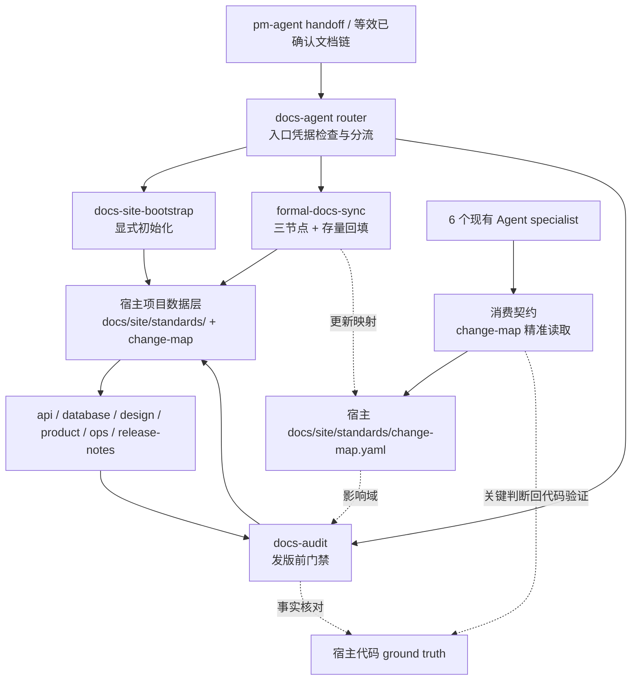

# docs-agent TRD

## 1. 来源上下文

本 TRD 将已批准的 `docs/pm/agents/docs-agent/PRD.md`（Approved，版本以其 frontmatter 为准，当前 1.4.0）转成可实施的工程设计，变更来源为 issue #105、issue #112、issue #117、issue #118 与 PR #128 三条 P1 review。需求范围已稳定，`feature_path` 固定为 `agents/docs-agent`，本阶段不修改产品范围。参考实现提供 `docs/site` 内容模型、双站点预处理、change-map、生命周期、模板和校验脚本；本设计只提取可通用化机制，宿主项目的路径映射和模块数据不进入 marketplace skill。

PRD 的 8 项决议是本 TRD 的强约束：

| # | 已确认决议 | 技术落点 |
| --- | --- | --- |
| 1 | 消费契约集中维护，6 个现有 Agent 只加指针。 | 权威文件为 `agents/product_manager/skills/idea-to-spec/_internal/_shared/consumption-contract.md`，随 pm-agent 默认入口插件分发，保证任何标准安装可解析（沿用 skill-map.md 先例）；各 specialist 入口只引用，不复制协议。 |
| 2 | audit 报告归档到站点 `.meta/`。 | 使用 `docs/site/.meta/audit/audit-{version}.md`；`.meta/` 不进导航且不受 frontmatter 校验。 |
| 3 | public / internal 双站点进入 MVP。 | bootstrap 一次生成双首页、三份 VitePress config、visibility 过滤和双站点命令。 |
| 4 | 不生成宿主项目本地维护 skill。 | 通用维护协议随 `formal-docs-sync` 分发；宿主差异只写入 `docs/site/standards/`。 |
| 5 | release-notes 输出按站点存在性自动切换，changelog 归档路径不变。 | 仅 release-notes-generator 在存在 `docs/site/release-notes/` 时写入该目录，否则维持现有输出路径，不新增配置项；changelog-generator 归档始终留在 `docs/changelog/changelog-v{version}.md`。 |
| 6 | sync MVP 仅覆盖 api 链路。 | feature 落地与存量回填只把 api 文档作为 MVP 验收面；其他文档类型保留协议和骨架，不纳入 MVP 通过条件。 |
| 7 | 存量回填是 sync 的第四模式。 | `formal-docs-sync` 复用同一套证据、模板选择和 change-map 生长协议。 |
| 8 | 存量回填进入 MVP，api 先行。 | fixture 必须覆盖已有 API 代码、范围确认、分批执行和种子条目生成。 |

参考实现只用于校准文件形状与脚本职责，不作为运行时依赖，也不允许其项目专有路径、模块名或品牌内容进入模板。

## 2. 技术概览

docs-agent 是第 7 个角色 Agent。它由一个同名 router skill 和三个 specialist skill 组成；PRD 所述“3 个 skill”是三个执行能力，不包含 marketplace 既有模式要求的同名 router，因此注册总数为 4 个 skill。



| 层 | 归属 | 内容 | 发布方式 |
| --- | --- | --- | --- |
| 逻辑层 | marketplace | router、bootstrap/sync/audit 协议、内置文本模板、消费契约、latest-state 写作纪律 | 随 docs-agent plugin 与 `skills-lock.json` 分发 |
| 数据层 | 宿主项目 | `docs/site/standards/`、`change-map.yaml` 条目、目录微调、正式文档、`.meta/releases.json` 与 audit 报告 | 由宿主项目版本控制，不回写 marketplace |

边界：本仓库的 PR 必跑链只验证 skill、eval 和仓库文档契约；宿主 VitePress 构建与站点脚本由宿主项目自行接入 CI。

## 3. Agent 与 skill 结构

### 3.1 目录结构

```text
agents/docs/
├── README.md
├── skills/
│   ├── docs-agent/
│   │   └── SKILL.md
│   ├── docs-site-bootstrap/
│   │   ├── SKILL.md
│   │   └── _internal/INSTRUCTIONS.md
│   ├── formal-docs-sync/
│   │   ├── SKILL.md
│   │   └── _internal/INSTRUCTIONS.md
│   └── docs-audit/
│       ├── SKILL.md
│       └── _internal/INSTRUCTIONS.md
└── test/
    ├── docs-agent/evals/{evals.json,workspace/...}
    ├── docs-site-bootstrap/evals/{evals.json,workspace/...}
    ├── formal-docs-sync/evals/{evals.json,workspace/...}
    └── docs-audit/evals/{evals.json,workspace/...}
```

每个 eval workspace 都必须包含 durable `comparison.md`。运行期 transcript、`with_skill/`、`without_skill/`、verdict、timing 和 diagnostics 只写入隔离 scratch，不提交。

### 3.2 router 与 specialist gate

`agents/docs/skills/docs-agent/SKILL.md` 是第 6 个下游 role router，职责只有：

1. 校验 PM handoff packet、等效已确认文档链或 specialist entry basis；缺失时返回 `pm-agent`。
2. 按目标分流：显式建站 → `docs-site-bootstrap`；同步或回填 → `formal-docs-sync`；发版审计 → `docs-audit`（随 WS3 交付；WS2 中间态对审计请求明确告知能力未交付并 blocked，不得 handoff 到不存在的 skill，WS3 落地时启用该分流）。
3. 指向 specialist gate 的权威副本，不复制幂等、范围确认、`target_release_version` 或 mismatch 阻塞规则。
4. 完成后按 PM safety-net closeout 建议下一角色步骤；未启用 `auto-continue` 时等待确认。

执行 gate 留在对应 specialist `SKILL.md`：bootstrap 管显式 opt-in 与冲突；sync 管节点、证据、范围确认和 latest-state；audit 管版本基线、两层审计和 release block。`AGENTS.md` 中“5 个 role router”实施后更新为“6 个”。

### 3.3 marketplace 注册草案

```json
{
  "name": "docs-agent",
  "description": "Downstream documentation capability invoked after pm-agent handoff for confirmed formal documentation bootstrap, synchronization, backfill, and release audit.",
  "source": "./agents/docs",
  "strict": true,
  "skills": [
    "./skills/docs-agent",
    "./skills/docs-site-bootstrap",
    "./skills/formal-docs-sync",
    "./skills/docs-audit"
  ]
}
```

注册前必须新增 agents/docs/.claude-plugin/plugin.json，name 等于 marketplace 条目名 docs-agent，version 等于 marketplace metadata.version，结构对齐现有 agent 的 plugin manifest（含 description 与 author）；check_repository_contract.py 会校验两者一致。

上述 JSON 为 4-skill 注册终态。注册随 workstream 增量推进：WS2 注册 ./skills/docs-agent、./skills/docs-site-bootstrap、./skills/formal-docs-sync 三个路径并写入对应 skills-lock.json 条目；WS3 追加 ./skills/docs-audit 完成终态。repository contract 要求已注册路径必须真实存在，不得在 WS2 提前注册 docs-audit 或创建 stub。`AGENTS.md` 必须更新三处：协作流图增加 Docs Agent 正式文档生产/审计节点；“文档依赖”增加 6 个现有 Agent 读取消费契约与 docs-agent 读取 PRD/TRD/代码证据；“当前状态”随 workstream 增量更新：WS2 更新为 7 个 Agent / 31 个 specialist（登记 docs-agent 的 router 与 2 个 specialist），WS3 更新为 32 个 specialist（补 docs-audit）。README 和安装文档的 agent 清单也应同步暴露新 plugin，但不得把下游 router 描述成默认入口。

## 4. 内容模型与 change-map schema

### 4.1 正式文档 frontmatter

正式 Markdown 标准定义 7 个必填字段：

| 字段 | 类型 / 值域 | 约束 |
| --- | --- | --- |
| `title` | 非空字符串 | 页面人类可读标题 |
| `visibility` | `public`、`internal`、`both` | 控制双站点收录 |
| `doc_type` | `landing`、`release`、`design`、`api`、`database`、`ops`、`product` | 决定模板与导航分类；standards 说明页使用 `design`，`standards/templates/` 下模板页使用各自目标 `doc_type` |
| `stage` | `draft`、`dev`、`ops`、`release` | 表示内容所处生命周期节点 |
| `owners` | 非空字符串数组 | 使用角色或团队标识，不写个人凭据 |
| `related_code` | 非空路径 / glob 字符串数组 | 所有页面类型都必须非空，只列支撑该文档事实的代码与测试证据范围 |
| `last_verified_version` | 非空字符串：维护者已确认的目标发布版本，或字面量 `unverified` | 无条件必填；新建、变更后未验证或没有已确认目标发布版本的页面使用 `unverified`，只能由 audit 在统一盖章集合全部 verified 后统一替换 |

宿主没有版本体系或尚未进入已确认目标发布版本的审计时仍不得缺省 `last_verified_version`；页面保持 `unverified`，不得伪造 `unknown` 版本。进入 release audit 后缺少维护者明确确认的 `target_release_version` 必须 blocked，不得从 Git ref 或上下文推测。

validator 接受 `unverified` 为合法值，frontmatter 校验不因该值失败。
validator 要求所有页面的 `related_code` 都是非空字符串数组；字段缺失或空数组一律失败。

### 4.2 默认 frontmatter 契约（issue #118）

默认契约的唯一事实来源是 `agents/docs/skills/docs-agent/_internal/_shared/frontmatter-contract.md`，校验对象是 `docs/site/` 下的正式 Markdown 页面。`docs-site-bootstrap` 的内置页面、模板与宿主校验脚本，`formal-docs-sync` 新增或更新的页面，以及 `docs-audit` 的 frontmatter 判定共同消费该文件；生成端与审计端必须对同一页面得出一致结论。

契约无条件要求 `title`、`visibility`、`doc_type`、`stage`、`owners`、`related_code`、`last_verified_version` 七个字段。`visibility` 仅接受 `public`、`internal`、`both`，`stage` 仅接受 `draft`、`dev`、`ops`、`release`；`owners` 与 `related_code` 均为非空字符串数组，`related_code` 对所有页面类型都必须非空。`doc_type` 仅接受 `landing`、`release`、`design`、`api`、`database`、`ops`、`product`，不再接受 `standard`；standards 说明页（`standards/index.md`、`doc-lifecycle.md` 与 `doc-granularity.md`）使用 `design`；`standards/templates/` 下模板页按 AI Hub 先例使用各自目标 `doc_type`（`api`、`database`、`design`、`ops`、`product`），模板页作为 internal 页面参与 frontmatter 与结构完整性校验，其 `doc_type` 表示模板目标类型，不使模板占位内容成为类型化事实核查对象。

`standards/change-map.yaml` 的描述性头部沿用 `doc_type: design` 约定，但不属于 `check:frontmatter` 与 docs-audit frontmatter 校验对象；其结构与元数据由 change-map 工具链校验，并由 issue #122 跟踪。这一边界与 AI Hub 的 `check:frontmatter` 仅收集 Markdown 页面的基准行为一致。

`last_verified_version` 是无条件必填的非空字符串；未验证或没有已确认目标发布版本时使用 `unverified`，不得缺省字段。该字段表示内容验证版本，不表示发布状态，统一盖章时序与盖章集合由 `docs-audit` 持有；盖章集合包括 diff 受影响页面及本次验证通过且含该字段的 release surface Markdown 页。额外字段不受本契约限制。

frontmatter 不合格的页面由 `docs-audit` 记为 `stale`，pre-tag audit 必须返回 `blocked`。首版规则迁移自 AI Hub 已验证实现；AI Hub 仅作为 issue #118 的来源与兼容性基准，不是运行时依赖或长期规则所有者。

### 4.3 change-map

`docs/site/standards/change-map.yaml` 自身在文件顶部携带沿用正式页面字段命名的描述性元数据，随后才是 `change_map`。该头部不是 frontmatter 契约校验对象；其结构与元数据校验归 change-map 工具链（issue #122）。通用 schema 为：

```yaml
title: 文档变更映射
visibility: internal
doc_type: design
stage: dev
owners:
  - docs
related_code:
  - src/**
last_verified_version: unverified
change_map:
  "src/example/**":
    required_docs:
      - docs/site/api/example.md
    trigger: 路由、参数、响应或错误结构变化时同步 API 文档
    exclude:
      - "**/*.test.*"
```

bootstrap 生成的种子元数据 `last_verified_version` 初始为 `unverified`；宿主无版本体系或页面尚未完成目标发布版本审计时仍保持该值，只能由 docs-audit 使用维护者明确确认的 `target_release_version` 统一盖章。键是 `code_glob`；值固定为 `{required_docs: [], trigger: 文本, exclude: []（可选）}`。`required_docs` 路径相对仓库根，`exclude` 只缩小当前 code_glob，不覆盖其他条目。sync 写入时合并相同 code_glob、去重并稳定排序 `required_docs`；不得删除人工维护的未知条目。`docs/site/.meta/` 是机器消费区，目录内 Markdown 不参与 frontmatter 扫描、导航或 change-map 的 required-doc 更新判定。

## 5. docs-site-bootstrap 设计

### 5.1 生成清单

| 分类 | 生成内容 |
| --- | --- |
| 7 个内容目录 | `docs/site/api/`、`database/`、`design/`、`product/`、`ops/`、`release-notes/`、`standards/`；每类提供可构建入口页或占位页，不生成业务事实 |
| npm 工程 | `docs/site/package.json`；依赖集为 `vitepress`、`fast-glob`、`gray-matter`、`picomatch`、`yaml`、`mermaid`；scripts 暴露 prepare、dev、build 与三类 check 命令 |
| 6 个脚本 | `scripts/check-frontmatter.mjs`、`check-affected.mjs`、`check-version.mjs`、`prepare-site.mjs`、`prepare-nav.mjs`、`dev-site.mjs`，以及只被这些入口复用的 `scripts/lib/` helper |
| VitePress | `.vitepress/config.shared.ts`、`config.public.ts`、`config.internal.ts`；`.vitepress/theme/index.ts` 与 `custom.css`，及 Mermaid 渲染组件（设计/流程文档模板要求真实 Mermaid 图，站点必须能渲染）；public 只导航公开内容，internal 导航全部允许内容 |
| 双首页 | `index.public.md` 与 `index.internal.md`，分别标记 `visibility: public` / `internal`，prepare 时复制为目标站点 `index.md` |
| standards | `standards/index.md`、`doc-lifecycle.md`、`doc-granularity.md` 与 `change-map.yaml` 头部使用 `doc_type: design`；5 个模板 `api-template.md`、`database.md`、`feature-design.md`、`ops-runbook.md`、`product-handbook.md` 作为 internal 页面参与校验，并分别使用目标 `doc_type` `api`、`database`、`design`、`ops`、`product` |
| 数据文件 | 带顶部元数据（`last_verified_version: unverified`）且 `change_map: {}` 的空 `standards/change-map.yaml`；`.meta/releases.json` 初始含 `latest`、`released`、`verifiedDocs` |

6 个脚本的职责必须保持分离：

- `check-frontmatter`：扫描 `docs/site/**/*.md`，排除 `.meta/`、`.generated/`、VitePress cache/dist 与依赖目录；校验字段、枚举和非空数组。
- check-affected：取得工作区 diff，或从显式 base / merge-base 取得提交 diff；用 picomatch 执行 code_glob 和 exclude，报告命中条目中 required_docs 未同批更新的候选核对项（suspect）。该条件默认非阻塞（只输出报告，退出码不失败），与 7.2/7.3 的 audit 判定分层一致，stale/verified 由 docs-audit 事实层给出；宿主可通过显式 strict 开关自行将该条件提升为 CI 阻塞。frontmatter 无效仍为阻塞失败。
- `check-version`：校验 `.meta/releases.json` 的 `latest`、`released`、`verifiedDocs` 内部一致性；存在维护者确认的目标发布版本或实际 git tag 时与其对齐，缺少可核对版本输入时输出不可用说明而非绑定某种部署工具。
- `prepare-nav`：从 frontmatter 生成 public / internal 两份 sidebar 数据，public 接受 `public|both`，internal 接受 `public|internal|both`（internal 站为全集导航）。
- `prepare-site`：清理隔离输出目录，按 visibility 复制页面和对应首页，连接 VitePress config / theme；源目录不被改写。
- `dev-site`：先 prepare，再启动对应站点并监听 Markdown/YAML 变化；忽略 generated、cache 和依赖目录。

模板文件不从外部仓库复制；5 类模板和骨架文件的通用文本集中内置于 `agents/docs/skills/docs-site-bootstrap/_internal/INSTRUCTIONS.md`，bootstrap 按目标路径逐文件渲染到宿主项目。模板只保留通用字段、章节骨架和 latest-state 纪律，不在 `_internal/` 下建立多入口模块。

### 5.2 opt-in 与幂等协议

触发条件必须同时满足：用户明确请求初始化/创建正式文档站；目标仓库路径已确认；写入根固定为 `docs/site/`。仅因 sync/audit 发现站点缺失时，不自动 bootstrap，只返回可选 handoff。

执行顺序：先建立生成 manifest → 对每个目标路径分类 → 不存在则创建 → 已存在且内容与模板一致则跳过 → 已存在但内容不同则列出冲突路径并 blocked，要求用户选择保留、覆盖或逐文件合并。确认前不部分覆盖冲突文件；无冲突的新文件可在同一次确认范围内生成。重复执行不得改动已生成的相同文件，也不得重置已有 change-map、release metadata 或正式文档。

## 6. formal-docs-sync 设计

### 6.1 三节点协议

| 节点 | 入口凭据与证据 | 产品目标输出 | MVP 输出 |
| --- | --- | --- | --- |
| feature 落地 | Approved PRD、Confirmed TRD 的影响域证据（frontmatter `related_code` 字段或影响模块章节）、已确认 `IMPLEMENTATION_PLAN.md`、实际 diff/测试 | api、database、design 文档及 change-map | 仅 api 文档及 API code_glob 条目 |
| 部署验证 | TRD 部署面、部署配置、验证命令与结果、环境差异 | ops runbook、必要的 release 准备条目 | 后续迭代，不作为 MVP 验收面 |
| 发版 | release scope、已验证版本/tag、changelog/release 过程文档、审计结论 | 产品手册；release-notes 内容由 pm-agent 的 release-notes-generator 产出（站点存在时其输出已指向 docs/site/release-notes/），sync 不重复生成，只核对站点 release-notes 与版本上下文一致 | 后续迭代，不作为 MVP 验收面 |

每个节点执行相同步骤：

1. 从 handoff 与 TRD 影响域证据得到候选代码范围，证据优先级为：TRD frontmatter related_code 字段（若有）→ TRD 影响模块/接口章节 → 已确认 IMPLEMENTATION_PLAN 的 scope 条目 → 实际 diff；全部缺失时 blocked 并回 trd-gen 补影响域，不得临时自行推断范围。并用实际 diff / 代码补证；文档或 TRD 不能替代代码事实。
2. 读取 change-map 反查已有 required docs；若无条目，按 doc_type 模板提出目标文档和新 code_glob。
3. 只更新影响域文档，保留无关页面；正文改写成当前稳定状态，删除被新事实取代的旧描述，不追加“本次变更”流水账。
4. 回读路由、schema、测试或部署证据，核对文档中的路径、参数、响应、错误、字段和操作步骤。
5. 新增或修正 change-map 条目；输出 changed docs、evidence、map delta、未解决分歧和下一节点 handoff。

### 6.2 存量回填模式

存量回填是第四模式，不要求已有 feature 实施计划。协议为：

1. 若存在 PM `feature-catalog` 产物，以 feature → code path → owner 关系作为首选地图；仍需回代码验证路径有效。
2. 无 feature catalog 时先扫描 API 入口、schema / handler 与 contract tests，形成候选模块清单，不直接生成全库文档。
3. 将候选范围按稳定业务模块拆成批次；每批列出 code_glob、拟生成 api 页面、证据入口和不在本批的范围，等待维护者确认。
4. 对已确认批次生成 current-state API 基线；从真实 path、方法、鉴权、请求、响应、错误和测试提取事实。
5. 同批写入 change-map 种子条目并回读验证 glob 能命中代码、required_docs 指向已生成页面。
6. 每批完成后报告覆盖与缺口，再请求下一批确认；不得一次性静默扩展范围。

MVP 的 feature 落地和存量回填都只验收 api 链路。database、design、ops、release-notes 和产品手册的目录、模板与协议可存在，但其自动同步不得被描述为 MVP 已完成能力。

### 6.3 design 交付链收口门禁

feature delivery 模式对任何功能级 `docs/site/design/**` 页面提出写入前，必须按同一 `feature_path` 同时确认以下七项；任一项不满足即停止，不进入范围确认或写入：

1. 存在 Approved `docs/pm/{feature_path}/PRD.md`。
2. 存在 Confirmed `docs/engineer/{feature_path}/TRD.md`，且包含可追踪的影响域。
3. 存在已确认的 `docs/engineer/{feature_path}/IMPLEMENTATION_PLAN.md`。
4. 实施计划中的本次交付范围全部完成，不存在仍属本次范围的 pending、blocked、deferred、TODO、stub 或未落地条目。
5. 实际代码与 diff 覆盖实施计划和 TRD 声明的交付范围；不得仅凭过程文档自我宣称完成。
6. 实施计划要求的相关测试均已实际执行并全部通过，不存在影响本次范围的 failed、blocked、unknown 或未经说明的 skipped；计划或 `change_tier` 要求 QA / E2E 证据时，该证据也必须完成并通过。
7. 前六项全部通过后，仍执行 `formal-docs-sync` 既有范围确认门禁，向维护者展示候选设计页面、代码范围、证据、排除项和未决项，获得确认后才能写入。

完成态证据复用 `feature-implementor` closeout 的既有形态：实施计划 scope 条目的完成状态、实际 diff 覆盖和测试执行记录。不得发明新的证据格式；无法取得证据时按证据缺口 blocked，不采信过程文档的自我宣称。

blocked 输出必须逐项指出缺失证据、当前 owner 与下一步，并禁止先写暂定设计、未来态、实施草案或部分设计正文。功能级 design 页面与其 design change-map 条目属于同一原子范围；门禁失败时二者均零变化。

写入后的设计正文只陈述最终代码与通过测试共同证明的 current state；随后回读页面并用最终代码与测试证据逐项核对关键设计声明。新建或变更页面仍使用 `last_verified_version: unverified`，维护者确认目标发布版本后才由 `docs-audit` 统一盖章。

## 7. docs-audit 设计

### 7.1 双阶段版本审计（issue #117）

docs-audit 使用同一份维护者确认的目标版本事实执行 tag 前和 tag 后两次审计，消除 release PR 必须先等 tag 才能统一盖章的循环依赖。四个概念严格分离：

- `base_ref`：代码比较起点，默认是最近一次 release tag，也可以由调用方明确提供；只表示 Git ref 或 commit，不表示发布版本状态。
- `target_ref`：代码比较终点，默认是 pending-release HEAD，也可以是调用方明确提供的 commit SHA；只表示 Git ref 或 commit，不等同于目标发布版本。
- `target_release_version`：本次文档审计对应的目标发布版本，例如 `v0.3.0`；必须由维护者明确确认，是独立的必要输入，不得从 `target_ref`、分支名或其他上下文推测，也不得使用 `unknown`。它是统一盖章使用的版本值，即使 pre-tag 阶段尚不存在同名 tag 也可使用；pre-tag audit 后该值变化会使原结果立即失效并要求重跑。
- `last_verified_version`：页面最近一次成功完成内容验证时对应的版本，表示页面已针对该版本完成验证，不表示该版本已经正式发布；按 issue #118 的 frontmatter 契约必须存在，新文档或尚未完成验证的文档可以使用 `unverified`。审计开始时读取并在报告中记录各页面盖章前的该值作为历史基线，不新增 `baseline_verified_version` frontmatter 字段。

所有版本事实必须先按来源形态解析，再规范化为同一个 SemVer 值后比较；禁止直接比较原始字符串，也禁止用某一来源的前缀形态覆盖另一来源。来源契约如下：

| 版本事实来源 | 合法来源形态 | 规范化比较值 |
| --- | --- | --- |
| 实际 git tag | 带 `v` 前缀，例如 `v1.2.0` | 去除单个前导 `v` 后解析为 SemVer `1.2.0` |
| 站内 Release Notes 页 | 带 `v` 前缀，例如页面版本字段或版本化路径中的 `v1.2.0` | 去除单个前导 `v` 后解析为 SemVer `1.2.0` |
| 版本索引 | 带 `v` 前缀，例如 `v1.2.0` | 去除单个前导 `v` 后解析为 SemVer `1.2.0` |
| `.meta/releases.json` | 带 `v` 前缀，例如 `v1.2.0` | 去除单个前导 `v` 后解析为 SemVer `1.2.0` |
| `.claude-plugin/marketplace.json` 的 `metadata.version` | 不带 `v` 前缀，例如 `1.2.0` | 直接解析为 SemVer `1.2.0` |
| `package.json` 的 `version` | 不带 `v` 前缀，例如 `1.2.0` | 直接解析为 SemVer `1.2.0` |

该表与 `AGENTS.md` 中 marketplace `metadata.version` 必须等于 release 版本但不带 `v` 前缀的既有约定一致。任一来源缺失、形态不符合对应约定、无法解析为 SemVer，或规范化后的 SemVer 不相等，均返回 `blocked` 并报告具体来源、原始值和失败原因。

阶段选择默认以实际 tag 是否存在为界：同名 tag 不存在时执行 pre-tag，存在时执行 post-tag。唯一救济例外是 post-tag 已判定 tag 内容绑定漂移、维护者已明确选择本节规定的救济路径时，允许重新进入 pre-tag；存在 tag 本身不再阻止该次救济重跑。docs-audit 只裁定、报告并记录维护者选择，不删除、移动或创建任何 tag。

#### Pre-tag audit

Pre-tag audit 在 release PR 阶段按以下九步执行：

1. 确认 `base_ref`、`target_ref` 和维护者已确认的 `target_release_version`。
2. 基于 `base_ref..target_ref` 圈定完整受影响页面集合；默认使用两点端点差异，只有调用方显式要求 merge-base 语义时才使用三点形式并在报告注明。
3. 建立统一盖章集合：`base_ref..target_ref` 受影响页面与本次验证通过的 release 版本面 Markdown 页取并集；后者包括目标版本站内 Release Notes 页及其他包含 `last_verified_version` 的 release surface。非 Markdown 版本面仍参与一致性与内容绑定校验，但不进入 frontmatter 盖章集合。
4. 按上述来源表规范化 `target_release_version`、统一盖章集合、issue #116 handoff 证据、版本索引、`.meta/releases.json` 和宿主版本事实，再核对其 SemVer 是否一致，并对集合中的每一页完成事实验证。
5. 在审计报告记录统一盖章集合各页面盖章前的 `last_verified_version`。
6. 只有统一盖章集合全部为 `verified`，才允许把集合内全部页面的 `last_verified_version` 一次性统一更新为 `target_release_version`；其中 Release Notes 等 release surface 不得因未由代码 diff 命中而漏盖章。
7. 即使同名 tag 尚不存在，也允许完成本次统一盖章。
8. 逐页回读证明完整盖章后，对统一盖章集合每张页面的章后精确字节，以及版本索引、`.meta/releases.json`、文件化 #116 handoff 和宿主版本事实文件等其他版本面计算 SHA-256，并把盖章页面清单、逐页章前/章后 `last_verified_version`、逐页章后内容哈希、所有版本面路径与哈希、审计 `target_ref` commit、最终 `ready_for_tag` 和结果时间写入同一 pre-tag 持久化记录。
9. 将统一盖章与上述审计记录更新作为宿主 release PR 分支上的一个普通“盖章后 commit”提交；二者必须处于同一 commit，不得只停留在工作区。Git 创建该 commit 后，由可信 pre-tag handoff 持久化其完整 commit SHA、Git tree hash、记录路径与记录 blob hash，提交内记录保留各页章后内容哈希；记录不得自包含其所在 commit/tree identity，以避免 Git 哈希自引用。工作区状态不得作为记录锚点。通过 `git show <盖章后SHA>:<记录路径>` 回读并核对 blob、commit 与 tree 证据后才返回 `ready_for_tag`，且该状态只表示 tag 前文档审计通过，不得表述为“已发布”。

以下六类情况必须返回 `blocked` 且不得盖章：

- 缺少 `target_release_version`；
- 目标版本来自分支名、`target_ref` 或其他上下文推测；
- 使用 `unknown`；
- 目标版本未获得维护者确认；
- 受影响页面存在 `stale`、`mismatch`、`unverified` 或证据不足；
- Release Notes、版本索引、release metadata 或宿主版本事实与目标版本不一致。

不允许只对 `verified` 子集局部盖章。`target_release_version` 在审计完成后变化时，已有 `ready_for_tag` 立即失效，必须以新目标版本重新执行完整 pre-tag audit。
统一盖章、逐页回读、内容哈希、审计记录更新、盖章后 commit 创建、commit/tree 锚定或记录回读任一步失败时返回 `blocked`；失败记录不得写入成功盖章结论、`ready_for_tag` 或成功时间。

#### Post-tag audit

Post-tag audit 在宿主创建实际 tag 后按以下七步执行：

1. 读取实际 tag 并解析其 peeled commit；tag 缺失或 commit 无法解析时 `blocked`。
2. 从可信 pre-tag handoff 取得盖章后 commit SHA、tree hash、记录路径与记录 blob hash，并只使用 `git show <盖章后SHA>:<记录路径>` 读取该 commit 内的 pre-tag 成功记录；先核对回读字节与 blob hash，再消费记录。不得以工作区或后续修订中的记录副本替代。若当前副本与提交版不一致，报告路径与差异摘要，并始终以提交版为准。
3. 严格读取提交版记录中的字段：`base_ref`、审计 `target_ref` commit、`target_release_version`、统一盖章页面清单、逐页章前/章后 `last_verified_version`、逐页和版本面 SHA-256、`ready_for_tag` 与结果时间；同时要求 handoff 的盖章后 commit SHA、tree hash、记录路径与 blob hash 齐全。字段缺失视为证据不足，不得从当前文件补造。
4. 执行严格内容绑定：实际 tag peeled commit 的 Git tree hash 必须等于可信 handoff 锚定的盖章后 tree hash；commit SHA 相等本身不是独立成功条件，也不存在 tree 不等时按已记录文件逐项重算哈希后放行的降级路径。
5. tree hash 不相等时，无论差异是否触及统一盖章页面、版本面或其他已审计文件，一律返回 `blocked`；报告 tag tree 与盖章后 tree、差异文件摘要，并列出两条维护者救济路径：其一，由宿主删除或移动错误 tag，保留同一 `target_release_version`，以实际待发布内容作为新的 `target_ref` 完整重跑 pre-tag，并把旧记录标记为 `superseded`；其二，放弃该版本号，确认新的 `target_release_version`，同样以实际待发布内容作为新的 `target_ref` 完整重跑 pre-tag。docs-audit 只裁定、报告和记录维护者选择，不执行 tag 删除、移动或创建操作。
6. tree hash 严格相等后，按来源规范化表解析实际 tag、`target_release_version`、Release Notes、版本索引、`.meta/releases.json`、`.claude-plugin/marketplace.json`、`package.json` 和其他宿主版本事实；全部规范化为相同 SemVer 且证据完整时返回 `release_verified`。
7. 任一版本事实缺失、形态非法、SemVer 解析失败或规范化后不相等，以及 pre-tag 结果失效、记录字段缺失或证据不足时，均返回 `blocked`；报告失败来源与差异，不得从当前工作区补造或改写 pre-tag 成功证据。

Post-tag audit 只复核最终版本事实，不重新生成或编辑 Release Notes、版本索引、release metadata、GitHub Release 内容或其他发布内容，也不重新执行统一盖章。

#### 责任边界

- issue #116 `release-notes-generator` 生成并确认站内 Release Notes，确认后更新其索引、必要导航和 `.meta/releases.json`，并向 pre-tag audit 提供结构化 handoff 与宿主 docs checks 证据；#117 消费这些证据但不代行生成职责。
- issue #117 `docs-audit` 圈定完整受影响页面集合并纳入本次验证通过的 release surface Markdown 页形成统一盖章集合，执行版本一致性审计、记录三个审计输入与盖章前值、统一更新 `last_verified_version`，并分别输出 `ready_for_tag`、`release_verified` 或 `blocked`；只验证 `.meta/releases.json`，不创建或维护其内容，也不执行任何 tag 操作。
- issue #118 定义 frontmatter 契约，要求 `last_verified_version` 必须存在，并允许新文档或尚未验证页面保持 `unverified`；#117 只持有统一盖章时序，不改变该字段契约。
- issue #120 只能在 pre-tag audit 返回 `ready_for_tag` 后准备 GitHub Release 草稿；只有实际 tag 存在、post-tag audit 返回 `release_verified` 且维护者明确批准后，才允许发布 GitHub Release。
- 宿主仓库确认目标版本事实，负责创建 tag、运行确定性 CI 和执行实际发布；AI Hub 仅是首个试验项目、流程来源和验收样本，不是 docs-agent 的运行时依赖。

### 7.2 确定性层

1. 默认计算 `git diff --name-status <base_ref> <target_ref>`（两点端点差异），连同已确认纳入范围的工作区变更形成 changed files；仅调用方显式要求 merge-base 语义时使用三点形式，并在报告注明。
2. change-map 自身变更时读取 `base_ref` 与 `target_ref` 两版并做条目级对比；按两版 code_glob 并集匹配 changed files，使删除或改窄的旧条目仍参与本次影响域圈定，并应用各条目的可选 exclude；新增映射或扩充 `required_docs` 时，新挂载文档直接纳入影响域做事实核对，不得仅报告映射差异后放行。
3. 汇总 required_docs，检查这些文档是否在同一 diff 更新。
4. 将映射的新增、删除和改动作为审计证据单列报告；删除或改窄条目必须注明理由来源（如对应代码已删除），无合理可核验来源的映射收窄作为阻塞项。
5. changed files 中属于 `docs/site/**/*.md` 的正式文档页面（排除 `.meta/`）直接纳入影响域页面集；事实层按该页面 frontmatter 的非空 `related_code` 圈定代码与测试证据核对，防止纯文档变更绕过审计；字段缺失或空数组属于无效 frontmatter，页面记为 `stale`。
6. 对影响域正式 Markdown 执行 7 字段和枚举校验；明确排除 `docs/site/.meta/**`。
7. frontmatter 无效直接记录 `stale`；required_docs 未在同 diff 更新的记为候选核对项（`suspect`），交由事实层判定声明是否仍与代码一致，不直接记 `stale`。

### 7.3 事实层与报告

agent 对每个影响域页面建立“声明 → 代码证据”清单。对候选核对项优先核对：声明与当前代码仍一致（如纯实现重构、仅测试变更）时判 `verified`，不强制文档编辑；change-map 条目的 `trigger` 语义作为判定辅助输入。API 至少核对 method/path、鉴权、path/query/body 参数、成功响应、错误结构和流式/文件行为；其他类型后续按 schema 字段、环境变量、部署命令与回滚步骤扩展。结论为：

| 状态 | 判定 | release 建议 |
| --- | --- | --- |
| `verified` | 声明有当前代码/测试证据且无遗漏 | 可继续；仅统一盖章集合全部 verified 时盖章 |
| `stale` | 映射命中且事实层确认声明已与当前代码不同步，或 frontmatter 字段无效；旧 `last_verified_version` 只降低信任并扩大核对，由统一盖章步骤推进，不构成 stale | blocked，先同步文档 |
| `mismatch` | 文档声明与代码事实直接冲突 | blocked，先确认修文档还是修代码 |

Pre-tag 报告写入 `docs/site/.meta/audit/audit-{target_release_version}.md`，包含审计阶段、`base_ref`、`target_ref`、`target_release_version`、changed files、命中的 change-map、统一盖章页面集合、逐文档盖章前 `last_verified_version` 与当前证据、三态结论、阻塞项和复核命令；`.meta/` 报告不需要标准 frontmatter。统一盖章与逐页回读成功后，必须把统一盖章页面清单、逐页章前/章后 `last_verified_version`、逐页章后精确字节 SHA-256、版本索引/`.meta/releases.json`/#116 handoff/宿主版本事实文件等其他版本面路径与 SHA-256、审计 `target_ref` commit、`ready_for_tag` 与结果时间写入同一记录；统一盖章与记录更新必须作为宿主 release PR 分支上的一个普通盖章后 commit 提交，随后由可信 pre-tag handoff 持久化 commit SHA、tree hash、记录路径与 blob hash，工作区不可作为记录锚点，失败路径不得写成功结论。缺少维护者确认的 `target_release_version` 时只可返回 blocked 诊断，不得以短 SHA 或 `unknown` 伪造版本审计记录。Post-tag 必须通过 `git show <盖章后SHA>:<记录路径>` 读取锚定 commit 内的记录并核对 blob；当前副本不一致时报告差异并以提交版为准。实际 tag commit tree hash 必须严格等于 handoff 锚定的盖章后 tree hash；tree 不等时不允许以逐项文件哈希降级放行，无论未审计差异还是已审计文件漂移均 blocked，并报告差异摘要及“宿主删/移错误 tag 后，以实际待发布内容为新 `target_ref` 同版本完整重跑并 supersede 旧记录”或“确认新版本并以实际待发布内容为新 `target_ref` 完整重跑”两条维护者救济路径。所有版本事实按来源合法形态解析为同一 SemVer 后比较；形态非法、解析失败或规范化后不等均 blocked。docs-audit 不执行 tag 操作。只有统一盖章集合全部 `verified` 时才盖章；部分 verified 不局部盖章。`.meta/releases.json` 只参与一致性验证，docs-audit 不创建或维护其内容。

## 8. 消费契约设计

权威文件 `agents/product_manager/skills/idea-to-spec/_internal/_shared/consumption-contract.md` 包含以下固定骨架。该文件随 pm-agent 默认入口插件分发，保证任何标准安装可解析（沿用 skill-map.md 先例）：

1. **适用条件**：宿主存在 `docs/site/standards/change-map.yaml` 才启用；不存在时静默沿用当前代码探索，不追问建站。
2. **读取协议**：从任务输入解析代码/功能落点 → 用 change-map 的 code_glob 与 exclude 反查 required_docs → 只读命中文档及必要索引 → 对影响结论的关键声明回代码或测试验证。
3. **信任模型**：文档是探索地图，代码是 ground truth；冲突时保留路径、文档声明、代码事实和影响，供 docs-audit 消费。
4. **新鲜度**：比较 `last_verified_version` 与当前已确认的 `target_release_version`；差距存在或版本不可比时降低信任并扩大代码验证，不直接拒绝读取；`last_verified_version` 为 `unverified` 时按最低信任处理，关键判断必须回代码验证。
5. **输出约定**：只在发现分歧时结构化报告；无文档站、无 change-map 命中或文档缺失时不制造额外用户阻塞。

6 个现有 Agent 的适用 specialist `SKILL.md` 只加入一行指针，统一模板为：

```markdown
宿主存在 `docs/site/standards/change-map.yaml` 时，项目探索先按 docs-agent 的 `consumption-contract.md` 执行“任务落点 → change-map 反查 → 精准读取 → 关键判断回代码验证”；不存在时静默沿用当前代码探索。
```

`debugger` 的 expected-behavior gate 增补：命中的 API contract 可作为预期依据来源之一，但只有与 Approved PRD/TRD/测试及代码证据不冲突时才可采信。仅 `release-notes-generator` 按 `docs/site/release-notes/` 存在性切换输出目标：存在则写入站点目录，不存在则完全保留既有路径和行为；`changelog-generator` 的版本归档始终留在 `docs/changelog/changelog-v{version}.md` 既有契约路径，站点 release-notes 页面可引用归档事实但不替代归档。

## 9. 影响文件范围

| Workstream | 操作 | 路径 | 目的 |
| --- | --- | --- | --- |
| WS1 消费契约 | 新增 | `agents/product_manager/skills/idea-to-spec/_internal/_shared/consumption-contract.md` | 权威读取与信任协议 |
| WS1 消费契约 | 修改 | `agents/{product_manager,engineer,qa,devops,designer,security}/skills/*/SKILL.md`（排除 6 个 role router，只改适用 specialist） | 增加一行消费指针；debugger 与 release 类 skill 加专属规则 |
| WS1 消费契约 | 修改 | 6 个现有 Agent 的对应 `test/*/evals/evals.json`、workspace fixture、`comparison.md` | 覆盖有/无文档站两种消费行为 |
| WS2 Agent 骨架 | 新增 | `agents/docs/README.md`、`agents/docs/skills/docs-agent/SKILL.md` | 第 7 个 Agent 与第 6 个下游 router |
| WS2 bootstrap | 新增 | `agents/docs/skills/docs-site-bootstrap/**` | opt-in 建站协议与内置文本模板 |
| WS2 sync | 新增 | `agents/docs/skills/formal-docs-sync/**` | 三节点协议与 api 回填 MVP |
| WS2 PM 路由 | 修改 | `agents/product_manager/skills/pm-agent/SKILL.md`、`agents/product_manager/skills/idea-to-spec/_internal/_shared/skill-map.md` | PM 入口增加 formal-docs 请求分类与 downstream_owner: Docs 路由，使 docs-agent 经默认 PM-first 路径可达 |
| WS2 producer 增强 | 修改 | `agents/engineer/skills/trd-gen/SKILL.md`、`agents/engineer/skills/trd-gen/_internal/trd-schema.md` | TRD 输出契约增加可选 frontmatter related_code 字段（机器可读影响域，增强项非 gate；缺省时 sync 走影响域证据链回退）；schema 契约与 SKILL.md 同步更新，避免新 TRD 合规但缺 related_code |
| WS2 eval | 新增 | `agents/docs/test/{docs-agent,docs-site-bootstrap,formal-docs-sync}/evals/{evals.json,workspace/**}` | router、bootstrap、sync durable eval |
| WS2 eval workflow | 修改 | .github/workflows/evals.yml | 新增 docs target 与 docs-agent eval job，使 router / bootstrap / sync 三个 skill 的合并前手动 eval 触发可执行；docs-audit 由 WS3 接入同一 target |
| WS2 注册 | 修改 | `.claude-plugin/marketplace.json`、`skills-lock.json`、`agents/docs/.claude-plugin/plugin.json`（新增） | 注册 docs-agent 及 router / bootstrap / sync 3 个 skill 路径，刷新 hash；plugin manifest 与 marketplace name/version 对齐；docs-audit 注册由 WS3 追加 |
| WS2 协作契约 | 修改 | `AGENTS.md` | 协作流、6 个 router、文档依赖、当前状态与 specialist 总数 |
| WS2 用户文档 | 修改 | `README.md`、`README_zh.md`、`.codex/INSTALL.md`、`docs/README.codex.md` | 暴露新 plugin 与安装/协作说明 |
| WS3 audit | 新增 | `agents/docs/skills/docs-audit/**` | 两层审计、报告与统一盖章协议 |
| WS3 router 分流启用 | 修改 | `agents/docs/skills/docs-agent/SKILL.md`、`agents/docs/test/docs-agent/evals/{evals.json,workspace/**}` | 启用 router 审计分流并移除 WS2 中间态 blocked 文案，router eval 断言由 blocked 改为 handoff docs-audit |
| WS3 eval | 新增 | `agents/docs/test/docs-audit/evals/{evals.json,workspace/**}` | 既有 mismatch、stale、verified fixture；issue #117 的 pre-tag success / blocked 与 post-tag match / mismatch 在 A2 增量补齐；接入 evals.yml 的 docs target |
| WS3 audit | 修改 | `.claude-plugin/marketplace.json`、`skills-lock.json` | 追加 docs-audit 注册达成 4-skill 终态，刷新 metadata 与 computedHash |
| design 收口门禁 | 修改 | `docs/pm/agents/docs-agent/PRD.md`、`docs/engineer/agents/docs-agent/{TRD.md,IMPLEMENTATION_PLAN.md}` | 登记 issue #112 产品、技术与独立实施 scope 契约 |
| design 收口门禁 | 修改 | `agents/docs/skills/formal-docs-sync/SKILL.md`、`agents/docs/skills/formal-docs-sync/_internal/INSTRUCTIONS.md` | 落地七项完成态门禁、blocked、原子写入与回读规则 |
| design 收口门禁 | 新增/修改 | `agents/docs/test/formal-docs-sync/evals/**` | 增加实现未完成、测试失败或缺失、feature_path 不一致、全部通过四组 fixture 与 durable comparison |
| design 收口门禁 | 修改 | `skills-lock.json` | 刷新 formal-docs-sync metadata 与 computedHash |
| WS1-3 contract | 修改（按硬编码情况） | `scripts/check_repository_contract.py`、`scripts/check_eval_contract.py` 及对应 `tests/` | 若现有校验硬编码 Agent/router/skill 数量或路径，扩展到 docs-agent；不为动态已兼容逻辑做无关重写 |
| 交接文档 | 新增（TRD 确认后） | `docs/engineer/agents/docs-agent/IMPLEMENTATION_PLAN.md` | feature-implementor 的活跃实施计划 |

宿主项目中的 `docs/site/**` 是 skill 运行输出，不属于本 marketplace 实施 PR 的预置文件触点。

## 10. 实施拆分

本功能新增 Agent、修改 6 个角色消费契约、marketplace 注册与 eval，并由 issue #112 追加 design 收口契约，按 `AGENTS.md` 判定 `change_tier: major`。实施顺序固定为四个独立 PR：

| PR / Workstream | 实施内容 | 验收出口 |
| --- | --- | --- |
| PR 1 / WS1 消费契约 | 新增共享 contract；为 6 个现有 Agent 的适用 specialist 增加指针；补 debugger 与 release 输出切换；增加消费回归 fixture | 有 change-map 时精准读映射文档且关键判断回代码；无站点时行为不变；不复制权威协议 |
| PR 2 / WS2 Agent 骨架 + bootstrap + sync | 新增 `agents/docs`、router、bootstrap、sync、内置模板、注册和 lock；实现完整骨架协议、feature api 同步与存量 api 回填 | router / bootstrap / sync 3-skill 注册结构合法且路径全部可解析；bootstrap 完整/幂等/opt-in；sync 只更新影响 API；回填按批确认并生成 change-map 种子 |
| PR 3 / WS3 audit 门禁 | 新增 docs-audit、确定性/事实层、报告和盖章协议；接入 release handoff；启用 router 审计分流 | mismatch/stale 阻塞；受影响页面与验证通过的 release surface Markdown 页组成统一盖章集合且全 verified 才盖章；盖章与记录同一普通 commit 并绑定 SHA/tree/逐页哈希；post-tag 从锚定 commit 读记录并要求实际 tag tree 与盖章后 tree 严格相等，tree 不等无降级放行；版本事实按来源形态统一规范化为 SemVer 后判等；漂移时只提供两条维护者救济且不操作 tag；`.meta/` 排除 frontmatter；缺少明确目标版本时 blocked 且不推测；marketplace 追加 docs-audit 达成 4-skill 注册终态 |
| PR 4 / issue #112 design 收口门禁 | 修订 PRD/TRD/实施计划；在 `formal-docs-sync` 落地同 feature_path 的七项完成态门禁、blocked 原子性与 current-state 回读；新增四组持久化 eval 并刷新 lock | 三反一正 eval 全部通过；所有反向场景断言 design 正文与 map 零变化；repository → eval → artifact → doc → python 契约链全绿 |

每个 PR 修改 skill 后在同批刷新对应 `skills-lock.json` hash，实际执行 eval 时同批更新 durable `comparison.md`。不得把四个 PR 的确认合并成一次 major 实施确认；每个 workstream 按实施计划明确入口与出口。

## 11. 验证策略

### 11.1 eval 映射

| Skill / 场景 | PRD AC | fixture 形态 | 关键语义断言 |
| --- | --- | --- | --- |
| `docs-agent` router | AC-04、AC-05 | 含完整 PM handoff、等效文档链、无凭据请求三组 workspace | 正确分流三 specialist；无凭据回 PM；只引用 specialist gate；识别共享消费契约 |
| `docs-site-bootstrap` | AC-01、AC-05 | 空 workspace、已完整 bootstrap、存在冲突文件三组 | 一次生成清单完整；第二次零差异；冲突 blocked 且不覆盖；未显式 opt-in 不写文件；eval schema 1.0 |
| `formal-docs-sync` feature 模式 | AC-02、AC-05 | 已确认 PRD/TRD/plan、API code diff、已有无关文档与 change-map | 只更新命中 API 文档；从代码取 path/参数/错误；合并映射不删未知条目；不声称 database/ops 已完成 |
| `formal-docs-sync` design 收口门禁 | AC-07 | 四组 fixture：计划范围仍未完成；测试 failed 或证据缺失；PRD/TRD/plan/closeout 证据与 `feature_path` 不一致；实现、diff、测试与 closeout 全部通过 | 前三组原子性 blocked，输出缺失证据、owner 与下一步，design 正文及对应 map 零变化；正向组仅进入既有候选范围确认，不越过维护者确认写入；写入后只保留代码与测试证明的 current state |
| `formal-docs-sync` 回填模式 | AC-06 | 存量 API 代码 + feature-catalog；另设无 catalog fixture | 优先用 catalog 画范围；无 catalog 扫描后先确认；按批生成 API 基线与种子；未确认批次不写入 |
| `docs-audit` 事实层与双阶段审计 | AC-03、AC-05、issue #117 AC | 既有声明冲突、stale、纯重构 verified、全部一致、纯文档错误场景；A2 新增 pre-tag success、pre-tag blocked、post-tag match、post-tag mismatch 四组；A5 修订 eval-004、eval-008、eval-010、eval-011 | 事实层继续输出 mismatch/stale/verified；eval-004/008 验证带 `v` 的 release surfaces 与无 `v` 的 package 版本按来源规范化为同一 SemVer 后可通过 pre-tag；eval-010 仅在 tag commit tree hash 严格等于 handoff 记录的盖章后 tree hash 时返回 `release_verified`；eval-011 验证所有已记录路径未变但 tag 混入新增代码时仍因 tree 不等而 blocked，报告 name-status 差异与两条维护者救济，且工作区记录被改时仍以 `git show <盖章后SHA>:<记录路径>` 取得的提交版为准；docs-audit 不操作 tag |
| 6 Agent 消费回归 | AC-04 | 同一任务分别放入命中 change-map、无站点、过期版本三种 workspace | 优先精准读 required_docs；关键结论回代码；无站点静默降级；旧版本降低信任而非盲信 |

每个 `evals.json` 使用 schema version `1.0`，item 必含 `eval-NNN-short-slug` id、name、description、prompt、expected_output、`workspace/...` 和对象形式 semantic assertions。每个 workspace 持久化 `comparison.md`，不得依赖历史运行期输出。

### 11.2 验证命令与 Fresh Sub-Agent

PR 必跑顺序：

```bash
uv run scripts/check_repository_contract.py
uv run scripts/check_eval_contract.py
uv run scripts/check_eval_artifacts.py
uv run scripts/check_doc_contract.py
uv run --with pytest pytest <显式测试路径清单>
```

测试路径清单以 `.github/workflows/ci.yml` 为准，docs-agent 落地时需把新增 eval 测试路径加入该清单。

涉及 skill 行为、routing 或 fixture 的每个 workstream 在合并前手动触发 eval workflow。docs-agent 的 workflow target 由 WS2 在 evals.yml 中新增；该 target 落地前，以当前会话 fresh Codex subagent validation 作为等效门禁并在 comparison.md 记录。最终可用性判断由当前会话中的 fresh Codex subagent 执行：同一 prompt/fixture 先生成新的 with-skill，再在不读取 skill/Agent README 的条件下生成新的 without-skill baseline；不得复用历史 baseline。执行后必须把结论写回对应 durable `comparison.md`，CLI transcript 仅作诊断，不作为 pass/fail 来源。

## 12. 发布与回滚

docs-agent 随 marketplace 下一个版本发布：更新 `.claude-plugin/marketplace.json` 的 `metadata.version`、版本化 changelog 与根 `CHANGELOG.md` 索引，按手动 release checklist 检查 4 个 skill 的最新 comparison 结论。未获维护者确认前不创建 tag 或 GitHub Release。

新 Agent 通过独立 plugin 条目注册，整体回滚可普通 revert marketplace 条目、`agents/docs/`、lock 与文档清单，不影响既有 6 个 Agent 的原始执行路径。消费契约是各 specialist 中的增量行，可单独 revert；若回滚 docs-agent 而保留指针，必须同批移除悬空指针。宿主 bootstrap 已生成的数据归宿主项目，卸载 plugin 不自动删除；回滚宿主骨架需由维护者确认具体文件，禁止自动清空已有正式文档或 change-map。

## 13. 风险、假设和待确认问题

| 类型 | 内容 | 处理 / 解锁条件 | Blocking |
| --- | --- | --- | --- |
| Risk | 内置 5 类模板与脚本使 skill 目录体积较大，增加安装 hash 与维护成本。 | `_internal/INSTRUCTIONS.md` 保持单一文本来源；fixture 只保留最小样本；contract 检查模板清单而不复制模板。 | No |
| Risk | “已存在即跳过”可能保留过期骨架，“自动覆盖”又可能破坏宿主定制。 | 内容相同跳过，内容不同一律列清单并等逐文件选择；绝不隐式覆盖。 | Yes，存在冲突时 |
| Risk | related_code 太宽或 change-map glob 重叠，造成 required docs 过度命中。 | sync 输出每个 glob 的命中样本；分批确认；audit 报告展示条目来源与 exclude。 | No |
| Risk | 大仓库存量回填批次过大，review 质量下降。 | 默认按 feature-catalog 模块拆分；单批需能由一组稳定 API 页面和 code_glob 描述，实施计划再定义建议上限。 | No |
| Risk | 参考实现中的版本检查绑定具体部署工件，直接搬运会破坏技术栈无关性。 | 通用 `check-version` 只消费 release metadata、显式版本和 git 锚；宿主扩展由其数据层负责。 | No |
| Risk | 共享消费 contract 依赖 pm-agent 插件分发，未安装 pm-agent 的非常规安装形态只剩指针摘要。 | 权威文件随默认入口插件 pm-agent 分发（skill-map.md 同先例）；指针摘要本身含核心协议且静默降级。 | No |
| Assumption | 宿主使用 git，且 `docs/site/` 可作为正式文档根。 | 不满足时 sync/audit 不能使用默认 diff/路径，需由 PM 重新确认产品范围，不在 MVP 自适配。 | Yes |
| Assumption | API 事实可从路由/schema/handler/contract test 中至少取得一种可靠证据。 | 无可靠证据时该页面标记 unresolved，不生成猜测内容，不进入 verified。 | Yes，针对该批次 |
| Open Question | 回填“单批”是按业务 feature、API surface 还是 code owner 切分。 | `IMPLEMENTATION_PLAN.md` 结合首个 fixture 选择默认粒度；无论选择哪种都保留每批确认。 | No |
| Open Question | bootstrap 冲突时是否允许“保留现有文件并只登记 manifest”。 | 实施计划需定义交互输出与后续校验语义；未确认前默认 blocked。 | No |

## 14. Feature-Implementor 交接条件

TRD 获维护者确认后，`feature-implementor` 才可创建 `docs/engineer/agents/docs-agent/IMPLEMENTATION_PLAN.md`。交接包必须包含：

- Approved PRD：`docs/pm/agents/docs-agent/PRD.md`（版本以其 frontmatter 为准，当前 1.4.0）。
- Confirmed TRD：`docs/engineer/agents/docs-agent/TRD.md`。
- issue #105、issue #112、issue #117、issue #118 与 8 项决议，`change_tier: major`；既有顺序为 WS1 → WS2 → WS3 → PR 4 design 收口门禁，issue #118 追加 frontmatter 契约统一 scope，issue #117 追加 `two-phase-audit` scope。
- 第 9 节完整文件触点和 forbidden scope：不修改参考实现，不引入宿主专有模块名，不把宿主 `docs/site/**` 当 marketplace 预置数据。
- 4 个 skill 的入口凭据、router/specialist gate 边界、消费 contract 权威路径和 marketplace 注册草案。
- bootstrap 生成 manifest、7 字段 / change-map schema、`.meta/` 排除、冲突幂等策略和 opt-in 条件。
- sync 的三节点 / 回填协议、latest-state 纪律及“MVP 仅 api 链路”的验收边界。
- design 写入的七项完成态门禁、feature-implementor closeout 证据复用、blocked 原子性与 current-state 回读规则。
- audit 的 `base_ref` / `target_ref` / `target_release_version`、三态、双阶段结果、报告路径、统一盖章集合、盖章与记录同一普通 commit、commit SHA/tree/逐页哈希锚定、post-tag 提交版记录读取与严格 tree equality、版本事实规范化、漂移救济路径、tag 操作边界，以及缺少明确目标版本时的 blocked 行为。
- 第 11 节 eval fixture/assertion 映射、契约命令顺序、Fresh Sub-Agent 与 durable `comparison.md` 门禁。
- 第 13 节 blocking 风险的 owner 与解锁条件；未解决 blocking 项必须写入计划并停在对应 workstream 前。

实施计划需按四个独立 PR 展开到逐文件步骤、每步验证、回滚点和确认点。TRD 确认只授权编写实施计划，不授权直接修改 skill、registry、lock、eval 或宿主文档站。
