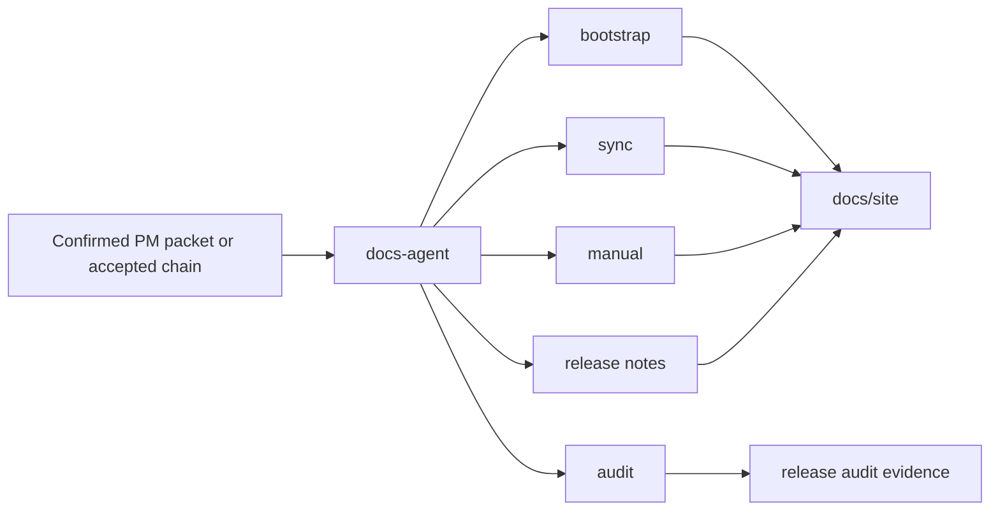

# docs-agent TRD

## 1. 父级技术边界

Docs Agent 只处理宿主正式文档层 `docs/site/`。它不修改 PM、Engineer、QA、DevOps 或
Security 的过程文档和代码事实。Router 只检查入口、选择一个 Specialist、保留证据和
指向权威 gate。

## 2. 组件

| 组件 | 责任 | 权威设计 |
| --- | --- | --- |
| `docs-agent` | 入口凭据、路由、阻塞、Specialist 指针 | `agents/docs/skills/docs-agent/SKILL.md` |
| `docs-site-bootstrap` | 显式初始化正式站点与基础 schema | 对应 Skill 与 child TRD |
| `formal-docs-sync` | 按证据同步或回填 current-state 正式事实 | 对应 Skill 与 child TRD |
| `manual-gen` | 基于真实运行界面截图交付图文操作手册 | 对应 Skill 与 child TRD |
| `release-notes-gen` | 站内版本页、确认、metadata、索引和站点校验 | 对应 Skill 与 child TRD |
| `docs-audit` | pre-tag 统一盖章与 post-tag 事实验证 | 对应 Skill 与 child TRD |

父 TRD 不复制子能力执行顺序、模板或 eval 场景。

## 3. 公共内容模型

正式页面使用统一 frontmatter contract：
`agents/docs/skills/docs-agent/_internal/_shared/frontmatter-contract.md`。常用字段包括
文档身份、版本、验证锚、来源代码和更新时间；各 Specialist 只能在共享 contract 允许的
范围扩展。

`docs/site/standards/change-map.yaml` 将代码落点映射到 required docs。消费方按共享
consumption contract 定位文档，再以代码或测试验证关键事实。无 change map 时静默使用
普通代码探索。

## 4. 路由与数据流

```mermaid
flowchart LR
    PM["Confirmed PM packet or accepted chain"] --> Router["docs-agent"]
    Router --> B["bootstrap"]
    Router --> S["sync"]
    Router --> M["manual"]
    Router --> R["release notes"]
    Router --> A["audit"]
    B --> Site["docs/site"]
    S --> Site
    M --> Site
    R --> Site
    A --> Evidence["release audit evidence"]
```

一个请求只选择一个 Specialist。缺少 host path、source evidence、release anchors 或
确认状态时，Router 返回 PM 或当前 owner，不代替 Specialist 收集并写入。

Security 结论不能直接触发 Docs；它按共享 escalation contract 回 PM 分类并建 issue。

## 5. 子能力接口

### Site bootstrap

输入为显式初始化请求和 host repository path。输出为可构建的正式文档站骨架。幂等、
覆盖范围和站点文件清单由 bootstrap Skill/child TRD 所有。

### Formal docs sync

输入为已落地的 feature、deployment、release 或 bounded backfill 证据。输出只反映当前
代码/测试事实；design closeout、change-map 更新和差异报告由该 Specialist 所有。

### Manual

输入为真实运行界面、已确认流程和安全处理后的截图。输出为正式站点图文操作手册。
截图卫生、流程确认和页面模板由 manual Skill/child TRD 所有。

### Release Notes

输入为维护者确认的版本和发布事实窗口。输出为站内版本页、metadata/index 与可交给
GitHub Release 的 confirmed handoff。用户可见版本说明归 Docs。

### Audit

Pre-tag 使用维护者确认版本完成内容/元数据/链接/构建审计与统一盖章；post-tag 验证实际
tag、tree 和盖章事实。GitHub Release 操作仍归 PM `github-release-gen`。

## 6. 安装与共享契约

Docs plugin 必须自包含 Router、五个 Specialist、内部 instructions、frontmatter contract
和生成的 handoff/closeout/security/consumption contracts。Claude plugin copy 与 Codex
mirror 均不得越过 plugin 根读取 PM 源路径。

## 7. 验证与回滚

- marketplace、lock hash、frontmatter、change-map、站点构建各由现有
  checker/Skill 验证。
- 安装测试证明内部资源在 Claude 与 Codex 边界可读。
- Release audit 验证使用隔离提交事务，不把未确认外部操作当作完成。
- 回滚按单个 Specialist 的已验证版本恢复；不在父 Router 保留双协议。
