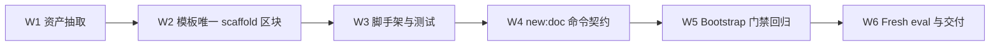

# Docs Authoring Foundation 实施计划

## 1. 前置对齐

- 已批准需求：`docs/pm/agents/docs-agent/docs-authoring-foundation/PRD.md`；该
  PRD 由维护者已确认的 GitHub issue #122 规格转化而来。
- 技术输入：本目录 `TRD.md`，版本 `0.1.0`，状态 `Approved`。
- Feature metadata：`agents/docs-agent/docs-authoring-foundation`，父功能
  `agents/docs-agent`，层级 `3`。
- `change_tier: major`：影响 bootstrap 静态交付方式、宿主命令、脚手架、测试和
  skill eval，保留完整计划、验证与维护者确认门禁。
- 维护者已批准实施总纲：W1 资产抽取 → W2 模板 scaffold 区块 → W3 确定性
  脚手架与测试 → W4 宿主命令契约 → W5 bootstrap 门禁保持 → W6 eval 与交付。
- 实际交付分为四轮：C1 完成 W1 与 PRD/TRD/实施计划文档链；C2 完成
  W2-W4；C3 完成 W6 的 eval 对齐与 fresh validation；C4 按 PR #125 review
  加固 W3/W4 相关脚本、补充回归测试并完成交付复核。W5 不是独立功能提交，
  其门禁保持要求贯穿 C1-C4 并由 bootstrap 与宿主回归验证。

## 2. 目标与非目标

目标是让 bootstrap、宿主写作流程和测试共享同一组真实资产；以五类宿主模板的
唯一 scaffold 区块作为文档骨架单一来源；交付唯一 `new:doc` 入口、确定性
change-map 合并、原子写入和完整测试证据，同时保持现有 bootstrap opt-in、
冲突、manifest、`kept-as-is`、回读与 zero-diff 语义。

非目标：引入 AI Hub 项目事实；修改 frontmatter 字段语义或 audit 盖章语义；
生成 Release Notes；替代 #121 的范围确认与事实写作；修改宿主 GitHub Actions；
自动发布、创建新 PR 或 merge。

## 3. 分阶段计划

| 阶段 | 内容 | 验证方式 |
| --- | --- | --- |
| W1 静态资产抽取（C1） | 新建 `assets/docs/site/**`，将基线 `_internal/INSTRUCTIONS.md` 的静态正文按宿主相对路径逐字节迁出；同时建立 PRD、TRD 与本实施计划文档链，收敛 Skill 指令并刷新 lock hash。 | 字节映射、资产清单、指令规模、仓库 checker 与 pytest 在 C1 验证通过。 |
| W2 五模板 scaffold 区块（C2） | 在五类宿主模板中交付唯一 `docs-scaffold:start/end` 区块，并补 standards 索引与单类型渐进读取约束。 | 模板 marker、`md` 围栏、`doc_type` 与目录映射由脚手架测试和文档检查覆盖。 |
| W3 确定性脚手架与测试（C2，C4 加固） | C2 交付 `scaffold-doc.mjs`、五类创建、dry-run、覆盖拒绝、change-map merge、原子写入与回滚；C4 增加 change-map 写入 realpath 边界、repo-relative code glob、Markdown page target 与删除 required doc 的防护。 | `scaffold-doc.test.mjs` 覆盖既有正反路径，并在 C4 增加 symlink、绝对/上跳 glob、目录/非 Markdown/机器目录 target、删除 required doc 用例。 |
| W4 宿主命令契约（C2，C4 加固） | C2 在 `package.json` 交付唯一 `new:doc` 并保持 prepare/dev/build/check/test 命令；C4 让 post-write 检查在 Windows 使用 `npm.cmd`，并在 VitePress 子进程退出时关闭 watcher、传播退出码。 | 隔离宿主执行 `npm run test:docs`；单元测试覆盖 Windows shim 与 child exit 生命周期。 |
| W5 Bootstrap 门禁保持（C1-C4 持续验证） | 资产复制继续保持显式 opt-in、完整 inventory、冲突汇总、`kept-as-is`、动态 manifest、回读、人工内容保护和重复 zero-diff；未引入独立的新行为提交。 | C1/C2 的确定性检查与 C3 fresh eval 共同证明完整交付、冲突阻断和幂等语义未退化；C4 继续运行宿主与仓库全量回归。 |
| W6 Eval 与交付（C3，C4 收尾） | C3 对齐 eval 定义与 fixture，重新生成 fresh with-skill / without-skill baseline 并更新 durable `comparison.md`；C4 按物化清单判断是否需要重验，刷新最终 lock hash、运行全量检查并提交 PR review 修复。 | C3 fresh judge 已记录 PASS；C4 记录 eval-002 决策、宿主测试、4 个 checker、CI pytest、PR review 与 CI 结果，运行期产物不提交且不合并 PR。 |



## 4. 实际交付分组

1. **C1 / `5f39454`**：完成 W1 静态资产化，并建立 PRD、TRD、实施计划文档链。
2. **C2 / `a2a30a3`**：完成 W2 五模板区块、W3 脚手架与测试、W4 宿主命令。
3. **C3 / `c4e7026`**：完成 W6 的 eval 定义、fixture、fresh with/without
   validation 与 durable comparison；同时补齐 bootstrap 入口报告协议。
4. **C4 / PR #125 review 修复**：只处理 7 条已核实 P2，补充相应回归测试，
   按 eval-002 物化清单决定是否重验，刷新 lock hash并完成 push、review 与 CI
   复核；禁止 merge、amend、rebase、force push 或提交 `tmp/`。

## 5. 验证命令

W1 至交付阶段至少依序执行：

```bash
uv run scripts/check_repository_contract.py
uv run scripts/check_eval_contract.py
uv run scripts/check_eval_artifacts.py
uv run scripts/check_doc_contract.py
```

随后执行 `.github/workflows/ci.yml` 当前定义的 9 路径 pytest 命令；W3 起再执行
宿主 `scripts/__tests__/*.test.mjs`，W4 起在隔离 fixture 执行
`npm run test:docs`、`npm run build:public` 和 `npm run build:internal`。实际命令
和测试数量以运行时仓库状态记录，不能用计划值代替验证证据。

W1 的临时自检必须逐文件报告：

```text
assets/docs/site/<relative-path> <- INSTRUCTIONS.md:<start>-<end> <- identical
```

所有条目均为 `identical` 才能提交。若现有 docs eval 只因仍断言“内嵌正文”而
失败，本轮如实报告，不修改 eval；修复归 W6 / 后续已确认的 eval 阶段。

## 6. 风险与缓解

| 风险 | 缓解 |
| --- | --- |
| `eval-002` 保存了旧内嵌正文的字节 fixture，资产化后失去来源或产生假失败 | W1 保留现状并报告；W6 从真实资产重做 fixture 和断言，同轮 fresh 生成 without-skill baseline 并更新 durable `comparison.md`。 |
| `formal-docs-sync` 的渐进加载被误解为 bootstrap 按类型裁剪 | Bootstrap 始终复制完整资产；W2 只让编写流程读取 standards 公共规则和当前类型模板，W5 增加全量 inventory 回归。 |
| W1 提取器错误处理代码围栏或末尾换行 | 以基线 blob 和二进制读取为准，记录源行区间，同时比较长度与字节；不经 Markdown formatter。 |
| 五模板或测试形成第二份 scaffold 正文 | 唯一正文留在模板标记区块；实现做解析，测试使用最小 fixture 和结构断言。 |
| change-map merge 覆盖宿主人工内容 | W3 先解析、只改显式键、保留未知内容并稳定合并，页面和 map 原子提交后回读。 |
| `new:doc` 被误当成事实写作能力 | 输出只含明确输入和类型骨架，固定 `unverified`；事实填充交给 #121。 |
| Release Notes 误入通用脚手架 | 类型白名单不含 release，拒绝并 handoff #116。 |
| issue #122 的 `feature_level` 标注与仓库路径层级契约不一致 | 同路径 PRD、TRD 与计划统一按三段 `feature_path` 记录为 level 3；不扩展 checker。 |

## 7. 阶段门禁与收尾

- W1-W4 已按 C1/C2 完成，W5 门禁保持已由 C3 eval 与本轮回归继续验证。
- C3 已完成 W6 的 fresh eval 部分；C4 只在物化资产字节变化时重验 eval-002，
  否则记录跳过依据，不改写 comparison。
- C4 完成后记录最终文件、命令、eval 决策和残余风险，普通 commit 并 push 到
  既有 PR 分支；等待 review 三信号和 CI 全绿后切回 `main`。
- 活动计划不在本轮归档；PR #125 不 merge，不 amend、rebase、force push 或使用
  管理员绕过。

## 8. C4 实施结果

### 8.1 完成范围

- `scaffold-doc.mjs` 已拒绝非仓库相对 code glob、非 Markdown page 的
  change-map target，并在写 change map 前校验其真实父路径仍位于 `docs/site/`。
- `check-affected.mjs` 已把工作区中不存在的 required doc 判为缺失，即使删除路径
  同时出现在 Git changed set 中。
- `dev-site.mjs` 已在 VitePress 子进程退出时清理 watcher 与信号监听，并传播数字
  退出码；脚手架写后检查在 Windows 使用 `npm.cmd`。
- `scaffold-doc.test.mjs` 已加入上述边界和跨平台回归测试；未新增第二份模板正文。

### 8.2 验证记录

| 命令 / 检查 | 结果 |
| --- | --- |
| 临时宿主 `npm run test:docs` | PASS，36 tests，0 failures |
| `uv run scripts/check_repository_contract.py` | PASS |
| `uv run scripts/check_eval_contract.py` | PASS |
| `uv run scripts/check_eval_artifacts.py` | PASS |
| `uv run scripts/check_doc_contract.py` | PASS |
| `.github/workflows/ci.yml` 同款 pytest 命令 | PASS，126 tests |

### 8.3 Eval 与残余风险

- eval-002 未重跑。其 `fixture-scope.json` 物化 9 个目标；本轮修改的 4 个资产
  `scripts/scaffold-doc.mjs`、`scripts/check-affected.mjs`、`scripts/dev-site.mjs`
  和 `scripts/__tests__/scaffold-doc.test.mjs` 均不在物化清单内。资产清单语义、
  manifest 状态机和代表性 zero-diff 字节断言未变，因此不改写 durable
  `comparison.md`。
- Windows shim 与 child-exit 生命周期由确定性单元测试覆盖；最终跨平台状态仍以
  PR CI 和后续真实 Windows 宿主运行为准。
- 下一所有者为 PR #125 review 与 CI 复核；本轮不需要新增 QA E2E 文档，原因是
  变更只影响 docs bootstrap 开发者脚本和单元测试，不改变终端产品用户流程。
