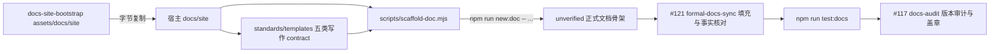

# Docs Authoring Foundation TRD

## 1. 来源与范围

本 TRD 将已批准的
`docs/pm/agents/docs-agent/docs-authoring-foundation/PRD.md` 转换为可实施的
工程设计；该 PRD 由维护者已确认的 GitHub issue #122 规格转化而来。父级
`docs/pm/agents/docs-agent/PRD.md` 只提供 docs-agent 的既有产品边界，不替代本
feature 的批准范围。

本 feature 的目标是把 `docs-site-bootstrap` 已验证的静态宿主输出迁入可共同
消费的真实资产，并在该宿主结构上增加确定性的正式文档脚手架。AI Hub 只作为
结构来源、fixture 与验收样本，不是运行时依赖；其业务名称、owners、版本、
代码路径、change map 和 release metadata 不得成为通用资产事实。

变更按仓库契约判定为 `major`。维护者已批准 W1 至 W6 的实施总纲；本轮只执行
W1 静态资产抽取和本 TRD / 实施计划落盘，不提前实现脚手架或修改 eval。

## 2. 技术概览



实现分为两层：

| 层 | 权威来源 | 职责 |
| --- | --- | --- |
| marketplace 交付层 | `agents/docs/skills/docs-site-bootstrap/assets/docs/site/**` | 保存可按字节复制的默认宿主文件，供 bootstrap、脚手架实现和测试共同消费。 |
| 宿主运行层 | `docs/site/**` | 保存项目自己的写作 contract、模板、脚本、正式页面、change map 与 release metadata。 |

宿主完成 bootstrap 后，以宿主 `docs/site/standards/**` 为准；后续流程不回读
AI Hub，也不从 marketplace assets 旁路覆盖宿主已经确认保留的内容。

## 3. 资产结构与 Bootstrap 交付

静态资产固定放在：

```text
agents/docs/skills/docs-site-bootstrap/assets/docs/site/
├── package.json
├── scripts/
│   ├── lib/
│   └── __tests__/
├── .vitepress/
├── index.public.md
├── index.internal.md
├── api/index.md
├── database/index.md
├── design/index.md
├── product/index.md
├── ops/index.md
├── release-notes/index.md
├── standards/
│   ├── index.md
│   ├── doc-lifecycle.md
│   ├── doc-granularity.md
│   ├── change-map.yaml
│   └── templates/
└── .meta/releases.json
```

`assets/docs/site/**` 去掉 `assets/` 前缀后的相对路径必须与宿主
`docs/site/**` 完全同构。所有可字节复制的 bootstrap 静态目标只能来自对应
资产文件；`docs/site/.meta/bootstrap-manifest.json` 由每次运行根据实际处理
结果确定性生成，不建立静态资产。

W1 只把 `_internal/INSTRUCTIONS.md` 中现有 `Target:` 正文逐字节迁出，保持内容、
换行和结尾字节不变。迁移后的指令只保留入口 gate、inventory、冲突处理、
`kept-as-is`、manifest 协议、写入顺序、资产映射、回读和 zero-diff 规则。

## 4. 五类模板契约

| `--type` / `doc_type` | 宿主模板 | 目标目录 |
| --- | --- | --- |
| `api` | `docs/site/standards/templates/api-template.md` | `docs/site/api/**` |
| `database` | `docs/site/standards/templates/database.md` | `docs/site/database/**` |
| `design` | `docs/site/standards/templates/feature-design.md` | `docs/site/design/**` |
| `ops` | `docs/site/standards/templates/ops-runbook.md` | `docs/site/ops/**` |
| `product` | `docs/site/standards/templates/product-handbook.md` | `docs/site/product/**` |

每个模板必须符合 #118 的七字段 frontmatter 契约，由
`standards/index.md` 索引，并作为 internal VitePress 页面参与宿主检查。模板的
`doc_type` 使用其各自目标类型：`api`、`database`、`design`、`ops`、
`product`。`standards/templates/**` 是可复用占位资产，免于按目标类型执行事实
核查；该豁免不取消 frontmatter 与结构完整性校验。

每个模板同时承载人和 Agent 可读的写作规则，以及唯一一个机器可提取区块：

````text
<!-- docs-scaffold:start -->
```md
<该类型唯一的可复制骨架>
```
<!-- docs-scaffold:end -->
````

同一模板缺少标记、出现多组标记、标记顺序错误或代码围栏不可解析时，脚手架
必须阻塞。完整章节骨架不得再复制到 `scaffold-doc.mjs`、Skill 指令或测试
fixture；示例只能用于说明，不能成为第二份模板来源。单类型编写只需读取
standards 索引、必要的 lifecycle / granularity 规则和当前类型模板。

## 5. 确定性脚手架契约

### 5.1 唯一入口

- 唯一实现：`docs/site/scripts/scaffold-doc.mjs`。
- 唯一宿主命令：`npm run new:doc -- ...`。

`new:doc` 是用户命令，`scaffold-doc.mjs` 是实现文件；不得提供第二个等价命令
或第二份实现。

### 5.2 输入

命令至少接收：

- `--type`：`api`、`database`、`design`、`ops` 或 `product`；
- `--path`：仓库根相对目标路径；
- `--title`、`--visibility`、`--stage`；
- 一个或多个 owner 与一个或多个 `related_code`；
- 可选的显式 `code_glob`、`trigger`、`exclude` 和 change-map 目标；
- `--dry-run`；以及覆盖行为所需的明确授权参数（若后续实现选择暴露）。

`doc_type` 只由 `--type` 决定；`last_verified_version` 固定生成
`unverified`，调用方不能提交伪造的验证版本。

### 5.3 阻塞条件

以下情况不写入任何文件：未知类型；目标位于 `docs/site/` 外；类型与目标目录
不匹配；缺少 #118 必填输入；已有目标未获明确覆盖授权；模板 scaffold 区块
不是唯一且可解析；change-map 输入不完整、现有文件解析失败或目标结构不合法；
Release Notes 请求。Release Notes 必须拒绝并 handoff 给 #116 的独立能力。

### 5.4 写入行为

脚手架按以下顺序工作：

1. 从宿主 `standards/templates/` 读取当前类型唯一模板和唯一 scaffold 区块。
2. 在内存中替换显式占位符，生成符合 #118、版本为 `unverified` 的页面。
3. 仅在调用方已确认范围并显式提供 mapping 输入时计算 change-map delta。
4. 对相同 `code_glob` 的 `required_docs`、`trigger`、`exclude` 做可预测合并、
   去重与稳定排序，同时保留未知字段、未知条目和人工内容。
5. `--dry-run` 只输出页面摘要和 change-map delta，不写盘。
6. 非 dry-run 将页面与 change map 作为一个原子变更应用；任一步失败都回滚，
   不留下半套结果。
7. 写后重新读取并解析页面 frontmatter 与 change map，再执行
   `npm run test:docs`。

脚手架不编辑 sidebar；导航继续由 `prepare-nav.mjs` 生成。它不扫描代码猜测
产品事实，也不替代 #121 的范围确认、证据提取、正文编写和事实核对。

## 6. 宿主命令与测试契约

`docs/site/package.json` 保留以下命令组织：

- `prepare:nav`、`prepare:site:public`、`prepare:site:internal`；
- `dev:public`、`dev:internal`、`build:public`、`build:internal`；
- `check:frontmatter`、`check:affected`、`check:version`、`test:docs`；
- 新增 `new:doc`。

`test:docs` 在 AI Hub-shaped fixture 中沿用 Docs PR Check 的同一入口，覆盖
frontmatter、affected docs、version 和 `scripts/__tests__/*.test.mjs`。
Public / internal build 保持独立命令，本 feature 不修改宿主 GitHub Actions。

脚手架测试位于 `docs/site/scripts/__tests__/scaffold-doc.test.mjs`，复用
`scripts/__tests__/fixtures/` 的宿主 fixture 组织，至少覆盖：五类成功路径、未知
类型、越界路径、类型/目录不匹配、覆盖拒绝、模板区块缺失或重复、dry-run
零写入、显式 change-map merge、未知内容保留、写后校验与原子失败回滚。

`standards/change-map.yaml` 的描述性头部不属于 Markdown frontmatter 校验对象；
其头部字段、结构与元数据校验归本 feature 的 change-map 工具链。

## 7. Bootstrap 门禁保持

资产化只改变静态正文的存放位置，不改变 `docs-site-bootstrap` 行为：

1. 只有显式初始化请求和已确认宿主路径同时存在时才加载内部指令。
2. 写前建立完整 inventory，并把每个目标分类为 missing、identical、
   `kept-as-is` 或 conflicting。
3. 冲突必须一次性完整报告；未获 overwrite、明确 merge 或 `kept-as-is`
   选择前不覆盖。
4. manifest 确定性记录 `created`、`skipped-identical`、`kept-as-is`，并在写后
   回读解析。
5. 已存在 change map、release metadata 和正式页面不得被隐式重置。
6. 模板、用户决定和宿主内容均未变化时，重复执行必须 zero-diff。

Bootstrap 始终交付完整宿主基础。后续 formal-docs-sync 的渐进加载只约束一次
编写读取哪些规则和模板，不允许 bootstrap 只生成一种文档类型。

## 8. Issue 边界与责任归属

| Issue | 责任 | 本 feature 边界 |
| --- | --- | --- |
| #118 | 定义正式 Markdown 页面七字段 frontmatter、值域与 `unverified` 语义。 | 资产、模板、脚手架输入和宿主校验共同消费；不重新定义字段。 |
| #117 | `docs-audit` 执行版本审计与统一盖章。 | 新页面只生成 `unverified`；不写真实版本锚，不改变盖章时序。 |
| #116 | 生成 Release Notes。 | `new:doc` 明确拒绝 release 类型并 handoff；不生成或编辑 Release Notes。 |
| #121 | 基于宿主 contract 进行多类型 formal-docs-sync。 | 本 feature 只提供机械骨架和测试入口，不确认范围、不提取证据、不写事实正文。 |

## 9. 影响面与非目标

主要影响：

- `agents/docs/skills/docs-site-bootstrap/assets/docs/site/**`；
- `agents/docs/skills/docs-site-bootstrap/{SKILL.md,_internal/INSTRUCTIONS.md}`；
- `agents/docs/test/docs-site-bootstrap/**`；
- `skills-lock.json` 中受影响 skill 的 `computedHash`；
- 本 feature 的 TRD 与实施计划。

后续阶段才影响宿主资产内的模板 scaffold 区块、`scaffold-doc.mjs`、
`package.json`、脚手架测试和 eval。非目标包括：复制 AI Hub 业务事实；动态发现
任意宿主 schema；自动扫描全仓生成正文；创建宿主本地 skill；修改 AI Hub；
修改宿主 CI；生成 Release Notes；改变 docs-audit 状态与盖章；发布 release、tag、
镜像或部署。

## 10. 验证策略

| 验证面 | 方法 |
| --- | --- |
| W1 字节等价 | 从 W1 基线 `INSTRUCTIONS.md` 按 `Target:` 提取正文，与每个资产逐字节比较并输出源行区间映射；任何差异均阻塞。 |
| 资产同构 | 对照资产索引检查 `assets/docs/site/**` 与目标 `docs/site/**` 相对路径一一对应；确认无静态 `bootstrap-manifest.json`。 |
| Bootstrap 回归 | 确定性测试覆盖空目录、相同文件、全量冲突、`kept-as-is`、manifest 回读和重复 zero-diff。 |
| 脚手架单元测试 | Node 测试覆盖五类成功与全部阻塞、dry-run、change-map 合并、原子回滚和写后校验。 |
| 宿主集成 | 在隔离 AI Hub-shaped fixture 执行 `npm run test:docs`，并分别验证 public / internal build。 |
| 仓库契约 | 依序运行 4 个 `uv run scripts/check_*.py` 与 CI 同款 pytest 清单。 |
| Skill eval | fresh with-skill 与同 prompt / fixture 的 fresh without-skill baseline，更新 durable `comparison.md`，不提交运行期产物。 |

## 11. 风险、假设与开放问题

| 风险 / 假设 | 处理 |
| --- | --- |
| W1 迁移改变任一字节 | 以基线提取脚本逐文件阻塞，不用格式化器重写资产。 |
| 模板正文出现第二份来源 | scaffold 只提取模板唯一标记区块；测试只断言结构和行为，不复制完整模板。 |
| 页面写入成功但 change map 失败 | 预计算并原子提交两者，失败恢复原状态，随后回读。 |
| 宿主人工字段被 merge 覆盖 | 只修改显式目标字段，未知字段和条目原样保留。 |
| `eval-002` 以旧内嵌正文做字节 fixture | 资产化后必须按同一字节源重做 fixture 与断言；属于 W6，不在 W1 修改 eval。 |
| formal-docs-sync 渐进加载与完整 bootstrap 被混淆 | W2/W5 明确 bootstrap 仍全量交付；#121 只按当前类型读取模板。 |
| issue #122 的 `feature_level` 标注与仓库路径层级契约不一致 | 同路径 PRD、TRD 与实施计划统一按三段 `feature_path` 记录为 level 3；不扩展 checker。 |

当前无阻塞技术开放问题；若维护者改变 scaffold 标记、命令名、change-map merge
语义或 Release Notes 边界，必须先回到 issue / PM 范围确认，再更新本 TRD。

## 12. 实施移交条件

进入 `feature-implementor` 的条件：issue #122 仍为批准范围；本 TRD 与
`IMPLEMENTATION_PLAN.md` 状态为 `Approved`；维护者确认当前 workstream；每个
阶段只修改计划列明的文件；发生字节差异、宿主事实泄漏、gate 退化或范围变化时
立即停止。实现完成后必须按 W6 执行 fresh eval、更新 durable comparison，并在
维护者明确确认前不 push、不开 PR、不 merge。
