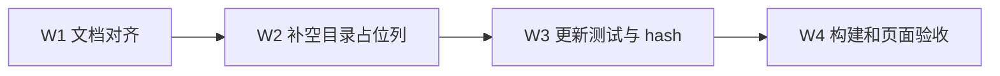

# Docs Site Kimi Layout 实施计划

## 1. 前置对齐

- `change_type: modify`
- `change_tier: major`
- 目标是采用 Kimi 文档站使用的 VitePress 默认栏位骨架。
- 保留现有配色、导航内容、目录规则、Mermaid 和依赖。
- 无右侧目录页面的桌面正文宽度与 Kimi 的 688px 阅读列一致。
- 1280px 以上为无目录页面保留 256px 空目录占位列，不直接计算正文偏移。
- 既有归档计划保持冻结。

## 2. 规模与边界

默认骨架调整已经完成；本轮再新增约 7 行 CSS、5 行测试和少量现有文档；
不新增依赖、组件、配置或抽象。

只允许修改本功能 PRD、TRD、活跃计划、主题 CSS、既有布局测试和
`docs-site-bootstrap` 的 lock hash。禁止修改导航内容、页面正文、Mermaid 组件、
依赖、其他 Skill、Router、README、注册信息、宿主站点和部署配置。

## 3. 文件级范围

| 路径 | 操作 |
| --- | --- |
| `docs/pm/agents/docs-agent/docs-site-layout/PRD.md` | 更新目标、边界和验收标准 |
| `docs/engineer/agents/docs-agent/docs-site-layout/TRD.md` | 更新默认栏位技术方案和验证设计 |
| `docs/engineer/agents/docs-agent/docs-site-layout/IMPLEMENTATION_PLAN.md` | 新建本轮活跃计划 |
| `agents/docs/skills/docs-site-bootstrap/assets/docs/site/.vitepress/theme/custom.css` | 限制正文为 688px，并补 256px 空目录列 |
| `agents/docs/skills/docs-site-bootstrap/assets/docs/site/scripts/__tests__/scaffold-doc.test.mjs` | 锁定正文宽度、空目录列和默认骨架保护 |
| `skills-lock.json` | 刷新 `docs-site-bootstrap.computedHash` |

## 4. 实施顺序



## 5. 测试与验证

在站点资产目录执行：

```bash
node --test scripts/__tests__/*.test.mjs
npm run build:public
npm run build:internal
```

在仓库根目录执行：

```bash
uv run scripts/generate_shared_contracts.py --check
uv run scripts/check_repository_contract.py
uv run scripts/check_doc_contract.py
git diff --check
```

确认依赖、导航和 Mermaid 组件没有变化。真实 Chrome 分别以 1280×900、
2560×1440、390×844 验收侧栏滚动、顶部导航、正文、目录和移动端折叠；桌面端
无右侧目录页面的 `.content-container` 实测宽度不超过 688px，空目录占位为 256px，
正文中心与屏幕中心偏差不超过 8px。

## 6. 停止与收尾

出现配色变化、导航变化、Mermaid 回归、依赖变化、侧栏仍被覆盖或任一检查失败时
停止交付。不得通过修改宿主站点或升级依赖绕过失败。

完成后记录实际文件、测试结果和浏览器验收；取得明确归档批准后归档为
`archive/IMPLEMENTATION_PLAN-docs-site-kimi-layout.md`。
