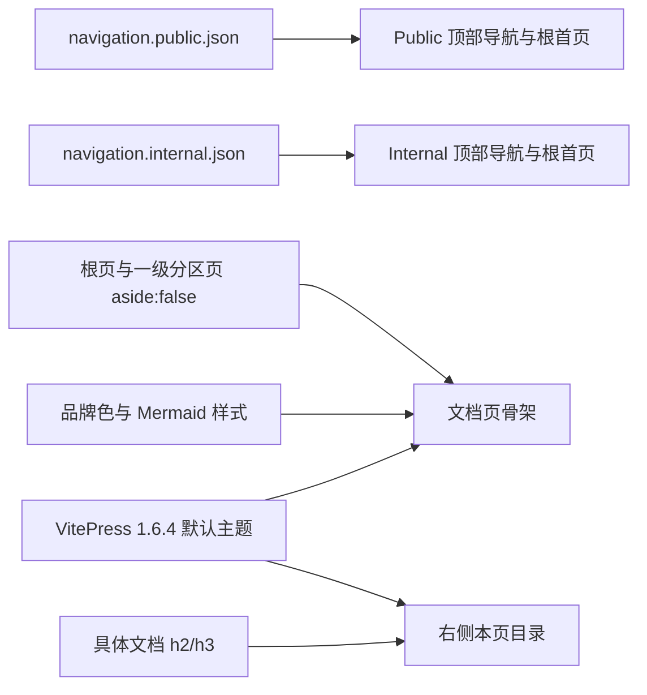

# Docs Site Layout TRD

## 1. 来源与范围

本 TRD 将已批准的同路径 PRD 转换为 `docs-site-bootstrap` 工程设计。变更为
`change_type: modify`、`change_tier: major`：修改 Skill 交付的主题资产、测试与
lock hash，但不改变导航、页面内容、发现描述、路由、注册、宿主 CI 或依赖。

## 2. 技术概览

实现使用 VitePress 1.6.4 默认主题的桌面栏位、层级、断点和移动端交互。两套入口
继续由目标专属 JSON 提供；页面用 frontmatter 区分目录状态；`custom.css` 保留
品牌色和 Mermaid 样式，并只限制无右侧目录页面的正文阅读列。

## 3. 组件与路径

| 组件 / 路径 | 计划改动 | 来源 |
| --- | --- | --- |
| `.vitepress/navigation.public.json`、`navigation.internal.json` | 分别保存两套独立有序入口 | #303 |
| `config.public.ts`、`config.internal.ts` | 只消费当前目标的 JSON | #303 |
| `index.public.md`、`index.internal.md` | 使用唯一入口 marker，并设 `aside: false` | #303、#304 |
| `scripts/lib/pages.mjs` | 校验 JSON，按 marker 确定性渲染 Markdown 列表 | #303 |
| `scripts/prepare-site.mjs` | 为目标首页渲染入口并复制 JSON 到生成树 | #303 |
| 八个一级分区 `index.md` | 显式设 `aside: false` | #304 |
| `.vitepress/theme/custom.css` | 无目录页限制正文为 688px，并补 256px 空目录列 | 用户确认 |
| `scripts/__tests__/scaffold-doc.test.mjs` | 锁定正文宽度与空目录占位规则 | 用户确认 |
| `skills-lock.json` | 刷新 `docs-site-bootstrap` hash | Skill 同步契约 |

## 4. 双站点导航契约

`navigation.public.json` 固定为产品 `/product/`、操作手册 `/manual/`、发布说明
`/release-notes/`；`navigation.internal.json` 固定为规范 `/standards/`、产品、
操作手册、设计 `/design/`、API `/api/`、数据库 `/database/`、运维 `/ops/`、
发布说明。两套数组均显式声明，不从另一套过滤或重排。

两份 VitePress config 各自只引用目标文件。根首页只保留一个
`<!-- docs-site-navigation -->` marker；`prepare-site` 读取并校验 JSON 后，把当前
目标数组渲染为 Markdown 列表。这样生成首页和顶部导航消费同一数据，测试再断言
固定候选顺序、唯一 marker、目标完整性及最终 `{text, link, order}`。

Sidebar 继续由 `SECTION_ORDER` 和页面可见性生成，其“文档规范”“API 文档”等
分区标题不参加顶部导航一致性比较。

## 5. 页面骨架与目录

根首页和八个一级分区首页显式写入 `aside: false`。根首页没有 sidebar；一级分区
首页仍命中现有 sidebar，因此使用“顶部栏 + 左侧栏 + 主内容”的文档页骨架。

具体文档继续使用共享 `outline.level: [2, 3]`。一级分区首页通过 `aside: false`
隐藏目录；其余目录显隐、宽度和折叠行为由 VitePress 默认主题处理。桌面断点下，
只对 `.VPDoc.has-sidebar:not(.has-aside) .content-container` 设置 `max-width: 688px`，
使无目录页面与 Kimi 的正文阅读列一致；960px 以下不覆盖流式宽度。1280px 以上在
`.container::after` 渲染一个无内容的 256px flex 占位列，模拟缺省的右侧目录 box，
让默认 flex 布局保持正文中心线；不新增 Vue 组件。

## 6. 默认栏位与主题契约

`.vitepress/theme/custom.css` 删除以下覆盖：

- `--docs-*` 布局变量，以及 `--vp-layout-max-width`、`--vp-sidebar-width` 覆盖；
- `.VPNav`、`.VPNavBar.has-sidebar`、`.VPSidebar` 的背景、位置和层级覆盖；
- `#VPContent.has-sidebar`、`.VPDoc`、`.container`、`.content` 和 `.aside` 的尺寸覆盖；
- 依赖 `:has(.VPDocAsideOutline.has-outline)` 的自定义目录布局。

删除后由 VitePress 默认主题负责顶部栏、侧栏、正文外层和目录的宽度、偏移、层级及
断点。布局例外只有无目录正文的 `688px` 最大宽度和 1280px 以上的 256px 空目录列；
不直接计算正文偏移，也不调整顶栏、侧栏、外层边距或层级。
`--vp-c-brand-1: #2563eb`、`--vp-c-brand-2: #1d4ed8` 和全部 Mermaid 样式原样保留。

## 7. 验证策略

Node 测试覆盖两套固定入口、JSON 反向场景、唯一 marker、生成首页逐项一致、根页
和八个分区 `aside: false`。主题测试断言品牌色、Mermaid、无目录正文宽度和空目录列
规则存在，并拒绝重新加入自定义栏位变量或 `.VPNav`、`.VPSidebar`、`#VPContent`
以及其他 `.VPDoc` 布局规则。
Public/internal build 证明 JSON 和主题进入两套生成树。

真实 Chrome 在 1280×900、2560×1440 检查双站点 `/`、`/product/` 及 internal
`/standards/doc-lifecycle`：确认顶部栏内容从左栏右侧开始、滚动条顶部完整可见，
并检查顶部导航、sidebar、目录和上一页/下一页；同时确认无目录页面正文不超过
688px、空目录占位为 256px，正文中心与屏幕中心偏差不超过 8px。
390px 仅做移动端折叠烟测。

## 8. 影响面、禁改范围与风险

在已完成的默认骨架调整上再新增约 7 行 CSS、5 行测试和少量文档，不新增依赖。
只允许触碰主题 CSS、对应测试、`skills-lock.json` 和同 feature 三份文档。
禁止修改 marketplace、Router、其他 Skill、README、`AGENTS.md`、宿主 CI、
`package.json`、`package-lock.json`、模板、脚手架和发布配置。`.generated/`、
`node_modules/`、截图及临时服务文件不得提交。

主要风险是未来重新加入宿主级顶部栏覆盖。锁定 VitePress 1.6.4，并以默认栏位保护
断言、双 build、真实浏览器检查和 Skill hash 阻塞漂移。既有宿主需按原冲突 gate
重新执行 bootstrap 并明确合并 `custom.css`；不得静默覆盖。当前无阻塞技术开放问题。
