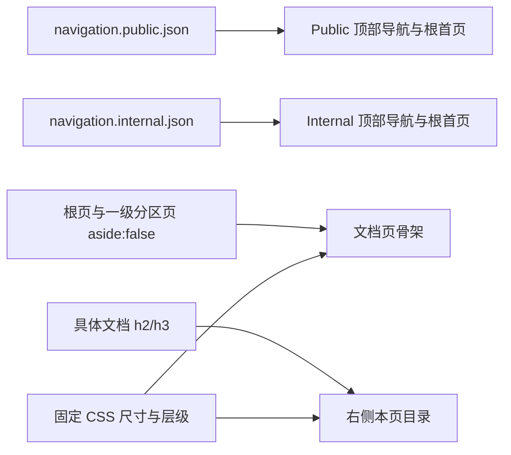

# Docs Site Layout TRD

## 1. 来源与范围

本 TRD 将已批准的同路径 PRD、issue #303/#304 和维护者确认的布局数值转换为
`docs-site-bootstrap` 工程设计。变更为 `change_type: modify`、
`change_tier: major`：修改 Skill 交付的站点资产、Bootstrap inventory、测试与
lock hash，但不改变发现描述、路由、注册、宿主 CI 或依赖。

## 2. 技术概览

实现沿用 VitePress 1.6.4 默认主题 DOM、断点和移动端交互。两套入口分别由目标
专属 JSON 提供；页面用 frontmatter 和主题现有 outline class 区分；桌面尺寸集中在
`custom.css`。

## 3. 组件与路径

| 组件 / 路径 | 计划改动 | 来源 |
| --- | --- | --- |
| `.vitepress/navigation.public.json`、`navigation.internal.json` | 分别保存两套独立有序入口 | #303 |
| `config.public.ts`、`config.internal.ts` | 只消费当前目标的 JSON | #303 |
| `index.public.md`、`index.internal.md` | 使用唯一入口 marker，并设 `aside: false` | #303、#304 |
| `scripts/lib/pages.mjs` | 校验 JSON，按 marker 确定性渲染 Markdown 列表 | #303 |
| `scripts/prepare-site.mjs` | 为目标首页渲染入口并复制 JSON 到生成树 | #303 |
| 八个一级分区 `index.md` | 显式设 `aside: false` | #304 |
| `.vitepress/theme/custom.css` | 固定宽度、居中、空目录隐藏和顶部/侧栏层级 | #304 |
| `scripts/__tests__/scaffold-doc.test.mjs` | 增补导航、首页、分区与 CSS 契约测试 | #303、#304 |
| `_internal/INSTRUCTIONS.md` | inventory 从 42 更新为 44 并登记两份 JSON | Skill 同步契约 |
| `skills-lock.json` | 刷新 `docs-site-bootstrap` hash | Skill 同步契约 |

## 4. 双站点导航契约

`navigation.public.json` 固定为产品 `/product/`、操作手册 `/manual/`、发布说明
`/release-notes/`；`navigation.internal.json` 固定为规范 `/standards/`、产品、
操作手册、设计 `/design/`、API `/api/`、数据库 `/database/`、运维 `/ops/`、
发布说明。两套数组均显式声明，不从另一套过滤或重排。

两份 VitePress config 各自只引用目标文件。根首页只保留一个
`<!-- docs-site-navigation -->` marker；`prepare-site` 读取并校验 JSON 后，把当前
目标数组渲染为 Markdown 列表。这样生成首页和顶部导航消费同一数据，测试再断言
固定候选顺序、唯一 marker、目标完整性及最终 `{text, link, order}`。

Sidebar 继续由 `SECTION_ORDER` 和页面可见性生成，其“文档规范”“API 文档”等
分区标题不参加顶部导航一致性比较。

## 5. 页面骨架与目录

根首页和八个一级分区首页显式写入 `aside: false`。根首页没有 sidebar；一级分区
首页仍命中现有 sidebar，因此使用“顶部栏 + 左侧栏 + 主内容”的文档页骨架。

具体文档继续使用共享 `outline.level: [2, 3]`。1280px 以上仅当默认主题生成
`.VPDocAsideOutline.has-outline` 时显示 aside；无可用 `h2/h3` 时通过 `:has()`
隐藏空 aside，并回到无目录正文宽度。960–1279px 和移动端继续沿用 VitePress
既有目录与折叠行为，不增加组件或断点。

## 6. 桌面布局契约

| 项目 | 数值 | CSS 落点 |
| --- | ---: | --- |
| 整体最大宽度 | 1440px | `--docs-layout-max-width` / `--vp-layout-max-width` |
| 左侧栏 | 240px | `--docs-sidebar-width` / `--vp-sidebar-width` |
| 正文内容 | 约 688px | 752px content 列扣除左右各 32px padding |
| 目录可视内容 | 224px | `.aside-container` |
| Aside 列 | 约 256px | 224px 内容加既有 32px 间距 |

桌面 `#VPContent.has-sidebar` 在 1440px 容器内居中，左栏从该容器左边界开始；
超宽屏只增加外侧空白。无 aside 和有 aside 页面都保持约 752px content 列，避免
拉宽正文。顶部栏高度继续取 `--vp-nav-height`；`.VPNav` 使用 nav 层级和不透明
背景，`.VPSidebar` 使用 sidebar 层级，使顶部栏覆盖侧栏顶部区域并保持可点击。

## 7. 验证策略

Node 测试覆盖两套固定入口、JSON 反向场景、唯一 marker、生成首页逐项一致、根页
和八个分区 `aside: false`，以及 1440/240/752/224/256 与关键层级选择器。
Public/internal build 证明 JSON 和主题进入两套生成树。

真实 Chrome 在 1280×900、2560×1440 检查双站点 `/`、`/product/` 及 internal
`/standards/doc-lifecycle`：测量整体、左栏、正文和目录，确认目录显隐、两侧空白、
顶部导航点击、sidebar、目录、上一页/下一页。390px 仅做既有移动端折叠烟测。

## 8. 影响面、禁改范围与风险

代码与测试预计净增约 120–220 行，不新增依赖；三份文档预计约 250–350 行。只
允许触碰组件表内当前 Skill 文件、`skills-lock.json` 和同 feature 三份文档。
禁止修改 marketplace、Router、其他 Skill、README、`AGENTS.md`、宿主 CI、
`package.json`、`package-lock.json`、模板、脚手架和发布配置。`.generated/`、
`node_modules/`、截图及临时服务文件不得提交。

主要风险是 VitePress 类名或 `:has()` 关系变化，以及新 JSON 漏入 Bootstrap
inventory。锁定 1.6.4，并以 Node 数值断言、双 build、真实浏览器测量、44 项
inventory 与 Skill hash 检查共同阻塞漂移。既有宿主需按原冲突 gate 重新执行
bootstrap；不得静默覆盖。当前无阻塞技术开放问题。
