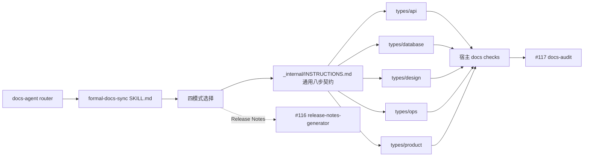

# Formal Docs Sync 多类型扩展 TRD

## 1. 来源、范围与分级

本 TRD 将已批准的
`docs/pm/agents/docs-agent/formal-docs-sync/PRD.md` 转换为可实施设计。PRD 由维护者
已批准的 GitHub issue #121 蒸馏而来；issue #118 的 frontmatter 契约与 issue #122
的五模板、`new:doc` 脚手架均已合并，满足硬前置。

本 feature 修改现有 specialist 的公开入口契约、内部协议和五类文档行为，影响后续
eval 与 lock hash，按仓库契约判定为 `change_tier: major`。本轮 S1 只实施 skill、
渐进加载结构、文档链与确定性仓库验证；S2 再处理 eval fixture、fresh validation、
durable comparison 与交付。

## 2. 技术结构



渐进加载结构固定为：

```text
agents/docs/skills/formal-docs-sync/
├── SKILL.md
└── _internal/
    ├── INSTRUCTIONS.md
    └── types/
        ├── api/INSTRUCTIONS.md
        ├── database/INSTRUCTIONS.md
        ├── design/INSTRUCTIONS.md
        ├── ops/INSTRUCTIONS.md
        └── product/INSTRUCTIONS.md
```

`SKILL.md` 只执行入口依据检查、模式选择和流程指针；通用入口定义八步站点契约、
change-map 通用规则、当前状态纪律、缺站行为和结果报告；五个类型模块只定义本类型
特有的证据检查、宿主模板选择与输出约束。一次只同步一种类型时，读取
`SKILL.md`、通用入口和该类型模块，不读取其他四个模块。

## 3. 入口门禁与四模式职责

所有模式都要求 PM handoff packet、等效已确认文档链或维护者批准的 specialist entry
basis，并在写前确认宿主 `docs/site/`、standards 与 change map 存在。缺失站点基础时
零写入并 handoff `docs-site-bootstrap`。

| 模式 | 必要依据 | 同步职责 | 阻塞与边界 |
| --- | --- | --- | --- |
| Feature delivery | Approved PRD、Confirmed TRD 影响范围、已确认实施计划、实际 diff 与测试 | API contract、database 当前 schema / domain、design / architecture 当前状态、受用户行为变化影响的 product 页面，以及对应 change map、索引与必要导航 | design 页面必须通过既有七项 closeout gate；未完成实现或未来设计不得写入。 |
| Deployment verification | 已确认部署范围、TRD deployment surface、配置、验证命令与结果、环境差异 | ops runbook、upgrade / rollback、环境变量、启动方式、Helm / Compose 等当前事实，以及对应 map、索引与必要导航 | 计划中的部署方式、未执行命令或未验证环境不得写成现状。 |
| Release | 已确认 release scope、版本事实、changelog / release-process 证据和审计上下文 | 只同步本次发布仍受影响的 product / ops 页面，并核对它们与版本事实一致 | Release Notes 正文、索引与 metadata 立即 handoff #116；不操作 GitHub Release 或 tag。 |
| Existing-system backfill | 维护者明确请求、确认宿主，以及 feature catalog、既有 change map 或获准的有界 discovery | 对 API、database、design、ops、product 建立有限当前状态基线；页面与新 map 条目同批确认 | 一次一个已确认批次；不从扫描结果扩张为全站生成；无可靠事实的页面保持 unresolved。 |

## 4. 通用八步站点契约

### 步骤 1：读取宿主 standards 入口

读取 `docs/site/standards/index.md` 或宿主等效入口，确认 lifecycle、granularity、目录、
导航和检查要求。不得以 marketplace 默认值覆盖宿主已确认规则。

### 步骤 2：读取目标类型模板

只读取 `docs/site/standards/templates/` 下目标类型模板；模板路径映射沿用 #122。模板是
正文与 scaffold 的唯一来源，不在 skill 或测试中内嵌第二份正文。新页面优先建议调用
宿主 `npm run new:doc -- ...` 创建骨架；该命令不替代证据确认与事实写作。

### 步骤 3：读取并应用 change map

读取 `docs/site/standards/change-map.yaml`，以已确认代码范围匹配 `code_glob` 并应用
各自 `exclude`。同 glob 条目合并、列表去重稳定排序、未知字段与人工条目保留；没有
映射时提出目标页面、代码范围与新条目，不自行扩大范围。

### 步骤 4：确认候选范围

展示模式、目标类型、候选页面、代码路径与 globs、每页证据、change-map delta、明确
排除项和未解决问题，等待维护者确认。页面、对应 change-map 条目、必要索引与导航是
同一确认范围；backfill 每次只确认一个批次。

### 步骤 5：有界写入并逐项回读

只写已确认范围，正文直接描述稳定当前状态，不追加变更流水账。写后重新读取页面、
change map 及受影响索引 / 导航，逐项核对路径、globs、排除项、链接和关键事实。

### 步骤 6：应用 #118 与 `unverified`

所有新改正式 Markdown 页面消费
`agents/docs/skills/docs-agent/_internal/_shared/frontmatter-contract.md`，不得重新定义字段
或值域。新改页面固定保留 `last_verified_version: unverified`；unsupported 或冲突事实
保持 unresolved，不猜测、不盖章。

### 步骤 7：运行宿主 docs checks

读取并执行宿主定义的检查命令，记录命令、工作目录、退出结果与关键摘要。AI
Hub-shaped fixture 必须执行与其 VitePress CI 一致的 `npm run test:docs`；失败时报告
证据并保持 not-ready，不能用局部检查替代。

### 步骤 8：handoff #117

检查成功后输出确认范围、变更页面、证据、map delta、回读结果、未解决差异与覆盖缺口，
handoff `docs-audit` 执行版本审计和统一盖章。同步结果本身不产生 verified 版本结论。

## 5. 五类模块契约

| 类型模块 | 宿主模板 | 关键证据 | 输出约束 |
| --- | --- | --- | --- |
| API | `api-template.md` | routes、methods、auth、请求参数 / body、schema、response、errors、contract tests | 接口路径、方法、鉴权、输入输出与错误必须逐项可追溯；不从命名猜测 contract。 |
| Database | `database.md` | schema / model、migration、constraints、relations、indexes、repository / query 与测试 | 只写当前 schema 与 domain 事实；迁移计划未执行时不得写成现状。 |
| Design | `feature-design.md` | 同 feature_path 的 PRD、TRD、完成计划、最终代码 / diff 和全量必需测试 | Feature delivery 必须先通过既有七项 closeout gate；页面和 design map 条目原子阻塞或写入。 |
| Ops | `ops-runbook.md` | 部署配置、环境变量、启动 / 停止、验证命令结果、upgrade / rollback、环境差异 | 命令与顺序必须来自已验证证据；release 模式只改受版本影响页面。 |
| Product | `product-handbook.md` | Approved 用户行为、已完成实现、实际 UI / API 行为、验收与测试、版本上下文 | 只写已交付用户可见行为；不生成 Release Notes，不将计划功能写成手册事实。 |

模板模块只保存“如何核验证据与约束输出”的可复用判断，不复制上述宿主模板正文。宿主
模板名称或结构发生变化时，以 standards 入口与目标模板为准；无法唯一定位时阻塞并请求
维护者决定，不动态发明 schema。

## 6. Design closeout gate 保持

Feature delivery 提议任何 feature-level `docs/site/design/**` 写入前，必须核对同一
`feature_path` 的七项条件：Approved PRD、Confirmed TRD 且影响范围可追溯、已确认实施
计划、整个交付 scope 已完成、实际代码与 diff 覆盖计划及 TRD、全部必需测试已执行且
通过、候选范围已确认。

任一条件缺失、失败、blocked、unknown 或存在未解释 skipped 时，design 页面与其
change-map 条目均零变化，并输出失败条件、证据缺口、owner 和下一动作。通过后正文仍只
能描述最终代码与通过测试共同证明的当前状态，写后再次逐项核对，保持 `unverified`。

## 7. Backfill 批次与 change-map 规则

- 优先从 PM feature catalog 取得 feature、代码范围与 owner 关系，再与既有 change map
  交叉核验。
- 无 catalog 或 mapping 时，只有获得有界 discovery 授权后才扫描目标类型的入口证据，
  先形成候选批次，不直接生成页面。
- 默认一个业务模块或一个明确文档面为一批；每批只含维护者可一次审核的有限页面、
  globs、证据入口与排除项。
- 相同 `code_glob` 只合并，不创建重复 key；`required_docs`、`trigger`、`exclude` 按
  宿主 schema 有界修改并稳定排序；未知字段、未知条目和人工内容保留。
- `docs/site/.meta/**` 不作为正式页面发现、frontmatter 或 `required_docs` 更新目标；
  Release Notes metadata 归 #116。
- 每批结束后报告覆盖、未解决证据和剩余候选；未获下一次确认不得自动继续。

## 8. 相邻 Issue 边界

| Issue | 权威职责 | 本 feature 的消费或边界 |
| --- | --- | --- |
| #118 | 定义正式 Markdown 页面 frontmatter 字段、值域与 `unverified` 语义。 | 只读取契约真源；不复制字段清单、不定义 schema、不盖章。 |
| #122 | 提供宿主 standards、五模板唯一 scaffold 区块和 `new:doc` 脚手架。 | 宿主模板是唯一正文来源；新页面优先建议脚手架；不维护第二份模板。 |
| #116 | 生成站内 Release Notes 正文、版本索引和 release metadata。 | release 模式遇到该范围立即 handoff；不读写其 owner surface。 |
| #117 | 执行 docs-audit、版本审计与统一盖章。 | 所有同步完成且 checks 成功后 handoff；页面此前保持 `unverified`。 |

GitHub Release、tag、镜像、Helm 和部署不属于上述同步或 handoff。本功能也不初始化
`docs/site/`，不迁移 AI Hub 的非 VitePress 逻辑，不修改 AI Hub 仓库，不新增动态
宿主 schema。

## 9. 影响面

S1 预计只影响：

- `agents/docs/skills/formal-docs-sync/SKILL.md`；
- `agents/docs/skills/formal-docs-sync/_internal/**`；
- 本 feature 的 PRD、TRD 与实施计划；
- `skills-lock.json` 中 `formal-docs-sync` 的 `computedHash`。

S2 才影响 `agents/docs/test/formal-docs-sync/**` 的 eval 定义、fixture 和 durable
`comparison.md`。S1 不因现有 eval fixture 对旧 API-only 表述的断言失效而修改它们；
若确定性检查暴露该差异，应如实记录并留给 S2。

## 10. 验证策略

| 验证面 | 方法 |
| --- | --- |
| 渐进加载 | 静态核对 `SKILL.md`、通用入口和五类型模块的职责；单类型规则不得要求读取其他模块。 |
| 契约与边界 | 检查八步顺序、四模式输出、#116/#117/#118/#122 handoff 与所有负向禁令。 |
| 模板单一来源 | 搜索 skill 内无模板 scaffold 正文副本，五类型模块只指向宿主模板。 |
| 仓库契约 | 依序运行 4 个 `uv run scripts/check_*.py`。 |
| Python 回归 | 执行 `.github/workflows/ci.yml` 当前定义的同款 pytest 命令。 |
| Skill eval | S2 使用 AI Hub-shaped fixtures 覆盖 database / design、deployment ops、product 与 Release Notes 越界，fresh with/without 后更新 durable comparison。 |

## 11. 风险、假设与开放问题

| 风险 / 假设 | 处理 |
| --- | --- |
| 通用入口膨胀为五类规则全集 | 通用入口只保留八步与共享规则；证据和输出差异进入对应类型模块。 |
| 类型模块复制宿主模板正文 | 只保存模板路径、证据核验和输出约束；正文永远从宿主模板读取。 |
| Release 模式越界生成 Release Notes | 在入口、通用流程、product / ops 模块和报告中统一 handoff #116。 |
| Backfill 从扫描扩张为全站生成 | 优先 catalog / map；无映射只提出有限候选；一次一个确认批次。 |
| 计划或文档主张覆盖代码事实 | 以最终代码、测试、配置和真实验证为 ground truth；冲突即阻塞并回 owner。 |
| S1 改文案使旧 eval fixture 断言失效 | 不在 S1 顺手改 eval；记录结果，S2 同 prompt 重新生成 fresh baseline 后处理。 |

当前无阻塞技术开放问题。若宿主缺少 standards、目标模板或可解析 change map，运行时
必须阻塞并 handoff / 请求维护者决定，不能由 skill 静默补建或发明默认契约。
