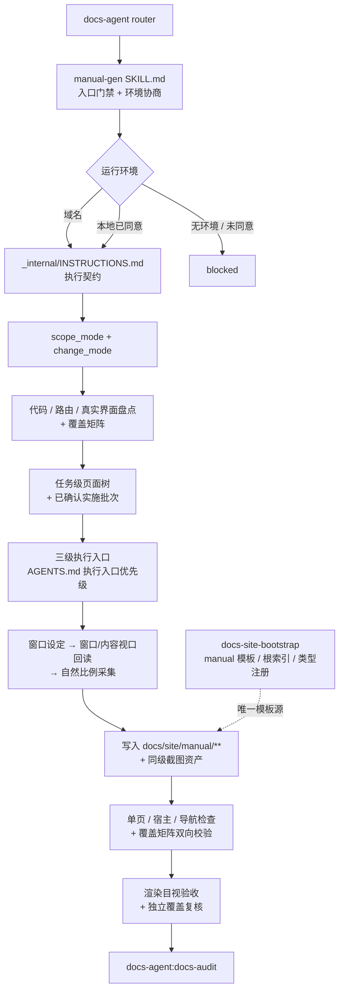

# Manual Gen TRD

## 1. 来源、范围与分级

本 TRD 把 `docs/pm/agents/docs-agent/manual-gen/PRD.md`（v1.1.0，FR-M01~M20）转换为可实施设计。v0.2.0 依据维护者提供的全量手册失败 Case 与确认批注，修正已发布的执行协议。

本轮修改既有 `docs-agent` Router、`manual-gen` Specialist 和 `docs-site-bootstrap` 交付的宿主粒度标准，并同步三个 Skill 哈希，按仓库「变更分级契约」判定为 `change_tier: major`、`change_type: modify`。

范围内的三条工作面是：**范围与目录分类**、**写前/写后覆盖门禁**、**真实视口截图契约**。既有 `doc_type: manual`、模板、站点脚本和其他 Docs Specialist 不在本轮修改范围。

## 2. 技术结构



## 3. 正式文档层扩展

`doc_type` 枚举与站点分区在 skill 契约层和宿主脚本资产层各有副本，必须同批次同步。经实际核对，类型枚举与侧边栏分区涉及五处；顶部导航与落地页的手写链接另涉及四处：

| # | 文件 | 改动 | 说明 |
|---|---|---|---|
| 1 | `agents/docs/skills/docs-agent/_internal/_shared/frontmatter-contract.md:23` | `doc_type` 枚举加 `manual` | 权威定义 |
| 2 | `agents/docs/skills/docs-audit/_internal/INSTRUCTIONS.md:223` | 同步枚举表副本 | 审计判定依据 |
| 3 | `.../assets/docs/site/scripts/lib/pages.mjs:7` | `DOC_TYPES` Set 加 `'manual'` | `check:frontmatter` 实际校验点 |
| 4 | `.../assets/docs/site/scripts/lib/pages.mjs:11` | `SECTION_ORDER` 加 `'manual'` | 页面收集与分区顺序 |
| 5 | `.../assets/docs/site/scripts/lib/sidebar.mjs:3` | `SECTION_LABELS` 加 `manual: '操作手册'` | 侧边导航标签 |
| 6 | `.../assets/docs/site/.vitepress/config.public.ts` | 顶部 `nav` 增加 `/manual/` 入口 | public 站顶部导航为手写配置 |
| 7 | `.../assets/docs/site/.vitepress/config.internal.ts` | 顶部 `nav` 增加 `/manual/` 入口 | internal 站顶部导航为手写配置 |
| 8 | `.../assets/docs/site/index.public.md` | 落地页增加操作手册链接 | public 站落地页为手写内容 |
| 9 | `.../assets/docs/site/index.internal.md` | 落地页增加操作手册链接 | internal 站落地页为手写内容 |

`SECTION_ORDER` 中 `manual` 插入到 `product` 之后、`design` 之前：手册与产品文档同属面向用户的阅读入口，紧邻可减少读者在导航中的跳跃。

侧边栏由 `SECTION_ORDER` 与 `SECTION_LABELS` 驱动自动生成，不需要手写 sidebar 配置；`config.shared.ts` 也不维护分区列表。但 public / internal 顶部 `nav` 与两个落地页入口均为手写内容，因此需要同步修改 `config.public.ts`、`config.internal.ts`、`index.public.md` 与 `index.internal.md`。这四处是 PRD「导航分区」要求在宿主站点中的具体实现触点。

脚手架注册在 `scaffold-doc.mjs:18` 的 `TYPES` 映射增加一条：

```js
manual: { directory: 'manual', template: 'manual-guide.md' }
```

## 4. manual 模板与根索引

新增两个宿主资产文件，并同步模板入口索引，形态对齐现有五类：

- `assets/docs/site/standards/templates/manual-guide.md`：模板页自身 frontmatter 用 `doc_type: manual`，正文说明写作纪律，`<!-- docs-scaffold:start -->` / `end` 之间是唯一的 `md` fence 骨架。
- `assets/docs/site/manual/index.md`：类型根索引，`doc_type: landing`，与 `api/index.md`、`product/index.md` 等既有根索引一致。
- `assets/docs/site/standards/index.md`：模板入口从五项更新为六项，并链接 `manual-guide.md`。

`docs-scaffold` 块固化 PRD FR-M08 的七项字段：

```text
## 适用范围
- 适用角色：
- 前置条件：

## 操作步骤
1. 步骤与可见界面说明
   

## 预期结果

## 注意事项与异常处理
```

模板是唯一模板源。`manual-gen` 通过宿主 `standards/` 入口读取该模板，skill 内不维护第二份模板正文。

## 5. 截图资产落盘

**复用现有机制，零新增。** `prepare-site.mjs` 的 `referencedAssets()` 已经收集页面中以相对路径引用的非 `.md` 文件，并带边界保护：拒绝站外路径、排除区路径、非真实文件，逐条给出 `warnSkippedAsset` 原因。收集结果与 `public/**` 一并复制进构建产物。

因此截图落点定为**手册页同级相对路径**，例如 `docs/site/manual/<业务>/<操作>/step-1-<slug>.png`，页面内以 `./step-1-<slug>.png` 引用。这样：

- 截图随页面移动，不产生跨目录的悬空引用；
- 无需新建 `public/` 子目录约定，无需改 `prepare-site.mjs`；
- 截图随站点构建打包，读者访问的文档与截图属同一构建版本，与 PRD 决议 5「不新增过期告警机制」一致。

命名规则：`step-<序号>-<lower-kebab-case 描述>.png`，序号对应操作条目的编号步骤。

## 6. skill 本体结构

```text
agents/docs/skills/manual-gen/
├── SKILL.md                    # 入口门禁 + 环境协商协议 + 执行指针
└── _internal/
    └── INSTRUCTIONS.md         # 执行契约
```

单层 `_internal`，不建 `types/` 子模块——手册只有一种产物形态，不存在 `formal-docs-sync` 那样的五类分支，建子模块属于无依据的抽象。

`SKILL.md` frontmatter：`name: manual-gen`、`visibility: internal`、`description` 按仓库约定写明「Internal documentation specialist—not a direct entry point」并避免用户触发语（`check_doc_contract.py` 校验该项）。

**职责切分**：`SKILL.md` 承载入口门禁、范围模式、目录变更模式与环境协商协议；`_internal/INSTRUCTIONS.md` 承载盘点、覆盖矩阵、页面规划、采集、写入、验收和报告的完整执行契约。

`_internal/INSTRUCTIONS.md` 的执行步骤：

1. 读宿主标准入口与 `change-map.yaml`，确认站点基础存在（缺失则返回 `docs-site-bootstrap` handoff，零站点写入）
2. 读 manual 模板与既有 `docs/site/manual/**`，把旧页面当作待验证证据而非默认目标树
3. 分类 `scope_mode` / `change_mode`，按范围盘点代码、路由、角色和真实界面，建立覆盖矩阵与任务归属
4. `bounded` 确认有限批次；`full-manual` 一次确认完整矩阵、页面树和全部批次，之后逐批持续执行
5. 设置桌面窗口 → 回读实际窗口和内容视口 → 确认桌面布局 → 按自然比例采集截图
6. 写入手册页与截图资产，生长 change-map 条目
7. 运行单页、宿主、导航和矩阵双向检查，做渲染目视验收；完整手册再做独立覆盖复核
8. handoff 至 `docs-audit`，`last_verified_version` 保持 `unverified`

## 7. 范围、目录与视口的指令层设计

这些是最容易被模型「推断掉」的约束，需要在指令层用可观察产物固定。

### 7.1 范围与目录使用正交状态

`scope_mode` 只回答覆盖边界：

| 值 | 判定 | 盘点边界 |
|---|---|---|
| `bounded` | 明确命名的页面、角色、流程或功能 | 只盘点确认范围及其必要父级导航 |
| `full-manual` | 完整手册、整个产品、所有可见用户功能 | 在写任何页面前盘点所有确认角色、代码入口、路由和真实界面 |
| `full-site` | 所有正式文档面 | Router / PM 先拆分 Specialist；`manual-gen` 只消费其中已确认的手册范围 |

`change_mode` 只回答如何处理既有目录：

| 值 | 判定 | 目录处理 |
|---|---|---|
| `extend` | 用户未要求舍弃或重建，目标是新增、补齐或更新 | 保留有当前证据支持的路径，并按独立任务新增叶子页或拆分子目录 |
| `rewrite` | 用户明确要求舍弃旧内容、整体重写、重建或按当前产品重新梳理 | 从当前产品功能模型推导目标树；旧目录只参与差异核对 |

因此 `full-manual + extend` 和 `bounded + rewrite` 都是合法组合。全量范围不自动要求新目录，增量范围也不能把旧目录视为天然正确。

### 7.2 覆盖矩阵与页面所有权

`full-manual` 写入前必须完成一张矩阵，至少包含：角色、路由或入口、可见功能、独立用户目标、操作与预期结果、权限或前置条件、目标父页、唯一归属叶子页、代码/界面证据、截图需求。`bounded` 使用同一字段结构覆盖受影响范围。

先把可见控件映射为用户任务：一个按钮或对话框可以只是任务中的步骤，不机械地各建一页；每个独立任务必须有且只有一个归属叶子页。满足任一条件时默认拆页：独立入口或按钮、可单独完成、独立结果、独立权限/前置条件/风险、独立异常处理、独立截图证据、不同更新节奏。必须连续完成同一目标且共享入口和结果的动作可以合并。

父级 `index.md` 只说明范围、角色、关系与导航，不承载用于替代叶子页的操作步骤。叶子页必须满足 manual 模板的全部可复现字段。

### 7.3 完整计划与分批执行

`bounded` 仍只确认一个有限批次。`full-manual` 先一次展示并确认完整覆盖矩阵、目标页面树、迁移/新增/拆分清单、全部实施批次和显式排除项；这次确认授权依序执行所列批次。每次只写一个批次，但完成后继续下一个已确认批次，不重新把它解释为新的范围确认。只有范围、树或副作用边界变化时才暂停并重新确认。

**环境协商（FR-M02）。** 协商顺序写成带前置条件的分支，而非并列选项：

- 入口凭据或 handoff 已提供域名可访问环境时，直接使用已确认 URL 并记录来源，不再提问；仅当域名证据缺失时，第一问固定为域名环境，且不得与本地启动合并成一个二选一问题；
- 本地启动分支的进入条件是「无可用域名环境」或「用户明确要求本地」二者之一成立，否则不得询问；
- 启动命令的执行条件是用户对本地启动的明确同意，指令层写为「未获明确同意前不得执行任何启动命令」，并要求报告中回显同意来源。

### 7.4 视口回读

要求产出三条独立证据：

- 设定证据：设置浏览器桌面窗口的命令或操作及目标尺寸；维护者未指定时可将 1920×1080 用作窗口目标；
- 窗口回读证据：从运行环境读回的实际浏览器窗口宽高；
- 内容视口回读证据：从页面读取实际内容视口宽高，例如运行环境提供的 layout viewport 或 `window.innerWidth` / `window.innerHeight`。

回读结果不得由设定值推断。窗口与内容视口不同是正常现象；阻塞条件是无法回读，或内容视口触发了非预期的移动/响应式布局，而不是内容视口没有等于窗口目标。截图保存采集后的自然像素比例；正文样式不得同时强制不同比例的宽度和高度，不把 1920×907 等实际内容截图拉伸为 1920×1080 或 16:9。

### 7.5 执行入口

直接引用 `AGENTS.md` 「QA E2E 测试用例持久化」节中的执行入口优先级条目与 QA 三个 skill 中的权威副本，不复制判定细则，不新增第四种契约。指令层只要求说明所选入口为何覆盖当前采集需求。

### 7.6 写后校验与完成门禁

写后校验分两层，不用构建成功替代覆盖判断：

1. **页面层**：每个叶子页含适用角色、前置条件、编号步骤、可见界面与截图、预期结果、异常处理；父级索引只做范围和导航；图片可见且未变形。
2. **范围层**：矩阵中的每个独立任务恰好映射到一个叶子页，每个叶子页也能反向映射到矩阵证据；所有页面从导航可达；可见路由、菜单动作、按钮、对话框和角色均有已覆盖、任务步骤、明确排除或证据阻塞结论。

`bounded` 只要求受影响矩阵闭环。`full-manual` 还要求非作者执行独立覆盖复核，结论必须是无未解释遗漏。对于 public / internal 等受影响站点变体，分别抽查首页、目录页和内容页的顶部区域、侧栏、图片与正文布局；样式不一致或图片失真阻止完成。

## 8. 本轮同步面

| 文件 | 改动 |
|---|---|
| `agents/docs/skills/docs-agent/SKILL.md` | 完整手册直接路由 `manual-gen`；完整站点的非手册面返回 PM 拆分；保留范围与目录模式 |
| `agents/docs/skills/manual-gen/SKILL.md` | 入口加入 `scope_mode` / `change_mode` 分类及 `full-site` 边界 |
| `agents/docs/skills/manual-gen/_internal/INSTRUCTIONS.md` | 八步执行契约加入覆盖矩阵、目录策略、拆页、分批持续执行、真实视口和完成门禁 |
| `agents/docs/skills/docs-site-bootstrap/assets/docs/site/standards/doc-granularity.md` | 向新 bootstrap 宿主交付手册粒度和目录策略 |
| `agents/docs/README.md` / `README_zh.md` | 能力表同步局部与完整手册输入 |
| `skills-lock.json` | 刷新 `docs-agent`、`manual-gen`、`docs-site-bootstrap` 的 `computedHash` |

不修改 marketplace 注册、插件描述、PM 默认入口、共享 frontmatter、`formal-docs-sync`、`docs-audit`、Release Notes 或站点运行脚本。现有宿主不会自动获得更新后的 `doc-granularity.md`；需要重跑 `docs-site-bootstrap` 或显式合并该标准文件。

## 9. 行为验证场景

本轮不新增 eval 框架或固定业务 fixture。实现审查至少逐项验证：

1. `bounded + extend`：新增功能在仍有效的现有目录中新增叶子页，满足条件时拆分子目录，不盘点无关后台。
2. `full-manual + extend`：写前覆盖所有确认角色和可见功能，保留有效路径，完整计划确认后逐批持续执行，最终矩阵双向闭环。
3. `full-manual + rewrite`：旧目录只作差异证据，目标树从当前产品任务模型推导。
4. `full-site`：Router 不把所有正式文档面交给 `manual-gen`，而是要求 PM 拆分并只路由手册子范围。
5. 1920×1080 浏览器窗口、1920×907 内容视口：允许截图，报告两组实际值，图片不被拉伸成 16:9；内容进入移动布局或无法回读时阻塞。
6. 构建和链接通过但覆盖矩阵仍有无归属任务：结果保持 incomplete / blocked，不得报告完成。

## 10. 验证策略

| 层 | 手段 | 命令 |
|---|---|---|
| 共享契约 | 确认未误改生成副本 | `uv run scripts/generate_shared_contracts.py --check` |
| 仓库契约 | skill 结构、活跃计划、lock hash | `uv run scripts/check_repository_contract.py` |
| 文档契约 | frontmatter、本地链接与实施计划触点 | `uv run scripts/check_doc_contract.py` |
| 确定性测试 | 现有 checker 与安装测试不回归 | `uv run --with pytest pytest agents/test_doc_contract.py scripts/test_generate_shared_contracts.py scripts/test_install_codex_skills.py scripts/test_check_repository_contract.py` |
| 行为语义 | 第 9 节六个场景逐条审读，确认增量/重写与局部/全量组合无矛盾 | 独立 diff review |
| 补丁卫生 | 空白、冲突标记与越界改动 | `git diff --check` + `git diff --stat` |

## 11. 实施约束与非目标

- 只实现 PRD 逐条列出的改动；不新增抽象层或基类、重试与退避、缓存、降级开关、feature flag、新配置项、包装函数、事件钩子、监控埋点或额外日志层。
- 不修改 `formal-docs-sync` 的五类契约与八步流程，不修改 `release-notes-gen` 与 `docs-audit` 的既有职责。
- 不实现浏览器自动化框架、应用启动脚本或部署环境。
- 不为截图过期新增告警机制或第二套变更检测协议。
- 不在本 feature 内统一仓库 `-generator` 后缀命名（issue #230）。
- 量级预期：净新增约 180–280 行，不新增抽象层。实际偏离明显时先停下核对范围。

## 12. 风险与假设

| 项 | 类型 | 内容 | 影响 |
|---|---|---|---|
| 范围和目录模式被混为一谈 | 风险 | 完整手册被强制换目录，或增量补写盲从旧目录 | 两组枚举正交定义，并用四种组合审读 |
| 存量宿主脚本升级 | 假设 | 已 bootstrap 宿主通过重跑 `docs-site-bootstrap` 获得 manual 支持，复用其幂等与 keep/overwrite 机制 | 宿主本地改过脚本时进入既有冲突决策流程，不新增机制 |
| 截图引用被 `referencedAssets` 拒绝 | 风险 | 引用路径若指向站外或排除区，截图不会进入构建产物 | 落点定为页面同级，天然在 `docs/site` 内；`warnSkippedAsset` 输出纳入渲染验收检查项 |
| 窗口尺寸被推断为内容视口 | 风险 | Chrome 外壳导致实际内容更矮，图片再被固定 16:9 拉伸 | 报告分列窗口设定、窗口回读和内容视口回读，图片保持自然比例 |
| 覆盖门禁退化为构建门禁 | 风险 | 页面可运行但独立任务缺页 | 完整手册强制矩阵双向校验和非作者覆盖复核 |

## 13. 开放技术问题

| # | 问题 | Owner | 阻塞性 |
|---|------|-------|--------|
| 1 | `SECTION_LABELS` 的 `manual` 中文标签定为「操作手册」，是否与宿主既有用词冲突 | Maintainer | 非阻塞，宿主可在自己的资产副本中改 |
| 2 | 类型层扩展与 skill 本体是否拆两个 PR 交付 | Maintainer | 非阻塞，影响交付节奏不影响设计 |

## 14. Handoff 条件

本 TRD 与同路径 `IMPLEMENTATION_PLAN.md` 对齐后进入 `maintain-skills` 实施。完成条件是第 8 节触点全部同步、第 9 节场景无契约矛盾、第 10 节命令全部通过；不得用静态检查替代人工范围审读。
