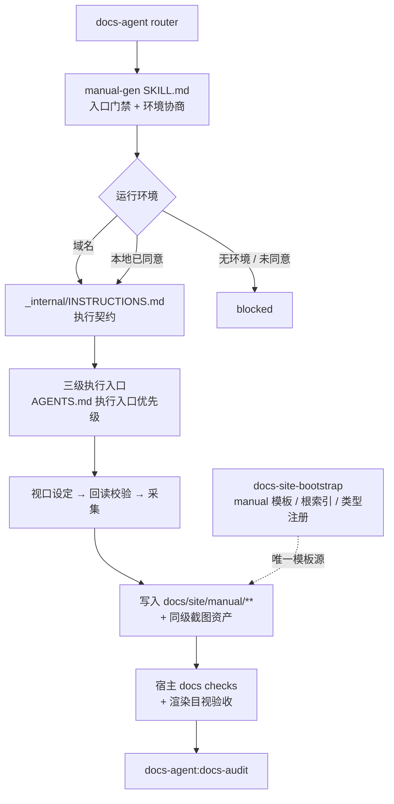

# Manual Gen TRD

## 1. 来源、范围与分级

本 TRD 把 `docs/pm/agents/docs-agent/manual-gen/PRD.md`（v1.0.2，FR-M01~M16）转换为可实施设计。PRD 由 issue #226 及其维护者决策记录蒸馏而来。

本 feature 新增一个 specialist、扩展 `docs-agent` 拥有的共享 frontmatter 契约、修改 `docs-site-bootstrap` 交付给宿主的脚本资产，并改动 marketplace 注册表，按仓库「变更分级契约」判定为 `change_tier: major`。

范围内的两条独立工作面：**类型层扩展**（`doc_type: manual` 与站点资产）与 **skill 本体**。前者是后者的写入前置，必须先落地。

## 2. 技术结构



## 3. 正式文档层扩展

`doc_type` 枚举与站点分区在 skill 契约层和宿主脚本资产层各有副本，必须同批次同步。经实际核对，类型枚举与侧边栏分区涉及五处；顶部导航与落地页的手写链接另涉及四处：

| # | 文件 | 改动 | 说明 |
|---|---|---|---|
| 1 | `agents/docs/skills/docs-agent/_internal/_shared/frontmatter-contract.md:23` | `doc_type` 枚举加 `manual` | 权威定义 |
| 2 | `agents/docs/skills/docs-audit/_internal/INSTRUCTIONS.md:223` | 同步枚举表副本 | 审计判定依据 |
| 3 | `.../assets/docs/site/scripts/lib/pages.mjs:7` | `DOC_TYPES` Set 加 `'manual'` | `check:frontmatter` 实际校验点 |
| 4 | `.../assets/docs/site/scripts/lib/pages.mjs:11` | `SECTION_ORDER` 加 `'manual'` | 页面收集与分区顺序 |
| 5 | `.../assets/docs/site/scripts/lib/sidebar.mjs:3` | `SECTION_LABELS` 加 `manual: '操作手册'` | 侧边导航标签 |
| 6 | `.../assets/docs/site/.vitepress/config.public.ts` | 顶部 `nav` 增加 `/manual/` 入口 | public 站顶部导航为手写配置 |
| 7 | `.../assets/docs/site/.vitepress/config.internal.ts` | 顶部 `nav` 增加 `/manual/` 入口 | internal 站顶部导航为手写配置 |
| 8 | `.../assets/docs/site/index.public.md` | 落地页增加操作手册链接 | public 站落地页为手写内容 |
| 9 | `.../assets/docs/site/index.internal.md` | 落地页增加操作手册链接 | internal 站落地页为手写内容 |

`SECTION_ORDER` 中 `manual` 插入到 `product` 之后、`design` 之前：手册与产品文档同属面向用户的阅读入口，紧邻可减少读者在导航中的跳跃。

侧边栏由 `SECTION_ORDER` 与 `SECTION_LABELS` 驱动自动生成，不需要手写 sidebar 配置；`config.shared.ts` 也不维护分区列表。但 public / internal 顶部 `nav` 与两个落地页入口均为手写内容，因此需要同步修改 `config.public.ts`、`config.internal.ts`、`index.public.md` 与 `index.internal.md`。这四处是 PRD「导航分区」要求在宿主站点中的具体实现触点。

脚手架注册在 `scaffold-doc.mjs:18` 的 `TYPES` 映射增加一条：

```js
manual: { directory: 'manual', template: 'manual-guide.md' }
```

## 4. manual 模板与根索引

新增两个宿主资产文件，并同步模板入口索引，形态对齐现有五类：

- `assets/docs/site/standards/templates/manual-guide.md`：模板页自身 frontmatter 用 `doc_type: manual`，正文说明写作纪律，`<!-- docs-scaffold:start -->` / `end` 之间是唯一的 `md` fence 骨架。
- `assets/docs/site/manual/index.md`：类型根索引，`doc_type: landing`，与 `api/index.md`、`product/index.md` 等既有根索引一致。
- `assets/docs/site/standards/index.md`：模板入口从五项更新为六项，并链接 `manual-guide.md`。

`docs-scaffold` 块固化 PRD FR-M08 的七项字段：

```text
## 适用范围
- 适用角色：
- 前置条件：

## 操作步骤
1. 步骤与可见界面说明
   

## 预期结果

## 注意事项与异常处理
```

模板是唯一模板源。`manual-gen` 通过宿主 `standards/` 入口读取该模板，skill 内不维护第二份模板正文。

## 5. 截图资产落盘

**复用现有机制，零新增。** `prepare-site.mjs` 的 `referencedAssets()` 已经收集页面中以相对路径引用的非 `.md` 文件，并带边界保护：拒绝站外路径、排除区路径、非真实文件，逐条给出 `warnSkippedAsset` 原因。收集结果与 `public/**` 一并复制进构建产物。

因此截图落点定为**手册页同级相对路径**，例如 `docs/site/manual/<业务>/<操作>/step-1-<slug>.png`，页面内以 `./step-1-<slug>.png` 引用。这样：

- 截图随页面移动，不产生跨目录的悬空引用；
- 无需新建 `public/` 子目录约定，无需改 `prepare-site.mjs`；
- 截图随站点构建打包，读者访问的文档与截图属同一构建版本，与 PRD 决议 5「不新增过期告警机制」一致。

命名规则：`step-<序号>-<lower-kebab-case 描述>.png`，序号对应操作条目的编号步骤。

## 6. skill 本体结构

```text
agents/docs/skills/manual-gen/
├── SKILL.md                    # 入口门禁 + 环境协商协议 + 执行指针
└── _internal/
    └── INSTRUCTIONS.md         # 执行契约
```

单层 `_internal`，不建 `types/` 子模块——手册只有一种产物形态，不存在 `formal-docs-sync` 那样的五类分支，建子模块属于无依据的抽象。

`SKILL.md` frontmatter：`name: manual-gen`、`visibility: internal`、`description` 按仓库约定写明「Internal documentation specialist—not a direct entry point」并避免用户触发语（`check_doc_contract.py` 校验该项）。

**职责切分**：`SKILL.md` 只承载入口门禁与环境协商协议（这两步决定是否继续，必须在加载执行契约前完成）；`_internal/INSTRUCTIONS.md` 承载采集、写入、验收、报告的完整执行契约。

`_internal/INSTRUCTIONS.md` 的执行步骤：

1. 读宿主标准入口与 `change-map.yaml`，确认站点基础存在（缺失则返回 `docs-site-bootstrap` handoff，零站点写入）
2. 读 manual 模板与既有 `docs/site/manual/**` 结构
3. 在已确认环境中梳理角色、业务场景与操作流程
4. 展示候选范围与页面树，等待确认（未确认零写入）
5. 设定视口 → 回读校验 → 采集截图（含卫生处理）
6. 写入手册页与截图资产，生长 change-map 条目
7. 运行宿主 docs 检查 + 渲染目视验收
8. handoff 至 `docs-audit`，`last_verified_version` 保持 `unverified`

## 7. 环境协商与视口回读的指令层设计

这两条是 PRD 中最容易被模型「推断掉」的约束，需要在指令层用可观察产物固定。

**环境协商（FR-M02）。** 协商顺序写成带前置条件的分支，而非并列选项：

- 入口凭据或 handoff 已提供域名可访问环境时，直接使用已确认 URL 并记录来源，不再提问；仅当域名证据缺失时，第一问固定为域名环境，且不得与本地启动合并成一个二选一问题；
- 本地启动分支的进入条件是「无可用域名环境」或「用户明确要求本地」二者之一成立，否则不得询问；
- 启动命令的执行条件是用户对本地启动的明确同意，指令层写为「未获明确同意前不得执行任何启动命令」，并要求报告中回显同意来源。

**视口回读（FR-M03）。** 要求产出两条独立证据而非一条：

- 设定证据：设定命令与目标值 1920×1080；
- 回读证据：从运行环境读回的实际视口尺寸数值。

指令层明确「回读结果必须来自运行环境的实际读数，不得由设定值推断」，并要求回读数值与 1920×1080 不符时停止采集。报告模板中这两项是分列字段，缺任一项即视为未完成该步骤。此约束的来源是实测：浏览器工具的 `desktop` 预设落到 691×837 视口并触发站点响应式移动布局。

**执行入口（FR-M04）。** 直接引用 `AGENTS.md` 「QA E2E 测试用例持久化」节中的执行入口优先级条目与 QA 三个 skill 中的权威副本，不复制判定细则，不新增第四种契约。指令层只要求说明所选入口为何覆盖当前采集需求。

## 8. 注册与计数

| 文件 | 改动 |
|---|---|
| `.claude-plugin/marketplace.json` | `docs-agent` 的 `skills` 数组增加 `./skills/manual-gen`；agent `description` 加图文手册能力 |
| `agents/docs/.claude-plugin/plugin.json` | per-agent plugin `description` 加图文手册能力 |
| `skills-lock.json` | 增加 manual-gen 条目；`computedHash` 由契约脚本随 SKILL.md 改动刷新，属同一变更 |
| `agents/docs/skills/docs-agent/SKILL.md` | Available Skills、Routing Signals、Specialist Gate Pointers 三处各加一条；frontmatter `description` 与 Role Boundary 列举句同步 |
| `agents/docs/README.md` / `README_zh.md` | 能力摘要与主要输出补图文手册；skills 表、Specialist skills 计数 4 → 5、Routing Rules 小节同步 |
| `AGENTS.md` | `docs-agent` skill 数 4 → 5，Specialist skills 总数 31 → 32，根路由指针句加手册分流 |
| 根 `README.md` / `README_zh.md` | Skills 徽章 38 → 39、概览 specialist 总数 31 → 32；顶层 Agent 表的 Docs Agent 行 `5 (1 + 4)` → `6 (1 + 5)` 并补图文手册能力 |
| `agents/product_manager/skills/pm-agent/SKILL.md` | Downstream Role Handoff Targets、User Entry Coverage、`formal_docs` 分类行、Default Routes 四处补图文手册 |

`docs-agent` 路由信号措辞：按「基于运行界面截图生成或更新站内图文用户操作手册」分流，与 `formal-docs-sync` 的「同步当前事实」在证据链上区分，避免两者路由重叠。

## 9. eval 组织

```text
agents/docs/test/manual-gen/evals/
├── evals.json
└── workspace/
    ├── eval-001-domain-provided/（#245 单一通用正向测试，平台与场景不绑定）
    ├── eval-002-local-start-consent/
    └── eval-003-no-environment-blocked/
```

每个 workspace 含 `eval_metadata.json`、`comparison.md` 与环境描述文件；平台相关采集脚本只在运行期按所选入口准备，不作为固定场景资产提交。

共享契约变更的依赖 eval 同批同步：`docs-agent` router 增加 manual 路由用例；`docs-audit` 增加 manual 事实审计并更新 frontmatter 枚举用例；`docs-site-bootstrap` 更新资产计数、枚举断言及旧 comparison 的待重跑状态。manual-gen fixture 的 `docs/site/package.json` 只声明 fixture 内可直接运行的自包含 `test:docs`，不引用未物化的宿主 `scripts/` 树。

**执行入口**：按采集入口优先级执行——repo harness > Chrome 插件 / browser connector > Playwright fallback（对齐 `manual-gen/_internal/INSTRUCTIONS.md` 采集入口契约），保证 with-skill 与新生成的 `without_skill` baseline 都能在同一入口下运行。

**运行期采集脚本形态**：需要 Playwright fallback 时按 QA 既有约定在隔离 scratch workspace 准备 `*.spec.md`，保证重复执行一致且不含明文凭据；repo harness 或 Chrome 插件 / browser connector 可直接使用其入口。采集脚本不提交到 eval fixture。

**产物边界**：截图、手册页与采集脚本都是运行期产物，写隔离 scratch workspace，不入库。fixture 只保留环境描述与期望的手册结构骨架。`evals.json` 不声明截图类 runner output。

**断言取向**：一律语义判断，不比对具体目录名，也不规定业务模块的数量或命名；但平台层、业务层、操作层三类语义是强制契约。eval-001 必须分别核验平台定位/适用对象/角色边界、业务场景/能力目的/模块关系，以及操作步骤可复现性，目录落点随宿主既有信息架构自适应。

**外部数据源**：按 #235 契约，eval 运行环境由维护者在每轮执行前确认注入（平台名、可访问 URL、本地代码路径），不固定外部站点。站点或平台改版导致断言无触发条件时记 `NOT EXERCISED`，计入 Coverage result，不计入 Behavior result 的 `FAIL`。环境相关标识脱敏由 eval-001 通用断言覆盖，不绑定分享场景。

**正向执行前提**：eval-001 的 runner 必须支持候选范围提出后的多轮确认，并选择可证明非写入的核心流程，或使用具备测试账号、测试数据与重置权限的可丢弃环境；缺少任一前提时整体记 `BLOCKED`，不得跳过核心步骤后继续判定正向路径。

## 10. 验证策略

| 层 | 手段 | 命令 |
|---|---|---|
| 仓库契约 | 注册表、skill 结构、lock hash、eval 定义、文档 frontmatter | `uv run scripts/check_repository_contract.py` → `check_eval_contract.py` → `check_eval_artifacts.py` → `check_doc_contract.py` |
| 确定性测试 | 现有 pytest 套件不回归 | 仓库既有 pytest 命令 |
| 宿主脚本 | manual 类型在宿主校验链中可用 | 在临时 bootstrap 出的站点上创建手册页并运行宿主 docs 检查 |
| skill 行为 | 3 个 eval 场景（001 通用正向 / 002 / 003） | fresh subagent validation + 本轮新生成的 `without_skill` baseline |

宿主脚本层改动（`pages.mjs`、`sidebar.mjs`、`scaffold-doc.mjs`）属于交付给宿主的资产，本仓库的 pytest 不直接覆盖其运行时行为，需在临时站点上实测一次并记录结果。

## 11. 实施约束与非目标

- 只实现 PRD 逐条列出的改动；不新增抽象层或基类、重试与退避、缓存、降级开关、feature flag、新配置项、包装函数、事件钩子、监控埋点或额外日志层。
- 不修改 `formal-docs-sync` 的五类契约与八步流程，不修改 `release-notes-gen` 与 `docs-audit` 的既有职责。
- 不实现浏览器自动化框架、应用启动脚本或部署环境。
- 不为截图过期新增告警机制或第二套变更检测协议。
- 不在本 feature 内统一仓库 `-generator` 后缀命名（issue #230）。
- 量级预期：净新增约 800–1100 行，不新增抽象层。实际偏离明显时先停下核对范围。

## 12. 风险与假设

| 项 | 类型 | 内容 | 影响 |
|---|---|---|---|
| 枚举五处同步 | 风险 | 任一处遗漏会让手册页在宿主 `check:frontmatter` 中失败 | 类型层作为独立批次先落地并单独验证 |
| 存量宿主脚本升级 | 假设 | 已 bootstrap 宿主通过重跑 `docs-site-bootstrap` 获得 manual 支持，复用其幂等与 keep/overwrite 机制 | 宿主本地改过脚本时进入既有冲突决策流程，不新增机制 |
| 截图引用被 `referencedAssets` 拒绝 | 风险 | 引用路径若指向站外或排除区，截图不会进入构建产物 | 落点定为页面同级，天然在 `docs/site` 内；`warnSkippedAsset` 输出纳入渲染验收检查项 |
| 视口回读被推断 | 风险 | 模型以「已设定」代替实际读数 | 报告模板分列设定与回读两个字段，缺任一项视为未完成 |
| eval 依赖被测平台可访问 | 假设 | 维护者确认注入的平台在 eval 执行期可访问且界面稳定 | 不可访问时该轮记 blocked；平台改版导致断言无触发条件时记 `NOT EXERCISED` |

## 13. 开放技术问题

| # | 问题 | Owner | 阻塞性 |
|---|------|-------|--------|
| 1 | `SECTION_LABELS` 的 `manual` 中文标签定为「操作手册」，是否与宿主既有用词冲突 | Maintainer | 非阻塞，宿主可在自己的资产副本中改 |
| 2 | 类型层扩展与 skill 本体是否拆两个 PR 交付 | Maintainer | 非阻塞，影响交付节奏不影响设计 |

## 14. Handoff 条件

TRD 经维护者确认后移交 `engineer-agent:feature-implementor`，基于本文件编写 `docs/engineer/agents/docs-agent/manual-gen/IMPLEMENTATION_PLAN.md`，确认后再进入实现。实施计划需按第 3 节到第 9 节的工作面切分批次，类型层扩展排在 skill 本体之前。
