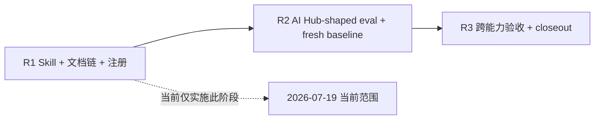

# Release Notes Generator 实施计划

## 1. 前置对齐

- 已批准需求：`docs/pm/agents/docs-agent/release-notes-generator/PRD.md`，由维护者已
  批准的 GitHub issue #116 蒸馏。
- 技术输入：本目录 `TRD.md`，版本 `0.2.0`，状态 `Approved`。
- Feature metadata：`agents/docs-agent/release-notes-generator`，父功能
  `agents/docs-agent`，层级 `3`。
- `change_tier: major`：新增 specialist、router/marketplace/lock 注册和 eval 行为，
  保留完整计划、验证和维护者确认门禁。
- issue #122 已合并的 docs authoring foundation 是 R2 AI Hub-shaped fixture 的基础，
  不是本 skill 的运行时依赖。
- 维护者已批准第 2 波方案并授权当前 R1 实施。本计划记录 R1-R3 总纲，但当前只实施
  R1；R2 与 R3 仍为未实施计划。

## 2. 目标与非目标

目标是把站内 Release Notes 从混合 release 能力中拆为 docs-agent 独立 specialist，
交付 issue #116 的七步协议、确认与检查双门禁、#120 ready handoff，并通过后续隔离
eval 证明在 AI Hub-shaped 宿主可用。

非目标：实现或操作 GitHub Release；创建或移动 tag；发布镜像、修改 Helm 或部署；
初始化宿主文档站；实现 #117 双阶段审计或版本盖章；实现 #121 多类型正式文档同步；
修改 AI Hub；修改既有 eval fixture。

## 3. 分阶段计划

| 阶段 | 范围 | 验证与完成门禁 | 当前状态 |
| --- | --- | --- | --- |
| R1 — Skill 实现与注册 | 建立 PRD/TRD/计划文档链；新增 `release-notes-generator/{SKILL.md,_internal/INSTRUCTIONS.md}`；在 docs-agent router、Agent README、根 README、AGENTS、marketplace 和 skills-lock 注册并更新计数；实现七步协议、确认门禁、宿主 checks 与 handoff 文案；补齐同名 skill 的 Codex 扁平安装过渡解析。 | 4 个仓库 checker 与 CI 同款 pytest 全通过；checker 已强制要求最小合法 eval 定义，其 R1 占位不修改既有 fixture、不执行模型 eval。 | 已完成并通过确定性验证。 |
| R2 — Eval 与 AI Hub-shaped 验收 | 基于 #122 资产新增隔离 eval workspace，覆盖成功、未确认、检查失败、缺站点、证据完整性和越权负向场景；完成 fresh with-skill 与同 prompt/fixture 的 fresh without-skill baseline，更新 durable `comparison.md`。 | eval contract/artifact checks、宿主 `npm run test:docs`、fresh judge 结论和 comparison 一致；不提交 transcript、verdict、timing 或 diagnostics。 | 未实施。 |
| R3 — 集成验收与 Closeout | 复核 #117 输入证据和 #120 ready handoff 的字段/时序兼容性；执行完整仓库与宿主回归，处理已确认 review 问题，汇总残余风险并请求 closeout/归档批准。 | 所有 required checks 通过；#120 能在缺少 ready handoff 时阻塞、在 ready handoff 时消费；维护者独立批准 closeout 后才更新完成态或归档。 | 未实施。 |



## 4. R1 文件级范围

### 4.1 新增

| 路径 | 目的 |
| --- | --- |
| `docs/pm/agents/docs-agent/release-notes-generator/PRD.md` | 保存已批准产品范围、决策与验收面。 |
| `docs/engineer/agents/docs-agent/release-notes-generator/TRD.md` | 保存七步技术协议、handoff、issue 边界与 eval 设计。 |
| `docs/engineer/agents/docs-agent/release-notes-generator/IMPLEMENTATION_PLAN.md` | 跟踪 R1-R3 阶段、门禁与事实状态。 |
| `agents/docs/skills/release-notes-generator/SKILL.md` | 声明 internal specialist 入口、边界和 feature-scope gate。 |
| `agents/docs/skills/release-notes-generator/_internal/INSTRUCTIONS.md` | 实现 issue #116 七步执行协议和 ready handoff。 |
| `agents/docs/test/release-notes-generator/evals/**` | `check_eval_contract.py` 强制要求的最小 R2 占位；只记录 NOT RUN，不伪造 fresh eval。 |

### 4.2 修改

| 路径 | 目的 |
| --- | --- |
| `agents/docs/skills/docs-agent/SKILL.md` | 新增站内 Release Notes 分流规则。 |
| `agents/docs/README.md` | specialist 3→4，并新增 skills 表行和路由说明。 |
| `README.md`、`README_zh.md` | docs-agent 总 skill 数从 `4 (1 + 3)` 更新为 `5 (1 + 4)`。 |
| `AGENTS.md` | docs-agent specialist 数 3→4、总数 32→33，并补齐列举式分流描述。 |
| `.claude-plugin/marketplace.json` | 为 docs-agent plugin 追加 `./skills/release-notes-generator`。 |
| `skills-lock.json` | 将同名键切换到 Docs specialist source/hash，并刷新 docs-agent router hash；不修改 PM skill 文件。 |
| `scripts/install_codex_skills.py` | 跨 plugin 同名时由 marketplace 后注册者选择 Codex 顶层链接，隐藏镜像保留全部源。 |
| `scripts/test_install_codex_skills.py` | 按唯一扁平目标核对安装结果，并断言同名 Release Notes 链接指向 Docs source。 |

新 skill 目录应先 `git add`，再使用仓库的 `compute_tracked_directory_hash` 计算
`computedHash`；router `SKILL.md` 修改后同轮刷新 `docs-agent` 条目。R1 不修改 PM 侧
旧 `release-notes-generator`，其迁移/下游变更不在本阶段范围。

## 5. R2 Eval 交付设计

R2 新增 `agents/docs/test/release-notes-generator/` 下自己的 eval 定义、隔离 workspace
和 durable `comparison.md`，不得改动任何既有 eval fixture。eval schema 使用共享
`1.0` 契约，每个 item 都有显式 `workspace/...` 和语义 assertions。

建议用例：

1. `eval-001-ai-hub-shaped-ready-handoff`：完整证据、确认、派生更新、
   `npm run test:docs` 成功和 ready handoff。
2. `eval-002-unconfirmed-zero-derived-writes`：未确认正文时索引、metadata、导航零变化。
3. `eval-003-docs-check-failure-not-ready`：检查失败时准确阻塞。
4. `eval-004-missing-site-bootstrap-handoff`：缺站点时不初始化并正确分流。
5. `eval-005-evidence-and-role-boundaries`：完整保留七类证据，且不操作 GitHub Release、
   tag、部署或 #117 盖章。

R2 实际执行模型 eval 时必须在同一轮重新生成 fresh without-skill baseline；任何 baseline
或 judge 失败都在 comparison 记录影响，不得复用历史结果或降级为静态 PASS。

## 6. R3 集成与收尾

- 使用 R2 已确认页面和 handoff 检查 #120 的入口字段：`release_version`、页面路径、
  `confirmation_status: confirmed`、检查命令/成功结果、更新的索引/元数据和来源证据。
- 确认 handoff 不冒充 #117 的 `ready_for_tag`/`release_verified`，页面初始版本锚仍为
  `unverified`。
- 复核缺少 handoff、未确认或检查失败三类下游阻塞路径。
- 执行完整仓库 checker、CI pytest 与隔离宿主检查，记录实际命令和结果。
- R3 完成后先提交 closeout 报告，等待维护者独立批准；不自动归档活动计划，不自动
  merge、tag 或发布。

## 7. 验证命令

R1 至 R3 的仓库确定性检查按以下顺序执行：

```bash
uv run scripts/check_repository_contract.py
uv run scripts/check_eval_contract.py
uv run scripts/check_eval_artifacts.py
uv run scripts/check_doc_contract.py
```

随后执行 `.github/workflows/ci.yml` 当前定义的同款 pytest 命令。R2/R3 另在隔离宿主
执行 `npm run test:docs`，并按仓库 Fresh Sub-Agent 门禁执行模型验证。所有结果必须
记录实际运行时命令、退出状态与必要测试数量，不能以计划值替代证据。

当前 R1 尚未完成验证时，本计划不预填 PASS、测试数量或 commit SHA。若 eval checker
因新 skill 缺少定义而失败，R1 只补最小合法占位结构，并在交付报告明确“R2 未执行、
无 fresh eval 结论”。

## 8. 风险与缓解

| 风险 | 缓解 |
| --- | --- |
| R1 注册完成但没有行为验收 | 明确 R1 只完成协议和注册；R2 fresh eval 是 issue 验收的独立必需阶段。 |
| 确认前误写版本派生面 | 协议和 eval 均断言 metadata/index/navigation 零变化。 |
| 宿主结构差异导致硬编码 AI Hub | 运行时先读宿主规范和相邻版本；AI Hub 只作为 fixture。 |
| R2 改动既有 fixture 造成回归污染 | 新增独立 test 目录，不修改既有 eval workspace。 |
| #120 将 ready 当成发布授权 | handoff 仅证明站内文档 ready；GitHub draft、发布、tag 与审计保留独立门禁。 |
| 未来阶段被误报为完成 | 阶段表和最终报告分别记录实际状态；未执行的 checks/eval 不写 PASS。 |

## 9. 当前实施状态

2026-07-19 当前只授权并实施 R1。文档链、skill、注册、lock hash、checker 强制的
最小 eval 占位和 Codex 安装兼容已落盘；最终确定性检查与 commit 结果由本轮交付报告
记录。R2 的完整 AI Hub-shaped fixture 与 fresh with/without validation、R3 的跨 #120
集成验收和 closeout 均未实施，也不存在相应 PASS 结论。

## 10. R1 实施结果

### 10.1 完成范围

- 已建立同路径 Approved PRD、Approved TRD 与 R1-R3 活动实施计划。
- 已新增 Docs `release-notes-generator` 的公开入口和七步内部协议，落实确认前派生
  surface 零写入、共享 frontmatter、宿主 checks 与 #120 ready 双条件门禁。
- 已更新 docs-agent router、Agent/根 README、AGENTS、marketplace、计数和两个 lock
  hash；新 skill 目录在 hash 计算前已先加入 Git index。
- `check_eval_contract.py` 首轮明确要求新 skill eval 后，已按 R1 授权新增最小合法
  R2 占位。durable `comparison.md` 记录 `NOT RUN`；未修改既有 fixture、未执行或伪造
  fresh eval。
- CI 首轮暴露 PM/Docs 同名 skill 的 Codex 扁平安装冲突后，已让跨 plugin 重名按
  marketplace 后注册者解析到 Docs source，并保持 mirror 中两套源均存在；同一
  plugin 内重复仍阻塞。

### 10.2 验证记录

| 命令 | 结果 |
| --- | --- |
| `git diff --check` | PASS |
| `uv run scripts/check_repository_contract.py` | PASS |
| `uv run scripts/check_eval_contract.py` | PASS，全部 eval 符合 schema 1.0 |
| `uv run scripts/check_eval_artifacts.py` | PASS，无被跟踪的运行期 eval 产物 |
| `uv run scripts/check_doc_contract.py` | PASS |
| `.github/workflows/ci.yml` 同款 pytest 命令 | PASS，126 tests |

### 10.3 未执行项、残余风险与下一所有者

- R2 模型 eval、fresh with-skill、fresh without-skill、完整 AI Hub-shaped fixture 和
  宿主 `npm run test:docs` 未执行，原因是均不在 R1 范围；其占位 comparison 不构成
  skill 可用性 PASS。
- R3 的 #117/#120 跨能力兼容验收与计划 closeout/归档未执行，下一所有者仍为 issue
  #116 R2/R3。
- 活动计划保持 `In Progress`，因为 R2/R3 尚未完成；R1 已完成但不把整个 issue 标记
  Implemented，也不请求归档。
