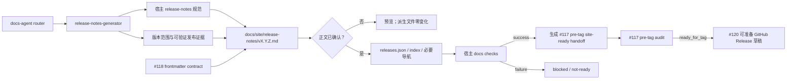

# Release Notes Generator TRD

## 1. 来源、范围与分级

本 TRD 将已批准的
`docs/pm/agents/docs-agent/release-notes-generator/PRD.md` 转换为可实施设计。PRD
由维护者已批准的 GitHub issue #116 蒸馏而来，issue #122 已合并的 bootstrap 资产
与脚手架为后续 AI Hub-shaped fixture 提供基础。

本 feature 新增 docs-agent specialist、router 分流、marketplace 注册和 eval 契约，按
仓库契约判定为 `change_tier: major`。R1 已交付 skill、注册与文档链；R2 已交付完整
eval fixture、fresh with/without validation、独立 judge、durable comparison、跨边界
自查和 PR 交付前验证。

## 2. 技术结构

实现分为三个责任面：

| 责任面 | 权威来源 | 行为 |
| --- | --- | --- |
| Marketplace 路由与协议 | `agents/docs/skills/release-notes-generator/**` | 执行 feature-scope gate、七步流程、确认门禁、检查和 handoff；不保存宿主业务事实。 |
| Codex 扁平安装兼容 | `scripts/install_codex_skills.py` | 跨 plugin 同名时按 marketplace 后注册者选择顶层链接，与 `skills-lock.json` 解析一致；隐藏镜像保留两套源，同一 plugin 内重复仍阻塞。 |
| 宿主文档层 | `docs/site/release-notes/**`、`docs/site/.meta/releases.json` 及宿主导航 | 保存目标版本页面和确认后的派生状态；具体格式以宿主规范和相邻版本为准。 |
| 下游交付 | #117 pre-tag handoff | 传递已确认、已校验的站内事实、维护者确认的 `target_release_version` 及确认来源；#120 保持为 `ready_for_tag` 后的 GitHub Release owner。 |

## 3. 入口与 Feature-scope Gate

`release-notes-generator` 是 `docs-agent` 的 internal specialist。默认由 router 在明确的
站内 Release Notes 请求上分流；显式直调仍需满足下游安全网：存在 PM handoff packet、
等效已确认文档链，或 issue #116 这类已由维护者批准、能确定目标版本和 release scope
的 specialist entry basis。

进入执行前必须确认：

- 宿主仓库路径与 `docs/site/release-notes/` 是否存在；缺失时零写入并 handoff
  `docs-site-bootstrap`，不自行初始化。
- `target_release_version` 与 release scope 已由维护者确认，并保留可追溯确认来源；不从
  分支名、目录名、Git ref 或未确认 tag 猜测版本。
- 可验证证据的来源、范围和冲突已列出；冲突事实必须阻塞并返回原 owner。
- 请求只涉及站内 Release Notes；GitHub Release、tag、部署或一般正式文档同步必须
  分流到对应 owner。

## 4. 输入证据模型

输入至少包含目标版本与已确认范围，并尽可能覆盖以下证据面：

| 证据面 | 示例来源 | 写作规则 |
| --- | --- | --- |
| 用户可见功能 | Approved PRD、完成的实施计划、代码与测试结果 | 只记录本版本已交付行为，不写未来目标。 |
| 架构与关键实现 | Confirmed TRD、ADR、实际 diff、集成测试 | 保留影响协作和维护的关键变化。 |
| 数据库与迁移 | schema/migration、回滚说明、验证结果 | 说明执行顺序、兼容性和数据风险；无证据不猜测。 |
| 部署、配置与环境 | DevOps 产物、Helm/manifest/env diff、部署验证 | 区分必需操作、默认变化和环境限制。 |
| 镜像、静态资源与资产 | 不可变版本、digest、构建或资产清单 | 记录可追溯标识，不执行发布动作。 |
| 升级、兼容性与风险 | runbook、回归/E2E、已知问题和回滚证据 | 保留操作步骤、兼容边界和未解决风险。 |

证据优先级遵循“当前代码/配置/迁移与实际验证是 ground truth，批准的产品和工程文档
定义预期”。二者冲突时不得自行选择一方，应报告冲突、owner 和补齐动作。页面必须
保存足够的来源追溯信息，handoff 再结构化列出实际使用的来源证据。

## 5. 七步执行协议

### 步骤 1：检测宿主并读取写作契约

检测 `docs/site/release-notes/`，读取该目录 `README.md` 或等效编写规范、相邻版本
页面、release index、`.meta/releases.json` 和必要的导航生成规则。不得假设所有宿主
都与 AI Hub 文件格式完全相同。目录不存在时停止并 handoff `docs-site-bootstrap`。

### 步骤 2：基于证据生成版本页面

规范化已确认版本为宿主采用的 `vX.Y.Z` 形式，目标路径为
`docs/site/release-notes/vX.Y.Z.md`。先建立证据到章节的映射，再生成正文；存在证据
的功能、架构、数据库、部署、资产、升级和风险内容不能为追求简洁而丢失。目标文件
已存在且用户未明确授权更新时必须阻塞，不能静默覆盖。

### 步骤 3：应用 #118 frontmatter

从 `agents/docs/skills/docs-agent/_internal/_shared/frontmatter-contract.md` 消费七字段
契约，不在本 skill 复制另一套值域。版本页面至少满足：

- `title` 为非空版本标题；
- `visibility` 取宿主规范允许的 `public`、`internal` 或 `both`；
- `doc_type: release`；
- `stage: release`；
- `owners` 与 `related_code` 都是非空字符串数组；
- `last_verified_version: unverified`，直到 issue #117 按其审计时序统一盖章。

宿主允许的附加字段可以保留，但不得削弱七字段契约。

### 步骤 4：展示正文并等待确认

展示完整页面正文、来源摘要、未覆盖证据面和风险，明确请求用户或维护者确认。确认必须
是针对当前正文的显式决定；正文发生实质变化后，旧确认失效。确认前不得更新
`.meta/releases.json`、Release Notes index 或导航。

### 步骤 5：确认后更新派生状态

仅当 `confirmation_status: confirmed` 时，按宿主现有 schema 更新
`.meta/releases.json`、Release Notes index 及必要导航。先计算完整 delta，保护未知
字段、人工内容和相邻版本条目，稳定去重并回读验证。若导航由脚本自动生成，则执行或
记录该宿主机制，不同时维护手写副本。

### 步骤 6：执行宿主 docs checks

读取宿主定义的检查命令并执行，记录命令、工作目录、退出结果和关键摘要。AI
Hub-shaped 宿主固定执行与其 Docs PR Check 一致的 `npm run test:docs`。检查失败时
报告失败证据并保持 `not-ready`；不得把局部检查或页面存在解释为成功。

### 步骤 7：输出 #117 pre-tag handoff

检查成功后输出第 6 节定义的结构化 handoff。只有目标版本获得维护者确认、正文确认和
检查成功三个条件同时成立时才能标记 `ready`；其他情况输出 blocked/not-ready、缺失
条件和下一 owner。

## 6. Handoff 契约

handoff 至少包含：

| 字段 | 要求 |
| --- | --- |
| `target_release_version` | 维护者明确确认的目标版本；不得从分支名、Git ref 或其他上下文推测。 |
| `target_release_version_confirmation` | `status: maintainer_confirmed` 与可追溯确认来源。 |
| `site_release_note_path` | 宿主仓库内目标页面路径。 |
| `confirmation_status` | 仅显式确认后为 `confirmed`；否则为未确认状态。 |
| `docs_checks` | 每条宿主检查的命令、工作目录、结果和必要摘要。 |
| `updated_release_surfaces` | 已更新的 `.meta/releases.json`、Release Notes index 与必要导航清单；未更新项说明原因。 |
| `source_evidence` | 正文实际使用的产品、工程、代码、测试、部署、资产、升级和风险证据。 |
| `handoff_status` | 仅目标版本有可追溯的维护者确认、正文 `confirmed` 且全部 docs checks 成功时为 `ready`。 |

该 handoff 直接提供给 #117 pre-tag audit，只证明站内 Release Notes ready，不授权
直接生成 GitHub Release 草稿。它也是 #120 的必要上游证据；只有 #117 返回
`ready_for_tag` 后，#120 才可继续预览或草稿。#120 的 compare、PR、贡献者收集和
最终发布批准不属于本 feature。handoff 不声明 tag 已存在，也不替代 #117 的
`ready_for_tag` 或 `release_verified` 结论。

## 7. 相邻 Issue 边界

| Issue | 权威职责 | 本 feature 的消费或边界 |
| --- | --- | --- |
| #118 | 定义正式页面七字段 frontmatter 及值域。 | 直接消费契约真源，生成 `doc_type: release`；不重新定义 schema。 |
| #117 | Pre-tag/Post-tag 文档审计与 `last_verified_version` 统一盖章。 | 直接提供已确认页面、索引、metadata、维护者确认的 `target_release_version` 及确认来源；必须等待其 `ready_for_tag` 后才允许 #120 准备草稿。 |
| #120 | 基于 ready handoff 生成 GitHub Release，并管理其独立批准门禁。 | 只输出 handoff；不收集 GitHub 专用信息，不创建、编辑或发布 GitHub Release。 |
| #121 | 多类型 `formal-docs-sync` 的范围确认、证据写作和 change-map 更新。 | Release Notes 独立处理；不接管 API/database/design/ops/product 正式文档同步。 |

## 8. 写入一致性与失败处理

- 步骤 4 前只允许目标页面草稿发生变化；所有派生 surface 必须保持原值。
- 步骤 5 以宿主事实为准计算最小 delta，任何解析或 schema 冲突都阻塞，不猜测修复。
- 写后逐文件回读，确认版本、路径、索引目标和 metadata 一致。
- 步骤 6 失败不回滚已经明确确认的正文和派生状态，但 handoff 必须为 not-ready，并
  精确报告失败；修复后重新执行完整宿主 checks 才能 ready。
- 不修改输入证据、过程文档、GitHub 状态、tag、镜像、Helm 或部署环境。

## 9. Eval 设计

Eval 使用 issue #122 已交付的 AI Hub-shaped bootstrap 资产建立隔离 fixture，不修改
既有 eval fixture。每个 eval 必须有显式 workspace 和 durable `comparison.md`，并
至少覆盖：

1. **完整成功路径**：七类证据可用，生成符合 #118 的页面；确认后更新三个派生
   surface，`npm run test:docs` 成功并输出 ready handoff。
2. **确认门禁**：正文未确认时，metadata、index、导航保持零变化且 handoff not-ready。
3. **检查失败**：正文已确认但 `test:docs` 失败，准确记录命令与结果，不输出 ready。
4. **缺少站点**：不创建 `docs/site/`，明确 handoff `docs-site-bootstrap`。
5. **证据完整性**：有证据的功能、架构、数据库、部署、资产、升级与风险内容没有被
   过度压缩；证据冲突时阻塞而非猜测。
6. **职责负向场景**：不操作 GitHub Release、tag、部署，也不代替 #117 盖章或 #121
   同步一般正式文档。

最终验证必须由 fresh Codex subagent 使用同一 prompt 和 fixture 先运行 with-skill，
再在不读取 skill/Agent README 的条件下生成新的 without-skill baseline，并根据
assertions 评审。实际运行同轮更新 durable `comparison.md`，运行期 transcript、verdict
和 diagnostics 不提交。

## 10. Codex 同名 Skill 过渡契约

issue #116 在 docs-agent 注册 `release-notes-generator` 时，issue #120 尚未把 PM 侧
旧能力重命名为 `github-release-generator`。Claude plugin 以 plugin namespace 区分两者，
但 Codex 安装器把 skill basename 暴露为扁平顶层目录，因此必须定义过渡解析：

- 隐藏镜像继续包含 PM 与 Docs 两个源目录，不删除或修改 PM skill；
- 顶层同名链接按 marketplace 顺序选择后注册的 Docs source，与 repository checker
  和 `skills-lock.json` 的同名键解析一致；
- 同一 plugin 内部的重复 basename 仍视为配置错误并阻塞；
- issue #120 完成 PM skill 重命名后，两套能力恢复为不同顶层名称，不再触发该解析。

安装器回归必须断言普通安装、routers-only、幂等、force、旧 symlink 迁移和 mirror
扫描均保持通过，并显式确认顶层 `release-notes-generator` 指向 Docs source。

## 11. 验证策略

| 验证面 | 方法 |
| --- | --- |
| 文档与注册契约 | 依序运行 4 个 `uv run scripts/check_*.py`。 |
| Python 回归 | 执行 `.github/workflows/ci.yml` 当前定义的同款 pytest 命令。 |
| 宿主集成 | 在隔离 AI Hub-shaped fixture 执行 `npm run test:docs`，验证 frontmatter、索引、metadata 与必要导航。 |
| 原子门禁 | 对未确认和检查失败场景比较派生 surface，确认未产生越权 ready 状态。 |
| Skill eval | fresh with-skill、fresh without-skill 和 durable comparison；不复用历史 baseline。 |

R2 的 fresh validation 在 `tmp/eval-runs/116/` 生成运行期证据，只把独立 judge 的结论
汇总到对应 durable `comparison.md`；运行期 transcript、candidate、verdict 和 diagnostics
不进入 git。

## 12. 风险、假设与开放问题

| 风险 / 假设 | 处理 |
| --- | --- |
| 宿主 release metadata 或导航结构与 AI Hub 不同 | 先读宿主规范和相邻版本，只按现有 schema 最小更新；无法解析即阻塞。 |
| 页面先写导致未确认事实被误用 | 确认前禁止派生更新，输出明确标注为待确认预览。 |
| 证据很多时被压缩成营销摘要 | 建立证据到章节映射，逐类核对保留研发、测试、运维与交付事实。 |
| `last_verified_version` 被提前写成目标版本 | 初始固定 `unverified`，只允许 #117 在完整审计后盖章。 |
| 页面与索引已确认但 docs checks 失败 | 保持 not-ready，记录失败命令；修复后重跑完整检查。 |
| 下游把 handoff 当成发布授权 | handoff 只证明站内页面 ready；#117 审计、tag 和 #120 发布各自保留独立门禁。 |
| PM 与 Docs 同名导致 Codex 安装器拒绝注册 | 过渡期按 marketplace 后注册者选择 Docs 顶层链接，mirror 保留 PM 源；由安装器测试锁定，#120 重命名后自然消除冲突。 |

当前无阻塞技术开放问题。若宿主没有明确的 release metadata/index schema，或目标版本
与 release scope 未获确认，运行时必须阻塞并请求维护者决定，不能由 skill 发明默认值。

## 13. 当前状态

本 TRD 与同路径 Approved PRD 已完成实施。3 个 specialist eval 和 docs-agent router
全部 4 个 eval 均使用本轮 fresh with-skill、fresh without-skill 与独立 judge 验证，
共 7/7 case、25/25 assertions PASS；AI Hub-shaped 成功路径真实执行
`npm run test:docs` 并返回 0。#117、#120、#121 的边界已在全面自查中复核，GitHub
Release、tag、统一盖章和一般正式文档同步仍由各自 owner 承担。

Issue #117 A2 将 site-ready handoff 改为直接面向 pre-tag audit 后，相关 3 个 specialist
eval 与 2 个 router eval 已重新生成 fresh with-skill / without-skill，并由独立 judge
评审为 5/5 case、18/18 assertions PASS；新的 handoff 明确携带维护者确认的
`target_release_version` 与确认来源，仍不授权 GitHub Release 或 tag 操作。
