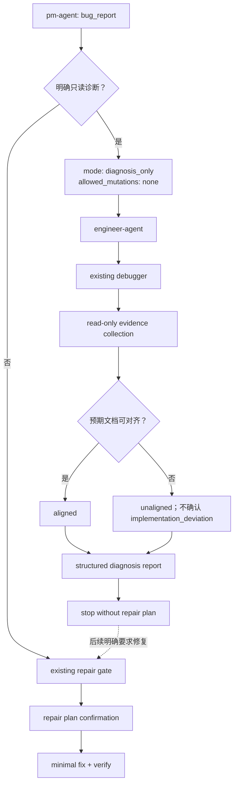

# debugger 只读诊断模式 TRD

## 1. 技术目标

在现有 `pm-agent → engineer-agent → debugger` 链路中增加轻量
`diagnosis_only` 模式，同时保留 `repair` 模式的完整门禁。实现只修改 Markdown skill
契约、路由文档、eval 数据和 PM 入口确定性测试，不新增生产运行时代码、配置、skill 或
抽象层。

成功条件：

- 明确的只读请求进入现有 `debugger`，handoff 携带零修改约束。
- 缺少 PRD/TRD 时仍能收集客观证据，但不确认实现偏差。
- 诊断报告后停止，不进入计划、实现或交付。
- 后续修复请求重新进入既有完整修复门禁。

## 2. 模式与 handoff 契约

### 2.1 `diagnosis_only`

PM 将明确的“只读确认、只诊断、不要修”分类为 `bug_report` 的只读子模式，并在
Engineer handoff 中附加：

```yaml
mode: diagnosis_only
allowed_mutations: none
required_output:
  - evidence_based_diagnosis_report
```

这些字段是 `diagnosis_only` 专属 supplemental fields，只在用户明确表达“只读、只诊断、
不要修”时出现；不改变 `idea-to-spec` `skill-map.md` 的通用 required fields 或
`request_type` 枚举。权威 `skill-map.md` 将其登记为条件性可选扩展，并定义预期未对齐时仍可
进行零修改 Engineer 调查的窄例外。模糊的“查一下”“为什么挂了”等普通诊断表达不能被
自动解释为零修改授权。`engineer-agent` 保留明确 handoff 中的字段并选择现有 `debugger`
作为唯一主 route。

### 2.2 `repair`

没有明确只读约束的修复请求，以及 `diagnosis_only` 完成后出现的修复请求，使用现有
`repair` 路径。此前诊断证据可以作为输入，但必须重新完成：

1. PM/Engineer handoff；
2. PRD/TRD/DECISIONS 预期对齐；
3. `implementation_deviation`、`requirement_change`、`missing_docs` 或 `trd_gap` 分类；
4. 复现和根因核证；
5. 根因与 tier-appropriate repair plan 同轮呈现；
6. 明确确认后才允许最小修复与验证。

## 3. 权限边界

| 操作 | `diagnosis_only` | `repair` |
| --- | --- | --- |
| 读取代码、文档、配置、日志 | 允许 | 允许 |
| 查询运行状态 | 允许 | 允许 |
| 只读数据库查询 | 允许 | 允许 |
| 不产生持久副作用的复现 | 允许 | 允许 |
| 可能写文件、缓存、数据库或外部状态的复现 | 禁止 | 完成门禁后按计划执行 |
| 修改源码、测试、E2E 或配置 | 禁止 | 计划确认后允许 |
| commit、push、PR | 禁止 | 交付阶段按授权执行 |
| 生成 repair plan | 禁止 | 根因确认后生成并等待确认 |

如果无法证明操作无副作用，`diagnosis_only` 按禁止处理，在报告中记录证据缺口，不增加
fallback、临时副本或自动恢复机制。

## 4. 预期对齐与结论模型

`diagnosis_only` 尝试读取可用 PRD、TRD、DECISIONS 和 API contract，但不把它们设为
调查前置门禁：

- 文档存在且一致：`expected_behavior_alignment: aligned`，可基于文档与代码证据判断
  是否存在实现偏差。
- 文档缺失、冲突或不足：`expected_behavior_alignment: unaligned`，只报告客观现象和
  可能根因，禁止输出已确认的 `implementation_deviation`。
- 低信任文档必须回代码、测试或运行证据核证；无法核证的内容放入未确认信息。

诊断报告结构：

```yaml
mode: diagnosis_only
allowed_mutations: none
expected_behavior_alignment: aligned | unaligned
observed_facts: []
direct_evidence: []
root_cause_assessment:
  conclusion: "..."
  confidence: high | medium | low
impact_scope: []
unknowns: []
minimum_next_step: "..."
```

输出可以使用等价的人类可读 Markdown，但语义字段必须齐全。报告完成即停止，不追加
“是否现在修复”的问题。

## 5. 双模式流程



## 6. 文件范围

| Path | Operation | Technical result |
| --- | --- | --- |
| `agents/product_manager/skills/pm-agent/SKILL.md` | Modify | 识别 `bug_report` 的只读子模式，传递 `mode` 与 `allowed_mutations`。 |
| `agents/product_manager/skills/idea-to-spec/_internal/_shared/skill-map.md` | Modify | 登记 diagnosis-only 可选扩展和未对齐只读 Engineer 路由，不改变通用必填字段。 |
| `agents/engineer/skills/engineer-agent/SKILL.md` | Modify | 将只读诊断路由到现有 `debugger`，保留零修改约束。 |
| `agents/engineer/skills/debugger/SKILL.md` | Modify | 增加双模式入口、只读调查流程、报告格式和 repair re-entry gate。 |
| `agents/product_manager/README.md`, `README_zh.md` | Modify | 同步 bug_report 只读子模式与 Engineer handoff。 |
| `agents/engineer/README.md`, `README_zh.md` | Modify | 同步 debugger 双模式与修复门禁不变。 |
| `skills-lock.json` | Modify | 刷新 `pm-agent`、`engineer-agent`、`debugger` 的 `computedHash`。 |

不修改 marketplace/plugin 注册，因为没有新增 skill，现有 Agent discovery 描述中的
bugs/debugging 已覆盖该能力。

## 7. Eval 设计

| Target | New eval | Expected behavior |
| --- | --- | --- |
| `product_manager/pm-agent` | `eval-020-route-read-only-diagnosis` | 分类为 `bug_report` 只读子模式，handoff Engineer 时包含 `mode: diagnosis_only`、`allowed_mutations: none`。 |
| `engineer/engineer-agent` | `eval-005-route-read-only-diagnosis` | 选择现有 `debugger`，不要求先补齐修复文档，也不创建新 specialist。 |
| `engineer/debugger` | `eval-006-diagnosis-only-without-product-docs` | 缺 PRD/TRD 时读取客观证据，输出 `unaligned` 结构化报告，保持零修改且不生成 repair plan。 |
| `engineer/debugger` | `eval-007-repair-after-diagnosis-reenters-gates` | 用户在诊断后要求修复时重新进入 PM/PRD/TRD/repair-plan 门禁，不沿用只读授权。 |

三项 SKILL.md 改变后，对应 skill 的全部 comparison 都会 stale。新增 eval 后 fresh 范围为：

- `pm-agent`：20 条；
- `engineer-agent`：5 条；
- `debugger`：7 条；
- 合计：32 条。

PR review 同步权威 handoff 契约后，`idea-to-spec` 的 9 条现有 eval 也需 fresh；这 9 条只
验证共享契约更新没有破坏既有 PM 文档编排行为，不新增 eval 定义。

模型 eval 使用一个 runner 进程、`jobs <= 10`。计划确认不包含模型执行授权；获得单独
授权后才可运行，durable `comparison.md` 只能由 runner 写入。

## 8. 验证策略

确定性验证：

```bash
uv run scripts/check_repository_contract.py
uv run scripts/check_doc_contract.py
uv run --with pytest pytest agents/product_manager/test/pm-agent/test_pm_entry_eval.py agents/test_eval_contract.py scripts/test_run_skill_eval.py scripts/test_eval_execution.py scripts/test_eval_persistence.py
uv run scripts/summarize_eval_results.py
git diff --check
git status --short
test ! -d tmp/eval-runs
```

## 9. 风险与控制

| Risk | Control |
| --- | --- |
| 只读复现隐含写入 | 无法证明无副作用时不执行，并记录证据缺口。 |
| 缺预期文档时误判缺陷 | 强制标记 `unaligned`，禁止确认 `implementation_deviation`。 |
| 诊断后直接修复 | 检查 repair re-entry gate，确认完整门禁重新生效。 |
| 变更扩散到注册或 eval 基础设施 | 文件范围和禁止区明确排除这些目录。 |
