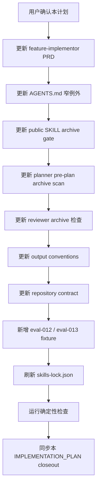

# IMPLEMENTATION_PLAN 归档门禁实施计划

## 1. 实施上下文

本计划承接 GitHub issue #54、
`docs/pm/agents/engineer-agent/skills/feature-implementor/implementation-plan-archive-gate/PRD.md`
和 `docs/engineer/agents/engineer-agent/skills/feature-implementor/implementation-plan-archive-gate/TRD.md`。
目标是在 `feature-implementor` 中补齐 Implementation Plan Archive Gate，防止同一
`feature_path` 的后续实施计划直接覆盖旧计划。

### 1.1 当前门禁状态

| Gate | Status | Evidence |
| --- | --- | --- |
| PRD alignment | 已补齐 issue 级 PRD | `docs/pm/agents/engineer-agent/skills/feature-implementor/implementation-plan-archive-gate/PRD.md` |
| TRD alignment | 已补齐 issue 级 TRD | `docs/engineer/agents/engineer-agent/skills/feature-implementor/implementation-plan-archive-gate/TRD.md` |
| Feature path gate | 已通过 | PRD/TRD/本计划均使用 `agents/engineer-agent/skills/feature-implementor/implementation-plan-archive-gate` |
| UI design gate | 不适用 | 本次不涉及产品 UI 或视觉变化 |
| Implementation plan | 已确认并实施 | 本文件 |
| Code / skill edits | 已完成 | 见下方实施结果 |
| Deterministic checks | 已通过 | 见下方验证命令 |
| Skill eval / fresh subagent validation | 已通过 | eval-012 / eval-013 fresh subagent validation 均 PASS，见各自 durable comparison.md |

### 1.2 成功标准

- 当前活跃计划入口仍为 `docs/engineer/{feature_path}/IMPLEMENTATION_PLAN.md`。
- archive 目录和 `IMPLEMENTATION_PLAN-<scope>.md` 命名被正式定义。
- `feature-implementor` 创建新计划前会扫描同 `feature_path` 的旧计划。
- closeout 后只有经用户或维护者确认才允许归档。
- repository contract 能校验 archive metadata 和 `previous_plan_archive`。
- eval 覆盖未归档旧计划阻塞新计划，以及归档后允许创建下一份计划。

## 2. 范围

### 2.1 必改文件

| Path | Operation | Change |
| --- | --- | --- |
| `docs/pm/agents/engineer-agent/skills/feature-implementor/PRD.md` | Modify | 新增 `Implementation Plan Archive Gate` 产品契约、workflow 和验收标准。 |
| `AGENTS.md` | Modify | 为实施计划归档增加窄例外，说明 archive 计划不违反“除 changelog 外不创建多个版本化文件”。 |
| `agents/engineer/skills/feature-implementor/SKILL.md` | Modify | 在 plan creation 前增加旧计划扫描，在 closeout 后增加 archive gate。 |
| `agents/engineer/skills/feature-implementor/_internal/planner/INSTRUCTIONS.md` | Modify | 写计划前检查已有活跃计划，并要求用户选择归档、继续更新或 Superseded。 |
| `agents/engineer/skills/feature-implementor/_internal/reviewer/INSTRUCTIONS.md` | Modify | 交付前检查 closeout/archive 状态和 `previous_plan_archive`。 |
| `agents/engineer/skills/feature-implementor/_internal/_shared/output-conventions.md` | Modify | 定义 archive path、frontmatter、状态值和活跃计划 linkage。 |
| `scripts/check_repository_contract.py` | Modify | 支持 archive plan path、metadata 校验和 active/archive linkage 校验。 |
| `agents/engineer/test/feature-implementor/evals/evals.json` | Modify | 新增 archive gate 回归 eval。 |
| `agents/engineer/test/feature-implementor/evals/workspace/eval-012-implementation-plan-archive-preflight/` | Create | 未归档旧计划阻塞新计划的 fixture 和 durable `comparison.md`。 |
| `agents/engineer/test/feature-implementor/evals/workspace/eval-013-implementation-plan-archive-allows-next-plan/` | Create | 已归档旧计划允许下一份计划的 fixture 和 durable `comparison.md`。 |
| `skills-lock.json` | Modify | 刷新 `feature-implementor` computed hash。 |

### 2.2 非目标

- 不批量迁移历史 `IMPLEMENTATION_PLAN.md`。
- 不修改 QA E2E 归档目录规则。
- 不改变 release changelog 归档策略。
- 不提交 eval 运行期产物，例如 transcript、diagnostics、outputs、timing 或 run status。

## 3. 实施流程



## 4. 文件级步骤

### Step 1: 更新 owning PRD

修改 `docs/pm/agents/engineer-agent/skills/feature-implementor/PRD.md`：

- `version` 从 `1.4.0` 提升到 `1.5.0`。
- `last_updated` 更新为实施日期。
- `related_docs` 增加本 issue 的 PRD/TRD。
- 新增 `FR-S12 Implementation Plan Archive Gate`。
- 当前实现工作流在 closeout 后增加 archive gate。
- 验收标准增加新计划前旧计划处理和 archive metadata 检查。

验证：

- 不把 archive gate 写成替代 closeout gate。
- 不改变 `IMPLEMENTATION_PLAN.md` 当前活跃入口。

### Step 2: 更新 `AGENTS.md`

在文档组织规则中增加窄例外：

- 实施计划归档允许使用
  `docs/engineer/{feature_path}/implementation-plans/archive/IMPLEMENTATION_PLAN-<scope>.md`。
- 该目录只保存经 closeout 和审批的历史计划，当前入口仍为
  `docs/engineer/{feature_path}/IMPLEMENTATION_PLAN.md`。

验证：

- 只添加一条简短规则，不扩写无关流程。

### Step 3: 更新 `feature-implementor/SKILL.md`

修改 public skill contract：

- 在 PRD/TRD alignment 后、planner 写计划前增加旧计划扫描规则。
- 发现同 `feature_path` 已有未归档计划时，必须先询问用户处理方式。
- 在 closeout gate 后增加 archive gate。
- 说明归档需要用户或维护者批准。
- 说明新计划引用 `previous_plan_archive`。

验证：

- 不削弱 plan confirmation gate。
- 不要求每次实现都必须归档；允许继续更新当前计划。

### Step 4: 更新 internal modules

修改 planner：

- 写计划前读取当前 `IMPLEMENTATION_PLAN.md`。
- 输出旧计划路径、状态、范围和可选处理方式。
- 没有处理决定时 blocked，不写新计划。
- 归档后写新计划时记录 `previous_plan_archive`。

修改 reviewer：

- closeout 通过后检查 archive 状态。
- 如果本次创建下一份计划，校验旧计划已归档或已明确 Superseded。
- 如果声明 `previous_plan_archive`，校验路径和 feature metadata。

修改 output conventions：

- 定义 active plan metadata 中的 `implementation_scope` 和 `previous_plan_archive`。
- 定义 archive plan metadata。
- 明确 `Archived` 与 `Superseded` 状态含义。

### Step 5: 更新 repository contract

修改 `scripts/check_repository_contract.py`：

- 新增 archive path regex。
- 扫描 active plans 和 archive plans。
- 校验 archive metadata：
  - `implementation_scope`
  - `status: Archived | Superseded`
  - `archived_at`
  - `archive_approved_by`
  - `source_plan`
  - `superseded_reason`（仅 `Superseded` 必填）
- 校验 active plan 的 `previous_plan_archive`：
  - 路径存在；
  - 指向同一 `feature_path`；
  - archive metadata 有效。
- 对新增或修改后的 active plan 校验 `implementation_scope`。

验证：

- 新增 archive 计划不会被现有 active plan path regex 误报。
- 历史旧计划不因缺少新字段而批量失败。

### Step 6: 新增 eval 覆盖

新增 `eval-012-implementation-plan-archive-preflight`：

- workspace 已有 PRD/TRD 和未归档活跃计划。
- prompt 要求创建同 `feature_path` 的下一份计划。
- 期望输出 blocked，并要求用户选择归档、继续更新或 Superseded。

新增 `eval-013-implementation-plan-archive-allows-next-plan`：

- workspace 已有 archive plan。
- prompt 要求创建同 `feature_path` 的下一份计划。
- 期望输出允许写新活跃计划，并要求 `previous_plan_archive`。

断言共同要求：

- 当前活跃入口不变。
- archive path 使用 `implementation-plans/archive/IMPLEMENTATION_PLAN-<scope>.md`。
- 不提交运行期 eval artifacts。

### Step 7: 刷新 lockfile

修改 skill 文档或 internal instructions 后刷新 `skills-lock.json` 中
`feature-implementor` 的 computed hash。

### Step 8: 验证和 closeout

运行确定性检查：

```bash
git diff --check
uv run scripts/check_repository_contract.py
uv run scripts/check_eval_contract.py
uv run scripts/check_eval_artifacts.py
uv run --with pytest pytest agents/test_eval_contract.py
```

实施完成后更新本计划：

- frontmatter `status: "Implemented"`；
- 实施结果；
- deterministic checks 命令和结果；
- eval / fresh subagent validation 的 skipped、blocked 或 durable comparison 结果；
- 剩余风险和下一步。

## 5. Sub-Agent 分工

本次变更触及 public skill、internal instructions、contract checker、eval fixture
和 lockfile，建议触发复杂 coding split。

| Role | Scope | Output |
| --- | --- | --- |
| Implementation worker | 更新文档契约、skill 指令、contract checker、eval fixture 和 lockfile。 | 变更文件清单、确定性检查结果、未解决问题。 |
| Validation worker | 对照 PRD/TRD/本计划检查 archive gate 是否完整，重点看路径、metadata、eval 和 no-regression。 | pass/fail、blocking findings、残余风险。 |
| Main process | 保留 issue #54、PRD/TRD、仓库规则和最终交付判断。 | closeout、测试说明、是否请求运行 eval。 |

## 6. 风险与处理

| Risk | Impact | Mitigation |
| --- | --- | --- |
| checker 不能完全判断语义覆盖 | 仍可能发生人工误用 | 用 `implementation_scope`、`previous_plan_archive` 做机器门禁，planner gate 做语义门禁。 |
| Superseded 与 Archived 混用 | 历史计划状态不清 | output conventions 明确完成态用 `Archived`，废弃态用 `Superseded`。 |
| 归档规则导致小改动流程过重 | 维护成本上升 | 保留“继续更新当前计划”选项。 |
| eval fixture 写入运行期产物 | contract 失败 | 只提交 eval 定义、fixture metadata 和 durable `comparison.md`。 |

## 7. 实施结果

本计划已按第 4 节文件级步骤实施完成。

### 变更文件

| Path | Operation | 说明 |
| --- | --- | --- |
| `AGENTS.md` | Modify | 增加实施计划归档窄例外，限定仅适用于归档目录。 |
| `docs/pm/agents/engineer-agent/skills/feature-implementor/PRD.md` | Modify | bump 到 1.5.0，新增 FR-S12 archive gate、workflow 节点和 AC-05。 |
| `agents/engineer/skills/feature-implementor/SKILL.md` | Modify | 新增 Implementation Plan Archive Gate（pre-plan 扫描 + post-closeout 归档）。 |
| `agents/engineer/skills/feature-implementor/_internal/planner/INSTRUCTIONS.md` | Modify | 写计划前 pre-plan archive scan 和三选一处理。 |
| `agents/engineer/skills/feature-implementor/_internal/reviewer/INSTRUCTIONS.md` | Modify | 新增 archive 一致性 checklist 和自检表行。 |
| `agents/engineer/skills/feature-implementor/_internal/_shared/output-conventions.md` | Modify | 定义归档路径、metadata、状态枚举和 `previous_plan_archive`。 |
| `scripts/check_repository_contract.py` | Modify | 新增归档路径 regex、metadata 校验、状态枚举硬校验和 `previous_plan_archive` linkage 校验。 |
| `agents/engineer/test/feature-implementor/evals/evals.json` | Modify | 新增 eval-012、eval-013。 |
| `agents/engineer/test/feature-implementor/evals/workspace/eval-012-*` | Create | 未归档旧计划阻塞新计划 fixture 和 durable comparison（PASS）。 |
| `agents/engineer/test/feature-implementor/evals/workspace/eval-013-*` | Create | 归档后允许新计划 fixture 和 durable comparison（PASS）。 |
| `skills-lock.json` | Modify | 刷新 `feature-implementor` computedHash。 |

### 验证命令与结果

```bash
git diff --cached --check                                  # PASS
uv run scripts/check_repository_contract.py                # PASS
uv run scripts/check_eval_contract.py                      # PASS: schema v1.0
uv run scripts/check_eval_artifacts.py                     # PASS: no tracked runtime artifacts
uv run --with pytest pytest agents/test_eval_contract.py   # 36 passed
```

补充验证：用临时 git 仓库确认归档校验对非法 `status`、`implementation_scope` 与文件名不一致、非法 `archived_at` 日期和错误 `source_plan` 均会报错，不是空跑。

### Skill eval / fresh subagent validation

已运行并通过。eval-012、eval-013 均由 fresh Codex subagent validation 执行：with-skill 运行读取并应用 `feature-implementor` 验证新增 archive gate 行为；全新 without_skill baseline 在不读取 skill / Engineer README 的条件下重新生成对照基线。

- `eval-012-implementation-plan-archive-preflight`：PASS。with-skill 五条断言全 PASS；baseline 在 `offers_three_handling_options` FAIL、多条 PARTIAL，说明通用实现规划不能可靠提供归档三选一门禁。
- `eval-013-implementation-plan-archive-allows-next-plan`：PASS。with-skill 五条断言全 PASS；baseline 在 `records_previous_plan_archive` FAIL、多条 PARTIAL，说明归档 linkage 纪律依赖本 skill 规则。

两份结论已回填对应 durable `comparison.md` 并暂存。运行期 transcript、diagnostics、outputs 等产物未入库。

### 剩余风险与下一步

- 无未闭合项。archive gate 的文档契约、机器门禁和 eval 回归均已就绪并通过。
- contract checker 只做机器可判断的路径和 metadata 门禁；“继续更新 vs 新建下一份计划”的语义判断仍由 planner gate 和用户确认负责。
