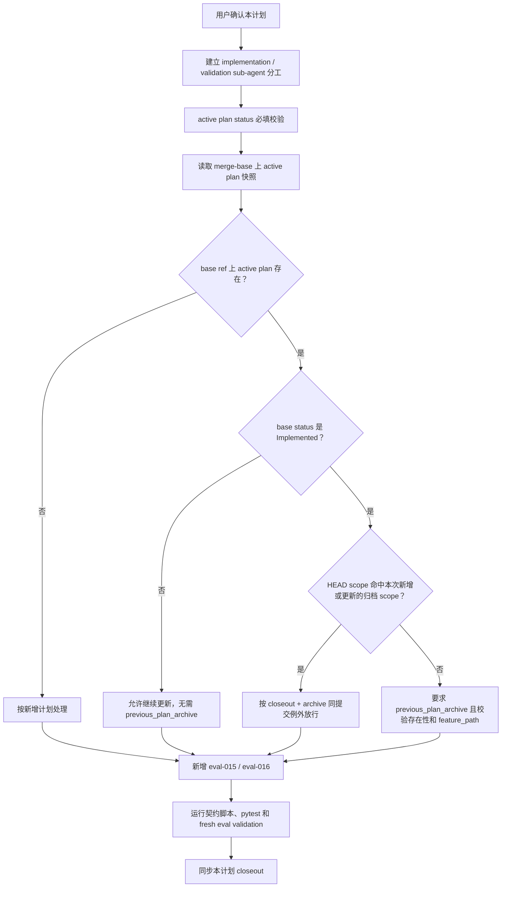

# IMPLEMENTATION_PLAN 归档门禁 status 触发修正实施计划

## 1. 实施上下文

本计划承接 GitHub issue
[#172](https://github.com/Neplich/dev-agent-skills/issues/172)、现有 PRD 的
FR-005 / US-002，以及 TRD `0.2.0` 的技术设计修正。产品意图保持不变：
同一 `feature_path` 的已完成实施计划不得被下一轮功能更新直接覆盖；本轮只修正
repository contract 的机器判断机制，使其覆盖“第一次归档前直接改写 active 计划”的缺口。

上一份已完成计划已归档到：

```text
docs/engineer/agents/engineer-agent/skills/feature-implementor/implementation-plan-archive-gate/implementation-plans/archive/IMPLEMENTATION_PLAN-implementation-plan-archive-gate.md
```

### 1.1 门禁状态

| Gate | Status | Evidence |
| --- | --- | --- |
| PRD alignment | 已确认，无需修改 | FR-005 / US-002 已覆盖不得直接覆盖已完成计划的产品意图。 |
| TRD alignment | 已更新，等待本计划确认 | TRD `0.2.0` 定义 base-ref `status` 分支、收口归档例外和校验范围。 |
| Feature path gate | 已通过 | PRD、TRD、本计划和上一份归档使用相同 `feature_path`。 |
| Previous plan archive | 已完成 | 本计划 frontmatter 的 `previous_plan_archive` 指向同一 `feature_path` 的归档文件。 |
| Implementation plan | 等待用户确认 | `status: "Pending Confirmation"`；确认前不实施。 |
| UI design gate | 不适用 | 本次不涉及产品 UI 或视觉变化。 |

### 1.2 成功标准

- 活跃 `IMPLEMENTATION_PLAN.md` 的 `status` 成为 repository contract 无条件必填字段。
- checker 以 merge-base 上 active 计划是否存在及其 `status` 为触发依据，不以 archive
  目录是否已有历史归档或 `implementation_scope` 是否变化作为触发依据。
- base ref 上不存在 active 计划时，按新增计划处理。
- base ref 上 `status` 非 `Implemented` 时，允许继续修订当前计划且无需
  `previous_plan_archive`，但必须正常 bump `version` 和 `last_updated`。
- base ref 上 `status` 为 `Implemented` 且本次修改 active 计划时，必须提供指向存在且
  `feature_path` 一致归档文件的 `previous_plan_archive`。
- 本次变更同时完成“标记完成 + 落地归档副本”时，若 HEAD 的
  `implementation_scope` 命中本次新增或更新的归档 scope，允许省略
  `previous_plan_archive`。
- 新增 eval 覆盖 base `Implemented` 缺回链被拦截，以及 base 非 `Implemented`
  继续更新被放行。

## 2. 实施范围

### 2.1 计划修改

| Path | Operation | Change |
| --- | --- | --- |
| `scripts/check_repository_contract.py` | Modify | 将 `status` 加入活跃计划必填 metadata；重写 `validate_active_plan_archive_linkage`，以 merge-base 快照中的 active 计划存在性和 `status` 执行分支判断，并保留同提交 closeout + archive 例外。 |
| `agents/engineer/test/feature-implementor/evals/evals.json` | Modify | 新增 `eval-015` 和 `eval-016` 的定义与语义断言。 |
| `agents/engineer/test/feature-implementor/evals/workspace/eval-015-*` | Create | 提供 base ref 已为 `Implemented`、修改 active 但缺少 `previous_plan_archive` 的 fixture 和 durable `comparison.md`。 |
| `agents/engineer/test/feature-implementor/evals/workspace/eval-016-*` | Create | 提供 base ref 非 `Implemented`、继续更新 active 且不声明 `previous_plan_archive` 的 fixture 和 durable `comparison.md`。 |
| `agents/engineer/skills/feature-implementor/_internal/_shared/output-conventions.md` | Review; modify only if required | 复核 active `status` 和 base-ref 判断的措辞；现有归档三选一、版本 bump 与回链规则已经对齐，除非发现与 TRD `0.2.0` 冲突，否则不修改。 |
| `agents/engineer/skills/feature-implementor/_internal/planner/INSTRUCTIONS.md` | Review; modify only if required | 复核 pre-plan archive scan；现有三选一门禁已经对齐，除非发现与新 contract 分支冲突，否则不修改。 |
| `agents/engineer/skills/feature-implementor/_internal/reviewer/INSTRUCTIONS.md` | Review; modify only if required | 复核 archive linkage checklist；除非发现与新 contract 分支冲突，否则不修改。 |
| `skills-lock.json` | Conditional Modify | 仅当 `agents/engineer/skills/feature-implementor/` 内的 skill 文档或 internal instructions 实际发生变更时，刷新 `feature-implementor` 的 `computedHash`。 |

### 2.2 非目标

- 不修改 PRD；FR-005 / US-002 的产品意图不变。
- 不使用 `implementation_scope` 是否变化作为触发条件。
- 不批量迁移或改写其他 feature 的历史实施计划。
- 不改变 archive 路径、归档状态枚举或用户三选一决策流程。
- 不提交 eval 运行期产物，例如 transcript、diagnostics、outputs、timing 或 run status。

## 3. 实施流程


```mermaid
flowchart TD
    Confirm["用户确认本计划"] --> Split["建立 implementation / validation sub-agent 分工"]
    Split --> Metadata["active plan status 必填校验"]
    Metadata --> BaseRef["读取 merge-base 上 active plan 快照"]
    BaseRef --> Exists{"base ref 上 active plan 存在？"}
    Exists -->|否| NewPlan["按新增计划处理"]
    Exists -->|是| BaseStatus{"base status 是 Implemented？"}
    BaseStatus -->|否| Continue["允许继续更新，无需 previous_plan_archive"]
    BaseStatus -->|是| Closeout{"HEAD scope 命中本次新增或更新的归档 scope？"}
    Closeout -->|是| ArchiveException["按 closeout + archive 同提交例外放行"]
    Closeout -->|否| Link["要求 previous_plan_archive 且校验存在性和 feature_path"]
    NewPlan --> Evals["新增 eval-015 / eval-016"]
    Continue --> Evals
    ArchiveException --> Evals
    Link --> Evals
    Evals --> Checks["运行契约脚本、pytest 和 fresh eval validation"]
    Checks --> CloseoutPlan["同步本计划 closeout"]
```

## 4. 文件级步骤

### Step 1: 增加 active plan `status` 必填校验

修改 `scripts/check_repository_contract.py` 的
`validate_implementation_plan_metadata`：

- 将 `status` 加入活跃计划 frontmatter 的无条件必填字段。
- 沿用当前 metadata 错误收集和报告方式，不引入额外状态枚举或无关迁移。
- 保持 archive metadata 校验逻辑不变。

验证：

- 缺少 `status` 的 active 计划被 repository contract 明确拦截。
- 仓库当前活跃计划均有 `status`，新增校验不造成无关批量失败。

### Step 2: 重写 active/archive linkage 判断

修改 `scripts/check_repository_contract.py` 的
`validate_active_plan_archive_linkage`：

1. 复用 `implementation_plan_base_ref(root)` 取得当前 HEAD 与
   `origin/main` / `main` 的 merge-base。
2. 通过 `content_at_ref(root, ref, rel)` 读取 base ref 上同一路径 active
   计划；返回 `None` 时按新增计划处理。
3. base 内容存在时，使用
   `parse_markdown_frontmatter(path, content, errors=None)` 只解析快照
   frontmatter，不把历史内容的解析问题写入当前错误列表。
4. base `status` 非 `Implemented` 时，允许继续修订或追加 active 计划，
   不要求 `previous_plan_archive`；现有版本契约继续要求正常 bump
   `version` 和 `last_updated`。
5. base `status` 为 `Implemented` 且本次修改 active 计划时，要求
   `previous_plan_archive` 指向存在且 `feature_path` 一致的 archive 文件。
6. 保留 closeout + archive 同提交例外：若 HEAD 的
   `implementation_scope` 命中本次变更中新增或更新的 archive scope，
   允许省略 `previous_plan_archive`。

明确不以 `implementation_scope` 是否变化或 archive 目录是否已有历史归档作为
触发条件；scope 只用于识别正确归档动作本身的例外。

验证：

- 第一次归档前直接改写 base `Implemented` active 计划会失败。
- base 非 `Implemented` 的同轮计划更新会通过。
- 已有历史 archive 但 base active 尚未完成时，不会误要求回链。
- closeout + archive 同提交仍可通过。
- 声明 `previous_plan_archive` 时，现有路径存在性与同 `feature_path`
  linkage 校验仍然生效。

### Step 3: 复核 skill 与 internal instructions

复核以下文件：

- `agents/engineer/skills/feature-implementor/_internal/_shared/output-conventions.md`
- `agents/engineer/skills/feature-implementor/_internal/planner/INSTRUCTIONS.md`
- `agents/engineer/skills/feature-implementor/_internal/reviewer/INSTRUCTIONS.md`
- `agents/engineer/skills/feature-implementor/SKILL.md`

当前文本已要求发现 active 计划且没有处理决定时停下并让用户选择归档、继续更新或
Superseded，也已约定继续更新时 bump 版本、归档后新计划写
`previous_plan_archive`。下一轮原则上不修改这些文件；只有发现其措辞与
`status` 必填或 base-ref 分支规则冲突时，才做最小修正并记录理由。

### Step 4: 新增 eval 定义、fixture 与 durable comparison

在 `agents/engineer/test/feature-implementor/evals/evals.json` 新增：

- `eval-015`：base ref 上 active `status: "Implemented"`，本次改动 active
  且缺少 `previous_plan_archive`；期望 repository contract 拦截。
- `eval-016`：base ref 上 active `status` 非 `Implemented`，本次继续更新
  active 且不声明 `previous_plan_archive`；期望 repository contract 放行。

为两个 eval 分别创建独立 workspace fixture 和 durable `comparison.md`。fixture
必须能构造 base ref 与 HEAD 差异，覆盖实际 checker 调用路径；不得把运行期产物提交到
fixture。

skill 行为或 eval fixture 变更后，先请求用户确认是否执行对应 skill eval。用户确认后：

- 由 fresh Codex subagent 基于同一 prompt 和 fixture 运行 with-skill。
- 不读取或应用 skill / Agent README，重新生成本轮新的 without_skill baseline。
- 基于 assertions、with-skill、without_skill 和上下文给出最终判断。
- 同一轮更新 `eval-015`、`eval-016` 的 durable `comparison.md`。
- baseline 无法生成或评审时，明确记录其对 Latest result 的影响，不复用历史 baseline。

### Step 5: 条件式刷新 `skills-lock.json`

确认 `skills-lock.json` 中 `feature-implementor` 的条目使用 `computedHash`
跟踪 `agents/engineer/skills/feature-implementor`：

- skill 目录没有实际变更时，不修改 lockfile。
- skill 文档或 internal instructions 因冲突需要最小修正时，使用仓库既有刷新流程更新
  `feature-implementor` 的 `computedHash`，并核对仅预期条目变化。

### Step 6: 验证和 closeout

按仓库要求运行四项契约脚本：

```bash
uv run scripts/check_repository_contract.py
uv run scripts/check_eval_contract.py
uv run scripts/check_eval_artifacts.py
uv run scripts/check_doc_contract.py
```

运行确定性 pytest：

```bash
uv run --with pytest pytest agents/test_eval_contract.py
```

同时运行 `git diff --check`，并根据实际变更补充 checker 的针对性回归验证。完成后更新
本计划：

- 将 `status` 更新为 `Implemented`；
- 记录实际变更文件和未修改文件的复核结论；
- 记录每条验证命令的 PASS / FAIL / BLOCKED；
- 记录 eval / fresh subagent validation 结果及 durable `comparison.md` 路径；
- 记录剩余风险和下一 owner；
- 按用户确认执行 closeout / archive gate。

## 5. Sub-Agent 分工

下一轮按复杂实现与验证分工执行：

| Role | Scope | Output |
| --- | --- | --- |
| Implementation sub-agent | 实现 `status` 必填校验和 base-ref linkage 分支，新增 eval 定义、fixture 和 comparison；仅在发现冲突时最小修改 skill instructions，并按条件刷新 lockfile。 | 变更文件、实现说明、验证结果和未解决问题。 |
| Validation sub-agent | 独立对照 issue #172、PRD、TRD `0.2.0` 和本计划审查分支行为、归档例外、fixture 覆盖与 no-regression。 | pass/fail、blocking findings、残余风险。 |
| Main process | 保留范围、用户确认、fresh eval gate、最终 closeout 与 Git 交付判断。 | 汇总结论和后续 handoff。 |

## 6. 风险与处理

| Risk | Impact | Mitigation |
| --- | --- | --- |
| base ref 无法解析或选择错误 | checker 可能漏报或误报 | 复用 `implementation_plan_base_ref`，为 base 文件不存在、状态分支和 merge-base 场景增加 fixture。 |
| 历史 active plan 的 `status` 缺失或不是 `Implemented` | 进入继续更新分支 | HEAD `status` 无条件必填；base 快照只解析不污染当前错误列表，并按“不是 `Implemented`”分支处理。 |
| closeout 归档动作被误判为覆盖 | 正确归档提交无法通过 | 保留 HEAD scope 命中本次新增或更新 archive scope 的窄例外。 |
| `implementation_scope` 被重新用作主触发条件 | 笼统 scope 可持续绕过门禁 | 测试明确以 base `status` 为主分支；scope 仅用于 closeout + archive 例外。 |
| eval 只验证文本、不经过真实 git 差异 | 无法覆盖 merge-base 缺口 | fixture 构造 base/HEAD 状态并调用真实 repository contract 路径。 |
| 不必要修改 skill 文档扩大范围 | 产生无关 hash 和行为漂移 | 先复核，只有发现与 TRD `0.2.0` 冲突时才最小修改并刷新 lockfile。 |

## 7. 待确认决策

本计划采用已确认的技术设计，不新增产品或架构决策。用户需要确认是否按上述范围进入下一轮实现；
在确认前不修改代码、eval fixture、eval 定义或 lockfile。

确认后加载 implementor 开始编码。
