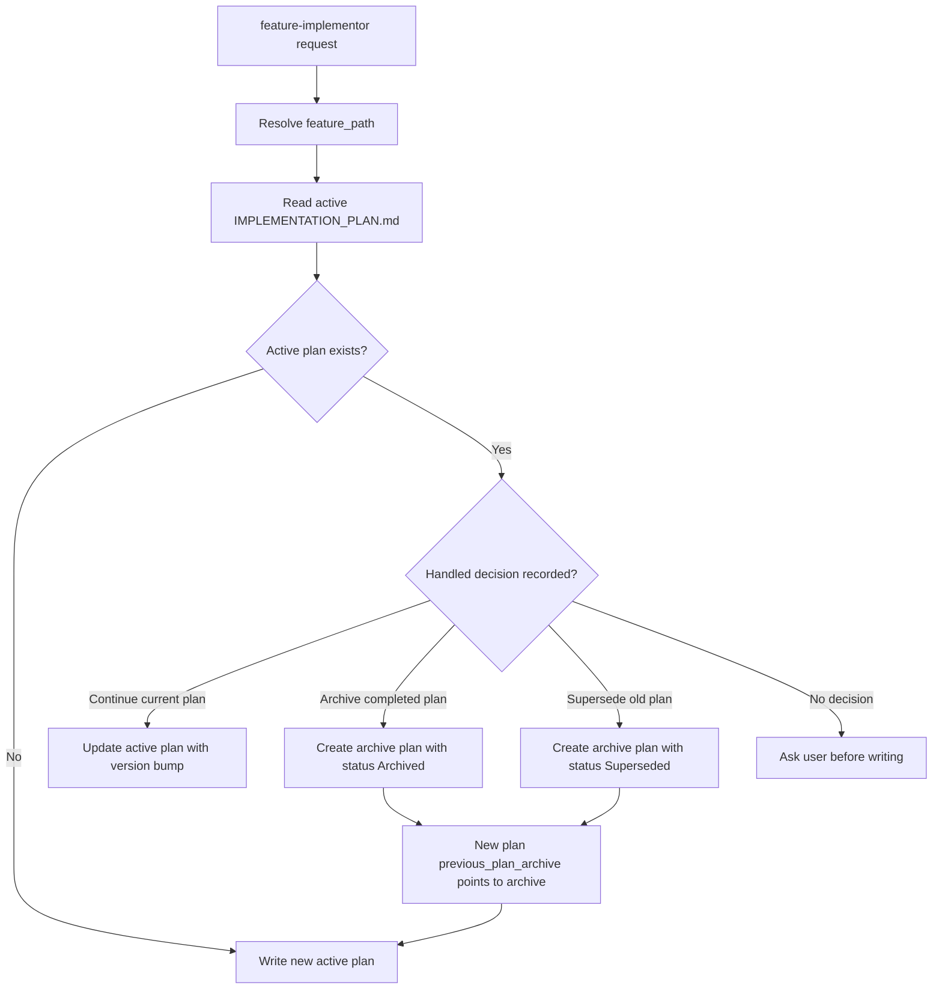

# IMPLEMENTATION_PLAN 归档门禁 TRD

## 1. 技术目标

为 `feature-implementor` 增加 Implementation Plan Archive Gate：

- 在创建同一 `feature_path` 的下一份活跃计划前，扫描并处理已有
  `docs/engineer/{feature_path}/IMPLEMENTATION_PLAN.md`。
- 将完成态或废弃态旧计划保存到
  `docs/engineer/{feature_path}/implementation-plans/archive/IMPLEMENTATION_PLAN-<scope>.md`。
- 保留当前活跃计划入口不变，并通过 `previous_plan_archive` 记录新旧计划关系。
- 扩展 repository contract 和 eval，避免计划被直接覆盖或归档 metadata 漂移。

## 2. 影响范围

| Area | File | Change |
| --- | --- | --- |
| Owning PRD | `docs/pm/agents/engineer-agent/skills/feature-implementor/PRD.md` | 增加 Implementation Plan Archive Gate 产品契约和工作流节点。 |
| Repository guidance | `AGENTS.md` | 为实施计划归档增加窄例外，避免与“除 changelog 外不创建多个版本化文件”冲突。 |
| Public skill contract | `agents/engineer/skills/feature-implementor/SKILL.md` | 在 plan creation 前增加旧计划扫描，在 closeout 后增加 archive gate。 |
| Planner module | `agents/engineer/skills/feature-implementor/_internal/planner/INSTRUCTIONS.md` | 写计划前检查同 `feature_path` 下是否存在未归档活跃计划。 |
| Reviewer module | `agents/engineer/skills/feature-implementor/_internal/reviewer/INSTRUCTIONS.md` | 交付前检查 closeout 与 archive 状态一致。 |
| Output conventions | `agents/engineer/skills/feature-implementor/_internal/_shared/output-conventions.md` | 定义归档路径、metadata、状态值和 `previous_plan_archive`。 |
| Repository contract | `scripts/check_repository_contract.py` | 识别归档路径，校验 active/archive plan metadata 和链接关系。 |
| Eval contract | `agents/engineer/test/feature-implementor/evals/evals.json` | 增加 archive gate 回归 eval。 |
| Eval fixtures | `agents/engineer/test/feature-implementor/evals/workspace/eval-012-*`, `eval-013-*` | 增加未归档阻塞和归档后允许新计划的 fixture 与 comparison。 |
| Skill lock | `skills-lock.json` | 刷新 `feature-implementor` computed hash。 |

## 3. 架构设计



核心设计是将“当前计划”和“历史计划”分层：

- 当前计划仍固定为 `docs/engineer/{feature_path}/IMPLEMENTATION_PLAN.md`。
- 历史计划只放在 `implementation-plans/archive/` 下。
- 新计划引用上一份归档计划，repository contract 校验引用关系。

## 4. 文件与 metadata 契约

### 4.1 活跃计划

活跃计划路径：

```text
docs/engineer/{feature_path}/IMPLEMENTATION_PLAN.md
```

新增或更新后的活跃计划 frontmatter 应包含：

```yaml
implementation_scope: "<lower-kebab-scope>"
previous_plan_archive: "docs/engineer/{feature_path}/implementation-plans/archive/IMPLEMENTATION_PLAN-<scope>.md"
```

规则：

- `implementation_scope` 描述当前计划范围，使用 lower kebab-case。
- `previous_plan_archive` 仅在同一 `feature_path` 存在上一份归档计划时必填。
- 如果用户选择继续更新当前计划，不写 `previous_plan_archive`，但必须正常 bump `version` 和 `last_updated`。

### 4.2 归档计划

归档计划路径：

```text
docs/engineer/{feature_path}/implementation-plans/archive/IMPLEMENTATION_PLAN-<scope>.md
```

完成态归档 frontmatter 必填字段：

```yaml
implementation_scope: "<lower-kebab-scope>"
status: "Archived"
archived_at: "YYYY-MM-DD"
archive_approved_by: "<user or maintainer>"
source_plan: "docs/engineer/{feature_path}/IMPLEMENTATION_PLAN.md"
```

废弃态归档 frontmatter 必填字段：

```yaml
implementation_scope: "<lower-kebab-scope>"
status: "Superseded"
archived_at: "YYYY-MM-DD"
archive_approved_by: "<user or maintainer>"
source_plan: "docs/engineer/{feature_path}/IMPLEMENTATION_PLAN.md"
superseded_reason: "<reason>"
```

归档文件必须保留原计划的 `feature_path`、`parent_feature` 和
`feature_level`，且必须与归档所在 `feature_path` 一致；还应保留原计划的
`feature`、`related_prd`、`related_trd`、`version`、`date`、`last_updated`
和 `author`，以便独立审查。

## 5. Repository Contract 设计

在 `scripts/check_repository_contract.py` 中新增：

| Component | Behavior |
| --- | --- |
| `IMPLEMENTATION_PLAN_ARCHIVE_RE` | 匹配 archive 目录和 `<scope>`。 |
| Archive metadata validator | 校验必填字段、日期、状态值、scope 与文件名一致、`source_plan` 指向活跃入口，以及必填的 `feature_path`、`parent_feature`、`feature_level` 与归档所在 `feature_path` 一致。 |
| Active plan linkage validator | 当活跃计划声明 `previous_plan_archive` 时，校验文件存在且 feature metadata 一致。 |
| Changed active plan guard | 对新增或明显替换的活跃计划，要求 `implementation_scope`；若声明上一份归档，则必须通过 linkage validator。当同 `feature_path` 已存在归档且变更计划未声明 `previous_plan_archive` 时，按 `implementation_scope` 区分：命中某个归档 scope 视为刚被归档的源计划（closeout 与归档同提交），不要求回链；未命中任何归档 scope 视为归档后的替换新计划，必须回链。 |
| Path allowlist | 允许 archive 目录下的 `IMPLEMENTATION_PLAN-<scope>.md`，避免被现有 active-plan path check 误报。 |

语义说明：

- checker 负责可机器判断的路径和 metadata 约束。
- 是否“继续更新当前计划”还是“创建下一份计划”仍由 planner gate 和用户确认判断。
- 对历史无 `implementation_scope` 的旧计划不做批量失败；当旧计划被触及时由新规则收口。

## 6. Skill 行为设计

### 6.1 Plan Creation 前置门禁

`feature-implementor` 在写计划前：

1. 解析 `feature_path`。
2. 检查 `docs/engineer/{feature_path}/IMPLEMENTATION_PLAN.md` 是否存在。
3. 如果不存在，正常创建新计划。
4. 如果存在，读取 frontmatter 和 closeout 状态。
5. 如果没有用户确认的处理方式，先询问：
   - 归档旧计划后创建新计划；
   - 继续更新旧计划；
   - 将旧计划归档为 `Superseded` 并记录原因。

### 6.2 Closeout 后归档门禁

实现完成并同步 closeout 后：

- 只有用户或维护者确认后才能归档。
- 归档动作必须保留 closeout 证据、验证命令、eval/skipped/blocked 记录和剩余风险。
- 归档后如果创建下一份活跃计划，新计划必须引用 `previous_plan_archive`。

### 6.3 Reviewer 检查

reviewer 在 handoff 或 delivery 前检查：

- 完成态计划是否已同步 closeout。
- 若本次创建了下一份计划，上一份计划是否已归档或明确继续更新。
- `previous_plan_archive` 是否存在且指向同一 `feature_path` 的 archive 文件。
- 归档状态是否只使用 `Archived` 或 `Superseded`。

## 7. Eval 设计

新增两个 eval：

| Eval | Scenario | Expected Behavior |
| --- | --- | --- |
| `eval-012-implementation-plan-archive-preflight` | 同一 `feature_path` 已存在未归档 `IMPLEMENTATION_PLAN.md`，用户要求创建新计划。 | skill 阻止直接覆盖，列出旧计划状态和三种处理选项。 |
| `eval-013-implementation-plan-archive-allows-next-plan` | 旧计划已 closeout 并归档，新请求创建下一份计划。 | skill 允许创建新活跃计划，并要求记录 `previous_plan_archive`。 |

每个 eval fixture 应包含：

- PRD / TRD；
- 活跃或归档计划；
- `comparison.md` durable 结果；
- 必要的 `eval_metadata.json`，但不提交运行期产物。

## 8. 验证策略

确定性检查：

```bash
git diff --check
uv run scripts/check_repository_contract.py
uv run scripts/check_eval_contract.py
uv run scripts/check_eval_artifacts.py
uv run --with pytest pytest agents/test_eval_contract.py
```

如果实际执行 feature-implementor eval 或 fresh Codex subagent validation，
必须在同一轮变更中更新对应 durable `comparison.md`。

## 9. 回滚策略

标准 git revert 可回滚文档、skill 指令、contract checker、eval fixture 和
`skills-lock.json`。回滚后：

- `IMPLEMENTATION_PLAN.md` 活跃入口仍存在；
- closeout gate 继续生效；
- archive 目录不再作为新计划前置门禁的一部分。

## 10. 开放技术问题

| # | Question | Owner | Resolution |
| --- | --- | --- | --- |
| 1 | `previous_plan_archive` 是否需要在所有新计划中出现，还是仅在存在上一份归档计划时出现？ | Maintainer | Proposed: 仅存在上一份归档计划时必填。 |
| 2 | 对没有 `implementation_scope` 的历史计划，contract checker 是否只在文件被修改时要求补齐？ | Maintainer | Proposed: yes，避免批量迁移。 |
