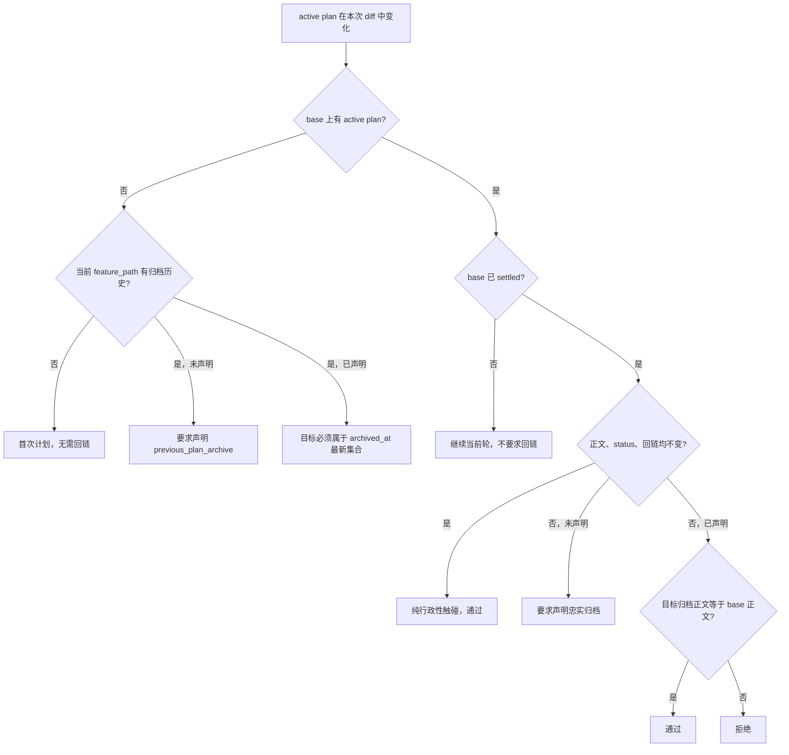

# IMPLEMENTATION_PLAN 归档回链统一内容比对模型实施计划

## 1. 实施上下文

本计划承接 GitHub issue
[#172](https://github.com/Neplich/dev-agent-skills/issues/172)、PR #179，以及现有
PRD 的 FR-005 / US-002。产品意图保持不变：同一 `feature_path` 的已收口实施计划
必须先被忠实归档，下一轮计划才能替换 active 正文。

本轮将此前依赖 changed scope、同提交归档、状态降级、scope 文件名和正文前缀等间接信号
的判断，替换为一套统一的内容比对模型。PRD、TRD、skill 和 internal instructions
不在本轮修改范围内。

## 2. 已确认技术设计

### 2.1 Settled

merge-base 上的 active plan 满足任一条件即视为已收口：

- base `status` 为 `Implemented`；
- 同一 `feature_path` 的任一合法 archive 文件，其 Markdown 正文与 base 正文完全一致。

归档文件何时创建或修改、文件名 scope 是否等于 active scope，均不参与 settled 判断。

### 2.2 Content unchanged

只有以下三项都与 base 完全一致，才视为纯行政性触碰：

- Markdown 正文；
- `status`；
- `previous_plan_archive`。

任何一项变化都会进入统一回链处理，避免状态降级或替换回链绕过。

### 2.3 回链处理

无 base 文件且已声明回链时只使用 `archived_at` 最新集合，不因归档文件在本次 diff 中被
创建或修改而开设捷径。同一天并列最新的归档均可作为合法目标。

## 3. 实施范围

| Path | Operation | Result |
| --- | --- | --- |
| `scripts/check_repository_contract.py` | Modify | 新增任意归档正文匹配检查；将 base round 简化为 `body`、`settled`、`content_unchanged`；统一有无回链的处理条件；删除 changed-scope、scope 匹配、状态降级和正文前缀等旧机制。 |
| `scripts/test_check_repository_contract.py` | Modify | 按 settled/content unchanged/latest archive 语义重梳回归测试，并使用两份真实回填归档正文验证历史数据。 |
| `agents/test_eval_contract.py` | Modify | 将 repository contract 集成测试从旧的 archived-scope 文案迁移到 settled-base 语义。 |
| 本文件 | Modify | 记录最终统一设计、验证结果和 closeout。 |

明确不修改：

- PRD、TRD；
- `feature-implementor/SKILL.md`；
- planner、implementor、reviewer、output conventions；
- eval 定义、fixture、durable `comparison.md`；
- `skills-lock.json`。

## 4. 实施步骤

1. 新增 `feature_path_any_archive_matches_body`，扫描同一 feature path 下的合法 archive
   文件，并用解析后的 Markdown 正文做严格等值比较。
2. 将 `ActivePlanBaseRound` 收敛为 `body`、`settled`、`content_unchanged`。
3. 让未声明回链和已声明回链分支共享相同的 settled/content unchanged 判断。
4. 删除无 base 文件分支中“本次改动过归档 scope 即放行”的捷径，只保留最新日期集合。
5. 删除不再使用的 changed archive scope、同提交 closeout、状态降级、scope 匹配和
   `body.startswith` 逻辑，并精简函数参数及调用点。
6. 重写和补充 pytest，运行仓库四项契约脚本、CI `python-tests` 实际清单和
   `git diff --check`。
7. 自审代码、测试语义、真实归档行为、性能和已知正文碰撞边界后交付。

## 5. 验证覆盖

pytest 覆盖以下行为：

- 无 base 文件时，首次计划、已有历史缺回链、较旧回链、最新回链、同提交最新回链和
  同日并列最新；
- 编辑较旧归档不能绕过最新回链要求；
- base `Implemented` 时，纯行政性触碰、回链替换、状态降级、正文替换、忠实回链和伪造
  回链；
- base 非 `Implemented` 时，普通续写、当前提交忠实归档、此前提交忠实归档、正文碰撞
  边界；
- `e2e-case-memory` 与
  `changelog-generator-docs-test-ci-semantics` 两份真实回填归档正文；
- base frontmatter 无效、archive 路径格式、feature path、文件存在性和空 archive。

## 6. 实施结果

### 6.1 代码与测试

- 核心逻辑已统一为 settled/content unchanged/content fidelity 三个事实判断。
- 不再依据归档是否在本次 diff 中变化，也不再比较 scope 文件名。
- `changed_engineer_docs` 仍由上层 metadata 校验用于识别 changed active plan，但已从
  archive linkage 函数和 base round 函数的参数中移除。
- 针对性 repository contract pytest：42 项通过。
- CI `python-tests` 实际文件清单：175 项通过。

### 6.2 Eval

本轮未修改 skill、eval 定义或 fixture，因此未执行或伪造 fresh eval：

| Eval | Durable latest result |
| --- | --- |
| eval-012 | PARTIAL |
| eval-013 | PASS |
| eval-015 | PARTIAL |
| eval-016 | PASS |
| eval-017 | PASS |

### 6.3 契约与格式

| Command | Result |
| --- | --- |
| `uv run scripts/check_repository_contract.py` | PASS |
| `uv run scripts/check_eval_contract.py` | PASS |
| `uv run scripts/check_eval_artifacts.py` | PASS |
| `uv run scripts/check_doc_contract.py` | PASS |
| CI `python-tests` 实际清单 | PASS，175 passed |
| `git diff --check` | PASS |

## 7. 自审结论

- 正文匹配扫描只在 changed active plan 的 base round 判断中执行；每个 feature path 只有
  一个 active 入口，归档数量为历史轮次数量，不存在重复递归扫描或明显性能问题。
- 非法文件、目录、无法读取或无法解析的 archive 不会被视为正文匹配。
- 已知边界是不同轮次正文完全相同会产生内容碰撞：只有 archive 与 base 正文相同才会把
  base 判为 settled；新正文仅与无关 archive 相同不会误判。前者可能造成保守误报，不能
  绕过忠实归档校验或指向其他 feature path。
- 未发现额外绕过或阻塞问题。
- 下一 owner 为 Engineer delivery：单次提交、普通 push、PR 评论并触发
  `@codex review`；不等待 review，不合并 PR。
