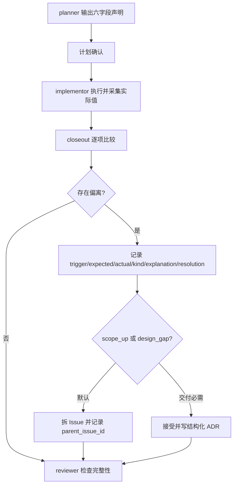

# 实施计划预期改动声明与收尾对账 TRD

## 1. 技术目标

在 `feature-implementor` 的现有计划与 closeout 流程之间建立同一组可追踪字段：
计划阶段声明预期值，实施阶段采集实际值，closeout 阶段逐项对账，reviewer
检查所有偏离是否已按统一格式解释和处置。

同时扩展 ADR schema，使形成实质技术决策的偏离具有可索引的 frontmatter，
但不改变普通 ADR 的必填要求。

## 2. 影响范围

| Area | File | Change |
| --- | --- | --- |
| Public contract | `agents/engineer/skills/feature-implementor/SKILL.md` | 在计划 checkpoint、渲染字段、reconcile 和 closeout 中加入预期声明与对账。 |
| Planning | `agents/engineer/skills/feature-implementor/_internal/planner/INSTRUCTIONS.md` | 增加六字段声明模板、常见预期值和 hotfix 简化规则。 |
| Closeout format | `agents/engineer/skills/feature-implementor/_internal/_shared/output-conventions.md` | 增加逐项比较、偏离记录、分类和默认处置。 |
| Review | `agents/engineer/skills/feature-implementor/_internal/reviewer/INSTRUCTIONS.md` | 检查对账完成且偏离字段完整。 |
| Evidence | `agents/engineer/skills/feature-implementor/_internal/implementor/INSTRUCTIONS.md` | 采集实际文件、依赖、配置、抽象层、行数和测试证据。 |
| ADR schema | `agents/product_manager/skills/idea-to-spec/_internal/_shared/doc-schemas/adr-schema.md` | 增加偏离驱动 ADR 的可选 frontmatter。 |
| Process docs | 本功能路径下的 PRD、TRD、IMPLEMENTATION_PLAN | 固化需求、技术设计和已批准实施范围。 |
| Skill lock | `skills-lock.json` | 刷新受影响 local Skill 的 `computedHash`。 |

## 3. 计划声明模型

计划模板使用以下六个稳定字段：

| Field | Type | Planning Rule |
| --- | --- | --- |
| `expected_files` | 数量级或文件列表 | 覆盖已确认范围内的所有直接变更与派生更新。 |
| `expected_new_dependencies` | 非负整数 | 常见值为 `0`。 |
| `expected_new_config` | 非负整数 | 常见值为 `0`。 |
| `expected_new_abstractions` | 非负整数 | 常见值为 `0`。 |
| `expected_loc_magnitude` | 区间描述 | 表达代码或契约净变更数量级，不要求精确行数。 |
| `expected_tests_vs_acceptance` | 关系描述 | 常见值为新增测试数与 PRD 验收点数相当。 |

六字段是 closeout 的对账基线和问询触发器，不是实现准入阈值。
hotfix 可以使用更短的声明形式，但仍需保留确认动作。

## 4. 实际值采集

implementor 在实施过程中保存以下证据：

- 实际变更文件集合与文件数量；
- 实际新增依赖数量；
- 实际新增配置项数量；
- 实际新增抽象层或基类数量；
- 实际代码或契约行数数量级；
- 实际新增测试与 PRD 验收点的覆盖关系。

证据进入现有 closeout，不新增日志层、事件钩子或独立数据文件。

## 5. Closeout 对账模型

closeout 对六个声明字段逐项比较。值一致时记录完成；值不一致时追加一条偏离记录：

| Field | Allowed Value or Meaning |
| --- | --- |
| `trigger` | 发生偏离的声明字段名。 |
| `expected` | 已确认计划中的原始值。 |
| `actual` | 实施后采集的实际值。 |
| `kind` | `scope_up`、`scope_down`、`estimate_wrong`、`design_gap`。 |
| `explanation` | 偏离原因和对当前交付范围的影响。 |
| `resolution` | `accepted`、`split_to_issue`、`reverted`。 |

`scope_up` 和 `design_gap` 默认使用 `split_to_issue`，新 Issue 记录
`parent_issue_id` 指回 #315 所代表的原始范围。仅当拆分会导致当前范围无法交付时，
才允许接受到当前范围，并记录必要性。

纯 `estimate_wrong` 表示实现内容未变，只是估算不准；它只在 closeout 留一行，
不生成 ADR。偏离不是缺陷，缺少解释和处置才是 reviewer 的阻断项。

## 6. ADR Frontmatter

ADR schema 增加以下可选字段：

```yaml
feature_path: <路径>
trigger: <偏离字段>
expected: <值>
actual: <值>
kind: scope_up | scope_down | estimate_wrong | design_gap
resolution: accepted | split_to_issue | reverted
spawned_issue: <Issue 号或 N/A>
```

普通 ADR 不要求这些字段。由被接受的 `scope_up`、新依赖、新抽象层或
`design_gap` 补全驱动的 ADR 必须填写全部新增字段。`spawned_issue` 在没有拆分时填
`N/A`。

## 7. 工作流



## 8. 文件级实施要求

1. `SKILL.md` 在 Mandatory Planning Checkpoint 第 5 条增加预期声明要求，
   checkpoint 渲染字段列出声明名称，并在 reconcile 与 Closeout 段要求对账。
2. planner instructions 在“预估文件数”附近加入六字段模板、默认值和 hotfix 说明。
3. output conventions 在 Implementation Plan Closeout 中加入比较、偏离格式、
   默认拆分、ADR 边界和“未经说明的偏离”规则。
4. reviewer instructions 增加一项对账完整性检查。
5. implementor instructions 在 closeout evidence 中增加实际值采集。
6. ADR schema 增加可选字段和偏离驱动 ADR 的条件必填说明。

## 9. 验证策略

```bash
uv run scripts/generate_shared_contracts.py --check
uv run scripts/check_repository_contract.py
uv run scripts/check_doc_contract.py
git diff --cached --check
```

验证同时检查：禁止区域无 diff、三份过程文档路径与 frontmatter 一致、
local Skill hash 已刷新。此次不新增测试文件。

## 10. 回滚

标准 git revert 可同时回滚六个契约源文件、三份过程文档和
`skills-lock.json`。回滚不需要数据迁移；旧计划仍按变更前规则 closeout。

## 11. 边界

- 不创建 ADR-INDEX 或 ADR 生成脚本。
- 不改 marketplace、plugin manifest、router SKILL.md 或 eval。
- 不新增依赖、配置、抽象、重试、缓存、开关、钩子、监控或日志层。
- 不改 hotfix 轻量计划形态，也不取消计划确认。
