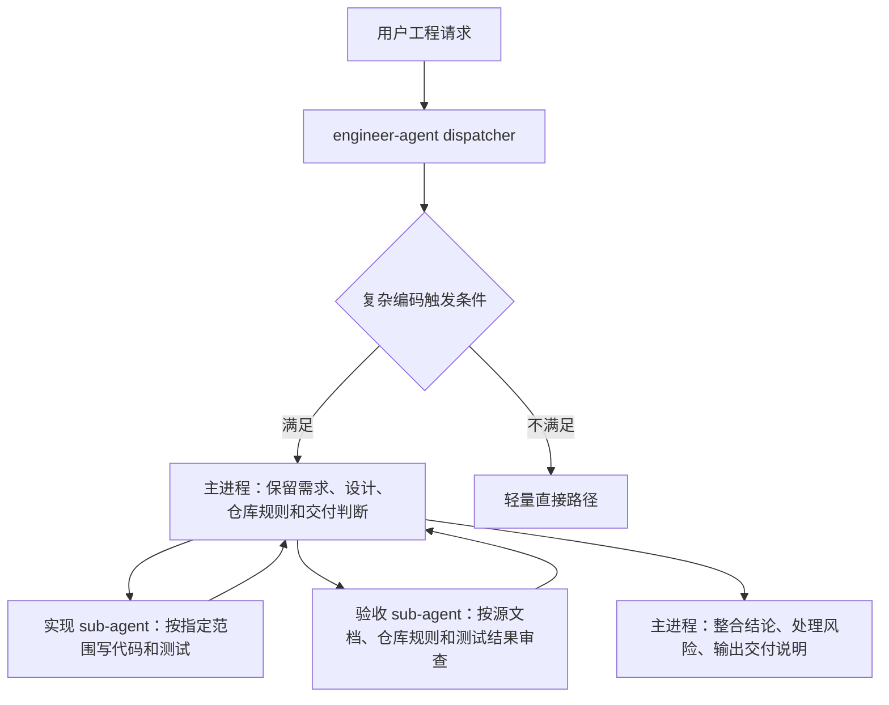
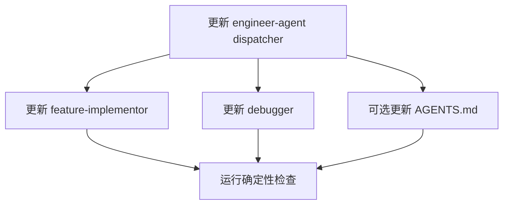
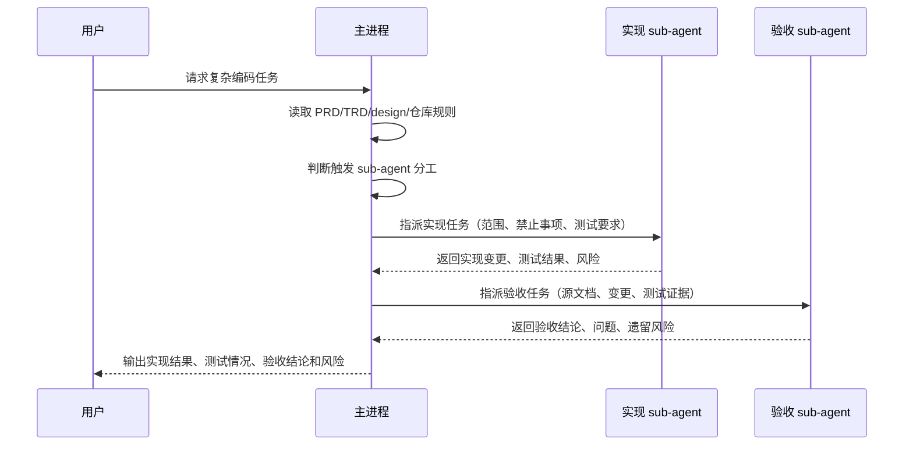

# Engineer Agent 编码阶段 sub-agent 分工实施文档

## 1. 概览

本实施文档承接 `docs/pm/agents/engineer-agent/subagent-division/PRD.md`，目标是在 Engineer Agent 的复杂编码路径中落地“主进程保留上下文、实现 sub-agent 编码、验收 sub-agent 审查”的协作模式。

第一版实施不新增公开 marketplace Agent，不改变现有 skill 目录结构，也不把所有工程任务强制拆分。MVP 重点覆盖 `engineer-agent` dispatcher、`feature-implementor` 和 `debugger` 三处指导。

## 2. 架构概览



| 组件 | 责任 | 主要变更 |
| --- | --- | --- |
| `engineer-agent` | 工程请求路由和工作流选择 | 增加复杂编码任务的 sub-agent 分工触发规则和非触发规则。 |
| `feature-implementor` | spec 驱动功能实现 | 在实现计划和执行阶段明确实现 sub-agent 委派契约，完成后触发独立验收。 |
| `debugger` | bug 复现、根因分析、最小修复和验证 | 对复杂 bug 修复增加实现与回归验收分工，保留复现优先原则。 |
| 仓库指导 | 跨角色协作边界 | 仅在确认需要时增加简短规则，不改变其他角色职责。 |

## 3. 技术栈与约束

| 层级 | 技术 / 文件 | 版本 | 理由 |
| --- | --- | --- | --- |
| Skill 文档 | Markdown `SKILL.md` | 当前仓库格式 | Agent 行为由公开 skill 文档和内部指令驱动。 |
| 校验脚本 | `uv run scripts/check_*.py` | 当前仓库脚本 | 仓库约定 Python 验证使用 `uv run`。 |

实施约束：

- 只修改 Engineer Agent 相关指导和必要文档。
- 不做无关重构，不整理现有 QA 工作区改动。

## 4. 文件变更计划

### 4.1 Feature Implementor 实现上下文

```text
Implementation context:
- Project: dev-agent-skills（多 Agent skill marketplace）
- Feature: engineer-agent-subagent-division
- Relevant docs:
  - docs/pm/agents/engineer-agent/subagent-division/PRD.md
  - docs/pm/agents/engineer-agent/subagent-division/DECISIONS.md
  - docs/engineer/agents/engineer-agent/subagent-division/TRD.md
- Existing modules affected:
  - agents/engineer/skills/engineer-agent/SKILL.md
  - agents/engineer/skills/feature-implementor/SKILL.md
  - agents/engineer/skills/debugger/SKILL.md
```

本轮实施计划由 `feature-implementor` 负责拆解到文件级步骤。进入编码前必须先由主进程确认计划；确认后再加载 implementor 执行，不在计划阶段直接改 skill 行为。

### 4.2 文件变更清单

| 路径 | 操作 | 内容 |
| --- | --- | --- |
| `agents/engineer/skills/engineer-agent/SKILL.md` | 修改 | 增加复杂编码任务 sub-agent 分工触发规则、非触发规则和路由说明。 |
| `agents/engineer/skills/feature-implementor/SKILL.md` | 修改 | 增加实现委派契约、主进程上下文保留要求、独立验收步骤和最终输出要求。 |
| `agents/engineer/skills/debugger/SKILL.md` | 修改 | 在复杂 bug 修复中加入实现 sub-agent 与验收 sub-agent 分工，同时保留复现、根因分析、最小修复顺序。 |
| `AGENTS.md` | 可选修改 | 仅当维护者确认该行为需要仓库级规则时，增加一句简短协作约束。 |

### 4.3 文件级实施顺序

1. **修改 `agents/engineer/skills/engineer-agent/SKILL.md`** — 增加 dispatcher 层复杂编码任务分工规则。（来自 PRD §5 FR-001、FR-002、FR-003）
   - 依赖：无。
   - 要点：在 Role Boundary 或 Common Multi-Skill Chains 附近补充主进程保留上下文、复杂任务分工、简单任务例外。
   - 验证：人工检查 dispatcher 仍然只负责路由，不承担 downstream skill 的完整协议。

2. **修改 `agents/engineer/skills/feature-implementor/SKILL.md`** — 增加 spec 驱动实现中的实现 sub-agent 与验收 sub-agent 流程。（来自 PRD §5 FR-003、FR-004、FR-005）
   - 依赖：步骤 1 的统一触发规则。
   - 要点：Phase 1 增加触发判断；Phase 2 增加实现委派契约；Phase 3 增加独立验收；Handoff 输出包含验收结论和遗留风险。
   - 验证：文档仍保持“先计划、确认后编码”的 feature-implementor 协议。

3. **修改 `agents/engineer/skills/debugger/SKILL.md`** — 增加复杂 bug 修复的分工路径。（来自 PRD §5 FR-001、FR-005）
   - 依赖：步骤 1 的统一触发规则。
   - 要点：不得破坏 `Reproduce -> Analyze -> Hypothesize -> Fix -> Verify` 顺序；只在根因确认后委派最小修复；测试后再做独立验收。
   - 验证：debugger 仍然要求先复现和根因分析，不允许直接猜修。

4. **可选修改 `AGENTS.md`** — 仅在维护者确认该行为需要仓库级协作规则时执行。（来自 PRD §5 FR-007）
   - 依赖：用户或维护者确认。
   - 要点：按 AGENTS 维护策略，优先扩展现有角色边界句子，不新增长段落。
   - 验证：不改变 PM、Designer、QA、DevOps、Security 角色边界。

### 4.4 依赖顺序



## 5. 行为设计

### 5.1 触发条件

满足以下任一条件时，Engineer Agent 应优先考虑 sub-agent 分工：

- 任务涉及多文件或多模块修改。
- 任务基于 `docs/pm/{feature}/PRD.md`、`docs/engineer/{feature}/TRD.md` 或 `docs/design/{feature}/...` 实施。
- 任务需要补充或更新测试，并用测试结果支持交付判断。
- bug 修复需要复现、根因分析、代码修复和回归验收。
- 主进程需要同时保留需求、设计、仓库规则、代码上下文和交付风险。

### 5.2 非触发条件

以下场景不强制拆分：

- 单文件小改。
- 纯解释、纯代码阅读、纯状态检查。
- 用户明确要求不要使用 sub-agent。
- 任务尚未进入编码阶段，只是在做 PM、设计或工程路由。

### 5.3 主进程职责

主进程必须保留并整合以下上下文：

- 用户目标和最新指令。
- PM / Design / Engineer 文档中的验收标准和约束。
- 仓库规则，例如最小修改、不能回退他人改动、不提交运行期产物。
- 实现 sub-agent 的输出和变更范围。
- 验收 sub-agent 的结论、问题和遗留风险。
- 最终交付说明，包括实现结果、测试情况、验收结论和风险。

### 5.4 实现 sub-agent 委派契约

实现 sub-agent 的任务描述必须包含：

| 字段 | 要求 |
| --- | --- |
| 写入范围 | 明确可修改的文件、目录或模块。 |
| 禁止事项 | 不得回退无关改动，不得修改未授权区域，不做额外重构。 |
| 输入文档 | 指明 PRD/TRD/design/spec 的相关路径和重点章节。 |
| 预期行为 | 说明需要实现的功能、测试或文档结果。 |
| 验证要求 | 说明需要运行或至少准备的确定性检查。 |
| 输出要求 | 列出变更文件、实现摘要、测试结果和未完成项。 |

### 5.5 验收 sub-agent 委派契约

验收 sub-agent 的任务描述必须包含：

| 字段 | 要求 |
| --- | --- |
| 验收依据 | PRD/TRD/design/spec、仓库规则、测试结果和变更文件。 |
| 检查范围 | 需求覆盖、测试覆盖、边界符合度、无关改动、运行期产物策略。 |
| 输出格式 | 按通过项、问题项、阻塞项、遗留风险输出。 |
| 限制 | 只做验收判断，不直接扩大实现范围。 |

## 6. 系统交互流程



## 7. 测试与验证策略

| 层级 | 范围 | 命令 / 方法 | 通过标准 |
| --- | --- | --- | --- |
| 仓库契约 | symlink、registry、skill frontmatter、非法产物 | `uv run scripts/check_repository_contract.py` | 无错误。 |
| Python 确定性测试 | 文档契约等确定性 pytest | `uv run pytest agents/test_doc_contract.py` | 与当前 CI 要求一致。 |

建议校验顺序：

```bash
uv run scripts/check_repository_contract.py
```

如修改了 Python 脚本或测试相关逻辑，再补充运行确定性 pytest。

## 8. 实施步骤

1. 更新 `engineer-agent/SKILL.md`。
   - 增加复杂编码任务触发规则。
   - 增加简单任务非触发规则。
   - 在完整工程链路中说明主进程保留上下文，必要时委派实现与验收。

2. 更新 `feature-implementor/SKILL.md`。
   - 在实现计划阶段加入“是否触发 sub-agent 分工”的判断。
   - 在实施阶段加入实现 sub-agent 委派契约。
   - 在自检之后加入独立验收 sub-agent。
   - 更新最终输出格式，包含验收结论和遗留风险。

3. 更新 `debugger/SKILL.md`。
   - 保留 `Reproduce -> Analyze -> Hypothesize -> Fix -> Verify` 顺序。
   - 对复杂 bug 修复，在根因确认后委派实现 sub-agent 做最小修复。
   - 修复和测试后委派验收 sub-agent 检查回归证据和边界风险。

4. 运行确定性检查。
   - 先运行 repository contract。
   - 按改动范围决定是否运行 pytest。

## 9. 回滚策略

| 回滚对象 | 回滚方式 |
| --- | --- |
| Skill 文档行为 | 回退对应 `SKILL.md` 中新增的 sub-agent 分工段落。 |
| 仓库指导 | 如果修改了 `AGENTS.md`，单独回退新增规则。 |

回滚后必须重新运行：

```bash
uv run scripts/check_repository_contract.py
```

## 10. 风险与技术债

| 风险 / 技术债 | 影响 | 缓解方式 | 时机 |
| --- | --- | --- | --- |
| 各 specialist skill 中的规则可能表述不一致。 | 中 | 使用同一组触发条件、委派契约和最终输出字段。 | Phase 1 |

## 11. 待确认技术问题

| # | 问题 | Owner | 截止点 |
| --- | --- | --- | --- |
| 2 | 是否需要同步修改 `AGENTS.md`，还是只改 Engineer skill 文档？ | Maintainer | 提交前 |

## 12. 交付验收清单

- [ ] `engineer-agent` 明确复杂编码任务的 sub-agent 分工规则。
- [ ] `feature-implementor` 明确实现委派、独立验收和最终输出要求。
- [ ] `debugger` 明确保留复现优先，同时支持复杂修复的实现与验收分工。
- [ ] `uv run scripts/check_repository_contract.py` 通过。
