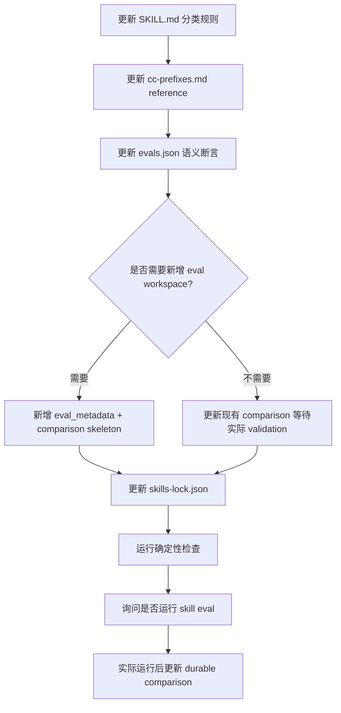

# changelog-generator docs/test/ci 语义判断实施计划

## 1. 实施上下文

本计划承接已更新的 PRD 和 Engineer TRD：

- PRD：`docs/pm/agents/pm-agent/skills/changelog-generator/PRD.md`
- TRD：`docs/engineer/agents/pm-agent/skills/changelog-generator/TRD.md`
- Issue：`https://github.com/Neplich/dev-agent-skills/issues/29`
- 功能：`skill-changelog-generator`
- 项目：`dev-agent-skills`，Markdown-first Agent skill marketplace

PRD 对齐结果：已覆盖。PRD `FR-S08`、`FR-S09`、`FR-S10` 已明确 docs/test/ci/build/style 前缀不再无条件跳过，并要求保留低价值维护变更省略能力。TRD 已定义实施范围和验证策略；当前计划不改变 PM scope 或 TRD 技术决策。

本计划确认后才进入具体实现。实现过程中只修改本计划列出的文件；如果发现 PRD/TRD 与现有文件结构冲突，应停止并回到 `engineer-agent:trd-gen` 对齐。

## 2. 实施目标

1. 将 `changelog-generator` 的跳过规则拆成硬跳过和语义判断两层。
2. 将 `docs:`、`test:`、`ci:`、`build:`、`style:` 从无条件跳过改为默认降权后读取 PR body / 上下文判断。
3. 保留 bot、依赖 bump、release chore、明确 internal scope 和低价值维护变更的省略能力。
4. 更新 eval，覆盖 skill marketplace 重要 docs/test/ci 变更应纳入 changelog，以及传统低价值维护 PR 仍可跳过。
5. 修改 skill 文档后同步 `skills-lock.json`，实际执行 eval 后再更新 durable `comparison.md`。

## 3. 文件变更清单

| 文件 | 操作 | 变更内容 | 来源 |
| --- | --- | --- | --- |
| `agents/product_manager/skills/changelog-generator/SKILL.md` | 修改 | 将 Step 3 的自动跳过规则拆为 hard skip 和 semantic review；更新 Step 4 prefix table；说明低价值前缀需读取 PR body / 可得上下文。 | PRD FR-S08、FR-S09、FR-S10；TRD §5 |
| `agents/product_manager/skills/changelog-generator/references/cc-prefixes.md` | 修改 | 将 `docs`、`ci`、`test/tests`、`build`、`style` 从 `Skip` 改为 conditional review；新增语义纳入和低价值省略信号。 | PRD FR-S08、FR-S09；TRD §5 |
| `agents/product_manager/test/changelog-generator/evals/evals.json` | 修改 | 更新 `eval-003-prefix-classification` 或新增语义判断 eval；覆盖 docs/test/ci 对 skill behavior、eval evidence、release workflow、installation/collaboration 的纳入判断；保留低价值跳过样例。 | PRD AC-04、AC-05；TRD §8 |
| `agents/product_manager/test/changelog-generator/evals/workspace/eval-003-prefix-classification/comparison.md` | 条件修改 | 只有实际运行 changelog-generator eval 或 fresh Codex subagent validation 后，才更新 latest result、with-skill behavior、failures、next steps 和 runtime artifact policy。 | 仓库 Eval 产物策略；TRD §8 |
| `agents/product_manager/test/changelog-generator/evals/workspace/<new-eval>/comparison.md` | 条件新增 | 如果新增 eval，则创建对应 workspace 和 durable `comparison.md`；实际 validation 后写入最新结论。 | 仓库 Eval 产物策略 |
| `agents/product_manager/test/changelog-generator/evals/workspace/<new-eval>/eval_metadata.json` | 条件新增 | 仅当新增 eval workspace 时添加 metadata；不得声明运行期 transcript/verdict 产物。 | 仓库 Eval 定义契约 |
| `skills-lock.json` | 修改 | `changelog-generator` skill 文档或 reference 变更后更新对应 `computedHash`。 | 仓库契约 |

## 4. 实施顺序



### Step 1：更新 `SKILL.md`

修改位置：

- Step 3：保留 hard skip，只包含 bot、deps bump、release chore、明确 internal scope。
- Step 4：将 `docs:`、`ci:`、`test:`、`build:`、`style:` 从 `Skip` 改为 `Review body/context`。
- 新增一段低价值前缀语义判断规则：
  - 命中 skill behavior、routing、handoff、gate、eval、durable comparison、installation、marketplace、release workflow、CI gate 或协作边界时纳入 changelog。
  - 仅拼写、排版、测试重命名、CI 缓存/runner 维护且无用户可见影响时跳过。

验证：

- `rg -n "Title prefix is .*docs|docs.*Skip|ci.*Skip|test.*Skip" agents/product_manager/skills/changelog-generator/SKILL.md` 不应再显示低价值前缀的无条件跳过规则。
- `SKILL.md` 仍保留 bot / deps / release chore / internal scope 的明确跳过规则。

### Step 2：更新 `cc-prefixes.md`

修改 prefix table：

- `docs`、`ci`、`test/tests`、`build`、`style` 标为 conditional review。
- `chore` 和 `wip` 仍默认 skip。
- `chore(deps)`、`chore(release)`、`build(deps)`、`Bump X from Y to Z` 继续 hard skip。

新增或扩展章节：

- Docs/Test/CI semantic review signals
- Low-value omission signals
- Empty body / unavailable changed files fallback

验证：

- reference 与 PRD “语义纳入信号”和“低价值省略信号”一致。
- 不引入与 `SKILL.md` 冲突的分类规则。

### Step 3：更新 changelog-generator eval

优先方案：扩展 `eval-003-prefix-classification`，因为它已经覆盖 prefix 分类。

更新内容：

- 将 prompt 从纯标题列表扩展为带 PR title + body 的样例。
- 增加应纳入样例：
  - `docs:` 描述 release workflow / changelog preflight 变化；
  - `test:` 描述 eval fixture / durable comparison 契约变化；
  - `ci:` 描述 required gate 或 release workflow 变化。
- 保留应跳过样例：
  - `docs:` typo / formatting-only；
  - `test:` mock rename 或 fixture cleanup，无契约变化；
  - `ci:` cache / runner maintenance，无 gate 变化。
- 更新 expected output 和 assertions，避免继续断言 `docs` / `ci` 一律跳过。

备选方案：新增 `eval-004-semantic-low-value-prefixes`。只有当扩展 `eval-003` 会让用例过长或语义混杂时采用。

验证：

- `evals.json` 保持 schema version `1.0`。
- 新 assertion `id` 使用 lower snake_case。
- 不引用 runtime artifact，例如 `transcript.md`、`run_status.json`、`comparison.auto.md`。

### Step 4：更新 eval workspace 和 durable comparison

如果只修改 `eval-003`：

- 更新 `agents/product_manager/test/changelog-generator/evals/workspace/eval-003-prefix-classification/comparison.md` 的 Test Set、Assertions、With Skill、Next Steps。
- 只有实际执行 skill eval 或 fresh Codex subagent validation 后，才能把 Latest result 写成新的 PASS 结论。

如果新增 `eval-004`：

- 新增 `agents/product_manager/test/changelog-generator/evals/workspace/eval-004-semantic-low-value-prefixes/eval_metadata.json`。
- 新增 `agents/product_manager/test/changelog-generator/evals/workspace/eval-004-semantic-low-value-prefixes/comparison.md`。
- 不提交运行期 transcript、outputs、diagnostics 或 subagent verdict。

验证：

- `uv run scripts/check_eval_contract.py`
- `uv run scripts/check_eval_artifacts.py`

### Step 5：同步 `skills-lock.json`

修改 `SKILL.md` 或 `references/cc-prefixes.md` 后，更新 `skills-lock.json` 中 `changelog-generator` 的 `computedHash`。

验证：

- `uv run scripts/check_repository_contract.py`

### Step 6：运行确定性检查

提交前运行：

```bash
uv run scripts/check_repository_contract.py
uv run scripts/check_eval_contract.py
uv run scripts/check_eval_artifacts.py
uv run --with pytest pytest agents/test_eval_contract.py
```

如果修改了 product manager eval runner 或相关测试，再补充：

```bash
uv run --with pytest pytest agents/product_manager/test/idea-to-spec/test_pm_run_eval.py
```

当前计划不修改 runner，因此第二条只作为条件检查。

### Step 7：询问并执行 changelog-generator eval

由于本计划会修改 skill 文档、reference 或 eval 定义，完成实现后必须主动询问是否运行对应 skill eval。

用户确认后执行：

- 模型 transcript 生成/检查，若当前 runner 支持；
- fresh Codex subagent validation；
- 按实际结果更新对应 durable `comparison.md`。

用户暂不运行时：

- 不把 `comparison.md` 更新为新的 PASS 结论；
- 最终汇总中明确模型 eval / fresh validation 未执行。

## 5. Sub-Agent 分工判断

本次实现涉及 skill 文档、reference、eval 定义和 durable comparison，属于多文件但单 skill 范围。实际编码阶段可以不拆 implementation sub-agent；主进程按顺序执行即可。

验证阶段建议在用户确认运行模型 eval 时使用 fresh Codex subagent validation，因为仓库 eval runner 约束要求最终可用性判断来自全新 Codex subagent。

| 分工 | 判断 | 理由 |
| --- | --- | --- |
| Implementation sub-agent | 默认不启用 | 写入范围单一，主进程能保持 PRD/TRD 和 eval 上下文一致。 |
| Validation sub-agent | eval 阶段启用 | 实际执行 skill eval 或 fresh Codex subagent validation 后，才能更新 durable comparison。 |

## 6. 不纳入本轮的事项

- 不修改 `release-notes-generator`。
- 不新增 GitHub Release workflow 或 CI workflow。
- 不修改已发布 changelog 内容，除非用户另外要求生成 release changelog。
- 不提交 runtime eval artifacts。
- 不自动创建 PR、commit 或 push。

## 7. 风险与处理

| 风险 | 处理 |
| --- | --- |
| 过度纳入 docs/test/ci 导致 changelog 噪音增加。 | eval 同时覆盖低价值维护跳过样例；SKILL 和 reference 均保留 low-value omission。 |
| 继续沿用标题前缀一刀切导致 issue #29 未修复。 | 删除 `docs/ci/test/build/style` 的无条件跳过表述，并用 semantic review 断言覆盖。 |
| comparison 与实际 eval 结果不一致。 | 只有实际运行 skill eval 或 fresh validation 后才更新 PASS 结论。 |
| `skills-lock.json` hash 遗漏。 | skill 文档和 reference 改完后运行 repository contract，以失败项驱动修正。 |
| body 缺失时分类不稳定。 | 按 PRD/TRD 记录 fallback：低价值前缀默认跳过，除非标题明确表达用户可见影响。 |

## 8. 确认后执行条件

本计划确认后，进入实现阶段。实现阶段按 Step 1 到 Step 7 顺序执行，每次修改已有文件前先读取文件内容，并保持最小改动。

如果实现过程中发现需要改变 PRD 的产品范围，立即停止并回到 `pm-agent:idea-to-spec`。如果发现 TRD 缺少必要技术决策，立即停止并回到 `engineer-agent:trd-gen`。
