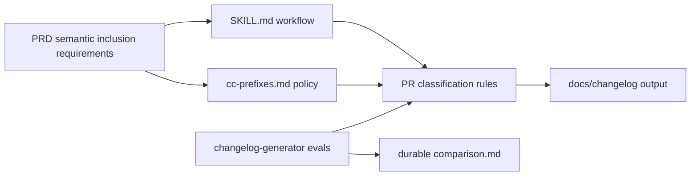
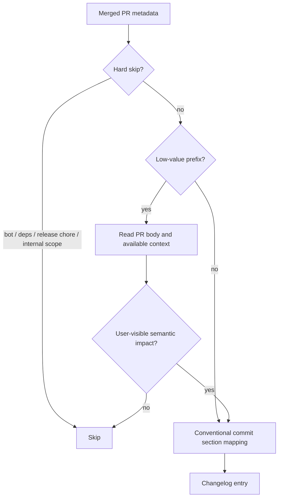

# changelog-generator docs/test/ci 语义判断 TRD

## 1. Source Context

本 TRD 承接 issue #29 和 `changelog-generator` PRD。PM scope 已确认：
`docs:`、`test:`、`ci:`、`build:` 和 `style:` 这类低价值前缀不能继续被无条件跳过；
在 docs-first / skill marketplace 仓库中，PR body 或上下文显示其影响 skill 行为、
routing、eval fixture、durable comparison、installation、marketplace、release workflow、
CI gate 或协作边界时，应进入 changelog。低价值内部维护变更仍可省略。

## 2. Technical Overview

实现方向是在 `changelog-generator` 的文档契约、prefix reference 和 eval 中引入
“硬跳过 + 降权语义判断”的两层分类策略。现有 GitHub CLI 查询已拉取 PR body，
因此不需要新增外部 API；主要工作是调整决策规则和测试语义断言。

## 3. Requirement Traceability

| PRD Requirement | Technical Component | Design Response |
| --- | --- | --- |
| FR-S08 Semantic Inclusion | `SKILL.md`, `cc-prefixes.md`, evals | Replace unconditional low-value prefix skipping with body/context semantic review. |
| FR-S09 Low-Value Omission | `SKILL.md`, evals | Preserve skip rules for formatting-only docs, internal test maintenance, internal CI maintenance, dependency bumps, release chores, and bot PRs. |
| FR-S10 Repository Context Awareness | `SKILL.md`, evals | Make skill marketplace / docs-first signals explicit and verify them with representative PR fixtures. |
| AC-04 | eval fixture and comparison | Add or update an eval where docs/test/ci PR bodies describe skill behavior, eval, release workflow, installation, or collaboration impacts. |
| AC-05 | eval fixture and comparison | Keep at least one low-value docs/test/ci sample skipped. |

## 4. Architecture Overview

The skill remains a Markdown-first rule set executed by the agent. No runtime service,
database, or package interface changes are required.

| Component | Responsibility | Planned Change |
| --- | --- | --- |
| `agents/product_manager/skills/changelog-generator/SKILL.md` | Main execution contract | Split automatic skip rules into hard-skip and semantic-review rules; update Step 3 and Step 4 wording. |
| `agents/product_manager/skills/changelog-generator/references/cc-prefixes.md` | Prefix reference | Mark docs/test/ci/build/style as “review body/context” instead of unconditional skip. |
| `agents/product_manager/test/changelog-generator/evals/evals.json` | Eval definition | Add semantic assertion coverage for docs-first marketplace PRs and low-value omission. |
| `agents/product_manager/test/changelog-generator/evals/workspace/.../comparison.md` | Durable eval result | Update comparison after actual eval or fresh Codex subagent validation is run. |

## 5. Classification Design

### Hard Skip Rules

The classifier may skip these without reading for semantic inclusion:

- bot authors such as `dependabot`, `renovate`, `github-actions`, or logins ending in `[bot]`;
- dependency bump patterns such as `chore(deps)`, `build(deps)` and `Bump X from Y to Z`;
- release-only chores such as `chore(release)`;
- explicit internal scopes such as `feat(internal):`, `fix(internal):` and `refactor(internal):`.

### Semantic Review Rules

For `docs:`, `test:`, `ci:`, `build:` and `style:`, the classifier should read title,
body and available file context. Include the PR when the content indicates:

- skill behavior, routing, handoff, gate, or collaboration-boundary changes;
- eval fixture, assertion, durable comparison, fresh validation, or required-check changes;
- marketplace registry, skill metadata, installation, packaging, or lockfile semantics;
- release workflow, changelog preflight, tag, draft release, or publishing flow changes;
- user-facing README, reference, or public skill documentation that changes how users operate the skill.

Default section mapping:

| Signal | Section |
| --- | --- |
| New user-visible capability or workflow | Added |
| Existing skill, eval, release, install, or collaboration behavior changed | Changed |
| Broken or misleading behavior fixed | Fixed |
| Security-sensitive validation or release gate changed | Security when security impact is explicit, otherwise Changed |

### Low-Value Omission Rules

Skip low-value PRs when title/body/context indicate only:

- spelling, copyediting, formatting, or link text cleanup;
- README examples that do not change behavior or operational guidance;
- test renames, fixture cleanup, mock cleanup, or coverage-only reshuffling without contract changes;
- CI cache, runner, dependency install, or lint-only maintenance without release gate changes.

When body is empty and changed files are unavailable, default to skip for low-value prefixes
unless the title itself clearly describes user-visible behavior.

## 6. Interfaces and Data

| Interface | Current State | Required Change |
| --- | --- | --- |
| `gh pr list --json number,title,body,mergedAt,author` | Already fetches PR body | Keep body in the query and make it semantically relevant in the skill instructions. |
| `SKILL.md` prefix table | `docs:` / `ci:` / `test:` are unconditional skip | Replace with hard-skip and review-body/context categories. |
| `cc-prefixes.md` table | marks docs/ci/test/build/style as skip | Mark low-value prefixes as conditional review. |
| Eval prompt fixtures | prefix classification expects docs/ci skip | Add marketplace-style PR bodies and low-value skip cases. |

No new API endpoint, credential, database, or external service is introduced.

## 7. Implementation Constraints

- Keep changes limited to `changelog-generator` skill docs, prefix reference, eval definitions, and durable comparison updates.
- Do not change release-notes-generator behavior.
- Do not make model eval runtime artifacts durable git files; only update `comparison.md` after actual validation.
- Preserve the ability to omit low-value docs/test/ci changes in traditional application repositories.
- Avoid brittle exact-string assertions; use semantic assertions matching the changed classification contract.

## 8. Validation Strategy

| Level | Scope | Command / Evidence | Required Before Handoff |
| --- | --- | --- | --- |
| Repository contract | Repository-level doc and marketplace rules | `uv run scripts/check_repository_contract.py` | Yes |
| Eval contract | `evals.json` schema and workspace references | `uv run scripts/check_eval_contract.py` | Yes |
| Eval artifacts | Durable vs runtime artifact policy | `uv run scripts/check_eval_artifacts.py` | Yes |
| Deterministic tests | Existing repository test coverage | `uv run --with pytest pytest agents/test_eval_contract.py` | Yes |
| Skill eval | Semantic docs/test/ci behavior | Run changelog-generator eval or fresh Codex subagent validation after user confirmation if eval definitions or skill behavior docs change. | Required when implementation touches skill docs or evals |

## 9. Rollout and Operations

This is a documentation, skill-contract, and eval-contract change. Rollout is by PR merge.
No service deployment, data migration, feature flag, or runtime monitoring change is required.

Rollback is a standard git revert of the skill docs, prefix reference, eval definition, and
comparison updates. If the implementation has already changed release changelog output, verify
the affected changelog file manually after rollback.

## 10. Security and Privacy

The change reads PR titles, bodies, authors, and optionally changed filenames that are already
available in the repository context. It must not request secrets, tokens, cookies, SSH keys, or
private account data. Eval fixtures must not contain credentials or private repository content.

## 11. Risks and Open Technical Questions

| Type | Item | Owner | Blocking |
| --- | --- | --- | --- |
| Risk | Over-including docs/test/ci PRs may add changelog noise. | Engineer | No |
| Risk | Under-specified PR bodies may still hide important docs-first changes. | Maintainer / Engineer | No |
| Risk | Existing prefix-classification eval currently expects docs/ci skip and must be updated carefully. | Engineer | Yes |
| Open Question | Should changed files be fetched for low-value prefixes when body is ambiguous? | Maintainer / Engineer | No; initial implementation can rely on title/body and document fallback behavior. |

## 12. Feature-Implementor Handoff

- Confirmed PRD path: `docs/pm/agents/pm-agent/skills/changelog-generator/PRD.md`
- TRD path: `docs/engineer/agents/pm-agent/skills/changelog-generator/TRD.md`
- Suggested implementation plan path after TRD confirmation:
  `docs/engineer/agents/pm-agent/skills/changelog-generator/IMPLEMENTATION_PLAN.md`
- Next implementation scope:
  - update `agents/product_manager/skills/changelog-generator/SKILL.md`;
  - update `agents/product_manager/skills/changelog-generator/references/cc-prefixes.md`;
  - update `agents/product_manager/test/changelog-generator/evals/evals.json`;
  - update durable `comparison.md` only after actual eval or fresh subagent validation.
- Handoff condition: maintainer confirms this TRD or explicitly accepts any open questions as non-blocking.
