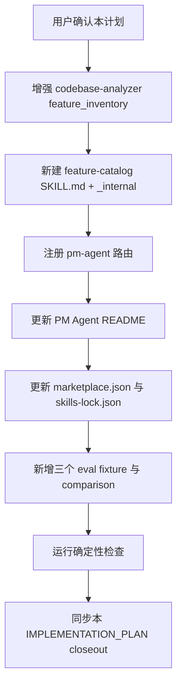

# 接手项目功能目录与项目画像实施计划

## 1. 实施上下文

本计划承接 GitHub issue #51、
`docs/pm/agents/pm-agent/skills/feature-catalog/PRD.md` 和
`docs/engineer/agents/pm-agent/skills/feature-catalog/TRD.md`。目标是补齐
“接手项目画像 -> 功能目录草案 -> 维护者确认 -> 正式功能文档”入口能力：
增强 `codebase-analyzer` 输出 `feature_inventory`，并新增
`pm-agent:feature-catalog` specialist skill。

### 1.1 当前门禁状态

| Gate | Status | Evidence |
| --- | --- | --- |
| PRD alignment | 已补齐 issue 级 PRD | `docs/pm/agents/pm-agent/skills/feature-catalog/PRD.md` |
| TRD alignment | 已补齐 issue 级 TRD | `docs/engineer/agents/pm-agent/skills/feature-catalog/TRD.md` |
| Feature path gate | 已通过 | PRD/TRD/本计划均使用 `agents/pm-agent/skills/feature-catalog` |
| UI design gate | 不适用 | 本次不涉及产品 UI 或视觉变化 |
| Implementation plan | 已确认并实施 | 本文件 |
| Code / skill edits | 已完成 | 见下方实施结果 |
| Deterministic checks | 已通过 | 见下方验证命令 |
| Skill eval / fresh subagent validation | Blocked（待触发） | 新增 skill 首个 eval 定义，模型 eval 由维护者在 PR 上决定触发；见各 eval durable `comparison.md` |

### 1.2 成功标准

- `codebase-analyzer` Project Profile 输出 `feature_inventory`：候选功能、
  建议 `feature_path`、分类证据、置信度和待确认问题。
- `pm-agent:feature-catalog` 可独立触发，先产出待确认功能目录草案，不批量
  生成 PRD。
- 父功能或 monorepo 范围不清时 blocked 并只问最小澄清问题，不创建并列顶层
  目录。
- 维护者确认后写 `docs/pm/FEATURE_CATALOG.md`，配合 `prd-gen` 创建或更新
  PRD/DECISIONS，PM 文档确认后显式 handoff `engineer-agent:trd-gen`。
- Handoff packet 包含 `feature_path`、`feature`、`parent_feature`、
  `feature_level` 和 `feature_path_evidence`。
- eval 覆盖无文档老项目、已有父 PRD 的子功能、monorepo 范围不清三个场景。

## 2. 范围

### 2.1 必改文件

| Path | Operation | Change |
| --- | --- | --- |
| `agents/engineer/skills/codebase-analyzer/SKILL.md` | Modify | Step 8 Project Profile 增加 `feature_inventory` 段和构建规则。 |
| `agents/product_manager/skills/feature-catalog/SKILL.md` | Create | 新 specialist skill 公开契约。 |
| `agents/product_manager/skills/feature-catalog/_internal/INSTRUCTIONS.md` | Create | 证据归并、命名原则、blocked 条件、catalog 与 handoff packet 模板。 |
| `agents/product_manager/skills/pm-agent/SKILL.md` | Modify | 注册 `feature-catalog` 路由信号与默认路由。 |
| `agents/product_manager/README.md` / `README_zh.md` | Modify | skills 表与 specialist 数量更新。 |
| `.claude-plugin/marketplace.json` | Modify | pm-agent skills 数组注册 `./skills/feature-catalog`。 |
| `skills-lock.json` | Modify | 新增 `feature-catalog` 条目，刷新 `pm-agent` 与 `codebase-analyzer` computedHash。 |
| `agents/product_manager/test/feature-catalog/evals/evals.json` | Create | 三个场景 eval 定义（schema 1.0）。 |
| `agents/product_manager/test/feature-catalog/evals/workspace/eval-001-legacy-project-catalog/` | Create | 无文档老项目 fixture、metadata 和 durable `comparison.md`。 |
| `agents/product_manager/test/feature-catalog/evals/workspace/eval-002-child-feature-under-parent-prd/` | Create | 已有父 PRD 子功能 fixture、metadata 和 durable `comparison.md`。 |
| `agents/product_manager/test/feature-catalog/evals/workspace/eval-003-monorepo-scope-clarification/` | Create | monorepo 范围不清 fixture、metadata 和 durable `comparison.md`。 |

### 2.2 非目标

- 不为整个旧项目批量生成 PRD/TRD。
- 不修改 `feature_path` contract 的机器校验规则。
- 不新增 `FEATURE_CATALOG.md` 的机器校验。
- 不提交 eval 运行期产物，例如 transcript、outputs、verdicts、timing 或
  diagnostics。

## 3. 实施流程



## 4. 文件级步骤

### Step 1: 增强 `codebase-analyzer`

- 在 Step 8 的 `project_profile` YAML 中追加 `feature_inventory` 段，字段与
  TRD 4.1 一致。
- 增加构建规则小节：业务能力分组、既有 `feature_path` 复用、`unresolved`
  与 open questions、置信度判定，并声明命名结论归
  `pm-agent:feature-catalog` 确认门禁。

验证：不改变既有 Step 1-7 协议；`feature_inventory` 只是输出格式扩展。

### Step 2: 新建 `feature-catalog` skill

- `SKILL.md` frontmatter 含 `name`、`description`（中英触发短语）。
- 正文覆盖职责、When to Use / Do NOT Use、协议流程、确认门禁、blocked
  规则、输出格式、handoff 边界和缺失 handoff 目标的降级行为。
- `_internal/INSTRUCTIONS.md` 保存详细实现指导；SKILL.md 内部引用使用相对
  路径 `_internal/INSTRUCTIONS.md`。

验证：skill 可独立触发，不依赖链路上游；不生成 PRD 正文。

### Step 3: 注册 dispatcher 与 registry

- `pm-agent` SKILL.md：职责边界、Available Skills、Routing Signals、
  Default Routes 补充 `feature-catalog`。
- `agents/product_manager/README.md` / `README_zh.md`：skills 表新增一行，
  specialist 数量 7 -> 8。
- `.claude-plugin/marketplace.json`：skills 数组新增
  `./skills/feature-catalog`。
- `skills-lock.json`：新增条目并重算 `pm-agent`、`codebase-analyzer`、
  `feature-catalog` 的 computedHash。

验证：`uv run scripts/check_repository_contract.py` 通过。

### Step 4: 新增 eval

- `evals.json` 按 schema 1.0 定义三个 eval，断言覆盖草案先行、证据与置信
  度、父功能复用、blocked 行为和 handoff packet 字段。
- 每个 workspace 提供最小模拟项目 fixture、`eval_metadata.json` 和 durable
  `comparison.md`；`comparison.md` 首次提交记录 blocked：新增 skill 的首个
  eval 定义，fresh subagent validation 尚未执行，由维护者在 PR 上决定触发。

验证：`uv run scripts/check_eval_contract.py` 与
`uv run scripts/check_eval_artifacts.py` 通过。

## 5. 验证命令

按 CI 顺序执行：

```bash
uv run scripts/check_repository_contract.py
uv run scripts/check_eval_contract.py
uv run scripts/check_eval_artifacts.py
uv run --with pytest pytest \
  agents/product_manager/test/idea-to-spec \
  agents/qa/test/test_qa_run_eval.py \
  agents/designer/test/test_designer_run_eval.py \
  agents/devops/test/test_devops_run_eval.py \
  agents/test_eval_contract.py
```

## 6. 实施结果

- 上述必改文件已全部落地，验证命令全部通过。
- 与并行分支（issue-58、issue-62、issue-63）在
  `agents/product_manager/skills/pm-agent/SKILL.md`、
  `agents/engineer/skills/codebase-analyzer/SKILL.md`、
  `.claude-plugin/marketplace.json`、`skills-lock.json` 上存在交叠，合并时
  需要重算 skills-lock hash。
- 模型 eval / fresh subagent validation 未在本轮执行，原因见各 eval
  `comparison.md` 的 blocked 记录，由维护者在 PR 上决定触发。
