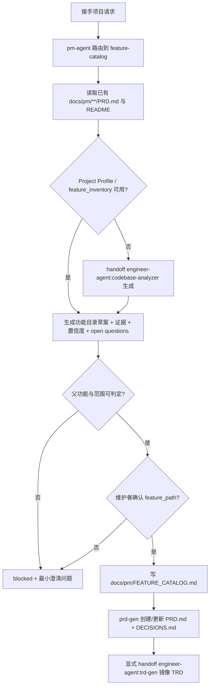

# 接手项目功能目录与项目画像 TRD

## 1. 技术目标

- 在 `codebase-analyzer` 的 Project Profile 输出中新增 `feature_inventory`
  段，给出候选功能、建议 `feature_path`、分类证据、置信度和待确认问题。
- 在 `pm-agent` 下新增 `feature-catalog` specialist skill，承接
  “接手项目 -> 功能目录草案 -> 维护者确认 -> 正式功能文档” 流程。
- 把 catalog 条目证据结构定义为 `feature_path_evidence` 的标准来源，供
  `prd-gen` / `trd-gen` handoff packet 直接引用。
- 完成 marketplace、skills-lock 注册和 eval 契约覆盖。

## 2. 影响范围

| Area | File | Change |
| --- | --- | --- |
| Engineer skill | `agents/engineer/skills/codebase-analyzer/SKILL.md` | Project Profile 增加 `feature_inventory` 输出段和构建规则。 |
| New PM skill | `agents/product_manager/skills/feature-catalog/SKILL.md` | 新建公开 skill 契约：触发、协议、确认门禁、handoff 边界。 |
| New PM skill internals | `agents/product_manager/skills/feature-catalog/_internal/INSTRUCTIONS.md` | 证据归并规则、命名原则、blocked 条件、catalog 模板、handoff packet 模板。 |
| PM dispatcher | `agents/product_manager/skills/pm-agent/SKILL.md` | Available Skills、Routing Signals、Default Routes 注册 `feature-catalog`。 |
| Agent README | `agents/product_manager/README.md`、`agents/product_manager/README_zh.md` | skills 表与 specialist 数量更新。 |
| Marketplace | `.claude-plugin/marketplace.json` | pm-agent skills 数组新增 `./skills/feature-catalog`。 |
| Skill lock | `skills-lock.json` | 新增 `feature-catalog` 条目，刷新 `pm-agent`、`codebase-analyzer` computedHash。 |
| Eval contract | `agents/product_manager/test/feature-catalog/evals/evals.json` | 三个场景 eval 定义。 |
| Eval fixtures | `agents/product_manager/test/feature-catalog/evals/workspace/eval-00{1,2,3}-*` | 最小模拟项目 fixture、`eval_metadata.json` 和 durable `comparison.md`。 |

## 3. 架构设计



## 4. 详细设计

### 4.1 `feature_inventory` 输出契约

`codebase-analyzer` Step 8 的 `project_profile` 新增：

```yaml
feature_inventory:
  - candidate_feature: <human-readable name>
    suggested_feature_path: <lower-kebab feature path or unresolved>
    evidence:
      routes: []
      pages: []
      api_endpoints: []
      services: []
      data_models: []
      background_jobs: []
      tests: []
      docs: []
    confidence: high | medium | low
    open_questions: []
```

构建规则：

- 以业务能力为分组单位，从路由、页面、API、服务、数据模型、后台任务、
  测试和已有文档归并证据；代码目录名不直接当作功能名。
- 证据能映射到已有 `docs/pm/**/PRD.md` 时，`suggested_feature_path` 复用
  既有 `feature_path`；父功能归属不清时置为 `unresolved` 并记录
  `open_questions`。
- `confidence` 判定：多类证据互相印证为 `high`；只有单类证据或命名推断为
  `medium`；仅凭目录名或依赖猜测为 `low`。
- `feature_inventory` 是画像证据，不是命名结论；正式 `feature_path` 由
  `pm-agent:feature-catalog` 走维护者确认门禁。

### 4.2 `feature-catalog` skill 协议

- 输入：Project Profile 与 `feature_inventory`、代码扫描结果、已有
  `docs/pm/**/PRD.md`、README、API/路由/测试入口。
- 流程：上下文读取 -> 功能目录草案（候选功能、建议 `feature_path`、证据、
  置信度、待确认问题、关联代码路径）-> 确认门禁 -> 确认后写
  `docs/pm/FEATURE_CATALOG.md` -> 移交 `prd-gen` / `trd-gen`。
- 门禁：草案未确认不写任何正式文档；父功能或 monorepo 范围不清时 blocked
  并只问当前最小澄清问题；不创建新的并列顶层目录。
- Handoff packet 字段：`feature_path`、`feature`、`parent_feature`、
  `feature_level`、`feature_path_evidence`（直接引用 catalog 条目证据）。
- SKILL.md 内部引用一律使用相对 SKILL.md 目录的路径，例如
  `_internal/INSTRUCTIONS.md`。

### 4.3 路由与注册

- `pm-agent` SKILL.md：Available Skills 增加 `pm-agent:feature-catalog`；
  Routing Signals 增加“接手项目、建立功能目录、功能画像”信号；Default
  Routes 表新增一行；职责边界列表补充不重复 `feature-catalog` 域逻辑。
- `.claude-plugin/marketplace.json`：pm-agent 的 skills 数组新增
  `./skills/feature-catalog`。
- `skills-lock.json`：新增 `feature-catalog` 条目（source、sourceType、
  computedHash），并按 `compute_tracked_directory_hash` 重算被修改的
  `pm-agent` 与 `codebase-analyzer` 条目。

### 4.4 Eval 设计

`agents/product_manager/test/feature-catalog/evals/evals.json`（schema 1.0）
覆盖 PRD FR-010 的三个场景：

| Eval | 场景 | 核心断言 |
| --- | --- | --- |
| `eval-001-legacy-project-catalog` | 无文档老项目 | 草案先行、证据与置信度、不批量生成 PRD |
| `eval-002-child-feature-under-parent-prd` | 已有父 PRD 的子功能 | 复用父 `feature_path`、不建并列顶层目录、handoff packet 字段完整 |
| `eval-003-monorepo-scope-clarification` | monorepo 范围不清 | blocked + 最小澄清问题、unresolved 条目不落正式文档 |

每个 eval 提供最小模拟项目 fixture、`eval_metadata.json` 和 durable
`comparison.md`；不提交运行期产物。首次提交的 `comparison.md` 记录尚未执行
fresh subagent validation 的 blocked 状态与原因。

## 5. 验证策略

| Check | Command | Expectation |
| --- | --- | --- |
| Repository contract | `uv run scripts/check_repository_contract.py` | marketplace、skills-lock hash、文档 frontmatter 全部通过 |
| Eval contract | `uv run scripts/check_eval_contract.py` | 新 evals.json 满足 schema 1.0 |
| Eval artifacts | `uv run scripts/check_eval_artifacts.py` | 无运行期产物入库 |
| Python tests | CI 同款 pytest 命令 | 全部通过 |

## 6. 风险与缓解

| Risk | Mitigation |
| --- | --- |
| `feature_inventory` 与 catalog 草案字段漂移 | 两处使用同一 evidence 分类，TRD 4.1 为唯一 schema 来源。 |
| dispatcher 路由与 `idea-to-spec` 抢占 | 路由信号限定在接手项目/功能画像场景；需求收敛仍归 `idea-to-spec`。 |
| skills-lock hash 失效 | 提交前重算并由 repository contract 校验。 |

## 7. 待确认问题

| # | Question | Proposed |
| --- | --- | --- |
| 1 | `FEATURE_CATALOG.md` 是否需要专属 frontmatter 契约校验 | 暂不加机器校验，先按文档组织规范执行 |
