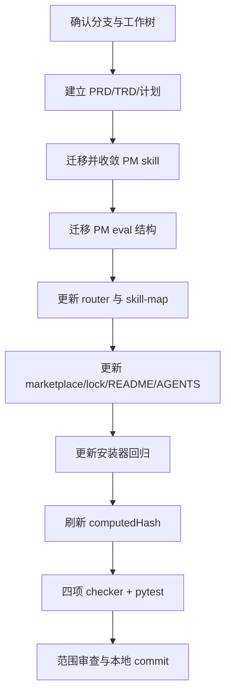

# PM Release skill 收敛为 github-release-generator（issue #120 G1）实施计划

## 1. 计划状态与授权

本计划覆盖 issue #120 阶段 G1，`change_tier: major`。用户已在本次任务中明确确认
PRD、TRD、实施计划、skill 更名、注册迁移、computedHash 刷新、验证和本地 commit 的
执行，无需再次请求计划确认。

授权不包含 push、创建 PR、merge、amend、rebase、force push、tag 操作、GitHub Release
真实发布、镜像/Helm/部署或 G2 eval 内容重写。

## 2. 成功标准

1. PM 旧 `release-notes-generator` 目录原地迁移为 `github-release-generator`，旧目录消失。
2. 新 skill 实现 #116 ready handoff、#117 双态、预览/draft/publish/readback 门禁。
3. PM router 与共享 skill map 正确拆分站内 Release Notes 和 GitHub Release 路由。
4. marketplace、skills lock、安装器测试、README/AGENTS 和 PM eval 路径全部一致。
5. specialist 总数不变，Docs `release-notes-generator` 职责不变。
6. 四项 checker 与 CI 同款 pytest 全部通过。
7. 生成指定中文 commit，停留在本地功能分支，不 push、不建 PR。

## 3. 精确文件清单

### 3.1 文档链

| 文件 | 操作 | 内容 |
| --- | --- | --- |
| `docs/pm/agents/pm-agent/skills/github-release-generator/PRD.md` | 新增 | issue #120 产品范围、门禁、边界与验收 |
| `docs/engineer/agents/pm-agent/skills/github-release-generator/TRD.md` | 新增 | 文件级设计、#116/#117 handoff、安装迁移与验证 |
| `docs/engineer/agents/pm-agent/skills/github-release-generator/IMPLEMENTATION_PLAN.md` | 新增 | G1 文件、顺序、验证、禁止项和 closeout |

### 3.2 Skill 与 eval

| 文件或目录 | 操作 | 内容 |
| --- | --- | --- |
| `agents/product_manager/skills/release-notes-generator/` | 删除/迁移 | 删除 PM 旧目录，不保留旧名 shim |
| `agents/product_manager/skills/github-release-generator/SKILL.md` | 新路径重写 | 入口、时序、职责、mutation 和边界门禁 |
| `agents/product_manager/skills/github-release-generator/reference/github-release-workflow.md` | 迁移并修改 | 只描述 preview/draft/publish/readback；删除 tag owner 与站内职责 |
| `agents/product_manager/skills/github-release-generator/reference/release-outline.md` | 迁移并修改 | 以已确认站内正文为事实基线，补 GitHub 追溯格式 |
| `agents/product_manager/test/release-notes-generator/` | 删除/迁移 | 移除旧 PM eval 路径 |
| `agents/product_manager/test/github-release-generator/evals/evals.json` | 迁移并最小修改 | 更新 agent/skill/path，保持 schema `1.0` 和最小合法定义 |
| `agents/product_manager/test/github-release-generator/evals/workspace/**` | 迁移并最小修改 | 更新 metadata/source/path；durable comparison 明示 G2 待重写，不伪造验证结论 |

若旧目录中存在上述未列出的合法 reference 或 eval fixture 文件，按同目录整体迁移并只做
名称/路径/checker 所需的最小修改，不删除有效资产。

### 3.3 路由、注册与文案

| 文件 | 操作 | 内容 |
| --- | --- | --- |
| `agents/product_manager/skills/pm-agent/SKILL.md` | 修改 | 可用 skill、route matrix、signals、chains 改为 GitHub/Docs 双路由 |
| `agents/product_manager/skills/idea-to-spec/_internal/_shared/skill-map.md` | 修改 | 更新 `release_notes` 分类、handoff 和 closeout owner |
| `.claude-plugin/marketplace.json` | 修改 | PM skills 数组旧名替换为新名；Docs 数组不动 |
| `README.md` | 修改 | 英文能力表、路由和协作说明更新 |
| `README_zh.md` | 修改 | 中文能力表、路由和协作说明更新 |
| `agents/product_manager/README.md` | 修改 | PM skill 名、职责和典型流程更新 |
| `AGENTS.md` | 修改 | 描述性更新；7 Agents / 33 specialists 总数不变 |

### 3.4 安装、lock 与测试

| 文件 | 操作 | 内容 |
| --- | --- | --- |
| `skills-lock.json` | 修改 | 删除 `pm-release-notes-generator` 和遗留 PM 旧记录；新增 `github-release-generator`；Docs 恢复朴素 `release-notes-generator` |
| `scripts/install_codex_skills.py` | 复核/必要最小修改 | 保留通用同名限定机制；确保唯一名称朴素安装，无具体 skill hardcode |
| `scripts/test_install_codex_skills.py` | 修改 | 更新本仓库真实安装断言，并保留合成同名冲突回归 |

### 3.5 computedHash

刷新所有实际受影响 skill 的 lock hash，至少覆盖：

- `pm-agent`；
- `github-release-generator`；
- Docs `release-notes-generator`；
- 因共享 `skill-map.md` 被 hash 输入覆盖而变化的关联 skill。

以 repository checker 报告为准补齐，不手工忽略 stale hash。

## 4. 实施顺序



### Step 1：分支与基线

- 从最新 `main` 创建并停留在 `feat/120-github-release-generator`。
- 记录初始 `git status --short --branch`，保留所有范围外用户改动。
- 复核 issue #120、#116/#117 契约和旧 PM skill/eval 当前文件集合。

验证：当前分支名正确；没有覆盖并行或用户已有改动。

### Step 2：建立确认文档链

- 写入本计划 §3.1 三个文件。
- frontmatter 使用 `feature_path: agents/pm-agent/skills/github-release-generator`、
  `parent_feature: agents/pm-agent/skills`、`feature_level: "4"`、`status: Approved`、
  日期 `2026-07-20` 和 issue #120 URL。

验证：`uv run scripts/check_doc_contract.py` 可读取三文件且层级一致。

### Step 3：迁移并收敛 PM skill

- 用 Git 可追踪的目录迁移保留历史，再重写 `SKILL.md` 和 references。
- 入口先验证 #116 ready handoff，再验证版本/compare，再消费 #117 `ready_for_tag`。
- preview 永远先于写 draft；draft 写入只响应本次明确请求并回读。
- publish 要求实际 tag、`release_verified` 与另行明确批准，并在发布后回读。
- 删除创建/移动 tag、生成站内页面、运行 docs check、镜像/Helm/部署等旧越界行为。

验证：旧 PM skill 目录不存在；新 `SKILL.md` 同时含四类门禁和边界禁令。

### Step 4：迁移 G1 eval 结构

- 迁移旧测试目录，更新 `skill_name`、workspace 路径和 metadata/source 指针。
- checker 若要求行为字段，只做 schema 合法所需最小修改。
- comparison 明确旧结果不能证明新协议，G2 才进行语义重写和 fresh validation。

验证：`check_eval_contract.py` 与 `check_eval_artifacts.py` 通过；无 runtime artifact 被提交。

### Step 5：更新路由和共享指针

- PM `release_notes`/沟通类请求拆分：站内或用户侧版本说明经 PM handoff 到
  `docs-agent:release-notes-generator`；GitHub Release 到 `github-release-generator`。
- 更新 Available Skills、route matrix、routing signals、dispatch table、multi-skill chain 和
  closeout 指针中的 PM 旧名。
- 不改变 Docs specialist gate 权威副本或 docs-audit 双态定义。

验证：全仓逐条审查旧名命中；PM GitHub owner 不再指向旧 skill。

### Step 6：更新注册、安装和仓库说明

- marketplace PM 数组替换目录；Docs 数组保持原样。
- lock 按朴素安装名迁移两条记录并刷新 hash。
- 安装器算法保留；测试断言真实仓库现在安装 `github-release-generator` 与
  `release-notes-generator`，合成 collision 用例仍覆盖限定名。
- 根 README 中英、PM README、AGENTS 只做本次职责和名称的描述性更新。

验证：marketplace specialist 数量不变；安装器测试不依赖本例同名 hardcode。

### Step 7：验证与修复

严格按 §5 命令顺序运行。失败时只修复与本次变更直接相关的契约、路径、hash 或测试
期望，不顺手重构邻接代码。

### Step 8：范围审查与提交

- 执行 `git diff --check`、`git status --short`、`git diff --stat`。
- 确认无 `docs/site/`、tag、部署资产和范围外改动。
- 使用 `git commit -F <message-file>`，标题固定为：
  `feat: PM Release skill 收敛为 github-release-generator（issue #120 G1）`。
- commit 正文用中文，概括职责收敛、双态门禁、注册安装迁移和验证结果。

验证：记录 `git rev-parse --short HEAD`；分支仍为功能分支且 ahead 1；不 push、不建 PR。

## 5. 验证命令

```bash
uv run scripts/check_repository_contract.py
uv run scripts/check_eval_contract.py
uv run scripts/check_eval_artifacts.py
uv run scripts/check_doc_contract.py
uv run --with pytest pytest \
  agents/product_manager/test/idea-to-spec \
  agents/product_manager/test/pm-agent \
  agents/qa/test/test_qa_run_eval.py \
  agents/designer/test/test_designer_run_eval.py \
  agents/devops/test/test_devops_run_eval.py \
  agents/docs/test/test_docs_run_eval.py \
  agents/test_doc_contract.py \
  agents/test_eval_contract.py \
  scripts/test_install_codex_skills.py
git diff --check
```

若 checker 或 CI 测试清单在最新 `main` 已更新，以仓库当前 required workflow/文档记录
的同款显式 pytest 清单为准，报告实际命令与结果。

## 6. 禁止项

- 不 push、不建 PR、不 merge，不 amend/rebase/force push。
- 不创建、移动、删除或重打 tag，不发布真实 GitHub Release。
- 不生成或修改站内 Release Notes，不改 `docs/site/`。
- 不改变 Docs `release-notes-generator` 的职责或 `docs-audit` 权威协议。
- 不运行或替代宿主文档站 `test:docs`。
- 不发布镜像、不更新 Helm、不执行部署。
- 不在 G1 重写 eval 内容或声称完成 fresh validation。
- 不清理与本任务无关的代码、文档、测试或用户改动。

## 7. Closeout

完成后输出一次简洁报告，必须包含：

- 目录迁移、注册、lock、安装、router/skill-map 和 README/AGENTS 变更清单；
- #116 入口门禁、#117 pre-tag/draft/publish 三重门禁及回读验证落点；
- 四项 checker、CI 同款 pytest 和 `git diff --check` 的实际结果；
- 本地 commit SHA 和当前分支；
- 明确说明未 push、未建 PR、未执行 tag/Release/部署操作；
- G2 eval 语义重写仍待后续阶段。

本轮 closeout 以本地 commit 完成为终点，不等待外部 review 或其他状态。

## 8. 实施结果

| 项目 | 结果 |
| --- | --- |
| 文档链 | PRD、TRD、IMPLEMENTATION_PLAN 已创建并保持 `status: Approved`；层级、日期和 issue #120 关联通过文档契约检查。 |
| Skill 收敛 | PM 旧目录已迁移为 `github-release-generator`；#116 入口、#117 双态、事实一致性、preview/draft/publish/readback 与全部边界已落地。 |
| Draft 安全边界 | `ready_for_tag` 后可生成完整 draft 预览；无现有 draft 且无实际 tag 时不调用 GitHub create；新建远端 draft 强制绑定已存在 tag，更新已有 draft 强制验证远端 tag 零变化。 |
| 路由与注册 | PM router、共享 skill map、marketplace、README/AGENTS 和当前态文档指针已拆清 Docs 站内说明与 PM GitHub Release；specialist 总数不变。 |
| 安装与 lock | 安装器通用同名限定机制保持不变；真实仓库恢复两个朴素名；lock key/source 与受影响 computedHash 已同步。 |
| Eval | 旧 PM eval 目录已完成 G1 结构迁移，durable comparison 明确旧结果不能证明新协议；G2 语义重写和 fresh paired validation 按阶段边界未执行。 |
| 独立验收 | fresh validation sub-agent 最终结论 PASS，无剩余 blocking finding。 |

实际验证结果：

- `uv run scripts/check_repository_contract.py`：PASS。
- `uv run scripts/check_eval_contract.py`：PASS。
- `uv run scripts/check_eval_artifacts.py`：PASS。
- `uv run scripts/check_doc_contract.py`：PASS。
- CI 同款显式 pytest：`128 passed`。
- `git diff --check`：PASS。
- `docs/site/` 与 `agents/docs/skills/`：零内容变更。

残余范围只有 G2 eval 语义重写与 fresh with-skill / without-skill validation；它不影响
G1 的目录、门禁、注册、安装和确定性检查完成状态。
