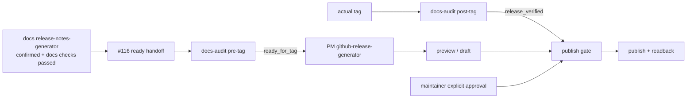

# github-release-generator TRD

## 1. 来源与范围

本 TRD 承接已批准 PRD 与 issue #120，实施等级为 `major`。目标不是新增第二套发布
说明生产线，而是将 PM 旧 `release-notes-generator` 收敛为 GitHub Release 专用 skill，
并消费 #116、#117 已建立的上游契约。

技术范围包括：目录更名与 skill 指令收敛、PM/Docs 路由拆分、marketplace 与 lock
迁移、安装器回归、旧 PM eval 目录的 G1 结构迁移、computedHash 刷新及仓库验证。
不包含站内 Release Notes 实现、tag 操作或任何部署行为。

## 2. 技术架构



`github-release-generator` 是 Markdown-first 指令协议，不新增服务、API server、数据库、
包依赖或持久化格式。GitHub 读取/写入继续通过项目允许的 GitHub Connector 或已认证
`gh` 完成；写操作前后都必须读取状态。

## 3. 入口数据契约

### 3.1 #116 site-ready handoff

skill 必须先验证以下字段和证据：

| 字段 | 要求 | 失败处理 |
| --- | --- | --- |
| `release_version` | 已确认的目标版本；消费 #116 当前规范字段名时映射自同义 `target_release_version`，并按仓库 tag 规则规范化后比较 | blocked，返回 PM/Docs 对齐版本 |
| `site_release_note_path` | 指向可读、已确认的站内 Release Notes | blocked，返回 Docs specialist |
| `confirmation_status` | 必须精确为 `confirmed` | blocked，等待用户/维护者确认 |
| docs check | 包含宿主命令、退出状态和成功结果 | 未执行或非成功均 blocked |
| index/metadata updates | 说明已更新的版本索引、`.meta/releases.json` 和必要导航 | 缺失或与版本不一致时 blocked |
| source evidence | 列出 Release Notes 使用的 PRD/TRD/代码/测试/发布证据与未决 gap | 事实来源不足时 blocked |

读取页面后计算或记录内容摘要，后续预览、draft 和发布回读都以同一已确认版本事实为
基线。GitHub compare/PR/commit 只能增加追溯链接、贡献者和页面格式，不能覆盖页面事实。

### 3.2 版本和 compare 范围

独立解析并记录：

- `release_version`、目标 `target_tag` 与 pre-tag handoff 的不可变 `target_ref`；
- 上一发布 tag `previous_tag`；
- tag 尚不存在时使用 `previous_tag...target_ref` 审计范围；tag 存在后复核其指向已审计内容，并生成 `previous_tag...target_tag` 最终 compare URL；
- compare 中的 merged PR、commit 和 contributor 集合；
- 相邻已发布 GitHub Release 的标题/正文风格。

对带 `v` 与不带 `v` 的来源先执行 SemVer 规范化比较，但 Git 命令和 GitHub Release
仍使用仓库真实 tag 字面值。版本不存在、范围为空且无法解释、范围交叉或事实不一致时
停止，不猜测 previous tag。

## 4. #117 时序状态机

### 4.1 pre-tag 消费

生成可提交预览或创建/更新 draft 前，必须消费可信 pre-tag handoff 包，并至少核对：

- `phase: pre-tag`、`phase_result: ready_for_tag`；
- 与 #116 一致的 `target_release_version`；
- 不可变 `base_ref` / `target_ref`；
- handoff 的审计范围、版本来源结论和可复核证据；
- handoff 包符合 docs-audit 当前对外 schema，且没有 blocker。

这些字段的完整权威定义留在 `docs-audit/_internal/INSTRUCTIONS.md`，本 skill 不复制、
生成或修复该 handoff。缺失、冲突或 `blocked` 时返回 docs-audit。

### 4.2 draft 状态

在 `ready_for_tag` 后：

1. 读取站内 Release Notes、GitHub compare 和相邻 Release 风格。
2. 生成标题与正文预览，标明事实来源与补充链接。
3. 仅在用户明确要求时创建或更新 draft；无现有 draft 且实际 tag 不存在时只保留完整
   draft 预览，因为 GitHub CLI/API 的 release create 会连带创建缺失 tag。
4. 已有 draft 可在证明 tag 状态不变的前提下更新；新建远端 draft 必须使用
   `--verify-tag` 绑定已经存在的 tag。
5. 写入后用 `gh release view` 或 Connector 回读 tag、name、body、`isDraft` 和 URL，并
   比较写前写后的远端 tag 状态。
6. 若操作会创建或移动 Git tag，必须停止；本 skill 不拥有 tag。

### 4.3 publish 状态

从 draft 变为 published 前要求一个逻辑与门：

```text
actual_tag_exists
AND post_tag_phase_result == release_verified
AND maintainer_publish_approval == explicit_and_current
```

post-tag handoff 必须对应同一 `target_release_version` 和实际 tag，并携带/引用可信 pre-tag
authority、实际 tag 与版本来源的复核结论。任何 `blocked`、tag 缺失/移动或版本不一致
都禁止发布。此前对生成 Release Notes 或创建 draft 的批准不能复用为发布批准。

发布后再次回读并核对 tag、标题、正文、draft/published 状态、发布时间和 URL；回读失败
或不一致必须报告失败，不宣称发布完成。

## 5. 内容转换规则

| 输入 | 处理 | 输出 |
| --- | --- | --- |
| 已确认站内 Release Notes | 保持功能、架构、数据库、部署、资产、升级和风险事实 | GitHub Release 用户说明主体 |
| compare | 生成完整 compare 链接，校验发布范围 | 页尾追溯链接 |
| merged PR | 选择与正文事实对应的代表性 PR | 重点条目的 PR 链接 |
| commit | 用于范围审计和必要的精确追溯 | 不输出未经整理的原始 commit dump |
| contributor | 从已纳入条目和 compare 中归并 | 项目既有风格的贡献者署名 |
| 相邻 Release | 提取标题、章节和链接格式 | 与项目既有 GitHub Release 风格一致 |

正文不得新增站内页面未确认的产品事实。若 GitHub 证据揭示页面遗漏或冲突，停止生成
并将差异交回 `docs-agent:release-notes-generator` 重新确认和校验；不能在 GitHub Release
中单边修正。

## 6. 文件级设计

| 文件或目录 | 操作 | 技术设计 |
| --- | --- | --- |
| `agents/product_manager/skills/release-notes-generator/` | 删除/迁移 | 不保留 PM 旧 skill 目录或兼容别名 |
| `agents/product_manager/skills/github-release-generator/SKILL.md` | 新路径重写 | 固化 #116 入口、#117 双态、预览/draft/publish/readback 和全部边界 |
| `agents/product_manager/skills/github-release-generator/reference/` | 迁移并收敛 | 仅保留 GitHub Release outline/workflow；删除站内 Release Notes 职责措辞 |
| `agents/product_manager/skills/pm-agent/SKILL.md` | 修改 | `release_notes` 分类拆成 Docs 站内说明与 PM GitHub Release 两条路由 |
| `agents/product_manager/skills/idea-to-spec/_internal/_shared/skill-map.md` | 修改 | 同步 route、handoff、closeout 指针和下游 owner |
| `.claude-plugin/marketplace.json` | 修改 | PM skills 数组用 `github-release-generator` 替换旧名；Docs 数组不变 |
| `skills-lock.json` | 修改 | 删除 PM 限定/旧朴素记录；新增 `github-release-generator`；Docs 恢复单条朴素 `release-notes-generator` |
| `scripts/install_codex_skills.py` | 兼容性复核/必要最小修改 | 保留跨 plugin 同名限定安装与同 plugin 重名报错的通用算法；唯一名称恢复朴素安装 |
| `scripts/test_install_codex_skills.py` | 修改 | 断言 PM/Docs 两个朴素安装名；保留构造型同名冲突和 obsolete alias 清理回归 |
| `agents/product_manager/test/github-release-generator/` | 从旧目录迁移 | G1 保证路径、`evals.json` schema、显式 workspace 和 durable comparison 结构合法；G2 重写行为语义 |
| 根 README 中英、PM README、`AGENTS.md` | 修改 | 更新名称、职责、路由与描述；specialist 总数保持 33 |
| 本 PRD/TRD/实施计划 | 新增 | 提供 issue #120 的确认文档链 |

全仓 `release-notes-generator` 文本不能机械全替换：指向
`agents/docs/skills/release-notes-generator` 或站内 Release Notes owner 的引用必须保留；
只有描述 PM GitHub Release 能力的旧指针改为 `github-release-generator`。

## 7. 安装与 lock 迁移

安装器以 marketplace skill basename/frontmatter name 建立安装规格，并在跨 plugin 同名时
使用 `<plugin-prefix>-<skill-name>` 限定名。更名后名称集合不再冲突，因此预期为：

| Source | 安装名 / lock key |
| --- | --- |
| `agents/product_manager/skills/github-release-generator` | `github-release-generator` |
| `agents/docs/skills/release-notes-generator` | `release-notes-generator` |

通用机制仍须通过合成 fixture 验证跨 plugin 同名限定安装、同 plugin 重名拒绝、旧未限定
collision alias 的受控清理。不得为这两个具体名称添加 hardcode 分支。

## 8. Eval 与 hash 策略

- 将旧 PM eval 目录整体迁移到 `agents/product_manager/test/github-release-generator/`。
- G1 仅修正 skill 名、workspace 路径、metadata/source 指针和 checker 要求的最小合法内容。
- 不在 G1 声称旧 eval 已验证新双态协议；完整 prompt/assertion/fixture/comparison 重写和 fresh
  with-skill/without-skill validation 属于 G2。
- skill 或 reference 变化后，使用仓库现有 hash 生成/同步方式刷新 `pm-agent`、
  `github-release-generator`、Docs `release-notes-generator` 及实际受影响记录。
- `skills-lock.json` 的 key 与安装器最终安装名一致。

## 9. 验证策略

按仓库 required check 顺序运行：

```bash
uv run scripts/check_repository_contract.py
uv run scripts/check_eval_contract.py
uv run scripts/check_eval_artifacts.py
uv run scripts/check_doc_contract.py
uv run --with pytest pytest \
  agents/product_manager/test/idea-to-spec \
  agents/product_manager/test/pm-agent \
  agents/qa/test/test_qa_run_eval.py \
  agents/designer/test/test_designer_run_eval.py \
  agents/devops/test/test_devops_run_eval.py \
  agents/docs/test/test_docs_run_eval.py \
  agents/test_doc_contract.py \
  agents/test_eval_contract.py \
  scripts/test_install_codex_skills.py
```

补充静态核对：

- `rg` 检查 PM 侧旧目录/旧路由/旧 lock key 已消失；
- 对剩余 `release-notes-generator` 命中逐条确认均指 Docs 站内能力或通用冲突 fixture；
- `git diff --check`；
- `git status --short` 确认没有 `docs/site/`、tag、部署或范围外文件变化。

## 10. 风险与缓解

| 风险 | 影响 | 缓解 |
| --- | --- | --- |
| 机械替换破坏 Docs specialist | 站内 Release Notes 路由失效 | 逐条语义 grep，只替换 PM owner 指针 |
| 将 `ready_for_tag` 误当发布批准 | tag 前提前发布 | publish 使用 tag + `release_verified` + 独立批准的与门 |
| GitHub 数据反向改写站内事实 | 两个发布面不一致 | 发现冲突即返回 Docs 重新确认，不在本 skill 修正 |
| lock key 与安装名不一致 | repository checker 或安装失败 | lock 使用最终朴素安装名，并执行真实安装器测试 |
| G1 最小 eval 被误报为完整验证 | 双态门禁缺乏证据 | comparison 明确 G2 待办，不生成虚假 PASS |

## 11. Feature Implementor Handoff

- PRD、TRD 和 issue #120 范围均已确认。
- 实施入口：`docs/engineer/agents/pm-agent/skills/github-release-generator/IMPLEMENTATION_PLAN.md`。
- 仅执行 G1；不开展 G2 eval 内容重写。
- 完成后提交一次本地 commit，停留在功能分支，不 push、不建 PR、不 merge。
