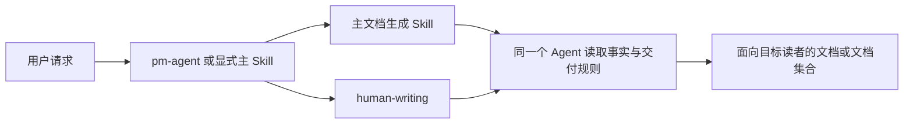

# human-writing TRD

## 1. 来源与范围

本 TRD 承接已批准 PRD 和 DECISIONS，`request_type: new_feature`，
`change_tier: major`。功能以 Markdown-first Skill 实现，不新增服务、依赖、配置、API、
数据库或运行时状态。

第一批已经建立 Skill 本体、参考规则、PM 入口、插件注册、README 和 lock。第二批只修改
六个下游 Router、三十二个 Specialist、架构说明和对应 lock hash，不改变注册与发现元数据。
第三批（本批）补齐 `human-writing` 本体的编写范围判断、作者决策链、必要结构权限和高风险
事实回传，并把周边共同加载条款中的 "structure" 统一修订为 "required structure"；不新增
文件、不改变注册与发现元数据。

## 2. 技术结构



`human-writing` 不接收另一 Skill 的中间产物，也不把自己的输出交给另一 Skill。共同加载
只表示当前 Agent 在同一上下文中同时遵守两份契约。主 Skill 决定事实、流程、必要结构、
格式、文件路径和验证；`human-writing` 决定读者视角、内容选择、信息组织、重点与详略、
解释方式和语言表达。

## 3. Skill 目录

```text
agents/product_manager/skills/human-writing/
├── SKILL.md
├── agents/
│   └── openai.yaml
└── references/
    ├── chinese-prose.md
    ├── document-patterns.md
    └── revision.md
```

| 文件 | 职责 |
| --- | --- |
| `SKILL.md` | 触发条件、规则优先级、编写方式与范围判断、结构权限、高风险事实回传、推断流程、事实保护、参考文件路由和交付规则 |
| `agents/openai.yaml` | 显示名、简短描述和包含 `$human-writing` 的默认提示 |
| `references/chinese-prose.md` | 自然中文、段落推进、Agent 口径泄露和常见机器感的语义规则 |
| `references/document-patterns.md` | 用户手册、产品、PRD、TRD、API、运维、QA、Release Notes、README 及文档集合与文档站的信息重点 |
| `references/revision.md` | 对既有文档的克制改写流程和交付前静默检查 |

首版不建立 `scripts/`。当前规则依赖上下文和文种，机械字符串检查无法可靠判断一句话是
真实术语、必要结构，还是空泛模板。

## 4. 入口与触发

Skill frontmatter 使用 `name: human-writing`、可检索 description 和
`visibility: internal`。以下场景可隐式触发：

- 生成或实质更新面向真实读者的正式文档；
- 用户要求改写、润色、去除 AI 味、机器感、报告腔或 Agent 口径；
- 主 Skill 已确定事实与结构，需要共同完成面向读者的正文。

代码、配置、schema、纯数据输出和只读分析不单独触发。直接调用 `$human-writing` 时，
Skill 可以独立改写用户提供的文本；若任务还要求某类正式文档，仍需同时遵守对应主 Skill。

## 5. 运行流程

1. 读取用户请求和主 Skill，确定不可改动的事实、顺序、必要结构、格式与安全边界。
2. 判断编写方式（创建、改写、审查）和修改范围（句子或段落、单篇文档、文档集合、文档站），按范围确定工作方式。
3. 从目标文件、相邻文档和上下文推断读者、阅读目的、文种、语气和长度。
4. 只有不同答案会实质改变内容时，提出一个最小澄清问题；否则直接继续。
5. 按文种读取 `document-patterns.md`；文档集合和整站任务读取其中的多文档模式；涉及中文正文时读取 `chinese-prose.md`。
6. 生成新文档时按读者任务组织内容；局部改稿只改命中问题的段落和必要衔接；授权范围内的整站任务先调整页面职责和分组，再修改正文。
7. 遇到权限、数据边界、自动行为等高风险事实疑问时，停止润色并返回主 Skill 核验。
8. 初稿完成后读取 `revision.md`，静默检查事实漂移、重复、Agent 口径、范围一致性和格式破坏。
9. 只交付主任务要求的文档和必要说明，不输出内部写作检查报告。

## 6. 事实与格式保护

以下内容默认逐字或逐结构保留，除非用户或主 Skill明确要求修改：

- 产品名、页面名、按钮名、字段名和正式术语；
- 操作顺序、权限前提、警告、失败条件和恢复步骤；
- 代码、命令、配置、路径、数字、单位、版本和链接；
- 引用、来源、frontmatter、Markdown 结构、表格和必需章节；
- 主 Skill 要求的 artifact path、状态、handoff 和验证证据。

内部 handoff 或验证证据可以保留在需要它们的工程文档中；面向普通用户的手册正文则不应
出现 Agent 如何截图、如何收集证据或如何确认自己完成任务的说明。判断依据是目标读者
是否需要这项信息完成任务，而不是某个词是否在禁用名单中。

## 6.1 结构权限

`human-writing` 保留的是主 Skill 规定的必要结构与真实流程，不是现有信息布局。它可以
调整现有内容的分组和解释顺序；在用户或主 Skill 明确授权时，可以重分类、拆分、合并或
移动文档内容。它不得改变真实操作顺序、必需章节或正式 artifact 契约。所有结构性修改
交回主 Skill 执行导航、链接、构建或渲染验证。

## 6.2 高风险事实回传

以下内容存在疑问时，`human-writing` 停止语言优化并请求主 Skill 核验，不把不确定描述
润色成更肯定的说法：

- 角色与权限；
- 用户级、工作区级和实例级边界；
- 数据权威来源；
- 同步、导入和拉取是否自动生效；
- 删除、覆盖和发布的影响范围；
- 失败条件与恢复方式；
- 登录、分配和等待状态；
- API、命令和配置的真实行为。

`human-writing` 负责识别风险信号，事实研究和最终确认仍由主 Skill 负责。

## 7. 注册与发现

| 表面 | 修改 |
| --- | --- |
| `.claude-plugin/marketplace.json` | 在 PM 插件 skills 数组注册 `./skills/human-writing`，更新能力描述 |
| `agents/product_manager/.claude-plugin/plugin.json` | 与 marketplace 的 PM 描述保持一致 |
| `.kimi-plugin/plugin.json` | 目录发现无需新增 skills 路径，只更新仓库能力描述 |
| `skills-lock.json` | 新增 `human-writing`，刷新被修改的 `pm-agent` hash |
| `agents/product_manager/skills/pm-agent/SKILL.md` | 增加辅助写作能力发现和直接/组合使用说明，不修改其他 Router 接入 |
| PM README 中英 | 增加 Skill 清单、用途和总数 |
| 根 README 中英 | 总 Skill 数改为 40，内部 specialist 改为 33，PM 数改为 `9 (1 + 8)` |

## 8. 失败与边界

- 读者或文种无法推断且不同答案会改变事实选择时，停止写正文并询问一个问题。
- 材料不足以支撑现实事实时，不用泛化解释补篇幅；返回主 Skill 的证据收集或范围确认流程。
- 写作规则与主 Skill 冲突时，以用户要求和主 Skill 为准，并保留必要结构。
- 无法确认某句话是否是事实时，不润色成更确定的口吻。
- 不修改其他 Agent、Router 或文档生成类 Skill 的触发条件。

## 9. 验证策略

### 9.1 结构验证

```bash
uv run scripts/generate_shared_contracts.py --check
uv run scripts/check_repository_contract.py
uv run scripts/check_doc_contract.py
git diff --check
```

`skill-creator` 的 `quick_validate.py` 不识别本仓库要求的 `visibility: internal`。验证时将
Skill 复制到临时目录，只从临时 `SKILL.md` 移除该仓库扩展字段，再运行官方校验器；实际
文件中的 `visibility` 继续由 `check_repository_contract.py` 和
`check_doc_contract.py` 校验。临时副本在命令结束后删除。

### 9.2 安装与注册验证

```bash
uv run --with pytest pytest \
  scripts/test_check_repository_contract.py \
  scripts/test_install_codex_skills.py \
  agents/test_doc_contract.py
```

验证 marketplace、PM plugin descriptor、目录、frontmatter 名称和 lock key 一致；Kimi
目录式发现继续覆盖新 Skill。

### 9.3 前向样例

使用三组固定输入做人工语义对照：

1. 用户手册：保留页面操作顺序和可见结果，删除 Agent 截图与验证口径。
2. TRD：保留术语、命令、表格和章节，只消除重复与抽象名词化。
3. Release Notes：保留版本事实和风险，改为用户能感知的变化，不输出生成过程。

每组检查”事实零新增、关键术语零丢失、内部口径不进入不相关读者正文”。本批次不引入
模型 eval runner 或新的持久化 eval 资产。

第三批增加一个人工语义验收场景：对一套按技术域组织、含多角色和截图的文档站执行整站
优化请求，预期在改写句子前识别章节组织与读者任务的不匹配，提出或执行任务导向的重分类，
保留全部页面、图片、操作步骤、警告和恢复说明，并将权限、数据边界和自动行为描述交由主
Skill 核实。外部仓库不作为自动测试依赖。

## 10. 发布与回滚

这是仓库内 Skill 和文档变更，没有运行时迁移。若验证失败，停止交付并修正当前分支；
不得通过放宽 repository contract、删除必需元数据或跳过 lock 同步绕过失败。

## 11. 周边 Skill 适配

### 11.1 Router 契约

以下六个 Router 在选定主 Specialist 后执行同一判断：如果主任务将生成或大幅更新供真实
读者使用的正文，同时加载 `human-writing`。同一个 Agent 读取两份规则并产出一个 artifact。

- `designer-agent`
- `engineer-agent`
- `qa-agent`
- `devops-agent`
- `security-agent`
- `docs-agent`

Router 不把 `human-writing` 加入主路由表。主 Specialist 继续拥有 entry gate、证据、事实、
格式、路径、验证和 closeout；`human-writing` 只影响读者视角、信息顺序和表达。代码、配置、
schema、lockfile 或数据输出不加载。

### 11.2 Specialist 契约

三十二个 Specialist 增加自包含触发条件，确保直接 slash 调用不依赖 Router：

| 角色 | Specialist 数 | Skill |
| --- | ---: | --- |
| PM | 7 | `idea-to-spec`, `feature-catalog`, `competitive-brief`, `changelog-gen`, `github-release-gen`, `roadmap-gen`, `github-reader` |
| Designer | 2 | `ui-ux-design`, `visual-design` |
| Engineer | 6 | `codebase-analyzer`, `trd-gen`, `feature-implementor`, `test-writer`, `debugger`, `delivery` |
| QA | 4 | `spec-based-tester`, `exploratory-tester`, `bug-analyzer`, `regression-suite` |
| DevOps | 4 | `deployment-planner`, `cicd-bootstrap`, `env-config-auditor`, `incident-playbook-writer` |
| Security | 4 | `appsec-checklist`, `authz-reviewer`, `dependency-risk-auditor`, `privacy-surface-mapper` |
| Docs | 5 | `docs-site-bootstrap`, `formal-docs-sync`, `manual-gen`, `release-notes-gen`, `docs-audit` |

每个 Specialist 都保留相同边界：只有读者向正文触发，主 Skill 不向 `human-writing` 交接
草稿，也不增加一次后处理。纯机器产物继续只执行主 Skill。

### 11.3 同步表面

| 表面 | 修改 |
| --- | --- |
| 38 个目标 `SKILL.md` | 增加 Router 或 Specialist 共同加载条款，不改 frontmatter |
| `skills-lock.json` | 刷新 38 个被修改 Skill 的 `computedHash` |
| `docs/architecture.md` | 记录跨角色写作组合层，不改变七个角色关系 |
| 本 PRD、DECISIONS、TRD、活跃计划 | 对齐第二批范围、边界和验证 |

不修改 marketplace、plugin descriptor、中英文 README、`human-writing` 本体、`pm-agent`、
共享生成契约、handoff、安装器、eval runner、宿主模板或发布配置。

### 11.4 验证

除 §9 命令外，遍历全部目标 `SKILL.md`，验证 `human-writing` 引用无遗漏；确认 Router 文本
包含”主 Specialist 已选定后共同加载”，Specialist 文本包含”直接调用也自行判断”，并检查
所有被修改 Skill 的 lock hash。受影响 deterministic tests 沿用 repository contract、安装器
与文档契约测试。模型 eval 不在本批确定性实施范围内。

## 12. 第三批：编写范围与结构权限

### 12.1 修改面

| 文件 | 修改 |
| --- | --- |
| `human-writing/SKILL.md` | description 改为 “required structure and real workflow”；规则优先级第 3 条扩展为作者决策链；新增编写方式与范围判断、结构权限、高风险事实回传三节；创建与改稿流程按范围分层 |
| `human-writing/agents/openai.yaml` | 默认提示中的 “structure” 同步为 “required structure” |
| `references/document-patterns.md` | 新增”文档集合与文档站”模式 |
| `references/revision.md` | 静默复核补充范围一致性、结构遗漏、维护历史泄漏、角色泛化、内容不变量和主 Skill 验证需求 |
| 38 个周边 `SKILL.md` 共同加载条款 | “retains evidence, facts, structure, paths, gates, and verification” 统一为 “required structure” |
| `skills-lock.json` | 刷新全部被修改 Skill 的 `computedHash` |
| `docs/architecture.md` | 写作组合层一节补充范围判断与必要结构表述 |

不新增参考文件，不修改 `references/chinese-prose.md`、marketplace、plugin descriptor、
README、共享生成契约、handoff、安装器或发布配置。

### 12.2 验证

除 §9 命令外，逐个检查 38 处共同加载条款的措辞一致性，确认 `human-writing` 本体与周边
条款中的 “required structure” 语义一致，并按 §9.3 的整站场景完成一次人工语义验收。
