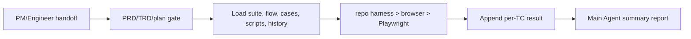

# QA Agent E2E 用例沉淀与复用 TRD

## 1. 技术范围

本设计用 Markdown 文件形成可重复 E2E 测试记忆，不新增 runner、服务、数据库或依赖。
QA reference 拥有格式；本 TRD 只定义目录关系、读写时序、门禁和验证。

## 2. 目录与数据关系

```text
docs/qa/e2e/{feature_path}/
├── TEST_SUITE.md
├── FLOW_INDEX.md
├── cases/
├── scripts/
├── results/{platform-version}/
└── _reports/{platform-version}/
```

`TEST_SUITE.md` 是用例索引，`FLOW_INDEX.md` 是产品流程到 TC 的覆盖映射。Case 与
script 一一对应。Result 与 report 只追加。具体字段见
`agents/qa/skills/qa-agent/references/e2e-case-format.md` 和
`e2e-test-report.md`。

凭据存在本地 `.qa/e2e/accounts.local.json`，通过稳定 ID 解析；schema 与禁令见
`e2e-credential-store.md`。仓库文件永不读取或复制 secret 值。

## 3. 执行数据流



1. Router 保留场景、平台版本、`feature_path`、环境、spec 和计划。
2. 缺失版本、凭据、环境、预期或计划时产生 blocked 结果，不执行受影响 TC。
3. 功能更新选取直接影响 TC；release 选取全部 active TC。
4. 单 TC 默认交给 subagent；主进程保持范围和证据。
5. 执行结果追加到版本目录，再聚合为单次报告。
6. 只有覆盖缺口才改 suite/flow/case/script；历史结果不重写。

## 4. Owner 与消费边界

| 内容 | 唯一 owner | 消费者 |
| --- | --- | --- |
| 凭据文件、ID 与 secret 禁令 | `e2e-credential-store.md` | QA Router 与 Specialists |
| Suite/flow/case/script/result 格式 | `e2e-case-format.md` | QA Router 与执行 subagent |
| 汇总报告格式 | `e2e-test-report.md` | 主 Agent |
| 产品场景与验收 | PM PRD | QA Router |
| 数据流与门禁 | 本 TRD | Engineer/QA handoff |

Router 和 Specialist 只保留 reference 指针，不复制模板。

## 5. 兼容与错误处理

- 旧 `docs/qa/{feature}` 不作为新写入入口；实际迁移由单独确认的维护任务执行。
- 版本目录不可使用 `unknown`。
- 找不到 credential ID 时 blocked，不回退到文档中的明文。
- repo harness 缺失时才选择浏览器或 Playwright。
- 预期变化回 PM；技术设计缺口回 `trd-gen`；计划缺失回 `feature-implementor`。
- 结果写入失败时不宣称测试完成。

## 6. 验证

- QA Router/Specialist 确定性测试和受影响 eval 保持行为。
- 扫描 case、script、result、report 与 fixture，拒绝明文 secret。
- 检查平台版本、TC 命名、case/script 一一对应和追加路径。
- 文档契约检查 reference 链接。
- `git diff --check` 确认无格式问题。

本变更没有服务发布、迁移脚本、监控或运行时回滚。回滚只恢复文档 owner 指针，不形成双模板 owner。
