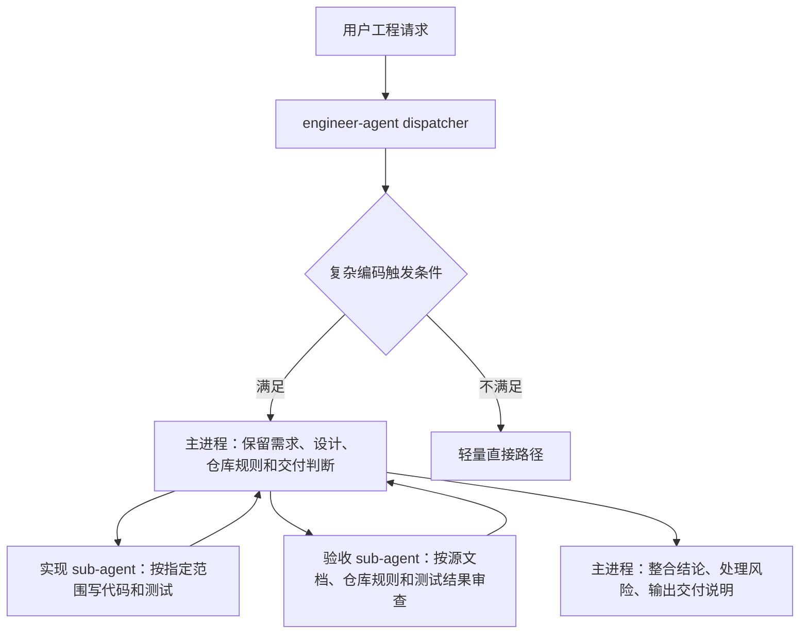
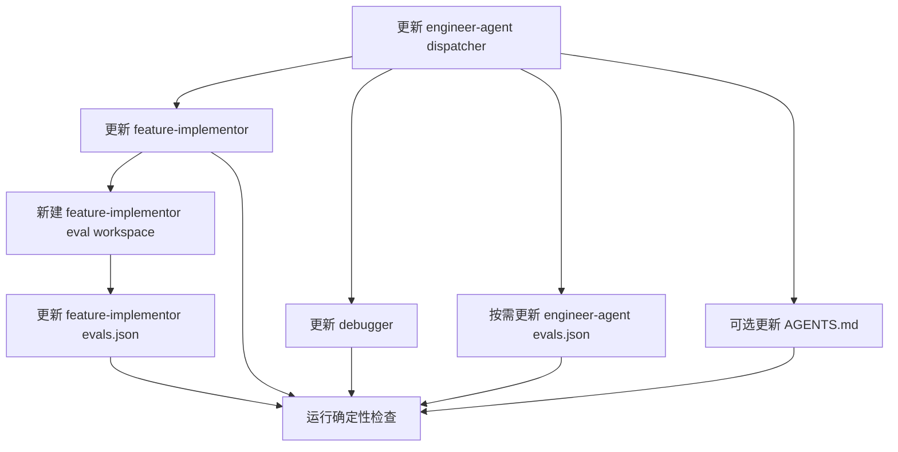
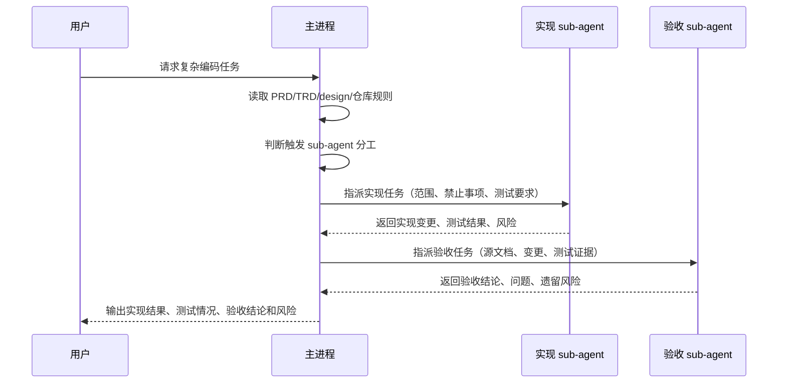

# Engineer Agent 编码阶段 sub-agent 分工实施文档

## 1. 概览

本实施文档承接 `docs/pm/engineer-agent-subagent-division/PRD.md`，目标是在 Engineer Agent 的复杂编码路径中落地“主进程保留上下文、实现 sub-agent 编码、验收 sub-agent 审查”的协作模式。

第一版实施不新增公开 marketplace Agent，不改变现有 skill 目录结构，也不把所有工程任务强制拆分。MVP 重点覆盖 `engineer-agent` dispatcher、`feature-implementor` 和 `debugger` 三处指导，并新增一个真实 eval 场景验证文档驱动实现与独立验收行为。

`project-bootstrap` 是否纳入 MVP 仍是 PM 文档中的待确认问题。实施默认不修改 `project-bootstrap` 行为，仅在文档和 eval 中保留后续扩展入口。

## 2. 架构概览



| 组件 | 责任 | 主要变更 |
| --- | --- | --- |
| `engineer-agent` | 工程请求路由和工作流选择 | 增加复杂编码任务的 sub-agent 分工触发规则和非触发规则。 |
| `feature-implementor` | spec 驱动功能实现 | 在实现计划和执行阶段明确实现 sub-agent 委派契约，完成后触发独立验收。 |
| `debugger` | bug 复现、根因分析、最小修复和验证 | 对复杂 bug 修复增加实现与回归验收分工，保留复现优先原则。 |
| Eval fixture | 行为回归验证 | 增加一个真实文档驱动实现 workspace，断言分工、委派质量、验收依据和最终总结。 |
| 仓库指导 | 跨角色协作边界 | 仅在确认需要时增加简短规则，不改变其他角色职责。 |

## 3. 技术栈与约束

| 层级 | 技术 / 文件 | 版本 | 理由 |
| --- | --- | --- | --- |
| Skill 文档 | Markdown `SKILL.md` | 当前仓库格式 | Agent 行为由公开 skill 文档和内部指令驱动。 |
| Eval 定义 | `evals.json` schema | `1.0` | 仓库规定所有 Agent skill eval 使用共享 schema。 |
| Fixture | Markdown / JSON / 示例代码骨架 | 当前仓库格式 | 真实 workspace 能验证文档驱动实现，不依赖玩具 prompt。 |
| 校验脚本 | `uv run scripts/check_*.py` | 当前仓库脚本 | 仓库约定 Python 验证使用 `uv run`。 |
| Git 产物策略 | `comparison.md` 持久化结果 | 当前仓库规则 | 提交 durable result，不提交 transcript、outputs、diagnostics 等运行期产物。 |

实施约束：

- 只修改 Engineer Agent 相关指导、eval 定义、eval workspace 和必要文档。
- 不做无关重构，不整理现有 QA 工作区改动。
- 不提交运行期 eval 产物。
- 修改 skill 文档或 eval fixture 后，需要主动询问是否运行对应 skill eval，用户确认后再执行模型 eval。

## 4. 文件变更计划

### 4.1 Feature Implementor 实现上下文

```text
Implementation context:
- Project: dev-agent-skills（多 Agent skill marketplace）
- Feature: engineer-agent-subagent-division
- Relevant docs:
  - docs/pm/engineer-agent-subagent-division/PRD.md
  - docs/pm/engineer-agent-subagent-division/DECISIONS.md
  - docs/engineer/engineer-agent-subagent-division/TRD.md
- Existing modules affected:
  - agents/engineer/skills/engineer-agent/SKILL.md
  - agents/engineer/skills/feature-implementor/SKILL.md
  - agents/engineer/skills/debugger/SKILL.md
  - agents/engineer/test/engineer-agent/evals/evals.json
  - agents/engineer/test/feature-implementor/evals/evals.json
- New modules needed:
  - agents/engineer/test/feature-implementor/evals/workspace/eval-002-subagent-division-from-docs/
```

本轮实施计划由 `feature-implementor` 负责拆解到文件级步骤。进入编码前必须先由主进程确认计划；确认后再加载 implementor 执行，不在计划阶段直接改 skill 行为。

### 4.2 文件变更清单

| 路径 | 操作 | 内容 |
| --- | --- | --- |
| `agents/engineer/skills/engineer-agent/SKILL.md` | 修改 | 增加复杂编码任务 sub-agent 分工触发规则、非触发规则和路由说明。 |
| `agents/engineer/skills/feature-implementor/SKILL.md` | 修改 | 增加实现委派契约、主进程上下文保留要求、独立验收步骤和最终输出要求。 |
| `agents/engineer/skills/debugger/SKILL.md` | 修改 | 在复杂 bug 修复中加入实现 sub-agent 与验收 sub-agent 分工，同时保留复现、根因分析、最小修复顺序。 |
| `agents/engineer/test/engineer-agent/evals/evals.json` | 修改 | 增加或扩展 dispatcher 层 eval，验证复杂实现请求会安排 sub-agent 分工。 |
| `agents/engineer/test/feature-implementor/evals/evals.json` | 修改 | 增加 spec 驱动实现 eval，验证实现委派和验收委派质量。 |
| `agents/engineer/test/feature-implementor/evals/workspace/eval-002-subagent-division-from-docs/` | 新增 | 放置 PRD/TRD/design 片段、代码骨架、`eval_metadata.json` 和 durable `comparison.md`。 |
| `AGENTS.md` | 可选修改 | 仅当维护者确认该行为需要仓库级规则时，增加一句简短协作约束。 |

### 4.3 文件级实施顺序

1. **修改 `agents/engineer/skills/engineer-agent/SKILL.md`** — 增加 dispatcher 层复杂编码任务分工规则。（来自 PRD §5 FR-001、FR-002、FR-003）
   - 依赖：无。
   - 要点：在 Role Boundary 或 Common Multi-Skill Chains 附近补充主进程保留上下文、复杂任务分工、简单任务例外。
   - 验证：人工检查 dispatcher 仍然只负责路由，不承担 downstream skill 的完整协议。

2. **修改 `agents/engineer/skills/feature-implementor/SKILL.md`** — 增加 spec 驱动实现中的实现 sub-agent 与验收 sub-agent 流程。（来自 PRD §5 FR-003、FR-004、FR-005）
   - 依赖：步骤 1 的统一触发规则。
   - 要点：Phase 1 增加触发判断；Phase 2 增加实现委派契约；Phase 3 增加独立验收；Handoff 输出包含验收结论和遗留风险。
   - 验证：文档仍保持“先计划、确认后编码”的 feature-implementor 协议。

3. **修改 `agents/engineer/skills/debugger/SKILL.md`** — 增加复杂 bug 修复的分工路径。（来自 PRD §5 FR-001、FR-005）
   - 依赖：步骤 1 的统一触发规则。
   - 要点：不得破坏 `Reproduce -> Analyze -> Hypothesize -> Fix -> Verify` 顺序；只在根因确认后委派最小修复；测试后再做独立验收。
   - 验证：debugger 仍然要求先复现和根因分析，不允许直接猜修。

4. **新建 `agents/engineer/test/feature-implementor/evals/workspace/eval-002-subagent-division-from-docs/`** — 构造真实文档驱动实现 fixture。（来自 PRD §5 FR-008）
   - 依赖：步骤 2 的目标行为。
   - 子文件：
     - `eval_metadata.json`
     - `comparison.md`
     - `docs/pm/sample-feature/PRD.md`
     - `docs/engineer/sample-feature/TRD.md`
     - `docs/design/sample-feature/ui-ux-spec.md`
     - `src/sample/existing-handler.ts`
     - `src/sample/existing-service.ts`
     - `tests/sample/existing-handler.test.ts`
   - 验证：fixture 中不包含运行期 `with_skill/`、`without_skill/`、`outputs/`、`transcript.md`、`diagnostics/` 等产物。

5. **修改 `agents/engineer/test/feature-implementor/evals/evals.json`** — 新增 `eval-002-subagent-division-from-docs`。（来自 PRD §5 FR-008）
   - 依赖：步骤 4 的 workspace。
   - 要点：使用 schema version `1.0`；assertions 使用 lower snake_case `id`；每个 assertion 包含 `description` 和语义化 `text`。
   - 验证：`uv run scripts/check_eval_contract.py` 应通过。

6. **按需修改 `agents/engineer/test/engineer-agent/evals/evals.json`** — 增加 dispatcher 层路由断言。（来自 PRD §5 FR-006、FR-008）
   - 依赖：步骤 1。
   - 默认建议：如果 feature-implementor eval 已覆盖完整行为，dispatcher eval 只补路由层语义，不重复完整实现 fixture。
   - 验证：避免让 dispatcher eval 直接要求代码实现。

7. **可选修改 `AGENTS.md`** — 仅在维护者确认该行为需要仓库级协作规则时执行。（来自 PRD §5 FR-007）
   - 依赖：用户或维护者确认。
   - 要点：按 AGENTS 维护策略，优先扩展现有角色边界句子，不新增长段落。
   - 验证：不改变 PM、Designer、QA、DevOps、Security 角色边界。

### 4.4 依赖顺序



## 5. 行为设计

### 5.1 触发条件

满足以下任一条件时，Engineer Agent 应优先考虑 sub-agent 分工：

- 任务涉及多文件或多模块修改。
- 任务基于 `docs/pm/{feature}/PRD.md`、`docs/engineer/{feature}/TRD.md` 或 `docs/design/{feature}/...` 实施。
- 任务需要补充或更新测试，并用测试结果支持交付判断。
- bug 修复需要复现、根因分析、代码修复和回归验收。
- 主进程需要同时保留需求、设计、仓库规则、代码上下文和交付风险。

### 5.2 非触发条件

以下场景不强制拆分：

- 单文件小改。
- 纯解释、纯代码阅读、纯状态检查。
- 用户明确要求不要使用 sub-agent。
- 任务尚未进入编码阶段，只是在做 PM、设计或工程路由。

### 5.3 主进程职责

主进程必须保留并整合以下上下文：

- 用户目标和最新指令。
- PM / Design / Engineer 文档中的验收标准和约束。
- 仓库规则，例如最小修改、不能回退他人改动、eval 产物策略。
- 实现 sub-agent 的输出和变更范围。
- 验收 sub-agent 的结论、问题和遗留风险。
- 最终交付说明，包括实现结果、测试情况、验收结论和风险。

### 5.4 实现 sub-agent 委派契约

实现 sub-agent 的任务描述必须包含：

| 字段 | 要求 |
| --- | --- |
| 写入范围 | 明确可修改的文件、目录或模块。 |
| 禁止事项 | 不得回退无关改动，不得修改未授权区域，不做额外重构。 |
| 输入文档 | 指明 PRD/TRD/design/spec 的相关路径和重点章节。 |
| 预期行为 | 说明需要实现的功能、测试或文档结果。 |
| 验证要求 | 说明需要运行或至少准备的确定性检查。 |
| 输出要求 | 列出变更文件、实现摘要、测试结果和未完成项。 |

### 5.5 验收 sub-agent 委派契约

验收 sub-agent 的任务描述必须包含：

| 字段 | 要求 |
| --- | --- |
| 验收依据 | PRD/TRD/design/spec、仓库规则、测试结果和变更文件。 |
| 检查范围 | 需求覆盖、测试覆盖、边界符合度、无关改动、运行期产物策略。 |
| 输出格式 | 按通过项、问题项、阻塞项、遗留风险输出。 |
| 限制 | 只做验收判断，不直接扩大实现范围。 |

## 6. Eval 设计

### 6.1 推荐新增 eval

| 字段 | 建议值 |
| --- | --- |
| 位置 | `agents/engineer/test/feature-implementor/evals/evals.json` |
| ID | `eval-002-subagent-division-from-docs` |
| Workspace | `workspace/eval-002-subagent-division-from-docs` |
| Prompt | 要求基于 PM/TRD/design 文档实现一个多文件功能，并明确“现在进入编码阶段”。 |
| 预期输出 | 主进程读取文档并保留上下文，委派实现 sub-agent，随后委派验收 sub-agent，最后整合实现结果、测试情况、验收结论和风险。 |

### 6.2 Eval workspace 结构

```text
agents/engineer/test/feature-implementor/evals/workspace/eval-002-subagent-division-from-docs/
  eval_metadata.json
  comparison.md
  docs/
    pm/
      sample-feature/
        PRD.md
        TRD.md
    design/
      sample-feature/
        ui-ux-spec.md
  src/
    sample/
      existing-handler.ts
      existing-service.ts
  tests/
    sample/
      existing-handler.test.ts
```

### 6.3 Eval assertions

| Assertion ID | 语义 |
| --- | --- |
| `preserves_main_context` | 主进程说明自己保留需求、设计、仓库规则和最终交付判断。 |
| `delegates_implementation_scope` | 实现 sub-agent 任务包含写入范围、禁止事项、预期行为和测试要求。 |
| `delegates_independent_validation` | 验收 sub-agent 基于源文档、仓库规则、测试结果和变更范围做判断。 |
| `keeps_simple_path_exception` | 输出不表达“所有任务都必须拆分”，保留简单任务例外。 |
| `final_summary_contract` | 最终交付说明包含实现结果、测试情况、验收结论和遗留风险。 |

### 6.4 Durable `comparison.md` 内容

`comparison.md` 至少包含：

- evaluation target
- fixture version
- latest result
- with-skill behavior
- baseline 或 without-skill behavior
- failures
- next steps
- runtime artifact policy

## 7. 系统交互流程



## 8. 测试与验证策略

| 层级 | 范围 | 命令 / 方法 | 通过标准 |
| --- | --- | --- | --- |
| 仓库契约 | symlink、registry、skill frontmatter、非法产物 | `uv run scripts/check_repository_contract.py` | 无错误。 |
| Eval 契约 | `evals.json` schema、metadata、workspace 路径 | `uv run scripts/check_eval_contract.py` | 无错误。 |
| Eval 产物策略 | 禁止提交运行期输出 | `uv run scripts/check_eval_artifacts.py` | 无运行期产物入库。 |
| Python 确定性测试 | runner/parser/prompt/report 等确定性测试 | 仓库现有 pytest 命令 | 与当前 CI 要求一致。 |
| 模型 eval | Engineer Agent 行为可用性 | 用户确认后运行对应 eval | sub-agent validation 给出 pass/fail 结论。 |

建议校验顺序：

```bash
uv run scripts/check_repository_contract.py
uv run scripts/check_eval_contract.py
uv run scripts/check_eval_artifacts.py
```

如修改了 eval runner 或 Python 测试相关逻辑，再补充运行确定性 pytest。

## 9. 实施步骤

1. 更新 `engineer-agent/SKILL.md`。
   - 增加复杂编码任务触发规则。
   - 增加简单任务非触发规则。
   - 在完整工程链路中说明主进程保留上下文，必要时委派实现与验收。

2. 更新 `feature-implementor/SKILL.md`。
   - 在实现计划阶段加入“是否触发 sub-agent 分工”的判断。
   - 在实施阶段加入实现 sub-agent 委派契约。
   - 在自检之后加入独立验收 sub-agent。
   - 更新最终输出格式，包含验收结论和遗留风险。

3. 更新 `debugger/SKILL.md`。
   - 保留 `Reproduce -> Analyze -> Hypothesize -> Fix -> Verify` 顺序。
   - 对复杂 bug 修复，在根因确认后委派实现 sub-agent 做最小修复。
   - 修复和测试后委派验收 sub-agent 检查回归证据和边界风险。

4. 新增或更新 eval。
   - 优先给 `feature-implementor` 增加真实 workspace。
   - 视需要给 `engineer-agent` 增加 dispatcher 层断言。
   - 不提交运行期 transcript、outputs、diagnostics。

5. 运行确定性检查。
   - 先运行 repository contract。
   - 再运行 eval contract 和 eval artifact 检查。
   - 按改动范围决定是否运行 pytest。

6. 询问是否运行模型 eval。
   - 因为修改了 skill 文档和 eval fixture，必须主动询问。
   - 用户确认后再运行对应 eval，并按产物策略更新 `comparison.md`。

## 10. 回滚策略

| 回滚对象 | 回滚方式 |
| --- | --- |
| Skill 文档行为 | 回退对应 `SKILL.md` 中新增的 sub-agent 分工段落。 |
| Eval 定义 | 删除新增 eval item 或恢复原断言。 |
| Eval workspace | 删除新增 workspace 目录。 |
| 仓库指导 | 如果修改了 `AGENTS.md`，单独回退新增规则。 |

回滚后必须重新运行：

```bash
uv run scripts/check_repository_contract.py
uv run scripts/check_eval_contract.py
uv run scripts/check_eval_artifacts.py
```

## 11. 风险与技术债

| 风险 / 技术债 | 影响 | 缓解方式 | 时机 |
| --- | --- | --- | --- |
| `project-bootstrap` 暂不覆盖，复杂 bootstrap 任务仍可能不拆分。 | 中 | 在 MVP 验证后单独评估并补 eval。 | Phase 4 |
| 各 specialist skill 中的规则可能表述不一致。 | 中 | 使用同一组触发条件、委派契约和最终输出字段。 | Phase 1 |
| Eval 过度依赖文本措辞。 | 高 | 使用语义断言，检查行为而不是精确句子。 | Phase 2 |
| 模型 eval 运行成本较高。 | 中 | PR 必跑只放确定性检查，模型 eval 由维护者合并前手动触发。 | Phase 3 |

## 12. 待确认技术问题

| # | 问题 | Owner | 截止点 |
| --- | --- | --- | --- |
| 1 | `project-bootstrap` 是否纳入第一版实施？ | PM / Engineer maintainer | 修改 specialist skill 前 |
| 2 | 是否需要同步修改 `AGENTS.md`，还是只改 Engineer skill 文档和 eval？ | Maintainer | 提交前 |
| 3 | 模型 eval 的实际运行入口使用现有脚本还是手动 sub-agent validation？ | Maintainer | 运行 eval 前 |
| 4 | `comparison.md` 是否需要记录本次模型 eval 的具体日期和 runner 版本？ | Maintainer | 更新 comparison 前 |

## 13. 交付验收清单

- [ ] `engineer-agent` 明确复杂编码任务的 sub-agent 分工规则。
- [ ] `feature-implementor` 明确实现委派、独立验收和最终输出要求。
- [ ] `debugger` 明确保留复现优先，同时支持复杂修复的实现与验收分工。
- [ ] 至少一个真实 eval 覆盖文档驱动实现与独立验收。
- [ ] `uv run scripts/check_repository_contract.py` 通过。
- [ ] `uv run scripts/check_eval_contract.py` 通过。
- [ ] `uv run scripts/check_eval_artifacts.py` 通过。
- [ ] 如用户确认，完成对应模型 eval 并更新 durable `comparison.md`。
