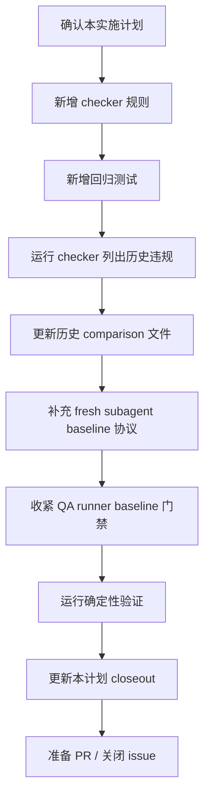

# 评测基线证据契约实施计划

## 1. 实施上下文

本计划用于实施 GitHub issue #46 描述的治理修复。当前仓库已经具备完整的 eval item
到 durable comparison 映射，但历史 `comparison.md` 文件仍有完整 PASS 语义下的弱
baseline 证据。

来源文档：

- PRD：`docs/pm/eval-baseline-evidence-contract/PRD.md`
- TRD：`docs/engineer/eval-baseline-evidence-contract/TRD.md`
- Issue：`https://github.com/Neplich/dev-agent-skills/issues/46`
- 已修复样例：`agents/engineer/test/feature-implementor/evals/workspace/eval-010-implementation-plan-closeout-sync/comparison.md`

## 2. 当前门禁状态

| 门禁 | 状态 | 证据 |
| --- | --- | --- |
| PRD 对齐 | 已起草 | `docs/pm/eval-baseline-evidence-contract/PRD.md` |
| TRD 对齐 | 已起草 | `docs/engineer/eval-baseline-evidence-contract/TRD.md` |
| 实施计划 | 已确认并实施 | 本文件已更新为 `status: "Implemented"` |
| 代码修改 | 已完成 | `scripts/check_eval_contract.py`、`agents/test_eval_contract.py`、`agents/qa/test/run_eval.py` |
| 历史 comparison 清理 | 已完成 | 74 个 historical comparison 已移出完整 PASS 语义 |
| 验证 | 已完成 | 见 `## 10. 实施收尾` |

## 3. 范围

### 3.1 计划文件变更

| 路径 | 操作 | 目的 |
| --- | --- | --- |
| `scripts/check_eval_contract.py` | 修改 | 增加 durable `comparison.md` 的 PASS baseline 硬冲突校验。 |
| `agents/test_eval_contract.py` | 修改 | 增加非法和合法 baseline 证据状态的回归测试。 |
| `AGENTS.md` | 修改 | 明确 fresh subagent validation 必须生成 `with_skill` 和 `without_skill` 两路结果。 |
| `agents/*/test/README.md` | 修改 | 在各 Agent eval 指南中声明 `without_skill` baseline 缺失时不能写完整 PASS。 |
| `agents/qa/test/run_eval.py` | 修改 | QA runner 在 `without_skill` candidate 或 judge verdict 缺失时失败。 |
| `agents/qa/test/test_qa_run_eval.py` | 修改 | 覆盖 QA runner baseline 生成缺失时失败的回归场景。 |
| `agents/**/comparison.md` | 修改 | 将 PASS 下的 diagnostic-only baseline 状态替换为 review 结论或非 PASS 语义。 |
| `docs/engineer/eval-baseline-evidence-contract/IMPLEMENTATION_PLAN.md` | 修改 | 实施后记录结果、验证证据和剩余风险。 |

### 3.2 非目标

- 不改变 skill 行为或 public skill instructions。
- 不改变 `evals.json` schema version。
- 不新增模型 eval runner。
- 不提交 runtime artifacts。
- 不重构无关校验脚本。

## 4. 实施流程



## 5. 文件级步骤

### 步骤 1：增加 comparison 证据校验

修改 `scripts/check_eval_contract.py`：

- 增加 helper 读取每个 durable `comparison.md`。
- 使用 `Latest result: PASS` 判断完整 PASS。
- 完整 PASS 下拒绝以下硬冲突 baseline 文案：
  - `Baseline behavior is diagnostic only.`
  - `Baseline behavior remains diagnostic:`
  - `BLOCKED`
  - `SKIPPED`
  - `not generated`
  - `not run`
- 不用脚本判断 baseline 自由文本是否语义完整、覆盖充分或足以代表 skill 质量；该判断保留给 sub-agent / 人工 review。
- 复用现有 `ContractError` 输出违规，保持 CLI 输出格式一致。

验证：

```bash
uv run scripts/check_eval_contract.py
```

预期中间结果：历史 comparison 清理前，该命令应失败并列出违规文件。

### 步骤 2：增加回归测试

修改 `agents/test_eval_contract.py`：

- 增加 `Latest result: PASS` + `Baseline behavior is diagnostic only.` 应失败的 fixture。
- 增加 `Latest result: PASS` + `Baseline behavior remains diagnostic:` 应失败的 fixture。
- 增加 `Latest result: PASS` + 经 review 保留的 baseline 文案应通过的 fixture。
- 增加 `Latest result: PARTIAL` + baseline not generated 应通过的 fixture。

验证：

```bash
uv run --with pytest pytest agents/test_eval_contract.py
```

预期中间结果：checker 实现后 unit tests 通过。

### 步骤 3：生成历史违规列表

运行更新后的 checker，并只把违规列表保留在终端输出或临时 scratch 空间，不提交生成的诊断文件。

预期起始盘点：

- issue 中记录的 72 个精确 diagnostic-only baseline 文件；
- 2 个额外包含 `Baseline behavior remains diagnostic:` 的 tracked 文件。

实现时应以 checker 输出作为编辑历史 comparison 的准确信息来源。

### 步骤 4：更新历史 `comparison.md` 文件

对每个 invalid comparison：

1. 如果文件中已有实际 baseline 运行或 review 结论，将 baseline section 改写为直接陈述结果。
2. 如果 baseline 明确未生成或被阻塞，将 latest result 从完整 `PASS` 改为 `PARTIAL` 或 `BLOCKED`。
3. 保留已有 with-skill validation 证据。
4. 保持 runtime artifact policy 明确。
5. 避免无关措辞或格式改动。

baseline 缺失时推荐替换结构：

```markdown
- Latest result: PARTIAL - with-skill validation 已通过；without-skill baseline 未生成。

## Without Skill / Baseline

- BLOCKED：该历史 comparison 未记录 without-skill baseline run。生成并写入 baseline 结果前，本文件不视为完整 eval PASS。
```

验证：

```bash
uv run scripts/check_eval_contract.py
```

预期结果：所有 invalid full-PASS baseline evidence 清理后通过。

### 步骤 5：保持 runtime artifact 策略

历史清理后运行 artifact checker：

```bash
uv run scripts/check_eval_artifacts.py
```

预期结果：PASS。不应有 `with_skill/`、`without_skill/`、`baseline/`、`outputs/`、
`diagnostics/`、`transcript.md`、`candidate-output.md`、`subagent-verdict.md`、
`timing.json`、`run_status.json` 或 `comparison.auto.md` 被 tracked。

### 步骤 6：补充 fresh subagent baseline 生成协议

修改 `AGENTS.md` 与各 Agent test README：

- fresh Codex subagent validation 必须基于同一份 eval prompt 和 fixture 完成 `with_skill` 与 `without_skill` 两次运行。
- `without_skill` 运行结果是 durable `comparison.md` 的 baseline 来源。
- baseline 未生成或无法评审时，不能记录完整 `PASS`；应记录 `PARTIAL` 或 `BLOCKED` 并说明原因。
- 运行期产物仍写入隔离 scratch workspace，不提交到 git。

验证：

```bash
git diff --check
```

预期结果：文档格式无 trailing whitespace。

### 步骤 7：收紧 QA runner baseline 门禁

修改 `agents/qa/test/run_eval.py` 与 `agents/qa/test/test_qa_run_eval.py`：

- `without_skill` 语义 verdict 可以是 `FAIL`，用于对照 skill 改善效果。
- `without_skill` candidate、fresh judge verdict 或可解析 verdict 缺失时，runner 返回失败。
- 自动报告的 runner policy 明确 baseline evidence 生成要求。

验证：

```bash
uv run --with pytest pytest agents/qa/test/test_qa_run_eval.py
```

预期结果：QA runner 单测通过。

### 步骤 8：最终确定性验证

运行完整仓库验证序列：

```bash
git diff --check
uv run scripts/check_repository_contract.py
uv run scripts/check_eval_contract.py
uv run scripts/check_eval_artifacts.py
uv run --with pytest pytest agents/test_eval_contract.py
```

将精确 pass/fail 结果写入本计划的 closeout section。

## 6. 子代理分工

实现阶段建议使用复杂编码 sub-agent 分工；本次实际改动由主流程串行完成，未启动 sub-agent。

| 角色 | 范围 | 禁止事项 | 输出 |
| --- | --- | --- | --- |
| 实现子代理 | `scripts/check_eval_contract.py`、`agents/test_eval_contract.py`、历史 `comparison.md` 清理。 | 未明确分配前，不编辑 skill 行为文档、lockfile 或 runtime artifact outputs。 | 变更文件、checker 行为和测试结果。 |
| 验证子代理 | 复核 PRD/TRD 对齐、checker 误报、历史清理完整性和 artifact policy。 | 不重写 implementation。 | PASS/FAIL、发现项和剩余风险。 |
| 主流程 | 集成编辑、运行最终检查、更新本计划 closeout、准备交付。 | 不回退无关用户改动。 | 最终状态和 issue handoff。 |

## 7. 验证计划

| 检查 | 命令 | 预期结果 |
| --- | --- | --- |
| 空白与 patch 检查 | `git diff --check` | PASS |
| 仓库契约 | `uv run scripts/check_repository_contract.py` | PASS |
| Eval 契约 | `uv run scripts/check_eval_contract.py` | 清理后 PASS |
| Runtime artifact 策略 | `uv run scripts/check_eval_artifacts.py` | PASS |
| 回归测试 | `uv run --with pytest pytest agents/test_eval_contract.py` | PASS |

## 8. 发布与回滚

通过普通 PR 发布。合并前 CI 应运行 repository contract、eval contract 和 python tests。

回滚策略：

- 如果校验规则误阻塞合法 PR，回滚 checker 和测试变更。
- 历史 comparison 清理如果提升了 durable 证据质量，可以保留。
- 如果必须回滚历史清理，应在同一回滚中处理 checker，避免 main 明知失败。

## 9. 风险

| 风险 | 影响 | 缓解 |
| --- | --- | --- |
| 批量 Markdown 编辑隐藏语义变化。 | Reviewer 可能漏看意外结果变化。 | 每处编辑限制在 latest result 和 baseline section。 |
| Checker 范围过宽。 | 合法 PASS 文件可能失败。 | 限定为完整 PASS + 明确缺失、blocked、skipped 或 diagnostic-only baseline 状态。 |
| 大量历史 eval 无法生成 baseline。 | 多个文件会变为 PARTIAL。 | 真实反映证据状态，后续可逐步补 baseline。 |
| 模型 eval 重跑耗时。 | 实现可能被拖慢。 | 本次不强制重跑；缺证据时使用非 PASS 语义。 |

## 10. 实施收尾

本计划已按确认范围实施。

### 10.1 变更文件

- 新增并维护文档：
  - `docs/pm/eval-baseline-evidence-contract/PRD.md`
  - `docs/engineer/eval-baseline-evidence-contract/TRD.md`
  - `docs/engineer/eval-baseline-evidence-contract/IMPLEMENTATION_PLAN.md`
- 更新仓库和 Agent eval 协议：
  - `AGENTS.md`
  - `agents/designer/test/README.md`
  - `agents/devops/test/README.md`
  - `agents/engineer/test/README.md`
  - `agents/product_manager/test/README.md`
  - `agents/product_manager/test/idea-to-spec/README.md`
  - `agents/qa/test/README.md`
  - `agents/security/test/README.md`
- 修改校验逻辑：
  - `scripts/check_eval_contract.py`
- 修改回归测试：
  - `agents/test_eval_contract.py`
- 修改 QA runner：
  - `agents/qa/test/run_eval.py`
  - `agents/qa/test/test_qa_run_eval.py`
- 批量更新历史 eval durable result：
  - 74 个 `agents/**/comparison.md`

### 10.2 实施结果

- `check_eval_contract.py` 已新增 baseline section 级硬冲突校验：
  - 仅当 `comparison.md` 包含 `Latest result: PASS` 时触发；
  - 只检查 `## Without Skill / Baseline`、`## Without Skill` 或 `## Baseline` section；
  - 拒绝 diagnostic-only、remains diagnostic、blocked / skipped、not generated / not run 等明确缺失或阻塞状态；
  - 不判断 baseline 自由文本是否语义完整，baseline PASS / FAIL / BLOCKED 由实际运行后的 sub-agent / 人工 review 判断。
- `agents/test_eval_contract.py` 已新增 6 个 baseline 证据回归用例。
- fresh subagent validation 协议已明确要求同一 eval prompt / fixture 下运行 `with_skill` 与 `without_skill`，并把 `without_skill` 作为 baseline 写回 durable `comparison.md`。
- QA runner 已在 `without_skill` candidate 或 fresh judge verdict 缺失时失败；`without_skill` 语义 verdict 为 `FAIL` 时仍可作为有效 baseline 对照。
- 74 个历史 comparison 已从完整 `PASS` 改为 `PARTIAL`，并补充明确 blocked baseline 原因。
- 已确认 `Latest result: PASS` 与 `Baseline behavior is/remains diagnostic` 并存数量为 0。
- 本轮未运行模型 eval 或 fresh Codex subagent baseline；原因是 #46 允许无法补齐实际 baseline 的历史 eval 先移出完整 PASS 语义。
- 本轮未提交 runtime transcript、diagnostics、outputs、timing、run status 或 `comparison.auto.md`。

### 10.3 验证结果

```bash
git diff --check
uv run scripts/check_repository_contract.py
uv run scripts/check_eval_contract.py
uv run scripts/check_eval_artifacts.py
uv run --with pytest pytest agents/test_eval_contract.py
```

结果：

- `git diff --check`: PASS
- `uv run scripts/check_repository_contract.py`: PASS
- `uv run scripts/check_eval_contract.py`: PASS
- `uv run scripts/check_eval_artifacts.py`: PASS
- `uv run --with pytest pytest agents/test_eval_contract.py`: PASS, 35 passed
- `uv run --with pytest pytest agents/qa/test/test_qa_run_eval.py`: PASS, 13 passed

### 10.4 剩余风险

| 风险 | 状态 | 说明 |
| --- | --- | --- |
| 历史 eval 尚未补真实 without-skill baseline | Accepted | 已通过 `PARTIAL` 语义避免误判为完整 PASS；后续可逐个补 baseline 后恢复 PASS。 |
| Checker 不覆盖 baseline 语义质量 | Accepted | 当前只覆盖 #46 中发现的 exact / remains diagnostic 变体和 blocked / skipped / not generated / not run 硬冲突；baseline 内容质量由执行 with/without 两路运行后的 sub-agent / 人工 review 判断。 |
| 批量 comparison 编辑较多 | Mitigated | 每个文件只改 latest result 和 baseline section，保留 prior validation note 与原有 With Skill 证据。 |
