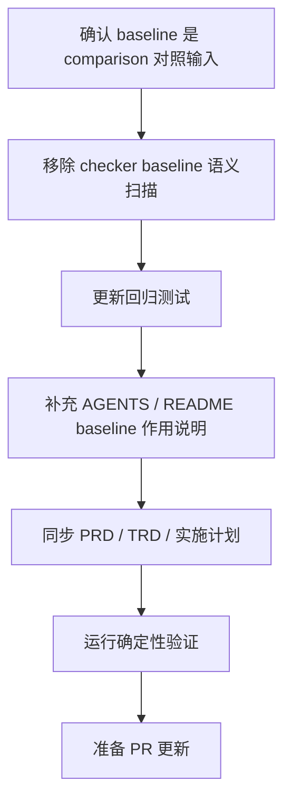

# 评测基线证据契约实施计划

## 1. 实施上下文

本计划用于实施 GitHub issue #46 描述的治理修复。最终决策是将 baseline 定义为
`comparison.md` 的 without-skill 对照输入，而不是 deterministic checker 的独立
语义校验对象。仓库契约继续校验 eval schema、workspace、metadata、durable
`comparison.md` 存在性和 runtime artifact 策略；PASS、PARTIAL 或 BLOCKED 由
sub-agent / fresh judge / reviewer 基于 comparison 全文判断。

来源文档：

- PRD：`docs/pm/eval-baseline-evidence-contract/PRD.md`
- TRD：`docs/engineer/eval-baseline-evidence-contract/TRD.md`
- Issue：`https://github.com/Neplich/dev-agent-skills/issues/46`
- 已修复样例：`agents/engineer/test/feature-implementor/evals/workspace/eval-010-implementation-plan-closeout-sync/comparison.md`

## 2. 当前门禁状态

| 门禁 | 状态 | 证据 |
| --- | --- | --- |
| PRD 对齐 | 已起草 | `docs/pm/eval-baseline-evidence-contract/PRD.md` |
| TRD 对齐 | 已起草 | `docs/engineer/eval-baseline-evidence-contract/TRD.md` |
| 实施计划 | 已确认并实施 | 本文件已更新为 `status: "Implemented"` |
| 代码修改 | 已完成 | `scripts/check_eval_contract.py`、`agents/test_eval_contract.py` |
| Baseline 作用说明 | 已完成 | `AGENTS.md`、`README.md`、PRD、TRD |
| 验证 | 已完成 | 见 `## 10. 实施收尾` |

## 3. 范围

### 3.1 计划文件变更

| 路径 | 操作 | 目的 |
| --- | --- | --- |
| `scripts/check_eval_contract.py` | 修改 | 移除 durable `comparison.md` baseline 自由文本语义校验，只保留 comparison 存在性。 |
| `agents/test_eval_contract.py` | 修改 | 增加 baseline 语义不由 contract checker 校验的回归测试。 |
| `AGENTS.md` | 修改 | 明确 baseline 是 comparison 的 without-skill 对照输入。 |
| `README.md` | 修改 | 补充 Baseline 作用、Latest result 结论来源和 deterministic checker 边界。 |
| `docs/engineer/eval-baseline-evidence-contract/IMPLEMENTATION_PLAN.md` | 修改 | 实施后记录结果、验证证据和剩余风险。 |

### 3.2 非目标

- 不改变 skill 行为或 public skill instructions。
- 不改变 `evals.json` schema version。
- 不新增模型 eval runner。
- 不提交 runtime artifacts。
- 不重构无关校验脚本。

## 4. 实施流程



## 5. 文件级步骤

### 步骤 1：移除 comparison baseline 语义校验

修改 `scripts/check_eval_contract.py`：

- 删除 `Latest result: PASS`、baseline heading 和 weak baseline 文案扫描。
- 保留 eval workspace 必须包含 durable `comparison.md` 的结构契约。
- 不根据 `Without Skill / Baseline` 自由文本推断 PASS、PARTIAL 或 BLOCKED。
- 继续复用现有 `ContractError` 输出缺失 workspace、metadata 或 comparison 的结构违规。

验证：

```bash
uv run scripts/check_eval_contract.py
```

预期结果：只要 eval schema、metadata 和 durable comparison 存在性有效，即使 baseline 文案包含 blocked、skipped 或 diagnostic-only 也不失败。

### 步骤 2：更新回归测试

修改 `agents/test_eval_contract.py`：

- 移除 PASS baseline 文案应失败的测试。
- 增加 `Latest result: PASS` + blocked / skipped / diagnostic-only / not generated baseline 文案仍通过的 fixture。
- 保留缺失 durable `comparison.md` 应失败的既有测试。

验证：

```bash
uv run --with pytest pytest agents/test_eval_contract.py
```

预期结果：unit tests 通过，并固定 checker 不做 baseline 语义判断。

### 步骤 3：补充 baseline 作用说明

修改 `AGENTS.md` 与 `README.md`：

- Baseline 是 `without_skill` 对照输入，不是独立机器判定对象。
- `Latest result` 是 sub-agent、fresh judge 或人工 reviewer 基于 with-skill、without_skill、assertions 和 fixture context 的结论。
- Deterministic contract checker 只校验 eval 定义、workspace、durable `comparison.md` 和 runtime artifact 策略。

验证：

```bash
git diff --check
```

预期结果：文档格式无 trailing whitespace。

### 步骤 4：同步 PRD / TRD

更新 `docs/pm/eval-baseline-evidence-contract/PRD.md` 和
`docs/engineer/eval-baseline-evidence-contract/TRD.md`：

- 移除“checker 拦截 PASS baseline 硬冲突”的需求和技术方案。
- 记录 baseline 的对照输入职责。
- 保留 durable comparison、runtime artifact 策略和 fresh validation 证据链要求。

### 步骤 5：保持 runtime artifact 策略

历史清理后运行 artifact checker：

```bash
uv run scripts/check_eval_artifacts.py
```

预期结果：PASS。不应有 `with_skill/`、`without_skill/`、`baseline/`、`outputs/`、
`diagnostics/`、`transcript.md`、`candidate-output.md`、`subagent-verdict.md`、
`timing.json`、`run_status.json` 或 `comparison.auto.md` 被 tracked。

### 步骤 6：最终确定性验证

运行完整仓库验证序列：

```bash
git diff --check
uv run scripts/check_repository_contract.py
uv run scripts/check_eval_contract.py
uv run scripts/check_eval_artifacts.py
uv run --with pytest pytest agents/test_eval_contract.py
```

将精确 pass/fail 结果写入本计划的 closeout section。

## 6. 子代理分工

实现阶段建议使用复杂编码 sub-agent 分工；本次实际改动由主流程串行完成，未启动 sub-agent。

| 角色 | 范围 | 禁止事项 | 输出 |
| --- | --- | --- | --- |
| 实现子代理 | `scripts/check_eval_contract.py`、`agents/test_eval_contract.py`、历史 `comparison.md` 清理。 | 未明确分配前，不编辑 skill 行为文档、lockfile 或 runtime artifact outputs。 | 变更文件、checker 行为和测试结果。 |
| 验证子代理 | 复核 PRD/TRD 对齐、checker 误报、历史清理完整性和 artifact policy。 | 不重写 implementation。 | PASS/FAIL、发现项和剩余风险。 |
| 主流程 | 集成编辑、运行最终检查、更新本计划 closeout、准备交付。 | 不回退无关用户改动。 | 最终状态和 issue handoff。 |

## 7. 验证计划

| 检查 | 命令 | 预期结果 |
| --- | --- | --- |
| 空白与 patch 检查 | `git diff --check` | PASS |
| 仓库契约 | `uv run scripts/check_repository_contract.py` | PASS |
| Eval 契约 | `uv run scripts/check_eval_contract.py` | PASS |
| Runtime artifact 策略 | `uv run scripts/check_eval_artifacts.py` | PASS |
| 回归测试 | `uv run --with pytest pytest agents/test_eval_contract.py` | PASS |

## 8. 发布与回滚

通过普通 PR 发布。合并前 CI 应运行 repository contract、eval contract 和 python tests。

回滚策略：

- 如果校验规则误阻塞合法 PR，回滚 checker 和测试变更。
- 历史 comparison 清理如果提升了 durable 证据质量，可以保留。
- 如果必须回滚历史清理，应在同一回滚中处理 checker，避免 main 明知失败。

## 9. 风险

| 风险 | 影响 | 缓解 |
| --- | --- | --- |
| baseline 语义不再由 CI 自动拦截。 | Reviewer 需要主动判断 comparison 结论。 | 明确 `comparison.md` 是 durable 结论入口，PR 评论必须与其一致。 |
| Checker 范围过宽。 | 合法 comparison 可能失败。 | 移除 baseline 自由文本扫描，只保留结构契约。 |
| 大量历史 eval 无法生成 baseline。 | Reviewer 需要判断旧 comparison 是否仍可信。 | 后续实际执行 eval 时更新 durable comparison。 |
| 模型 eval 重跑耗时。 | 实现可能被拖慢。 | 本次不强制重跑；缺证据时由 reviewer 在 comparison 结论中说明影响。 |

## 10. 实施收尾

本计划已按确认范围实施。

### 10.1 变更文件

- 新增并维护文档：
  - `docs/pm/eval-baseline-evidence-contract/PRD.md`
  - `docs/engineer/eval-baseline-evidence-contract/TRD.md`
  - `docs/engineer/eval-baseline-evidence-contract/IMPLEMENTATION_PLAN.md`
- 更新仓库和 Agent eval 协议：
  - `AGENTS.md`
  - `README.md`
  - `agents/designer/test/README.md`
  - `agents/devops/test/README.md`
  - `agents/engineer/test/README.md`
  - `agents/product_manager/test/README.md`
  - `agents/product_manager/test/idea-to-spec/README.md`
  - `agents/qa/test/README.md`
  - `agents/security/test/README.md`
- 修改校验逻辑：
  - `scripts/check_eval_contract.py`
- 修改回归测试：
  - `agents/test_eval_contract.py`

### 10.2 实施结果

- `check_eval_contract.py` 已移除 baseline section 级语义校验：
  - 不再识别 `Latest result: PASS`；
  - 不再扫描 `## Without Skill / Baseline`、`## Without Skill` 或 `## Baseline` 文案；
  - 不再根据 diagnostic-only、blocked / skipped、not generated / not run 判断 comparison 是否失败；
  - 继续要求 eval workspace 包含 durable `comparison.md`。
- `agents/test_eval_contract.py` 已新增 baseline 语义不由 contract checker 校验的回归用例。
- QA runner 已调整为报告 `without_skill` baseline evidence 状态，但不再因为 baseline candidate 或 fresh judge verdict 缺失而返回失败。
- `AGENTS.md` 和 `README.md` 已明确 baseline 是 `without_skill` 对照输入，最终结论以 `comparison.md` 的 `Latest result` 和 reviewer/sub-agent 判断为准。
- 本轮未运行模型 eval 或 fresh Codex subagent baseline；本次只调整 deterministic contract checker 和文档边界。
- 本轮未提交 runtime transcript、diagnostics、outputs、timing、run status 或 `comparison.auto.md`。

### 10.3 验证结果

```bash
git diff --check
uv run scripts/check_repository_contract.py
uv run scripts/check_eval_contract.py
uv run scripts/check_eval_artifacts.py
uv run --with pytest pytest agents/test_eval_contract.py
```

结果：

- `git diff --check`: PASS
- `uv run scripts/check_repository_contract.py`: PASS
- `uv run scripts/check_eval_contract.py`: PASS
- `uv run scripts/check_eval_artifacts.py`: PASS
- `uv run --with pytest pytest agents/test_eval_contract.py`: PASS, 31 passed
- `uv run --with pytest pytest agents/qa/test/test_qa_run_eval.py`: PASS, 13 passed
- `uv run --with pytest pytest agents/qa/test/test_qa_run_eval.py agents/test_eval_contract.py`: PASS, 44 passed

### 10.4 剩余风险

| 风险 | 状态 | 说明 |
| --- | --- | --- |
| 历史 eval 尚未补真实 without_skill baseline | Accepted | 后续实际执行 eval 时更新 durable comparison；checker 不再根据 baseline 文案裁决。 |
| Checker 不覆盖 baseline 语义质量 | Accepted | baseline 是 comparison 对照输入，内容质量由执行 with/without 两路运行后的 sub-agent / 人工 review 判断。 |
| 批量 comparison 编辑较多 | Mitigated | 既有历史清理已保留 prior validation note 与原有 With Skill 证据；后续不再由 baseline 文案 checker 强制清理。 |
