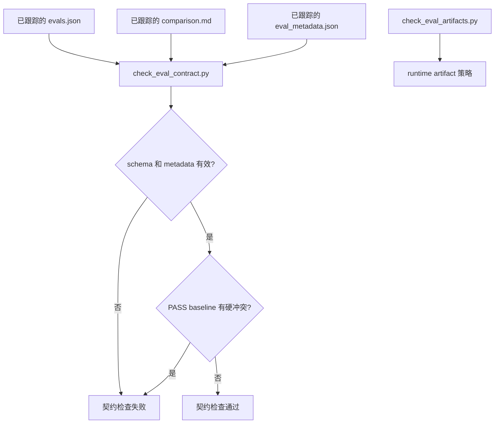
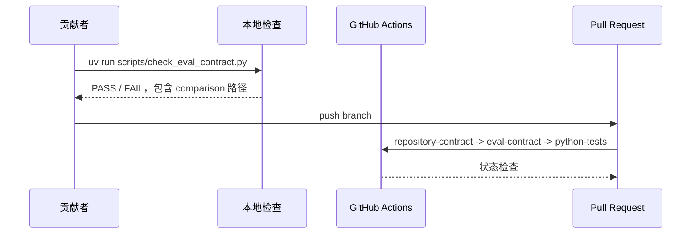

# 评测基线证据契约 TRD

## 1. 概述

本技术方案为 eval durable comparison 增加确定性仓库契约。核心规则保持窄范围：
tracked `comparison.md` 如果写有 `Latest result: PASS`，就不得把 baseline
描述为 diagnostic-only、blocked、skipped、not generated 或 not run，除非文件
同时明确说明该 eval 不需要 baseline。

方案扩展现有 eval 校验，不新增 runner，也不把 baseline 内容质量固化成脚本规则。
Baseline 的 PASS、FAIL 或 BLOCKED 应由运行 eval 的 sub-agent、fresh judge 或人工
reviewer 结合当前 skill、fixture 和实际运行结果判断。历史 comparison 文件只通过
durable Markdown 结果清理；runtime transcripts、diagnostics、outputs、timing、
run status 和 `comparison.auto.md` 继续不入库。

## 2. 来源文档与需求追踪

| 来源 | 需求 |
| --- | --- |
| `docs/pm/eval-baseline-evidence-contract/PRD.md` | 完整 PASS 不得与明确缺失或被阻塞的 baseline 状态冲突。 |
| GitHub issue #46 | 历史弱 baseline 文案必须移除、替换，或移出 PASS 语义。 |
| PR #45 `eval-010` 修复 | 完整 PASS 可引用真实 with-skill 和 without-skill subagent 结果，同时保持 runtime artifact 不入库。 |
| `AGENTS.md` eval artifact 策略 | Durable result 是 `comparison.md`；runtime artifacts 不得提交。 |

## 3. 架构概览



| 组件 | 职责 |
| --- | --- |
| `scripts/check_eval_contract.py` | 继续校验 eval schema 和 metadata；新增 durable comparison 硬冲突校验。 |
| `agents/test_eval_contract.py` | 覆盖合法和非法 comparison 证据模式。 |
| `agents/**/comparison.md` | 存储 durable latest result、baseline behavior、failures、next steps 和 artifact policy。 |
| `scripts/check_eval_artifacts.py` | 继续阻止 runtime artifact 文件入库；本次无需语义变更。 |

## 4. 技术栈

| 层级 | 技术 | 版本 | 选择理由 |
| --- | --- | --- | --- |
| 校验脚本 | Python | 项目默认 `uv` 环境 | 现有 eval contract checker 使用 Python。 |
| 测试运行 | pytest / unittest | 现有仓库配置 | `agents/test_eval_contract.py` 已验证 checker 行为。 |
| 产物格式 | Markdown | 现有 durable result 格式 | `comparison.md` 是已提交 eval 结果入口。 |
| Metadata 格式 | JSON | 现有 eval metadata 格式 | `evals.json` 和 `eval_metadata.json` 保持不变。 |

## 5. 数据模型

不新增持久化数据结构。Checker 通过保守的文本模式读取现有 Markdown。

| 字段 / Section | 含义 | 校验规则 |
| --- | --- | --- |
| `Latest result: PASS` | 完整 durable eval pass。 | 不得与明确缺失、blocked、skipped、not generated、not run 或 diagnostic-only baseline 状态并存。 |
| `Without Skill / Baseline` 或 `Baseline` | Baseline 对照 section。 | 在 PASS 下不得是 diagnostic-only、blocked、skipped、not generated 或 not run。 |
| `Latest result: PARTIAL` | 有价值但不完整的验证结果。 | 可以包含 baseline 缺失原因。 |
| `Latest result: BLOCKED` | Eval 未完整完成。 | 必须说明 blocker；不得表达完整 PASS。 |

## 6. 校验规则设计

### 6.1 候选文件

Checker 应校验从 `evals.json` workspace 解析出的每个 comparison 路径。也可以扫描
tracked `agents/**/comparison.md`，用于覆盖仍在 git 中但不属于 canonical eval
路径的历史布局。

### 6.2 PASS 识别

包含以下行时，将文件视为完整 PASS：

```text
Latest result: PASS
```

首版实现可使用精确短语判断，因为它符合当前 durable comparison 写法。未来若新增
结果格式，可再扩展为小型 parser。

### 6.3 PASS 下的 Baseline 硬冲突

检测到完整 PASS 后，如果 baseline 相关文本包含以下内容，则拒绝该文件：

- `Baseline behavior is diagnostic only.`
- `Baseline behavior remains diagnostic:`
- `BLOCKED`
- `SKIPPED`
- `not generated`
- `not run`

首版实现应保持模式简单，并对英文状态词做大小写不敏感判断。Checker 不判断
baseline 自由文本是否覆盖充分，也不要求固定的正向证据结构；这部分由
sub-agent / 人工 review 在写入 durable `comparison.md` 前完成。

### 6.4 允许状态

当 latest result 不是完整 PASS 时，checker 应允许不完整 baseline 描述，例如：

- `Latest result: PARTIAL - with-skill validation passed; baseline not generated`
- `Latest result: BLOCKED - baseline runner unavailable`

Checker 也应允许经 review 保留的完整 PASS，例如已修复的 `eval-010` comparison
记录了 with-skill 和 without-skill subagent ID 及结果；历史 comparison 中的
假设性 baseline 描述是否仍然可信，由后续 eval 刷新或 PR review 判断，而不是由
脚本推断。

## 7. 实现约束

- 改动集中在现有校验脚本和测试。
- 不新增 eval runner。
- 不在简单 section 级文本扫描足够时引入脆弱的完整 Markdown AST 解析。
- 不改变 `evals.json` schema version。
- 不修改无关 skill 文档、fixture 内容或格式。

## 8. 历史清理策略

历史 comparison 清理应保持确定性和可 review。

| 场景 | 需要的编辑 |
| --- | --- |
| 已知实际 without-skill baseline | 保留 `Latest result: PASS`；记录 baseline 运行日期、方式、结果，以及与 with-skill 的差异。 |
| 经 review 保留的历史 baseline 描述 | 可保留 `Latest result: PASS`；语义可信度由后续 eval 刷新或 PR review 判断，checker 不做自由文本质量判定。 |
| baseline 未生成 | 将 latest result 改为 `PARTIAL` 或 `BLOCKED`；说明 baseline 缺失原因。 |
| baseline 确实不适用 | 只有当文档明确解释 baseline 为何不需要且不违反 eval 契约时，才保留 `PASS`。 |
| 仍有 diagnostic-only 文案 | 替换成上述任一合法状态。 |

Issue 中记录的 72 个精确 diagnostic-only baseline 文件，以及 2 个额外 `remains diagnostic`
变体，默认应在同一批实现中处理，除非维护者选择分阶段清理。

## 9. 安全设计

不新增运行时安全面。主要安全约束是产物卫生：

- 不把 credentials、tokens、cookies、transcripts 或 runtime diagnostics 写入 git；
- 不执行不可信 Markdown 内容；
- deterministic contract check 不访问外部服务。

## 10. 部署架构

这是仓库本地治理变更，通过普通 PR 流程和现有 CI 检查发布。



## 11. 监控与可观测性

不需要生产监控。可观测性来自 checker 输出：

- 违规数量；
- 每个 invalid `comparison.md` 的路径；
- 每个违规的简短原因。

## 12. 测试策略

| 层级 | 范围 | 工具 | 覆盖目标 |
| --- | --- | --- | --- |
| 单元测试 | PASS + diagnostic-only baseline 应失败。 | pytest / unittest | 在 `agents/test_eval_contract.py` 覆盖 |
| 单元测试 | PASS + blocked / skipped / not generated baseline 应失败。 | pytest / unittest | 在 `agents/test_eval_contract.py` 覆盖 |
| 单元测试 | PARTIAL 或 BLOCKED + 明确 baseline 缺失原因应通过。 | pytest / unittest | 在 `agents/test_eval_contract.py` 覆盖 |
| 集成检查 | 历史清理后当前仓库没有 PASS 与明确缺失 / blocked baseline 状态并存。 | `uv run scripts/check_eval_contract.py` | PASS |
| 产物策略 | Runtime artifact 保持未入库。 | `uv run scripts/check_eval_artifacts.py` | PASS |

## 13. 验证命令

```bash
git diff --check
uv run scripts/check_repository_contract.py
uv run scripts/check_eval_contract.py
uv run scripts/check_eval_artifacts.py
uv run --with pytest pytest agents/test_eval_contract.py
```

如果更新历史 comparison 时实际运行了 skill eval 或 fresh Codex subagent
validation，必须在同一轮变更中更新对应 durable `comparison.md`，并保持 runtime
artifacts 不入库。

## 14. 回滚

标准 git revert 可移除 checker 变更、测试变更和历史 comparison 编辑。只回滚
checker、保留历史清理也是安全的，因为清理后的 comparison 仍然是更清晰的 durable
证据。

## 15. 风险与技术债

| 风险 / 技术债 | 影响 | 缓解 | 时间 |
| --- | --- | --- | --- |
| Pattern scan 不覆盖 baseline 语义质量。 | 可能留下需要人工判断的历史 comparison。 | Checker 只防硬冲突；baseline 质量由 sub-agent / 人工 review 和后续 eval 刷新负责。 | 实现阶段 |
| 批量 Markdown 编辑遮蔽真实 eval 差异。 | Reviewer 信心下降。 | 每处替换保持短小，并明确结果语义。 | 实现阶段 |
| 部分历史 eval 短期无法重跑。 | 无法保留完整 PASS。 | 使用 `PARTIAL` 或 `BLOCKED`，不伪造 baseline。 | 实现阶段 |
| canonical eval workspace 外仍有 legacy comparison 被 tracked。 | 契约覆盖可能不完整。 | 扫描 tracked comparison，或明确记录排除路径。 | 实现阶段 |

## 16. 待确认技术问题

| # | 问题 | 负责人 | 截止时间 |
| --- | --- | --- | --- |
| 1 | checker 应只扫描 eval-mapped comparison，还是扫描所有 tracked `agents/**/comparison.md`？ | 维护者 | 实现前 |
| 2 | `PARTIAL` 是否作为 with-skill pass 但 baseline 缺失时的推荐状态？ | 维护者 | 清理前 |
| 3 | 历史清理应一次性完成，还是按 agent 拆分 PR？ | 维护者 | 实现前 |

## 17. 交接条件

维护者接受 PRD 和 TRD 方向，或明确接受待确认问题不阻塞后，即可移交
`feature-implementor`。代码或历史 comparison 编辑开始前，应以本实施计划作为下一份可执行产物。
