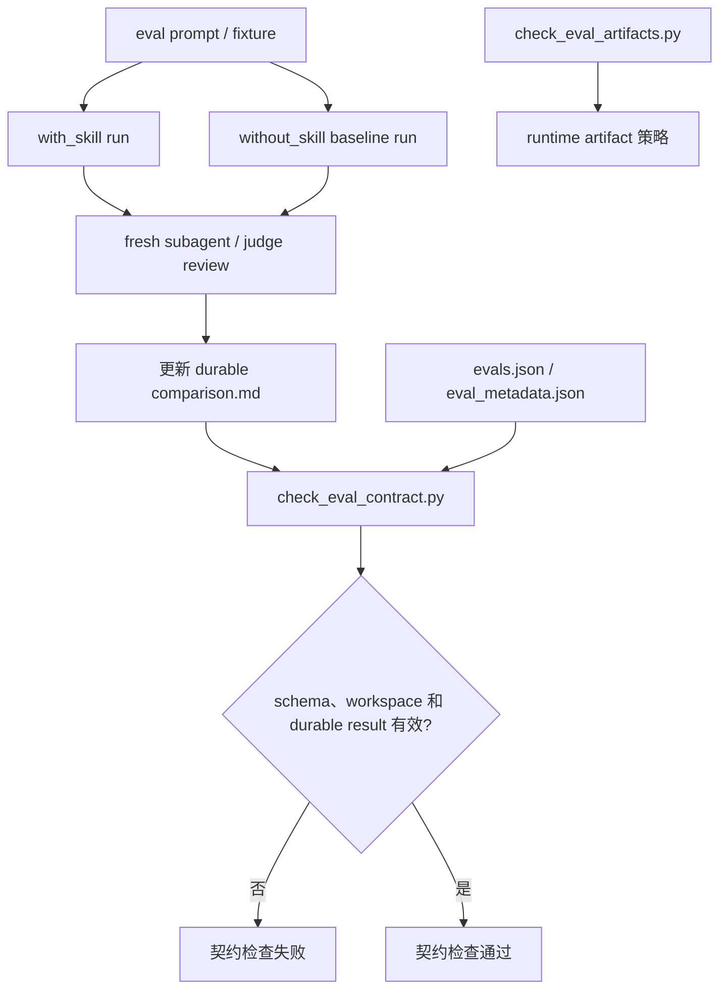
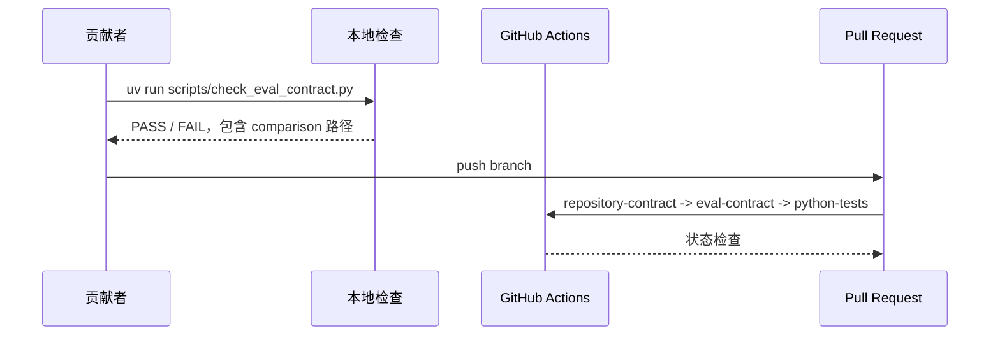

# 评测基线证据契约 TRD

## 1. 概述

本技术方案将 eval durable comparison 的确定性仓库契约收敛到结构和产物边界：
`check_eval_contract.py` 校验 eval schema、workspace、metadata 和 durable
`comparison.md` 是否存在，不再根据 `Without Skill / Baseline` 自由文本判断
PASS、PARTIAL 或 BLOCKED。

Baseline 是同一 eval prompt / fixture 下新生成的 `without_skill` 对照输入，用于帮助
sub-agent、fresh judge 或人工 reviewer 比较 with-skill 与 without-skill 表现。
最终结论以 durable `comparison.md` 的 `Latest result` 和正文解释为准。Runtime
transcripts、diagnostics、outputs、timing、run status 和 `comparison.auto.md`
继续不入库。

## 2. 来源文档与需求追踪

| 来源 | 需求 |
| --- | --- |
| `docs/pm/eval-baseline-evidence-contract/PRD.md` | Baseline 是 comparison 对照输入，不由 deterministic checker 做语义判定。 |
| GitHub issue #46 | 历史弱 baseline 文案暴露出 comparison 结论和 baseline 输入职责需要明确。 |
| PR #45 `eval-010` 修复 | 完整 PASS 可引用真实 with-skill 和 without_skill subagent 结果，同时保持 runtime artifact 不入库。 |
| `AGENTS.md` eval artifact 策略 | Durable result 是 `comparison.md`；runtime artifacts 不得提交。 |
| 用户确认方向 | baseline 是否可接受应看 `comparison.md` 的整体结论，不应固化成 baseline 文案脚本校验。 |

## 3. 架构概览



| 组件 | 职责 |
| --- | --- |
| `scripts/check_eval_contract.py` | 校验 eval schema、metadata、workspace 和 durable `comparison.md` 存在性。 |
| `agents/test_eval_contract.py` | 覆盖 schema、metadata、workspace、comparison 存在性和 baseline 语义不校验边界。 |
| `agents/**/comparison.md` | 存储 durable latest result、baseline behavior、failures、next steps 和 artifact policy。 |
| `AGENTS.md` 与 `README.md` | 定义 baseline 是 comparison 对照输入，最终结论以 `comparison.md` 为准。 |
| `agents/qa/test/run_eval.py` | QA fresh candidate / judge runner；报告 baseline 候选、verdict 和 baseline output 状态，但不把 baseline 缺失作为独立失败门禁。 |
| `agents/designer/test/run_eval.py`、`agents/devops/test/run_eval.py`、`agents/product_manager/test/idea-to-spec/run_eval.py` | deterministic helper runner；只把 with-skill 产物和 with-skill assertion 作为失败门禁，baseline output 和 baseline-target assertion 只报告。 |
| `scripts/check_eval_artifacts.py` | 继续阻止 runtime artifact 文件入库；本次无需语义变更。 |

## 4. 技术栈

| 层级 | 技术 | 版本 | 选择理由 |
| --- | --- | --- | --- |
| 校验脚本 | Python | 项目默认 `uv` 环境 | 现有 eval contract checker 使用 Python。 |
| 测试运行 | pytest / unittest | 现有仓库配置 | `agents/test_eval_contract.py` 已验证 checker 行为。 |
| 产物格式 | Markdown | 现有 durable result 格式 | `comparison.md` 是已提交 eval 结果入口。 |
| Metadata 格式 | JSON | 现有 eval metadata 格式 | `evals.json` 和 `eval_metadata.json` 保持不变。 |

## 5. 数据模型

不新增持久化数据结构。Checker 不解析 comparison 的自由文本语义，只确认 durable
`comparison.md` 存在。

| 字段 / Section | 含义 | 校验规则 |
| --- | --- | --- |
| `Latest result` | durable eval 结论入口。 | 由 sub-agent / fresh judge / reviewer 判断；checker 不解析其语义。 |
| `Without Skill / Baseline` 或 `Baseline` | without-skill 对照输入摘要。 | 可作为 comparison 证据；checker 不判断内容质量或状态。 |
| `without_skill` runtime result | 同一 eval prompt / fixture 下不加载 skill 的新运行输出。 | 作为 baseline 内容来源；不提交运行期产物，只把摘要写入 `comparison.md`。 |
| `comparison.md` | durable result 文件。 | eval workspace 必须包含该文件。 |

## 6. 校验规则设计

### 6.1 候选文件

Checker 校验从 `evals.json` workspace 解析出的 `comparison.md` 路径是否存在。
它不扫描 tracked `agents/**/comparison.md` 的自由文本，也不尝试识别 PASS、PARTIAL
或 BLOCKED。

### 6.2 Baseline 语义边界

Baseline 是 `without_skill` 对照输入，可能包含失败、阻塞、未生成目标产物等业务行为。
这些内容只有结合 skill、fixture、assertions 和 with-skill 结果才有意义，因此不适合用
deterministic regex 判定。

### 6.3 Fresh Subagent Baseline 生成协议

实际执行 skill eval 或 fresh Codex subagent validation 时，执行者必须完成：

1. 使用 eval 定义中的 prompt、fixture 和 assertions 运行 `with_skill`。
2. 使用同一 prompt 和 fixture，在不读取或应用目标 skill / Agent README 的条件下重新生成新的 `without_skill` baseline。
3. 将两路结果交给 fresh subagent / judge 做语义评审。
4. 在 durable `comparison.md` 中记录 with-skill 行为、without_skill baseline 行为、latest result、失败项、next steps 和 runtime artifact policy。

不得复用历史 baseline 充当本次 Fresh Sub-Agent 结果。如果新的 `without_skill`
baseline 不能生成、没有 judge verdict，或无法被 reviewer 判断，应由
sub-agent / reviewer 在 `comparison.md` 中说明其对 `Latest result` 的影响。

### 6.4 Deterministic Runner Baseline 边界

确定性 runner 可以继续检查并报告 baseline 相关路径和断言，便于 reviewer 判断
comparison 是否可信。但 runner failure 只来自 with-skill 路径：

- `with_skill_outputs` 缺失；
- with-skill candidate / verdict 缺失或失败；
- assertion target 不在 `without_skill/` 或 `baseline/` 下且机器断言失败。

`without_skill_outputs`、`baseline_outputs`、`baseline_output`、
`baseline_skill_outputs` 和 target 位于 `without_skill/` 或 `baseline/` 下的
assertion 都是 comparison 证据输入，只报告 PASS / FAIL 状态，不独立导致 runner
失败。

## 7. 实现约束

- 改动集中在现有校验脚本、runner、测试和仓库指导文档。
- 不新增 eval runner；现有 QA、Designer、DevOps 和 Product Manager runner 继续报告 baseline 证据状态，但不把 baseline 缺失或 baseline-target assertion 失败作为独立失败门禁。
- 不引入 Markdown AST 或 regex baseline 语义扫描。
- 不改变 `evals.json` schema version。
- 不修改无关 skill 文档、fixture 内容或格式。

## 8. 历史清理策略

历史 comparison 清理应保持确定性和可 review。

| 场景 | 需要的编辑 |
| --- | --- |
| 已知实际 without_skill baseline | 在 `comparison.md` 中记录 baseline 运行日期、方式、结果，以及与 with-skill 的差异。 |
| 经 review 保留的历史 baseline 描述 | 可保留；语义可信度由后续 eval 刷新或 PR review 判断，checker 不做自由文本质量判定。 |
| baseline 未生成 | 由 reviewer/sub-agent 在 `Latest result` 和 failures/next steps 中说明其影响。 |
| baseline 确实不适用 | 在 `comparison.md` 中解释不适用原因。 |
| 仍有 diagnostic-only 文案 | 由 reviewer 判断是否需要更新 comparison 结论；checker 不拦截。 |

历史 comparison 是否需要刷新由 reviewer 根据 release 或 skill 更新需要判断，不由
baseline 文案 checker 强制清理；但新执行的 Fresh Sub-Agent validation 必须生成新的
without_skill baseline。

## 9. 安全设计

不新增运行时安全面。主要安全约束是产物卫生：

- 不把 credentials、tokens、cookies、transcripts 或 runtime diagnostics 写入 git；
- 不执行不可信 Markdown 内容；
- deterministic contract check 不访问外部服务。

## 10. 部署架构

这是仓库本地治理变更，通过普通 PR 流程和现有 CI 检查发布。



## 11. 监控与可观测性

不需要生产监控。可观测性来自 checker 输出：

- 缺失或非法 eval 定义路径；
- 缺失的 workspace、`eval_metadata.json` 或 durable `comparison.md`；
- runtime artifact policy 违规路径。

## 12. 测试策略

| 层级 | 范围 | 工具 | 覆盖目标 |
| --- | --- | --- | --- |
| 单元测试 | baseline 自由文本不触发 contract failure。 | pytest / unittest | 在 `agents/test_eval_contract.py` 覆盖 |
| 单元测试 | workspace 缺少 durable `comparison.md` 应失败。 | pytest / unittest | 既有测试覆盖 |
| 单元测试 | PARTIAL 或 BLOCKED 等 latest result 文案不由 checker 解析。 | pytest / unittest | 在 baseline 语义不校验测试中覆盖 |
| 单元测试 | baseline output 或 baseline-target assertion 失败不触发 runner failure。 | pytest / unittest | 覆盖 QA、Designer、DevOps 和 Product Manager runner |
| 集成检查 | 当前仓库 eval schema、metadata 和 durable comparison 存在性有效。 | `uv run scripts/check_eval_contract.py` | PASS |
| 产物策略 | Runtime artifact 保持未入库。 | `uv run scripts/check_eval_artifacts.py` | PASS |

## 13. 验证命令

```bash
git diff --check
uv run scripts/check_repository_contract.py
uv run scripts/check_eval_contract.py
uv run scripts/check_eval_artifacts.py
uv run --with pytest pytest agents/qa/test/test_qa_run_eval.py agents/designer/test/test_designer_run_eval.py agents/devops/test/test_devops_run_eval.py agents/product_manager/test/idea-to-spec/test_pm_run_eval.py agents/test_eval_contract.py
```

如果更新历史 comparison 时实际运行了 skill eval 或 fresh Codex subagent
validation，必须生成新的 without_skill baseline，在同一轮变更中更新对应 durable
`comparison.md`，并保持 runtime artifacts 不入库。

## 14. 回滚

标准 git revert 可移除 checker 变更、测试变更和历史 comparison 编辑。只回滚
checker、保留历史清理也是安全的，因为清理后的 comparison 仍然是更清晰的 durable
证据。

## 15. 风险与技术债

| 风险 / 技术债 | 影响 | 缓解 | 时间 |
| --- | --- | --- | --- |
| Checker 不覆盖 baseline 语义质量。 | 需要 reviewer 判断 comparison 结论。 | 明确 baseline 是 comparison 输入，PR 结论必须与 committed comparison 一致。 | 实现阶段 |
| 批量 Markdown 编辑遮蔽真实 eval 差异。 | Reviewer 信心下降。 | 每处替换保持短小，并明确结果语义。 | 实现阶段 |
| 部分历史 eval 短期无法重跑。 | reviewer 需要判断旧 comparison 是否仍可信。 | 后续执行 Fresh Sub-Agent validation 时生成新的 baseline 并更新 durable comparison。 | 实现阶段 |
| canonical eval workspace 外仍有 legacy comparison 被 tracked。 | 契约只覆盖 canonical eval workspace。 | 以 `evals.json` workspace 为 contract 来源。 | 实现阶段 |

## 16. 待确认技术问题

| # | 问题 | 负责人 | 截止时间 |
| --- | --- | --- | --- |
| 1 | checker 应只扫描 eval-mapped comparison，还是扫描所有 tracked `agents/**/comparison.md`？ | 维护者 | 已确认：只校验 eval-mapped durable comparison 存在性，不扫描自由文本语义。 |
| 2 | `PARTIAL` 是否作为 with-skill pass 但 baseline 缺失时的推荐状态？ | 维护者 | 已确认：可用，但最终由 reviewer/sub-agent 在 comparison 中判断。 |
| 3 | 历史清理应一次性完成，还是按 agent 拆分 PR？ | 维护者 | 已确认：不再由 baseline 文案 checker 强制清理。 |

## 17. 交接条件

维护者接受 PRD 和 TRD 方向，或明确接受待确认问题不阻塞后，即可移交
`feature-implementor`。代码或历史 comparison 编辑开始前，应以本实施计划作为下一份可执行产物。
