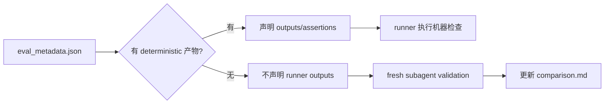

# Eval Comparison 覆盖实施计划

## 背景

GitHub issue #23 记录了 durable `comparison.md` 与实际 eval 结论不一致的问题。`comparison.md` 是外部判断 skill 更新后是否仍然可用的长期证据，因此覆盖范围需要从“带 workspace 的 eval”扩展为“所有 eval item”。

当前仓库共有 76 个 eval item，其中 34 个已有显式 workspace 并能映射到 `comparison.md`，42 个仍为 `workspace: null`。此外，`github-reader` 存在 `iteration-1` 和 `iteration-2` 两套历史 comparison，需要只保留更新后的 comparison，并迁移到统一命名结构。

## 目标

- 每个 eval item 都有显式 workspace。
- 每个 eval workspace 都包含 `eval_metadata.json` 和 durable `comparison.md`。
- `comparison.md` 作为 eval item 级别的唯一长期结论入口。
- `github-reader` 只保留最新 comparison 结果，并统一为 canonical workspace 命名。
- 当前版本 skill 的 fresh subagent validation 结论回写到对应 `comparison.md`。
- 仓库契约阻止后续新增 `workspace: null` 或缺失 durable comparison 的 eval。

## 非目标

- 不提交模型运行期产物，例如 transcript、verdict、diagnostics、`comparison.auto.md`。
- 不把所有 prompt-only eval 扩展成完整业务项目 fixture；只补最小可验证 workspace。
- 不改变 eval assertion 语义，除非为匹配新增 workspace 路径必须做最小调整。
- 不清理与 issue #23 无关的文档或历史测试资产。

## Deterministic runner 边界

Skill eval 默认通过 fresh subagent validation 做语义判断。`subagent-verdict.md`
只是 Codex 或 Claude Code subagent validation 的运行期诊断产物，不是
durable result，不提交到 git，也不作为 `eval_metadata.json` 中的 runner
必检 output。

`eval_metadata.json` 只描述 eval 输入、fixture、可清理路径和当前
deterministic runner 能真实生成或检查的产物。没有 deterministic 产物的 eval
不得声明 deterministic runner 流程；它只保留 metadata 描述和 durable
`comparison.md`，语义结论由 fresh subagent validation 后回写到
`comparison.md`。



QA eval 的 subagent 或 Claude/Codex 调用可以作为 E2E 执行方式，但
`subagent-verdict.md` 仍然只是内部 judge 诊断。QA metadata 应校验实际 QA
测试产物，例如测试报告、用例文件、执行摘要或 evidence，而不是校验 judge
verdict 文件是否存在。

| 类型 | metadata 约定 |
| --- | --- |
| 有 deterministic 产物的 eval | 保留 `with_skill_outputs`、`without_skill_outputs` 或机器断言，路径必须指向 runner 能生成或检查的真实产物 |
| 无 deterministic 产物的 eval | 不声明 runner output；保留 `eval_id`、`eval_name`、`workspace_root`、`skill_availability_goal`、`prompt`、`fixture_context` 等描述字段 |
| subagent validation 诊断 | 不写入 `validation_method`，不把 `subagent-verdict.md` 写入 outputs，不提交运行期 verdict |

## 当前覆盖盘点

| 类别 | 数量 |
| --- | ---: |
| eval item 总数 | 76 |
| 已有显式 workspace 的 eval | 34 |
| 当前 `workspace: null` 的 eval | 42 |
| 已有 durable `comparison.md` 总数 | 43 |
| 需要迁移或新增 workspace 的 eval | 42 |
| 预计需要当前版本 subagent validation 的 eval | 59 |
| 已有当前版本 comparison 可跳过的 eval | 17 |

## 需要补 workspace 的 eval

| Skill | 数量 | Eval |
| --- | ---: | --- |
| `designer/ui-ux-design` | 2 | `eval-002-ecommerce`, `eval-003-with-reference` |
| `designer/visual-design` | 1 | `eval-003-professional` |
| `devops/cicd-bootstrap` | 1 | `eval-001-github-actions-docker` |
| `devops/deployment-planner` | 2 | `eval-001-nextjs-web-app`, `eval-002-python-api-only` |
| `devops/incident-playbook-writer` | 1 | `eval-001-docker-rollback` |
| `engineer/codebase-analyzer` | 2 | `eval-001-analyze-nodejs-project`, `eval-002-detect-monorepo` |
| `engineer/debugger` | 2 | `eval-002-repair-plan-confirmation-gate`, `eval-003-bug-report-conflicts-with-prd` |
| `engineer/delivery` | 1 | `eval-001-create-pr-with-commits` |
| `engineer/engineer-agent` | 1 | `eval-002-existing-feature-alignment-gate` |
| `engineer/feature-implementor` | 4 | `eval-001-implement-from-prd-trd`, `eval-004-small-change-plan-gate`, `eval-005-existing-behavior-change-needs-pm`, `eval-006-small-bug-fix-plan-gate` |
| `engineer/project-bootstrap` | 2 | `eval-001-bootstrap-nextjs-project`, `eval-002-defer-bootstrap-without-spec` |
| `engineer/test-writer` | 1 | `eval-001-write-tests-from-spec` |
| `engineer/trd-gen` | 2 | `eval-001-prd-to-engineer-trd`, `eval-002-resolve-trd-gap-packet` |
| `product_manager/changelog-generator` | 3 | `eval-001-unreleased-mode`, `eval-002-single-version-mode`, `eval-003-prefix-classification` |
| `product_manager/competitive-brief` | 1 | `eval-001-positioning-gap-brief` |
| `product_manager/competitive-intelligence` | 1 | `eval-001-interactive-battlecard` |
| `product_manager/github-reader` | 3 | `eval-001-full-status`, `eval-002-focused-pr-query`, `eval-003-milestone-focused` |
| `security/appsec-checklist` | 3 | `eval-001-sql-injection`, `eval-002-auth-bypass`, `eval-003-xss` |
| `security/authz-reviewer` | 3 | `eval-001-rbac`, `eval-002-session`, `eval-003-jwt` |
| `security/dependency-risk-auditor` | 3 | `eval-001-npm-audit`, `eval-002-abandoned`, `eval-003-python` |
| `security/privacy-surface-mapper` | 3 | `eval-001-gdpr`, `eval-002-user-rights`, `eval-003-third-party` |

## 命名规则

所有 eval workspace 使用以下命名规则：

```text
agents/{agent}/test/{skill}/evals/workspace/{eval-id}/
```

每个 workspace 内固定包含：

```text
eval_metadata.json
comparison.md
```

已有不同布局的 workspace 可以保留原路径，除非存在重复历史结果或路径与 `evals.json` 无法对应。新建或迁移的 workspace 必须使用 `{eval-id}` 作为目录名，避免 `eval-1-*`、`iteration-*` 和 `eval-001-*` 混用。

## github-reader comparison 迁移

`github-reader` 当前存在两套历史 comparison：

```text
agents/product_manager/test/github-reader/workspace/iteration-1/eval-1-full-status/comparison.md
agents/product_manager/test/github-reader/workspace/iteration-1/eval-2-focused-pr/comparison.md
agents/product_manager/test/github-reader/workspace/iteration-1/eval-3-milestone/comparison.md
agents/product_manager/test/github-reader/workspace/iteration-2/eval-1-full-status/comparison.md
agents/product_manager/test/github-reader/workspace/iteration-2/eval-2-focused-pr/comparison.md
agents/product_manager/test/github-reader/workspace/iteration-2/eval-3-milestone/comparison.md
```

保留 `iteration-2` 的最新结果，迁移为：

```text
agents/product_manager/test/github-reader/evals/workspace/eval-001-full-status/comparison.md
agents/product_manager/test/github-reader/evals/workspace/eval-002-focused-pr-query/comparison.md
agents/product_manager/test/github-reader/evals/workspace/eval-003-milestone-focused/comparison.md
```

删除 `iteration-1` 历史 comparison。迁移后 `evals.json` 的 `workspace` 字段指向新的 canonical workspace。

## 文件变更清单

1. 更新 `AGENTS.md`
   - 将 `workspace` 从可为 `null` 改为所有 eval 必须显式配置 workspace。
   - 明确所有 eval 都必须有 durable `comparison.md`。

2. 更新 `scripts/check_eval_contract.py`
   - 禁止 `workspace: null`。
   - 对所有 eval item 强制检查 workspace、`eval_metadata.json` 和 `comparison.md`。
   - 保持路径安全检查和 metadata 字段检查。

3. 更新 `agents/test_eval_contract.py`
   - 增加覆盖 `workspace: null` 会失败的断言。
   - 保留现有 artifact checker 行为。

4. 更新 21 个 `evals.json`
   - 将 42 个 `workspace: null` 改为 canonical workspace 路径。
   - `github-reader` 映射到迁移后的 3 个 canonical workspace。
   - `changelog-generator` 映射到 canonical workspace，并迁移现有 comparison。

5. 新增或迁移 eval workspace
   - 为 42 个原 `workspace: null` eval 补 `eval_metadata.json`。
   - 为缺失 durable 结果的 eval 补 `comparison.md`。
   - 对已有历史 comparison 的 eval，迁移并按当前模板补齐缺失字段。

6. 清理重复历史 comparison
   - 删除 `github-reader` 的 `iteration-1` comparison。
   - 删除或迁移 `github-reader` 的 `iteration-2` 旧路径。
   - 保证每个 eval item 只对应一个当前 durable `comparison.md`。

7. 统一 metadata 与 runner 边界
   - 删除所有 `validation_method: "fresh_codex_subagent"` 字段。
   - 删除所有指向 `subagent-verdict.md` 的 `with_skill_outputs` 和 `without_skill_outputs`。
   - 无 deterministic 产物的 eval 不再声明 runner outputs 或 runner-only diagnostics。
   - 有 deterministic 产物的 eval 继续保留真实产物路径和机器断言。

8. 收紧 metadata 契约
   - `check_eval_contract.py` 禁止 metadata 出现 `validation_method`。
   - output metadata 禁止指向 `subagent-verdict.md`。
   - 保持 `eval_metadata.json`、`comparison.md` 和 workspace 路径检查。

9. 更新现有 runner 文档和测试
   - Designer / DevOps runner 不再用 `fresh_codex_subagent` 分支作为特殊协议。
   - 无 deterministic 产物的 metadata 不进入 deterministic runner 流程或被 runner 标记为不适用。
   - QA runner 若执行 subagent 或 Codex/Claude judge，只把 verdict 当内部诊断；metadata 校验实际 QA/E2E 测试产物。

## 实施顺序

1. 建立 canonical workspace 覆盖
   - 为 42 个 `workspace: null` eval 创建最小 workspace。
   - 为每个 workspace 写入 `eval_metadata.json` 和初始 `comparison.md`。

2. 迁移历史 comparison
   - 迁移 `github-reader` 的 `iteration-2` 最新结果。
   - 迁移 `changelog-generator` 的现有 comparison。
   - 删除重复或不再被 `evals.json` 引用的历史 comparison。

3. 收紧仓库契约
   - 更新 `AGENTS.md`、`check_eval_contract.py` 和确定性测试。
   - 运行 `uv run scripts/check_eval_contract.py` 确认 76 个 eval 全部可定位 durable comparison。

4. 执行当前版本 subagent validation
   - 对缺少当前版本结论的 eval 执行 fresh Codex subagent validation。
   - 将结论回写到对应 `comparison.md`。
   - 对已有当前版本 comparison 的 eval 标记为跳过，并在汇总中列明原因。

5. 统一 runner 边界和 metadata 语义
   - 扫描所有 `eval_metadata.json`，删除 `validation_method`。
   - 删除指向 `subagent-verdict.md` 的 output 字段；无其它真实产物时不补假产物。
   - 按是否存在真实 deterministic 产物，把 eval 分成 runner 可执行和 runner 不适用两类。
   - 更新 Designer、DevOps、QA runner 与 README，避免把 subagent verdict 当作必检产物。

6. 收紧防回归契约
   - 禁止后续 metadata 重新加入 `validation_method`。
   - 禁止 output metadata 指向 `subagent-verdict.md`。
   - 保证无 deterministic 产物的 eval 仍能通过 durable comparison 契约。

7. 最终验证
   - 运行仓库契约、eval 契约、runtime artifact 和确定性 pytest。

## Subagent validation 范围

预计需要执行当前版本 validation 的 eval 为 59 个，覆盖 26 个 skill：

| Skill | 结果数 |
| --- | ---: |
| `designer/ui-ux-design` | 4 |
| `designer/visual-design` | 2 |
| `devops/cicd-bootstrap` | 1 |
| `devops/deployment-planner` | 2 |
| `devops/env-config-auditor` | 1 |
| `devops/incident-playbook-writer` | 1 |
| `engineer/codebase-analyzer` | 2 |
| `engineer/debugger` | 2 |
| `engineer/delivery` | 1 |
| `engineer/engineer-agent` | 2 |
| `engineer/feature-implementor` | 6 |
| `engineer/project-bootstrap` | 2 |
| `engineer/test-writer` | 1 |
| `engineer/trd-gen` | 2 |
| `product_manager/changelog-generator` | 3 |
| `product_manager/competitive-brief` | 1 |
| `product_manager/competitive-intelligence` | 1 |
| `product_manager/idea-to-spec` | 5 |
| `product_manager/release-notes-generator` | 3 |
| `qa/exploratory-tester` | 2 |
| `qa/qa-agent` | 1 |
| `qa/spec-based-tester` | 2 |
| `security/appsec-checklist` | 3 |
| `security/authz-reviewer` | 3 |
| `security/dependency-risk-auditor` | 3 |
| `security/privacy-surface-mapper` | 3 |

## 可跳过 validation 的 eval

已有当前版本 comparison 的 eval 可跳过重新测试，但仍需保证其 workspace 和 metadata 满足新契约。当前可跳过数量为 17 个，覆盖：

- `designer/designer-agent`
- `devops/devops-agent`
- `engineer/debugger` 的 `eval-001-fix-failing-test`
- `product_manager/github-reader` 的 3 个 `iteration-2` 最新结果
- `product_manager/pm-agent`
- `product_manager/roadmap-generator`
- `qa/bug-analyzer`
- `qa/qa-agent` 的 `eval-002-empty-qa-directory-expands-cases`
- `qa/regression-suite`
- `security/security-agent`

## 验证命令

```bash
uv run scripts/check_repository_contract.py
uv run scripts/check_eval_contract.py
uv run scripts/check_eval_artifacts.py
uv run --with pytest pytest agents/test_eval_contract.py
```

如修改 eval runner 或相关 Python 测试，再补充对应 agent 测试命令。

Runner 边界调整后补充运行：

```bash
uv run --with pytest pytest agents/designer/test/test_designer_run_eval.py
uv run --with pytest pytest agents/devops/test/test_devops_run_eval.py
uv run --with pytest pytest agents/qa/test/test_qa_run_eval.py
```

## 风险与处理

| 风险 | 处理 |
| --- | --- |
| 42 个 prompt-only eval 一次性补 workspace 造成 diff 较大 | 按 agent 或 skill 分批提交，但保持同一命名规则和契约目标 |
| 外部数据类 eval 结果不稳定 | `comparison.md` 记录执行日期、数据来源和不可复现因素 |
| 旧 comparison 与新 eval id 无法一一对应 | 只迁移能明确对应的最新结果，无法确认的结果重新 validation |
| 运行期产物误提交 | 运行 `uv run scripts/check_eval_artifacts.py`，并只提交 durable `comparison.md` |
| 无产物 eval 被 deterministic runner 误判失败 | 无 deterministic 产物时不声明 runner outputs，runner 不把 subagent verdict 当作必检产物 |
| QA runner 把 judge verdict 当成 eval 产物 | QA metadata 改为校验实际 QA/E2E 测试结果，judge verdict 仅作为运行期诊断 |

## 完成标准

- `evals.json` 中不存在 `workspace: null`。
- 76 个 eval item 都能定位到唯一 `comparison.md`。
- 每个 workspace 都有 `eval_metadata.json`。
- `github-reader` 只保留 canonical workspace 下的最新 comparison。
- metadata 中不存在 `validation_method`。
- output metadata 不指向 `subagent-verdict.md`。
- 无 deterministic 产物的 eval 不附带 deterministic runner 流程。
- 所有 required verification 命令通过。
- PR 评论、对话结论和 committed `comparison.md` 保持一致。
