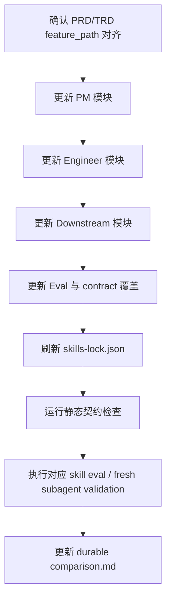
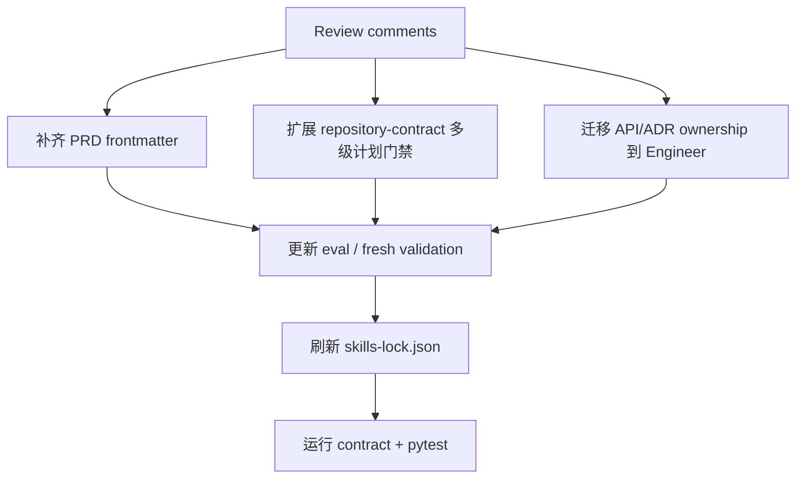

# PRD/TRD 多级功能目录契约实施计划

## 1. 实施上下文

本计划承接 `docs/pm/feature-path-contract/PRD.md` 和 `docs/engineer/feature-path-contract/TRD.md`，目标是把仓库内单层 `{feature-name}` 文档契约升级为最多三级 `{feature_path}`，并确保 PRD、TRD、`IMPLEMENTATION_PLAN.md` 及下游消费方不会错误生成并列目录或引用错误文档。

### 1.1 计划门禁

| 门禁 | 当前结果 | 证据 |
| --- | --- | --- |
| PRD 存在 | 通过 | `docs/pm/feature-path-contract/PRD.md` |
| TRD 存在 | 通过 | `docs/engineer/feature-path-contract/TRD.md` |
| PRD/TRD `feature_path` 对齐 | 通过 | 两者均为 `feature-path-contract` |
| PRD/TRD `parent_feature` 对齐 | 通过 | 两者均为 `N/A` |
| PRD/TRD `feature_level` 对齐 | 通过 | 两者均为 `"1"` |
| TRD `related_prd` 匹配 | 通过 | `docs/engineer/feature-path-contract/TRD.md` 指向同一路径 PRD |

后续进入 skill 修改前仍需确认本实施计划。实施阶段不能扩展到本计划未列出的功能，也不能在缺少 PRD/TRD 路径对齐时继续生成计划、代码或 E2E 产物。



## 2. 实施范围

### 2.1 PM 模块

PM 模块负责识别、生成和更新产品文档的 `feature_path`，是路径归属来源。

| 文件 | 操作 | 修改目标 | 来源 |
| --- | --- | --- | --- |
| `agents/product_manager/skills/idea-to-spec/SKILL.md` | 修改 | 将 feature document memory、deliverable shapes 和 PM-first routing 从 `{feature-name}` 升级为 `{feature_path}`；明确最多三级和旧单层兼容。 | PRD FR-001, FR-002, FR-003；TRD §4.1 |
| `agents/product_manager/skills/idea-to-spec/_internal/_shared/skill-map.md` | 修改 | Handoff packet 增加 `feature_path`、`feature`、`parent_feature`、`feature_level`、`feature_path_evidence`。 | PRD FR-006；TRD §3.3 |
| `agents/product_manager/skills/idea-to-spec/_internal/_shared/gen-conventions.md` | 修改 | 增加写入前扫描 `docs/pm/**/PRD.md`、父功能识别、路径不清 blocked 和 no directory drift 规则。 | PRD FR-002；TRD §4.1 |
| `agents/product_manager/skills/idea-to-spec/_internal/_shared/output-conventions.md` | 修改 | 统一 `docs/<agent-short>/{feature_path}/<DOC>.md` 路径和正式文档 frontmatter 字段。 | PRD FR-003, FR-005；TRD §5 |
| `agents/product_manager/skills/idea-to-spec/_internal/_shared/doc-schemas/prd-schema.md` | 修改 | PRD schema 增加 `feature_path`、`parent_feature`、`feature_level` 和兼容说明。 | PRD FR-005；TRD §3.2 |
| `agents/product_manager/skills/idea-to-spec/_internal/_shared/doc-schemas/brd-schema.md` | 修改 | BRD schema 镜像 PM feature path 字段。 | PRD FR-003, FR-005 |
| `agents/product_manager/skills/idea-to-spec/_internal/_shared/doc-schemas/test-spec-schema.md` | 修改 | Test Spec 消费同一 feature path，避免测试规格漂移。 | PRD FR-009 |
| `agents/product_manager/skills/idea-to-spec/_internal/_shared/doc-schemas/trd-schema.md` | 修改 | PM 侧 TRD schema 引用同一 feature path，保持旧路径兼容。 | PRD FR-004, FR-005 |
| `agents/product_manager/skills/idea-to-spec/_internal/gen/prd-gen/INSTRUCTIONS.md` | 修改 | PRD 生成前扫描父 PRD；父功能不明确时 blocked 或澄清；不得创建疑似并列顶层目录。 | PRD US-001, FR-002；TRD §4.1 |
| `agents/product_manager/skills/idea-to-spec/_internal/gen/brd-gen/INSTRUCTIONS.md` | 修改 | BRD 写入 `docs/pm/{feature_path}/BRD.md`，与 PRD 同目录。 | PRD FR-003 |
| `agents/product_manager/skills/idea-to-spec/_internal/gen/tspecs-gen/INSTRUCTIONS.md` | 修改 | 测试规格引用 `feature_path`，并读取同路径 PRD/TRD。 | PRD FR-009 |
| `agents/product_manager/skills/idea-to-spec/_internal/iteration/prd-iteration/INSTRUCTIONS.md` | 修改 | 更新已有 PRD 前校验路径和 frontmatter 一致；误放并列目录必须先输出冲突分析。 | PRD FR-011；TRD §6.2 |
| `agents/product_manager/skills/idea-to-spec/_internal/orchestration/iteration-coordinator/INSTRUCTIONS.md` | 修改 | 迭代协调时携带 feature path 证据，禁止下游凭末级名称自行选路径。 | PRD FR-006 |
| `agents/product_manager/skills/idea-to-spec/_internal/orchestration/project-init/INSTRUCTIONS.md` | 修改 | 新项目初始化时保留一级路径默认值，同时允许后续子功能路径。 | PRD FR-010 |

### 2.2 Engineer 模块

Engineer 模块负责镜像 PM 路径，并在 TRD、实施计划、调试流程中执行硬门禁。

| 文件 | 操作 | 修改目标 | 来源 |
| --- | --- | --- | --- |
| `agents/engineer/skills/engineer-agent/SKILL.md` | 修改 | Existing Feature Alignment Gate 改为按 `feature_path` 查找 PRD、TRD、DECISIONS 和实现计划。 | PRD FR-004, FR-007；TRD §4.2 |
| `agents/engineer/skills/trd-gen/SKILL.md` | 修改 | TRD 输出路径改为 `docs/engineer/{feature_path}/TRD.md`；缺 PRD 或 PRD 路径不清时回 PM。 | PRD US-002；TRD §4.2 |
| `agents/engineer/skills/trd-gen/_internal/trd-schema.md` | 修改 | 增加 feature path frontmatter、`related_prd` 镜像校验和旧单层兼容。 | PRD FR-005；TRD §3.2 |
| `agents/engineer/skills/feature-implementor/SKILL.md` | 修改 | 写实施计划前校验 PRD/TRD feature path、frontmatter 和 `related_prd` 一致；缺 PRD 回 PM，缺 TRD 回 `trd-gen`。 | PRD US-003, FR-007；TRD §4.3 |
| `agents/engineer/skills/feature-implementor/_internal/planner/INSTRUCTIONS.md` | 修改 | Planner 输入、输出路径、sub-agent 任务包和 blocker 规则全部升级为 `{feature_path}`。 | PRD FR-007；TRD §4.3 |
| `agents/engineer/skills/feature-implementor/_internal/_shared/output-conventions.md` | 修改 | 实施计划输出约定增加 `feature_path`、`parent_feature`、`feature_level` 和 `related_trd`。 | PRD FR-005；TRD §5 |
| `agents/engineer/skills/debugger/SKILL.md` | 修改 | bug 修复前按 feature path 对齐 PRD/TRD；需求变化回 PM，TRD gap 回 `trd-gen`。 | PRD FR-008；TRD §4.4 |
| `agents/engineer/skills/project-bootstrap/SKILL.md` | 修改 | 查找 specs 时支持嵌套 PRD/TRD，避免浅层扫描误判缺 spec。 | PRD FR-010 |
| `agents/engineer/README.md` | 修改 | 同步主入口文档中的 PRD/TRD/IMPLEMENTATION_PLAN 路径链路。 | TRD §5 |

### 2.3 Downstream 模块

Downstream 模块不拥有 feature path 决策权，只消费 PM/Engineer 已确认的路径。

| 文件或目录 | 操作 | 修改目标 | 来源 |
| --- | --- | --- | --- |
| `agents/designer/skills/designer-agent/SKILL.md` | 修改 | 设计 handoff 读取 `docs/pm/{feature_path}`，输出 `docs/design/{feature_path}`。 | PRD US-006, FR-009 |
| `agents/designer/skills/ui-ux-design/SKILL.md` | 修改 | UI/UX spec 输出路径镜像 PM feature path。 | PRD FR-009 |
| `agents/designer/skills/visual-design/SKILL.md` | 修改 | Visual system 文档按 feature path 落位，不自建同义顶层目录。 | PRD FR-009 |
| `agents/qa/skills/qa-agent/SKILL.md` | 修改 | QA 范围确认读取同一路径 PRD/TRD/Plan；E2E 目录继续使用三级功能树。 | PRD FR-009；TRD §4.4 |
| `agents/qa/skills/spec-based-tester/SKILL.md` | 修改 | 从 spec 生成测试前检查 `feature_path` 和已确认实施计划。 | PRD FR-009 |
| `agents/qa/skills/regression-suite/SKILL.md` | 修改 | 回归验证按 feature path 复用历史 E2E 资产。 | PRD FR-009 |
| `agents/qa/skills/bug-analyzer/SKILL.md` | 修改 | bug artifact 引用同一路径 PRD/TRD，避免缺路径时扩大分析范围。 | PRD FR-008, FR-009 |
| `agents/qa/skills/exploratory-tester/SKILL.md` | 修改 | 探索测试前定位 feature path，避免写入错误 QA 功能树。 | PRD FR-009 |
| `agents/devops/skills/devops-agent/SKILL.md` | 修改 | feature-scoped DevOps routing 消费 `docs/engineer/{feature_path}/TRD.md`。 | PRD FR-009 |
| `agents/devops/skills/deployment-planner/SKILL.md` | 修改 | 部署计划输出 `docs/devops/{feature_path}`，路径不清回 Engineer。 | PRD FR-009 |
| `agents/devops/skills/cicd-bootstrap/SKILL.md` | 修改 | CI/CD 变更引用同一路径 TRD/Plan。 | PRD FR-009 |
| `agents/devops/skills/env-config-auditor/SKILL.md` | 修改 | 环境配置审计报告使用 feature path。 | PRD FR-009 |
| `agents/devops/skills/incident-playbook-writer/SKILL.md` | 修改 | runbook 与 rollback 文档引用同一路径 Engineer 文档。 | PRD FR-009 |
| `agents/security/skills/security-agent/SKILL.md` | 修改 | security routing 使用 feature path 读取 PM/Engineer 文档。 | PRD FR-009 |
| `agents/security/skills/appsec-checklist/SKILL.md` | 修改 | release gate 或 feature review 引用同一路径文档。 | PRD FR-009 |
| `agents/security/skills/authz-reviewer/SKILL.md` | 修改 | authz review 按 feature path 定位需求和技术设计。 | PRD FR-009 |
| `agents/security/skills/privacy-surface-mapper/SKILL.md` | 修改 | privacy mapping 使用 feature path 归档。 | PRD FR-009 |

### 2.4 Eval / Contract 模块

Eval 和契约模块负责防止行为回退。只要实际执行 skill eval 或 fresh Codex subagent validation，就必须同步更新 durable `comparison.md`；运行期产物不得提交。

| 文件或目录 | 操作 | 修改目标 | 来源 |
| --- | --- | --- | --- |
| `agents/product_manager/test/idea-to-spec/evals/evals.json` | 修改 | 增加父 PRD 已存在时生成二级 PRD、父功能模糊时 blocked、旧单层兼容读取的 eval。 | PRD AC-001, AC-004 |
| `agents/product_manager/test/idea-to-spec/evals/workspace/**` | 修改/新增 fixture | 增加 `docs/pm/{parent}/PRD.md`、预期嵌套路径和模糊父功能 fixture。 | PRD AC-001 |
| `agents/product_manager/test/idea-to-spec/**/comparison.md` | 修改 | 实际执行 eval 或 fresh subagent validation 后写入最新 durable 结论。 | PRD AC-005 |
| `agents/engineer/test/trd-gen/evals/evals.json` | 修改 | 增加嵌套 PRD 输入到嵌套 TRD 输出、`related_prd` 匹配和路径冲突 blocked 断言。 | PRD AC-002 |
| `agents/engineer/test/trd-gen/evals/workspace/**` | 修改/新增 fixture | 增加嵌套 PRD fixture 与旧单层兼容 fixture。 | TRD §8 |
| `agents/engineer/test/trd-gen/**/comparison.md` | 修改 | 实际执行 eval 或 fresh subagent validation 后写入最新 durable 结论。 | PRD AC-005 |
| `agents/engineer/test/feature-implementor/evals/evals.json` | 修改 | 增加缺 TRD、PRD/TRD 路径不一致、正确嵌套路径生成计划的 eval。 | PRD AC-003 |
| `agents/engineer/test/feature-implementor/evals/workspace/**` | 修改/新增 fixture | 增加 PRD-only、mismatched TRD、aligned nested feature path fixture。 | TRD §8 |
| `agents/engineer/test/feature-implementor/**/comparison.md` | 修改 | 实际执行 eval 或 fresh subagent validation 后写入最新 durable 结论。 | PRD AC-005 |
| `agents/engineer/test/debugger/evals/evals.json` | 修改 | 增加二级 feature path bug 对齐和需求变化回 PM 的 eval。 | PRD FR-008 |
| `agents/qa/test/qa-agent/evals/evals.json` | 修改 | 增加 QA 消费同一路径 PRD/TRD/Plan 并落入 E2E 功能树的 eval。 | PRD FR-009 |
| `agents/qa/test/spec-based-tester/evals/evals.json` | 修改 | 增加缺已确认实施计划时 blocked 的 eval。 | TRD §4.4 |
| `agents/designer/test/designer-agent/evals/evals.json` | 修改 | 增加设计 handoff 镜像 feature path 的 eval。 | PRD FR-009 |
| `scripts/check_repository_contract.py` | 可选修改 | 如果维护者确认新增静态契约，检查正式文档 frontmatter 与目录路径一致。 | TRD Open Question |
| `scripts/check_eval_contract.py` | 视需要修改 | 若 eval schema 需要表达 runtime/durable 字段差异，保持 schema `1.0` 兼容。 | 仓库 eval 契约 |
| `skills-lock.json` | 修改 | 所有 skill 文档更新后刷新 metadata 和 hash。 | 仓库市场注册规则 |

## 3. 分阶段顺序

### Phase 0: 实施前确认

1. 确认本实施计划已被用户接受。
2. 确认 PRD/TRD 的 `feature_path`、`parent_feature`、`feature_level` 仍对齐。
3. 读取即将修改的每个文件，禁止在未读文件上直接编辑。
4. 记录当前未跟踪或用户已有变更，后续不得回退不属于本任务的改动。

验证：只做只读检查，不运行 eval，不改除计划外的文件。

### Phase 1: PM 模块更新

1. 更新 `idea-to-spec` 入口和 shared conventions。
2. 更新 PRD/BRD/Test Spec/TRD schema。
3. 更新 PRD/BRD/Test Spec generation 和 PRD iteration。
4. 更新 PM handoff packet，确保下游始终收到 feature path 证据。

验证：`rg` 检查 PM 模块中旧 `{feature-name}` 路径说法是否仍会误导生成；保留必要的兼容说明。

### Phase 2: Engineer 模块更新

1. 更新 `engineer-agent` 路由门禁。
2. 更新 `trd-gen` 和 TRD schema。
3. 更新 `feature-implementor` 和 planner 门禁。
4. 更新 `debugger` 与 `project-bootstrap`。

验证：确认缺 PRD、缺 TRD、路径不一致、旧单层兼容四种情况都有明确处理。

### Phase 3: Downstream 模块更新

1. 更新 Designer feature-scoped 输出路径。
2. 更新 QA spec/E2E 消费路径和实施计划门禁。
3. 更新 DevOps feature-scoped report 路径。
4. 更新 Security review/report 路径。

验证：Downstream 文档只消费 feature path，不拥有父功能判断权；路径不清必须回 PM/Engineer。

### Phase 4: Eval fixture 与 durable comparison 更新

1. 更新 `idea-to-spec`、`trd-gen`、`feature-implementor`、`debugger` 的 P0 eval。
2. 更新 QA、Designer 的 P1 eval。
3. 必要时更新 DevOps/Security eval，用于覆盖 feature-scoped report 路径。
4. 实际执行 eval 或 fresh Codex subagent validation 后，立即更新对应 durable `comparison.md`。
5. 不提交 `with_skill/`、`without_skill/`、`outputs/`、`transcript.md`、`candidate-output.md`、`subagent-verdict.md`、`timing.json`、`run_status.json`、diagnostics 或 `comparison.auto.md`。

验证：eval assertions 使用语义断言，覆盖路径、frontmatter、blocked/handoff，而不是只检查固定文案。

### Phase 5: skills-lock 刷新

1. 在所有 skill 文档和内部指令改完后刷新 `skills-lock.json`。
2. 仅刷新受影响 skill 的 metadata/hash，避免无关 churn。
3. 若仓库提供专用脚本，优先使用脚本；否则按现有 lock 文件格式最小更新。

验证：`git diff` 中 `skills-lock.json` 的变化应能追溯到实际修改过的 skill。

### Phase 6: 全量验证

按顺序执行：

```bash
uv run scripts/check_repository_contract.py
uv run scripts/check_eval_contract.py
uv run scripts/check_eval_artifacts.py
```

随后执行受影响 skill 的 eval 或 fresh Codex subagent validation。若实际执行模型 eval，必须更新 durable `comparison.md`；若因 runner、凭据或外部服务 blocked，必须在结果中记录 blocked 原因，不能把静态检查冒充 eval 通过。

## 4. Sub-Agent 并行分工

### Worker A: PM Module

- 范围：`agents/product_manager/skills/idea-to-spec/**`、`agents/product_manager/test/idea-to-spec/**`。
- 目标：实现 feature path 识别、PM 产物路径、handoff packet 和 PM eval。
- 禁止：修改 Engineer、QA、Designer、DevOps、Security skill；提交 runtime artifacts。
- 输出：changed files、PM 规则摘要、eval/validation 证据、未决问题。

### Worker B: Engineer Module

- 范围：`agents/engineer/skills/engineer-agent/SKILL.md`、`trd-gen`、`feature-implementor`、`debugger`、`project-bootstrap`、对应 Engineer eval。
- 目标：实现 TRD 镜像、实施计划门禁、debugger 对齐和 Engineer eval。
- 禁止：更改 PM 文档职责或自行补写 PRD 决策。
- 输出：changed files、门禁覆盖清单、eval/validation 证据、TRD gap。

### Worker C: QA / Designer Module

- 范围：`agents/qa/**`、`agents/designer/**` 以及对应 eval。
- 目标：将下游消费路径升级为 feature path，并保持 QA E2E 三级功能树不变。
- 禁止：把 QA 或 Designer 变成 feature path 决策方。
- 输出：changed files、下游 handoff 规则、eval/validation 证据。

### Worker D: DevOps / Security Module

- 范围：`agents/devops/**`、`agents/security/**` 以及必要 eval。
- 目标：feature-scoped report 和 release/security review 使用同一 feature path。
- 禁止：新增 release CI、release bot 或仓库权限变更。
- 输出：changed files、报告路径规则、eval/validation 证据。

### Worker E: Integration / Contract

- 范围：`skills-lock.json`、可选 `scripts/check_repository_contract.py`、可选 `scripts/check_eval_contract.py`、跨模块 final review。
- 目标：整合并消除规则冲突；刷新 lock；执行契约检查和全量验证。
- 禁止：替任一业务 worker 扩展 scope；不提交运行期诊断产物。
- 输出：验证命令、结果摘要、剩余风险、是否可进入 PR。

## 5. 生成门禁与错误处理

| 场景 | 必须处理 |
| --- | --- |
| 生成 PM 文档前无法确认父功能 | blocked 或最小澄清；不得创建新顶层目录。 |
| 新需求属于已有父功能 | 写入 `docs/pm/{parent}/{child}/...` 或第三级路径；handoff 带证据。 |
| `feature_path` 超过三级 | blocked，要求重构功能树或重新确认范围。 |
| PRD 缺失 | 回 `pm-agent:idea-to-spec`，不生成 TRD 或实施计划。 |
| TRD 缺失 | 回 `engineer-agent:trd-gen`，不生成实施计划。 |
| PRD/TRD 路径或 frontmatter 不一致 | blocked 或 TRD gap handoff，不实现代码。 |
| PRD/TRD 已对齐但 Engineer 目录不存在 | 允许创建目标 Engineer 目录并写入产物。 |
| 下游路径不清 | 回 PM/Engineer 对齐，不自建同义目录。 |
| 实际执行 eval 或 fresh subagent validation | 同步更新 durable `comparison.md`。 |
| 生成 runtime artifacts | 只能放 scratch workspace 或 CI artifact，不提交。 |

## 6. 禁止事项

- 不自动批量迁移历史单层文档。
- 不在路径证据不足时猜测父功能。
- 不把 `feature` 当作跨模块主键；跨模块主键是 `feature_path`。
- 不让 `feature-implementor`、QA、Designer、DevOps 或 Security 自行补写 PRD/TRD 决策。
- 不提交 runtime artifacts，包括 transcripts、outputs、diagnostics、`comparison.auto.md` 和临时 verdict。
- 不新增 Release CI、release bot、仓库权限或 bypass 规则。
- 不借本次契约升级重构无关 skill 文案、格式或 eval。
- 不在用户确认本计划前进入 skill 修改。

## 7. 验证命令

实施完成后必须执行：

```bash
uv run scripts/check_repository_contract.py
uv run scripts/check_eval_contract.py
uv run scripts/check_eval_artifacts.py
```

建议补充只读检查：

```bash
rg -n "docs/pm/\\{feature-name\\}|docs/engineer/\\{feature-name\\}|docs/<agent-short>/\\{feature-name\\}" agents docs --glob "*.md"
rg -n "feature_path|parent_feature|feature_level" agents docs --glob "*.md"
rg -n "comparison.auto.md|transcript.md|candidate-output.md|subagent-verdict.md|run_status.json|timing.json" agents docs --glob "*.md"
```

模型 eval 或 fresh subagent validation 的执行范围至少覆盖：

- `idea-to-spec`
- `trd-gen`
- `feature-implementor`
- `debugger`
- `qa-agent`
- `spec-based-tester`
- `designer-agent`

如果 DevOps/Security 文档发生行为约束变更，也应补充对应 eval 或 fresh subagent validation。

## 8. 风险与缓解

| 风险 | 影响 | 缓解 |
| --- | --- | --- |
| 父功能自动匹配过度自信 | PRD 写入错误父目录 | 只在已有 PRD、issue、DECISIONS 或用户确认能提供证据时自动归属；否则 blocked。 |
| 只更新 PM/Engineer，遗漏下游消费方 | 后续 QA/Design/DevOps/Security 继续目录漂移 | Downstream worker 单独负责消费方，并在 integration review 中检查旧路径说法。 |
| eval 只检查文案 | 不能防止错误目录生成 | eval assertions 必须检查路径、frontmatter、handoff 和 blocked 语义。 |
| `skills-lock.json` 未刷新 | marketplace metadata 与 skill 文档不一致 | 所有 skill 改完后统一刷新 lock，并检查 diff 是否仅覆盖受影响 skill。 |
| 旧单层文档被误判为违规 | 维护成本突增 | 旧单层目录读取兼容为一级功能；实质更新时再补字段。 |
| 多 worker 并行改同一文件 | 产生覆盖或冲突 | PM、Engineer、Downstream、Eval/contract 按文件边界分工；Integration worker 只整合。 |

## 9. 回滚策略

1. 普通文档和 eval 变更使用 git revert 回滚。
2. 若只发现某个模块规则不正确，优先回滚该模块 commit，再重新执行对应 eval。
3. 若 `skills-lock.json` 与 skill 文档不匹配，回滚 lock 后重新按当前 skill 内容刷新。
4. 若已迁移误放目录，回滚必须同步恢复 frontmatter、`related_*` 引用和 eval fixture，不能只移动目录。
5. 回滚后重新运行 repository contract、eval contract 和 eval artifact 检查。

## 10. 完成定义

本 issue 的实施完成需要同时满足：

- PM、Engineer、Downstream 模块都采用 `feature_path` 契约。
- PRD、TRD、`IMPLEMENTATION_PLAN.md` 路径镜像门禁被写入相关 skill。
- 缺 PRD、缺 TRD、路径冲突、父功能不清、超过三级均有 blocked/handoff 行为。
- 旧单层文档读取兼容为一级功能。
- 对应 eval fixture 和 durable `comparison.md` 已更新。
- `skills-lock.json` 已按实际 skill 文档变更刷新。
- `uv run scripts/check_repository_contract.py`、`uv run scripts/check_eval_contract.py`、`uv run scripts/check_eval_artifacts.py` 通过。
- 实际执行的 eval 或 fresh subagent validation 结论与提交的 `comparison.md` 一致。

## 11. PR Review 修复实施计划

### 11.1 修复上下文

本节承接 PR #42 review 发现的 3 个契约缺口，并记录用户确认后的修复方向：

| Review 问题 | 用户确认的解决方向 | 计划状态 |
| --- | --- | --- |
| 本次触碰的 PRD 缺少 `feature_path`、`parent_feature`、`feature_level`。 | 合理，需要补齐字段，不只依赖旧 `feature` 或目录反推。 | 进入实施 |
| `repository-contract` 仍只检查单层 `IMPLEMENTATION_PLAN.md`。 | 合理，需要补全多级 `feature_path` 计划门禁。 | 进入实施 |
| PM 内部 `api-gen` / `adr-gen` 仍使用旧 `<feature-name>` 路径。 | API 和 ADR 生成都应迁移到 Engineer，PM 不拥有工程 API/ADR 文档生成职责。 | 进入实施 |

### 11.2 修复门禁

| 门禁 | 当前结果 | 证据 |
| --- | --- | --- |
| PRD 存在 | 通过 | `docs/pm/feature-path-contract/PRD.md` |
| TRD 存在 | 通过 | `docs/engineer/feature-path-contract/TRD.md` |
| PRD/TRD `feature_path` 对齐 | 通过 | 两者均为 `feature-path-contract` |
| Review 修复是否改变 PM 范围 | 不改变 | 仍属于 PRD FR-005、FR-007、FR-012 的路径和门禁固化 |
| 是否需要回 `trd-gen` | 不需要 | TRD 已覆盖 frontmatter、计划门禁、eval/contract 风险；本节只细化实施文件 |
| 是否可以开始代码/文档修改 | 待用户确认 | 本节确认后再进入 skill、script、eval 和 PRD frontmatter 修改 |



### 11.3 文件变更清单

#### A. 补齐被触碰 PRD 的 feature path frontmatter

| 操作 | 文件范围 | 修改目标 |
| --- | --- | --- |
| 修改 | `docs/pm/agents/*/PRD.md` 中本 PR 已触碰的 Agent PRD | 增加 `feature_path`、`parent_feature`、`feature_level`，路径按 `agents/{agent}` 映射。 |
| 修改 | `docs/pm/agents/*/skills/*/PRD.md` 下全部 Skill PRD | 增加 `feature_path`、`parent_feature`、`feature_level`，路径按 `agents/{agent}/skills/{skill}` 映射并保留 `skills` 目录段。 |
| 修改 | `agents/product_manager/skills/idea-to-spec/_internal/_shared/gen-conventions.md` | 明确多级 PRD 触及时必须补齐 frontmatter；旧单层兼容不等于多级 PRD 可长期缺字段。 |
| 修改 | `agents/product_manager/skills/idea-to-spec/_internal/iteration/prd-iteration/INSTRUCTIONS.md` | 更新 PRD 时校验并补齐 feature path 三字段；路径不一致时 blocked。 |
| 修改 | `docs/pm/agents/pm-agent/PRD.md` 与 `docs/pm/agents/pm-agent/skills/idea-to-spec/PRD.md` | 记录 touched PRD backfill 规则和验收口径。 |

字段映射规则：

| PRD 路径 | `feature_path` | `parent_feature` | `feature_level` |
| --- | --- | --- | --- |
| `docs/pm/agents/{agent}/PRD.md` | `agents/{agent}` | `agents` | `2` |
| `docs/pm/agents/{agent}/skills/{skill}/PRD.md` | `agents/{agent}/skills/{skill}` | `agents/{agent}/skills` | `4` |

上述 Agent/Skill 治理 PRD 是仓库目录镜像例外，目的是让
`docs/pm/{feature_path}/PRD.md` 能解析到真实文件；普通产品功能文档仍只能使用
1-3 级 `feature_path`。

#### B. 补全 repository-contract 多级实施计划门禁

| 操作 | 文件 | 修改目标 |
| --- | --- | --- |
| 修改 | `scripts/check_repository_contract.py` | 将 `IMPLEMENTATION_PLAN_RE` 从单层 `docs/engineer/[^/]+/IMPLEMENTATION_PLAN.md` 扩展为 1-3 级 `feature_path`。 |
| 修改 | `scripts/check_repository_contract.py` | 对 `IMPLEMENTATION_PLAN.md` frontmatter 增加 `feature_path`、`parent_feature`、`feature_level`、`related_prd`、`related_trd` 校验。 |
| 修改 | `scripts/check_repository_contract.py` | 校验目录路径与 `feature_path` 一致，`parent_feature` 与父级一致，`feature_level` 与路径段数一致。 |
| 修改 | `scripts/check_repository_contract.py` | 校验 `related_prd` 等于 `docs/pm/{feature_path}/PRD.md`，`related_trd` 等于 `docs/engineer/{feature_path}/TRD.md`。 |
| 修改/新增 | repository contract 相关 pytest | 增加二级和三级 `IMPLEMENTATION_PLAN.md` fixture，确保旧单层仍通过，多级缺字段或路径不一致会失败。 |

#### C. API / ADR 生成职责迁移到 Engineer

| 操作 | 文件或目录 | 修改目标 |
| --- | --- | --- |
| 修改 | `agents/product_manager/skills/idea-to-spec/SKILL.md` | PM 不再生成 Engineer API/ADR 文档；只收敛产品层接口目标、约束和技术决策背景，并 handoff 给 Engineer。 |
| 修改 | `agents/product_manager/skills/idea-to-spec/_internal/_shared/skill-map.md` | 移除 PM 内部 `api-gen` / `adr-gen` 作为生成目标；改为 Engineer handoff。 |
| 修改 | `agents/product_manager/skills/idea-to-spec/_internal/orchestration/*` | 清理 project-init、flow、iteration-coordinator 中把 API/ADR 当 PM 生成器的路由。 |
| 修改/迁移 | `agents/product_manager/skills/idea-to-spec/_internal/gen/api-gen/` | 标记 deprecated 或迁出 PM 路由；不再作为 PM-owned 生成器触发。 |
| 修改/迁移 | `agents/product_manager/skills/idea-to-spec/_internal/gen/adr-gen/` | 标记 deprecated 或迁出 PM 路由；不再作为 PM-owned 生成器触发。 |
| 新增/修改 | `agents/engineer/skills/*` | 增加 Engineer-owned API/ADR 生成能力，或在 `trd-gen`/Engineer routing 中明确 API/ADR 文档生成职责。 |
| 新增/修改 | Engineer eval | 覆盖嵌套 `feature_path` 下生成 `docs/engineer/{feature_path}/API.md` 和 `docs/engineer/{feature_path}/ADR-<NNN>-<decision-title>.md`。 |
| 新增/修改 | PM eval | 覆盖 PM 遇到 API/ADR 请求时不直接写 Engineer 文档，而是输出 Engineer handoff。 |

### 11.4 实施顺序

1. **补 PRD frontmatter**
   - 先用脚本枚举本 PR 相对 `origin/main` 触碰的 `docs/pm/**/PRD.md`。
   - 只补本次触碰且属于 feature path 治理范围的 PRD。
   - 修改后抽样检查 frontmatter 与目录映射。

2. **扩展 repository contract**
   - 先更新多级 `IMPLEMENTATION_PLAN.md` 匹配规则。
   - 再增加 feature path 元数据校验函数。
   - 最后补 deterministic pytest fixture，避免只靠人工 review。

3. **迁移 API/ADR ownership**
   - 先从 PM 路由中移除直接生成 API/ADR 的入口。
   - 再在 Engineer 侧建立 API/ADR 文档生成职责和路径规则。
   - 最后补 PM handoff eval 与 Engineer generation eval。

4. **刷新 eval comparison**
   - 实际执行或 fresh Codex subagent validation 后更新相关 durable `comparison.md`。
   - 不提交 `transcript.md`、`subagent-verdict.md`、`comparison.auto.md`、`outputs/` 或 diagnostics。

5. **刷新 lock 与验证**
   - 刷新 `skills-lock.json` 中受影响 skill 的 hash。
   - 运行 repository/eval/artifact 门禁和全量 pytest。

### 11.5 Sub-Agent 分工

本修复跨 PM、Engineer、contract 和 eval，属于多模块上下文重的变更。确认本计划后建议使用并行分工：

| Worker | 范围 | 输出 |
| --- | --- | --- |
| Worker A: PRD Frontmatter | `docs/pm/agents/**/PRD.md`、PM PRD/frontmatter 规则 | 补字段清单、字段映射证据、静态检查结果 |
| Worker B: Contract Gate | `scripts/check_repository_contract.py`、对应 pytest | 多级 plan 校验、负例/正例测试、contract 结果 |
| Worker C: API/ADR Ownership | PM `idea-to-spec` 路由、Engineer API/ADR 生成职责、相关 eval | PM handoff 规则、Engineer 输出路径规则、eval 更新 |
| Worker D: Validation | 相关 `comparison.md`、fresh validation、final gate | fresh validation 结论、runtime artifact 检查、剩余风险 |

主进程负责整合 diff、刷新 `skills-lock.json`、运行最终门禁、更新 PR #42。

### 11.6 验证命令

实施完成后必须运行：

```bash
uv run scripts/check_repository_contract.py
uv run scripts/check_eval_contract.py
uv run scripts/check_eval_artifacts.py
git diff --check
uv run --with pytest pytest
```

补充检查：

```bash
rg -n "docs/engineer/<feature-name>|docs/engineer/\\{feature\\}|docs/engineer/\\{feature-name\\}" agents/product_manager agents/engineer --glob "*.md"
rg -n "NOT RUN|PENDING fresh validation|Fresh model validation is still pending|fresh Codex subagent validation have not|no model eval or fresh|Not assessed" agents -g "comparison.md"
```

### 11.7 完成定义

- 本次触碰的 PRD 均有 `feature_path`、`parent_feature`、`feature_level`。
- 多级 `docs/engineer/{feature_path}/IMPLEMENTATION_PLAN.md` 被 repository contract 识别并校验。
- API/ADR 生成职责从 PM 路由迁移到 Engineer，PM 只 handoff 产品需求和决策背景。
- API/ADR 输出路径使用 `docs/engineer/{feature_path}/...`，不能用末级 `<feature-name>` 自建并列目录。
- PM 和 Engineer eval 覆盖 API/ADR ownership 和嵌套路径。
- 所有实际执行的 fresh validation 结论已写入 durable `comparison.md`。
- `skills-lock.json` 与受影响 skill 文档一致。
- PR #42 更新后 CI required checks 全部通过。
