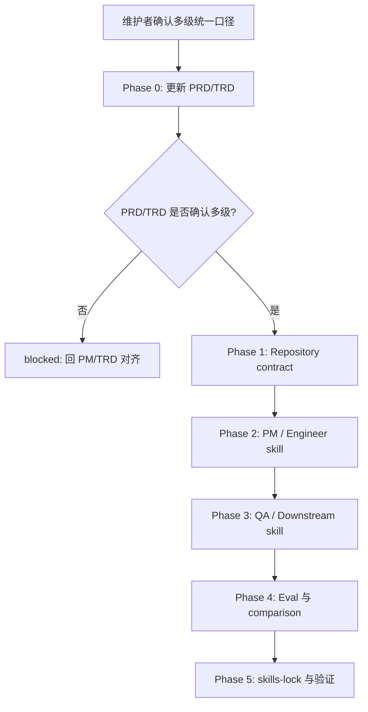

# Feature Path 多级统一口径实施计划

## 1. 实施上下文

本计划承接 issue #37、当前 PR #42 的 review 修复讨论，以及维护者对功能树演进的新增要求：随着项目功能点扩充，固定一、二、三级功能点不能完整覆盖真实产品结构，`feature_path` 需要从“最多三级”升级为“允许多级的统一口径”。

本次修复已先完成 `docs/pm/feature-path-contract/PRD.md` 和 `docs/engineer/feature-path-contract/TRD.md` 范围对齐，两份源文档均确认 `feature_path` 支持多级统一口径，再进入 skill、脚本和 eval 修改。

### 1.1 当前门禁状态

| 门禁 | 当前结果 | 处理 |
| --- | --- | --- |
| PRD 存在 | 通过 | `docs/pm/feature-path-contract/PRD.md` |
| TRD 存在 | 通过 | `docs/engineer/feature-path-contract/TRD.md` |
| PRD/TRD `feature_path` 对齐 | 通过 | 两者均为 `feature-path-contract` |
| PRD/TRD 是否覆盖新需求 | 通过 | 两者已更新为多级统一口径 |
| 是否可以直接改 skill / contract / eval | 通过 | Phase 0 已完成，可继续实施 |



## 2. 目标口径

| 项 | 新口径 |
| --- | --- |
| `feature_path` | 一个或多个 lower kebab-case 目录段，使用 `/` 分隔。 |
| `feature` | 兼容字段，新文档使用 `feature_path` 最后一段。 |
| `parent_feature` | 一级为 `N/A`，多级为去掉末段后的完整父路径。 |
| `feature_level` | 任意正整数字符串，值必须等于 `feature_path` 段数。 |
| Agent/Skill PRD | 不再需要“4 级例外”概念；`agents/{agent}/skills/{skill}` 是普通合法多级路径，必须保留 `skills` 目录段。 |
| QA E2E | 统一表达为 `docs/qa/e2e/{feature_path}/`。现有三级目录是合法示例，不再是上限。 |
| 旧单层文档 | 继续兼容为 `feature_level=1`，不做强制批量迁移。 |

路径仍必须拒绝空路径、空段、重复斜杠、绝对路径、`.`、`..`、隐藏目录段和非 lower kebab-case slug。

## 3. 实施范围总览

| 范围 | 涉及内容 | 改动量 | 说明 |
| --- | --- | --- | --- |
| PRD/TRD 源文档 | `docs/pm/feature-path-contract/PRD.md`、`docs/engineer/feature-path-contract/TRD.md` | 中 | 已先把“最多三级”改为“多级统一”，再实施后续约束。 |
| Repository contract | `scripts/check_repository_contract.py`、`agents/test_eval_contract.py` | 中 | 4+ 级从失败用例改为成功用例，并保留非法路径负例。 |
| PM skill | `idea-to-spec` public entry、shared conventions、schemas、generators、iteration/orchestration | 大 | PM 是 `feature_path` 归属来源，必须先统一。 |
| Engineer skill | `engineer-agent`、`trd-gen`、`feature-implementor`、`debugger`、`project-bootstrap` | 中到大 | 消费并镜像任意深度路径，缺文档时回正确 owner。 |
| QA skill | `qa-agent`、`spec-based-tester`、`regression-suite`、`exploratory-tester`、`bug-analyzer` | 大 | 从固定三级 E2E 目录升级到 `{feature_path}`。 |
| Designer / DevOps / Security | 下游 feature-scoped 输出和 README | 中 | 下游只消费已确认路径，不自行决定父功能。 |
| Eval / comparison | 相关 `evals.json`、fixture、durable `comparison.md` | 大 | 必须覆盖 4+ 级成功、非法路径失败、旧单层兼容和 owner handoff。 |
| `skills-lock.json` | 受影响 skill hash | 小 | 所有 skill 文档修改后刷新。 |

预估改动规模：如果同时统一 QA E2E 目录口径，约 35-55 个文件会发生实质变化；如果只改 PM/Engineer 和 repository contract，约 20-30 个文件。

## 4. Phase 0: PRD/TRD 范围对齐

### 4.1 文件变更

| 文件 | 操作 | 修改目标 |
| --- | --- | --- |
| `docs/pm/feature-path-contract/PRD.md` | 修改 | 将目标、FR、用户流程、数据模型、假设从“最多三级”改为“多级统一”。 |
| `docs/engineer/feature-path-contract/TRD.md` | 修改 | 将技术契约、解析算法、门禁、风险和交接条件改为任意深度 `feature_path`。 |
| `docs/engineer/feature-path-contract/IMPLEMENTATION_PLAN.md` | 修改 | 保持本计划与更新后的 PRD/TRD 一致。 |

### 4.2 PRD 更新要点

| 当前旧口径 | 新口径 |
| --- | --- |
| `feature_path` 最多 1-3 级。 | `feature_path` 支持 1-N 级，N 由实际功能树决定。 |
| 超过三级时 blocked，要求重构功能树。 | 超过三级只要路径合法且父功能证据明确，应允许生成。 |
| Agent/Skill PRD 是 4 级例外。 | Agent/Skill PRD 是普通多级路径，不再需要例外规则。 |
| QA E2E 固定 `{一级}/{二级}/{三级}`。 | QA E2E 使用 `{feature_path}`，三级只是现有示例。 |

### 4.3 TRD 更新要点

| 技术点 | 新要求 |
| --- | --- |
| 路径正则 | 支持 `segment(/segment)*`。 |
| `feature_level` | 用 `len(feature_path.split("/"))` 计算，允许任意正整数。 |
| 目录镜像 | PM、Engineer、Design、QA、DevOps、Security 都使用同一 `feature_path`。 |
| blocked 条件 | 不再因深度 blocked；只因路径非法、父功能不清、文档缺失或前后不一致 blocked。 |

验证：`docs/pm/feature-path-contract/PRD.md` 和 `docs/engineer/feature-path-contract/TRD.md` 不再把普通功能限制为 1-3 级。

## 5. Phase 1: Repository Contract

| 文件 | 操作 | 修改目标 |
| --- | --- | --- |
| `scripts/check_repository_contract.py` | 修改 | 将 `IMPLEMENTATION_PLAN_RE` 改为支持任意深度 `feature_path`。 |
| `scripts/check_repository_contract.py` | 修改 | 增加或抽取通用 `feature_path` 校验函数，拒绝非法路径段。 |
| `scripts/check_repository_contract.py` | 修改 | 继续校验 `feature_path`、`parent_feature`、`feature_level`、`related_prd`、`related_trd` 与路径一致。 |
| `agents/test_eval_contract.py` | 修改 | 将“4 级计划应失败”改为“4+ 级计划应通过”。 |
| `agents/test_eval_contract.py` | 新增 | 增加非法路径负例：空段、绝对路径、`..`、隐藏段、非法字符。 |

生成门禁：

| 场景 | 结果 |
| --- | --- |
| `docs/engineer/a/b/c/d/IMPLEMENTATION_PLAN.md` 且 frontmatter 匹配 | 通过 |
| `feature_level: "3"` 但路径是 4 段 | 失败 |
| `parent_feature` 不等于父路径 | 失败 |
| `related_prd` 或 `related_trd` 不指向同一 `feature_path` | 失败 |
| 路径包含 `..`、空段或隐藏段 | 失败 |

## 6. Phase 2: PM Skill 更新

PM 是 `feature_path` 的归属来源。所有正式 PM 文档生成或更新前，都必须先扫描既有 PRD，确认父功能归属。

| 文件或目录 | 操作 | 修改目标 |
| --- | --- | --- |
| `agents/product_manager/README.md`、`README_zh.md` | 修改 | 将 `feature_path` 说明从 1-3 级改为多级。 |
| `agents/product_manager/skills/idea-to-spec/SKILL.md` | 修改 | Feature Document Memory、context summary、deliverable shapes 支持多级。 |
| `agents/product_manager/skills/idea-to-spec/README.md` | 修改 | 同步公开说明。 |
| `agents/product_manager/skills/idea-to-spec/_internal/_shared/output-conventions.md` | 修改 | YAML 模板和 required fields 改为多级。 |
| `agents/product_manager/skills/idea-to-spec/_internal/_shared/gen-conventions.md` | 修改 | No directory drift 规则不再限制深度。 |
| `agents/product_manager/skills/idea-to-spec/_internal/_shared/skill-map.md` | 修改 | Handoff packet 中 `feature_level` 改为任意正整数。 |
| `agents/product_manager/skills/idea-to-spec/_internal/_shared/doc-schemas/*.md` | 修改 | PRD、BRD、TRD、TEST_SPEC schema 同步多级。 |
| `agents/product_manager/skills/idea-to-spec/_internal/gen/prd-gen/INSTRUCTIONS.md` | 修改 | PRD 生成前按多级 feature path 扫描父 PRD。 |
| `agents/product_manager/skills/idea-to-spec/_internal/gen/tspecs-gen/INSTRUCTIONS.md` | 修改 | Test Spec 的 QA 路径改为 `docs/qa/e2e/{feature_path}`。 |
| `agents/product_manager/skills/idea-to-spec/_internal/iteration/*` | 修改 | 更新 PRD/Test Spec/API/ADR handoff 时保留完整多级路径。 |
| `agents/product_manager/skills/idea-to-spec/_internal/orchestration/project-init/INSTRUCTIONS.md` | 修改 | Greenfield 默认一级，后续功能允许多级。 |

PM 生成门禁：

| 场景 | 必须处理 |
| --- | --- |
| 找不到 PRD 且用户请求明显是现有子功能 | blocked 或询问父功能，不创建同义顶层目录。 |
| 找到多个候选父 PRD | blocked 或给最小澄清问题。 |
| 用户明确确认完整多级路径 | 按该路径写入，并记录证据。 |
| API / ADR 请求 | PM 只写产品范围、接口目标和决策背景 handoff；Engineer 负责生成 API/ADR 文档。 |

## 7. Phase 3: Engineer Skill 更新

Engineer 镜像 PM 确认的 `feature_path`，不重新决定父功能。

| 文件或目录 | 操作 | 修改目标 |
| --- | --- | --- |
| `agents/engineer/README.md`、`README_zh.md` | 修改 | 同步多级路径说明。 |
| `agents/engineer/skills/engineer-agent/SKILL.md` | 修改 | Existing Feature Alignment Gate 不再把 4+ 级当缺文档。 |
| `agents/engineer/skills/trd-gen/SKILL.md` | 修改 | TRD、API、ADR 全部写入 `docs/engineer/{feature_path}/`。 |
| `agents/engineer/skills/trd-gen/_internal/trd-schema.md` | 修改 | schema 中 `feature_level` 改为任意正整数。 |
| `agents/engineer/skills/feature-implementor/SKILL.md` | 修改 | PRD/TRD/Plan gate 支持多级。 |
| `agents/engineer/skills/feature-implementor/_internal/planner/INSTRUCTIONS.md` | 修改 | 输出路径、sub-agent 任务包和 blocker 规则支持多级。 |
| `agents/engineer/skills/debugger/SKILL.md` | 修改 | bug 对齐不因路径超过三级回 PM。 |
| `agents/engineer/skills/project-bootstrap/SKILL.md` | 修改 | 规范说明改为多级，继续禁止浅层 `maxdepth` 漏 spec。 |

Engineer 生成门禁：

| 场景 | 必须处理 |
| --- | --- |
| PRD 缺失 | 回 `pm-agent:idea-to-spec`。 |
| PRD 路径或 frontmatter 不清 | 回 PM 对齐。 |
| TRD 缺失、stale 或 `related_prd` 不匹配 | 回 `engineer-agent:trd-gen`。 |
| `IMPLEMENTATION_PLAN.md` 缺失 | 回 `engineer-agent:feature-implementor`。 |
| 路径合法但为 4+ 级 | 允许继续，不能因为深度 blocked。 |

## 8. Phase 4: QA 与 Downstream 更新

### 8.1 QA

QA E2E 目录应改为统一 `feature_path` 表达：

```text
docs/qa/e2e/{feature_path}/
```

现有 `docs/qa/e2e/auth/login/login-form/` 这类三级目录继续有效，因为它本身也是合法 `feature_path`。本计划不要求批量迁移历史 E2E 资产。

| 文件或目录 | 操作 | 修改目标 |
| --- | --- | --- |
| `AGENTS.md` | 修改 | QA E2E 持久化路径从固定三级改为 `{feature_path}`。 |
| `agents/qa/README.md`、`README_zh.md` | 修改 | 同步 QA E2E 路径口径。 |
| `agents/qa/skills/qa-agent/SKILL.md` | 修改 | 路由、读历史用例、结果报告路径支持多级。 |
| `agents/qa/skills/spec-based-tester/SKILL.md` | 修改 | preflight 和 evidence contract 改为 `{feature_path}`。 |
| `agents/qa/skills/regression-suite/SKILL.md` | 修改 | 回归结果和报告路径改为 `{feature_path}`。 |
| `agents/qa/skills/exploratory-tester/SKILL.md` | 修改 | 探索测试前读取 `{feature_path}` QA memory。 |
| `agents/qa/skills/bug-analyzer/SKILL.md` | 修改 | bug artifact 引用同一路径 QA memory。 |
| `agents/qa/skills/qa-agent/references/e2e-test-report.md` | 修改 | report 模板路径改为 `{feature_path}`。 |

### 8.2 Designer / DevOps / Security

| 范围 | 操作 | 修改目标 |
| --- | --- | --- |
| `agents/designer/**` | 修改 | 所有 design 输出继续使用 `docs/design/{feature_path}/`，补充多级不受限说明。 |
| `agents/devops/**` | 修改 | feature-scoped DevOps 报告继续使用 `docs/devops/{feature_path}/`，路径不清回 PM/Engineer。 |
| `agents/security/**` | 修改 | security reports 继续使用 `docs/security/{feature_path}/`，路径不清回 PM/Engineer。 |

Downstream 生成门禁：

| 场景 | 必须处理 |
| --- | --- |
| 只有展示名，没有确认 `feature_path` | 回 PM/Engineer，不自建同义顶层目录。 |
| PRD/TRD/Plan 缺失 | 按 owner 回退，不直接写 QA/Design/DevOps/Security 产物。 |
| 已确认 4+ 级 `feature_path` | 使用完整路径，不截断为前三层或末级。 |

## 9. Phase 5: Eval 与 durable comparison

| Skill | 必补场景 | Durable 结果 |
| --- | --- | --- |
| `idea-to-spec` | 4+ 级路径生成 PRD；父功能不清 blocked；旧单层兼容。 | 更新相关 `comparison.md`。 |
| `trd-gen` | 4+ 级 PRD 生成同路径 TRD/API/ADR；PRD 缺失回 PM。 | 更新相关 `comparison.md`。 |
| `feature-implementor` | 4+ 级 PRD/TRD 生成 plan；缺 TRD 回 `trd-gen`；路径冲突 blocked。 | 更新相关 `comparison.md`。 |
| `debugger` | bug 报告定位 4+ 级功能；需求变化回 PM。 | 更新相关 `comparison.md`。 |
| `qa-agent` / `spec-based-tester` / `regression-suite` | QA E2E 使用 `docs/qa/e2e/{feature_path}`；缺 plan 回 `feature-implementor`。 | 更新相关 `comparison.md`。 |
| `designer-agent` | 4+ 级路径写入 `docs/design/{feature_path}`。 | 更新相关 `comparison.md`。 |
| `devops-agent` / `security-agent` | 4+ 级 feature-scoped report 不截断路径。 | 视改动更新 comparison。 |

运行期产物策略不变：`with_skill/`、`without_skill/`、`outputs/`、`transcript.md`、`candidate-output.md`、`subagent-verdict.md`、`timing.json`、`run_status.json`、diagnostics 和 `comparison.auto.md` 不提交。

## 10. Phase 6: Lock 与验证

所有 skill 文档、内部指令或 eval fixture 改完后，刷新 `skills-lock.json`。提交前按顺序运行：

```bash
uv run scripts/check_repository_contract.py
uv run scripts/check_eval_contract.py
uv run scripts/check_eval_artifacts.py
git diff --check
uv run --with pytest pytest
```

补充只读检查：

```bash
rg -n "最多三级|1-3 level|one to three|deeper than three|超过三级" agents docs scripts --glob "*.md" --glob "*.py"
rg -n "docs/qa/e2e/\\{一级功能\\}/\\{二级功能\\}/\\{三级功能\\}" AGENTS.md agents docs --glob "*.md"
rg -n "comparison.auto.md|transcript.md|candidate-output.md|subagent-verdict.md|run_status.json|timing.json" agents docs --glob "*.md"
```

允许历史 changelog 或旧需求文档保留历史表述；当前生效的 skill、contract、PRD/TRD/Plan 不应继续把普通功能限制为三级。

## 11. Sub-Agent 分工

本变更跨多角色、多 skill、多 eval，确认计划后建议拆分：

| Worker | 范围 | 输出 |
| --- | --- | --- |
| Worker A: PRD/TRD Alignment | `docs/pm/feature-path-contract/PRD.md`、`docs/engineer/feature-path-contract/TRD.md` | 更新后的多级源契约、门禁和完成定义。 |
| Worker B: Contract | `scripts/check_repository_contract.py`、`agents/test_eval_contract.py` | 任意深度路径校验、4+ 正例、非法路径负例。 |
| Worker C: PM / Engineer | PM 与 Engineer skill、schema、README、eval | 生成与镜像路径统一，owner handoff 正确。 |
| Worker D: QA / Downstream | QA、Designer、DevOps、Security skill 与 eval | 下游消费完整路径，不截断、不自建同义目录。 |
| Worker E: Integration | `skills-lock.json`、全量验证、PR review 回归 | lock 刷新、测试结果、runtime artifact 审查、剩余风险。 |

主进程负责整合 diff、避免 worker 互相覆盖、运行最终门禁，并确认 PR 评论中提到的问题是否已全部关闭。

## 12. 禁止事项

- 不在 PRD/TRD 未对齐时直接修改 skill 行为。
- 不把 4+ 级作为 Agent/Skill 专属例外；多级是统一口径。
- 不因为路径较深而要求用户重构功能树。
- 不在父功能证据不足时自动猜测路径。
- 不批量迁移历史单层或三级 QA 资产。
- 不把 QA、Designer、DevOps、Security 变成 feature path 决策方。
- 不提交 eval runtime artifacts。
- 不借本次治理变更重构无关文案或格式。

## 13. 完成定义

本计划完成需要同时满足：

- PRD/TRD 已确认 `feature_path` 支持多级统一口径。
- `repository-contract` 接受合法 4+ 级 `IMPLEMENTATION_PLAN.md`，拒绝非法路径。
- PM 生成链路支持多级并在父功能不清时 blocked。
- Engineer TRD、API、ADR、IMPLEMENTATION_PLAN 镜像完整 `feature_path`。
- QA E2E 使用 `docs/qa/e2e/{feature_path}` 作为统一表达，旧三级资产继续兼容。
- Designer、DevOps、Security 使用完整 `feature_path`，不截断路径。
- 缺 PRD、缺 TRD、缺 Plan、路径冲突和父功能不清都回到正确 owner。
- 相关 eval 与 durable `comparison.md` 覆盖 4+ 级成功、非法路径失败、旧单层兼容和 owner handoff。
- `skills-lock.json` 与实际 skill 文档一致。
- 本地 repository contract、eval contract、eval artifacts、pytest 和 `git diff --check` 均通过。

确认本计划后，才能进入 Phase 0 的 PRD/TRD 更新与后续实现。
