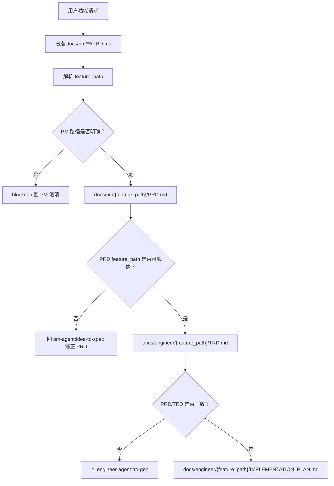

# PRD/TRD 多级功能目录契约 TRD

## 1. 来源上下文

本 TRD 承接 `docs/pm/feature-path-contract/PRD.md` 和 GitHub issue #37。PM 范围已经明确：将 `{feature-name}` 升级为允许多级的 `{feature_path}`，并防止 PRD、TRD、`IMPLEMENTATION_PLAN.md` 生成到错误的并列目录。

本 TRD 只定义技术契约、影响范围、门禁和验证策略，不进入实现。后续应由 `feature-implementor` 基于本 TRD 生成 `docs/engineer/feature-path-contract/IMPLEMENTATION_PLAN.md`，实施计划确认后再修改 skill 文档、内部指令、eval 或锁文件。

## 2. 技术概览

本变更通过统一 feature path 数据模型、生成前扫描、路径镜像、frontmatter 字段和 blocked/handoff 门禁，约束 PM 到 Engineer 再到 Implementor 的文档链路。



核心规则：

- `feature_path` 是跨 PM、Engineer、Design、QA、DevOps、Security 的功能归属主键。
- `feature_path` 支持一个或多个目录段，目录段使用仓库现有 lower kebab-case slug 风格。
- PRD 是 feature path 的产品归属来源；TRD 和实施计划必须镜像 PRD。
- API 文档和 ADR 是 Engineer-owned 产物；PM 只 handoff 产品范围、接口目标和技术决策背景。
- 缺 PRD 回 PM；缺 TRD、TRD stale 或 TRD 路径不一致回 `trd-gen`。
- 旧单层目录视为一级功能，读取兼容，写入时补齐字段或按维护者确认迁移。
- 仓库自身 Agent/Skill 治理 PRD 保留 `docs/pm/agents/{agent}/skills/{skill}/PRD.md` 的 `skills` 目录段；该路径按统一多级口径处理。

## 3. Feature Path 数据契约

### 3.1 路径格式

| 项 | 规则 |
| --- | --- |
| 名称 | `feature_path` |
| 层级 | 1-N 级 |
| 分隔符 | `/` |
| 目录段 | lower kebab-case slug，例如 `chat-interface` |
| 示例 | `chat-interface`、`chat-interface/history-search`、`chat-interface/history-search/export/reporting` |
| 非法 | 空路径、空段、包含 `.` 或 `..`、绝对路径、重复斜杠、隐藏目录段、非 lower kebab-case 段 |

### 3.2 语义字段

| 字段 | 新建文档要求 | 旧文档兼容 | 说明 |
| --- | --- | --- | --- |
| `feature_path` | 必填 | 缺失时从目录路径推导 | 完整功能路径，作为主键。 |
| `feature` | 必填 | 现有值保留 | 兼容字段；新文档建议使用末级 slug，完整路径由 `feature_path` 表达。 |
| `parent_feature` | 必填 | 一级旧文档推导为 `N/A` | 父 feature path；一级功能为 `N/A`。 |
| `feature_level` | 必填 | 从路径段数推导 | 任意正整数，必须等于 `feature_path` 段数。 |
| `related_prd` | TRD/Plan 必填 | 现有路径保留并校验 | 必须指向同一 `feature_path` 的 PRD。 |
| `related_trd` | Plan 必填 | 现有路径保留并校验 | 必须指向同一 `feature_path` 的 TRD。 |

Agent/Skill 治理 PRD 使用同一多级口径：`feature_path=agents/{agent}/skills/{skill}`、
`parent_feature=agents/{agent}/skills`、`feature_level=4`。解析器必须保留
`skills` 目录段，确保 canonical lookup 指向真实文件。

### 3.3 交接包

PM 到 Engineer、Engineer 到 Implementor 的 handoff 包必须包含：

```yaml
feature_path: chat-interface/history-search
feature: history-search
parent_feature: chat-interface
feature_level: 2
feature_path_evidence:
  - source: docs/pm/chat-interface/PRD.md
    reason: Existing parent feature matched request context
  - source: https://github.com/Neplich/dev-agent-skills/issues/37
    reason: Multi-level feature path contract
source_documents:
  prd: docs/pm/chat-interface/history-search/PRD.md
  decisions: docs/pm/chat-interface/history-search/DECISIONS.md
handoff_target: engineer-agent:trd-gen
engineer_outputs:
  trd: docs/engineer/chat-interface/history-search/TRD.md
  api: docs/engineer/chat-interface/history-search/API.md
  adr: docs/engineer/chat-interface/history-search/ADR-001-search-index.md
```

## 4. 解析与扫描算法

### 4.1 PM 生成前扫描

`idea-to-spec`、`prd-gen`、`prd-iteration`、`iteration-coordinator` 和相关 PM generator 在写入 PRD、BRD、DECISIONS 或 PM draft 前执行：

1. 扫描 `docs/pm/**/PRD.md`，深度支持多级 feature path。
2. 读取每个 PRD 的 frontmatter：`feature_path`、`feature`、`parent_feature`、`feature_level`、`title`、`related_issue`、`related_docs`。
3. 对缺少 `feature_path` 的旧单层 PRD，从 `docs/pm/{feature}/PRD.md` 推导 `feature_path={feature}`、`feature_level=1`。
4. 根据用户请求、issue 标题/正文、现有 PRD 标题、DECISIONS 和目录路径判断是否属于已有父功能。
5. 只有在父功能证据明确或用户明确确认时，生成子路径。
6. 父功能归属不清时，输出 blocked 或最小澄清问题，不创建新顶层目录。

### 4.2 Engineer 镜像解析

`trd-gen` 在写入 TRD 前执行：

1. 读取 PM handoff 或 PRD frontmatter 的 `feature_path`。
2. 校验 `docs/pm/{feature_path}/PRD.md` 存在。
3. 校验 `feature_level` 与路径段数一致。
4. 校验 `parent_feature` 与路径父级一致；一级功能必须为 `N/A`。
5. 写入或更新 `docs/engineer/{feature_path}/TRD.md`。
6. TRD 的 `related_prd` 必须指向 `docs/pm/{feature_path}/PRD.md`。
7. 当接口契约或架构决策已稳定，写入或更新同目录下的 `API.md` 和 `ADR-*.md`。
8. 不调用 PM 内部 `api-gen` 或 `adr-gen` 生成 Engineer 文档。

### 4.3 实施计划门禁

`feature-implementor` 在写入 `IMPLEMENTATION_PLAN.md` 前执行：

1. 读取 PRD 路径和 TRD 路径。
2. 校验 PRD 存在于 `docs/pm/{feature_path}/PRD.md`。
3. 校验 TRD 存在于 `docs/engineer/{feature_path}/TRD.md`。
4. 校验 PRD/TRD frontmatter 的 `feature_path`、`parent_feature`、`feature_level` 一致。
5. 校验 TRD `related_prd` 指向同一路径 PRD。
6. 校验目标实施计划路径是 `docs/engineer/{feature_path}/IMPLEMENTATION_PLAN.md`。

门禁结果：

| 情况 | 处理 |
| --- | --- |
| PRD 缺失 | 停止，回 `pm-agent:idea-to-spec` 生成或修正 PRD。 |
| PRD 缺少父级归属或 `feature_path` 不明确 | 停止，回 PM 澄清或更新 PRD。 |
| TRD 缺失 | 停止，回 `engineer-agent:trd-gen` 补 TRD。 |
| TRD stale、路径不一致或 `related_prd` 不匹配 | 停止，回 `engineer-agent:trd-gen` 修正 TRD。 |
| 多级目录缺失但 PRD/TRD 均已确认且路径一致 | 允许创建目标 Engineer 目录并写入实施计划。 |
| 用户要求跳过路径对齐 | blocked，不继续写实施计划或代码。 |

### 4.4 Debugger 和 QA 门禁

`debugger`、`qa-agent`、`spec-based-tester`、`regression-suite` 在现有功能变更、bug 修复或 E2E 文档更新前使用同一解析规则：

- 先定位 `feature_path`。
- 再读取 `docs/pm/{feature_path}/PRD.md`、`docs/engineer/{feature_path}/TRD.md` 和存在的 `docs/pm/{feature_path}/DECISIONS.md`。
- 如果需求变化，回 PM。
- 如果 PM 稳定但 TRD 缺失或冲突，回 `trd-gen`。
- 如果缺少已确认 `IMPLEMENTATION_PLAN.md`，不更新 E2E TC。

## 5. 目录镜像规则

| 文档类型 | 路径 |
| --- | --- |
| PM PRD | `docs/pm/{feature_path}/PRD.md` |
| PM BRD | `docs/pm/{feature_path}/BRD.md` |
| PM DECISIONS | `docs/pm/{feature_path}/DECISIONS.md` |
| PM draft | `docs/pm/{feature_path}/design.md` |
| Engineer TRD | `docs/engineer/{feature_path}/TRD.md` |
| Engineer plan | `docs/engineer/{feature_path}/IMPLEMENTATION_PLAN.md` |
| Engineer API | `docs/engineer/{feature_path}/API.md` |
| Engineer ADR | `docs/engineer/{feature_path}/ADR-*.md` |
| Design docs | `docs/design/{feature_path}/...` |
| QA E2E | `docs/qa/e2e/{feature_path}/...` |
| DevOps report | `docs/devops/{feature_path}/...` |
| Security report | `docs/security/{feature_path}/...` |

目录段缺失的处理规则：

- 生成 PRD 时，如果父级 PRD 不存在且用户表达的是子功能，必须回 PM 澄清功能树，不直接创建并列顶层目录。
- 生成 TRD 时，如果 PRD 的 `feature_path` 指向嵌套目录但 PRD 文件缺失，必须回 PM。
- 生成 API 或 ADR 时，如果 PRD 未确认或 `feature_path` 不明确，必须回 PM；如果 PM 范围已确认，则由 `trd-gen` 在 `docs/engineer/{feature_path}/` 下生成，不使用 PM 内部生成器。
- 生成实施计划时，如果 PRD 或 TRD 缺失，分别回 PM 或 TRD；如果只有 Engineer 目标目录不存在，且 PRD/TRD 已确认一致，可以创建目录。
- 下游 Design、QA、DevOps、Security 不拥有 feature path 决策权；路径不清时回 PM/Engineer。

## 6. 兼容与迁移边界

### 6.1 旧单层兼容

已有 `docs/pm/{feature}/PRD.md`、`docs/engineer/{feature}/TRD.md` 和 `docs/engineer/{feature}/IMPLEMENTATION_PLAN.md` 在没有 `feature_path` 字段时，按一级功能处理：

```yaml
feature_path: <feature>
parent_feature: N/A
feature_level: 1
```

读取兼容不得因为缺少新字段而失败。新建文档必须写入新字段。实质更新旧文档时应补齐新字段，格式或错别字修正可不强制补齐。

### 6.2 误放目录迁移边界

当发现子功能已经被生成成并列一级目录时：

1. 不自动移动历史目录。
2. 先输出路径冲突分析，列出现有目录、期望目录、引用方和潜在影响。
3. 由维护者确认是否迁移。
4. 迁移时必须同步 PRD/TRD/IMPLEMENTATION_PLAN 的 `related_*` 引用、frontmatter 和相关 eval fixture。
5. 没有维护者确认时，只阻止后续错误生成，并在 handoff 中记录冲突。

## 7. 影响文件范围

实施计划应覆盖下列文件类别，具体改动由 `feature-implementor` 在计划阶段拆分：

| 优先级 | 路径 | 预期改动 |
| --- | --- | --- |
| P0 | `agents/product_manager/skills/idea-to-spec/SKILL.md` | 将 feature document memory 和 deliverable shapes 从 `{feature-name}` 升级为 `{feature_path}`。 |
| P0 | `agents/product_manager/skills/idea-to-spec/_internal/_shared/skill-map.md` | Handoff packet 增加 feature path 字段和路径证据。 |
| P0 | `agents/product_manager/skills/idea-to-spec/_internal/_shared/gen-conventions.md` | 增加生成前扫描、父功能识别、no directory drift 规则。 |
| P0 | `agents/product_manager/skills/idea-to-spec/_internal/_shared/output-conventions.md` | 定义 `docs/<agent-short>/{feature_path}/<DOC>.md` 和 frontmatter 字段。 |
| P0 | `agents/product_manager/skills/idea-to-spec/_internal/_shared/doc-schemas/*.md` | 为 PRD/BRD/DECISIONS/TEST_SPEC 等 schema 补 feature path 字段。 |
| P0 | `agents/product_manager/skills/idea-to-spec/_internal/gen/prd-gen/INSTRUCTIONS.md` | PRD 生成前扫描 `docs/pm/**/PRD.md`，路径不清时 blocked。 |
| P0 | `agents/product_manager/skills/idea-to-spec/_internal/iteration/prd-iteration/INSTRUCTIONS.md` | 更新已有 PRD 时校验路径和 frontmatter 一致。 |
| P0 | `agents/engineer/skills/engineer-agent/SKILL.md` | Existing Feature Alignment Gate 改为 feature path。 |
| P0 | `agents/engineer/skills/trd-gen/SKILL.md` | TRD 输出路径和 handoff 语言升级为 `{feature_path}`。 |
| P0 | `agents/engineer/skills/trd-gen/_internal/trd-schema.md` | 增加 feature path frontmatter 和 `related_prd` 镜像校验。 |
| P0 | `agents/engineer/skills/feature-implementor/SKILL.md` | 实施前校验 PRD/TRD feature path 一致。 |
| P0 | `agents/engineer/skills/feature-implementor/_internal/planner/INSTRUCTIONS.md` | 写计划前执行 PRD/TRD/目录缺层门禁。 |
| P0 | `agents/engineer/skills/debugger/SKILL.md` | bug 对齐读取 `docs/pm/{feature_path}` 与 `docs/engineer/{feature_path}`。 |
| P1 | `agents/designer/**` | feature-scoped design docs 镜像 feature path。 |
| P1 | `agents/qa/**` | QA 消费 PRD/TRD/Plan 时使用同一 feature path；E2E 目录使用 `docs/qa/e2e/{feature_path}/`。 |
| P1 | `agents/devops/**` | feature-scoped DevOps 报告使用 feature path。 |
| P1 | `agents/security/**` | feature-scoped Security 报告使用 feature path。 |
| P1 | `agents/**/test/**/evals/evals.json` 和 fixture | 增加嵌套路径、缺层 blocked、旧路径兼容 eval。 |
| P1 | `skills-lock.json` | 如果 skill 文档发生变更，按仓库规则刷新 metadata。 |

## 8. Eval 覆盖

| Skill | Eval 场景 | 断言重点 |
| --- | --- | --- |
| `idea-to-spec` | 已有一级父功能 PRD，新需求为二级子功能。 | 生成 `docs/pm/{parent}/{child}/PRD.md`，不创建并列 `{child}`。 |
| `idea-to-spec` | 父功能归属模糊。 | blocked 或提出最小澄清，不写新顶层 PRD。 |
| `trd-gen` | 嵌套 PRD 输入。 | TRD 写入 `docs/engineer/{feature_path}/TRD.md`，`related_prd` 匹配。 |
| `feature-implementor` | PRD 存在但 TRD 缺失。 | 回 `engineer-agent:trd-gen`，不写 `IMPLEMENTATION_PLAN.md`。 |
| `feature-implementor` | PRD/TRD feature path 不一致。 | blocked 或 TRD gap handoff，不创建计划。 |
| `debugger` | bug 报告涉及已有二级功能。 | 按 feature path 读取 PRD/TRD；需求变化回 PM。 |
| `qa-agent` / `spec-based-tester` | E2E 文档更新来自嵌套功能实现。 | 引用同一路径 PRD/TRD/Plan，并写入 QA 功能树。 |
| legacy compatibility | 旧单层 fixture 无 `feature_path`。 | 作为一级功能读取，不误报缺字段。 |

只要实际执行 skill eval 或 fresh Codex subagent validation，就必须在同一轮变更中更新对应 durable `comparison.md`。运行期产物继续写入隔离 scratch workspace，不提交 transcript、outputs、diagnostics 或 `comparison.auto.md`。

## 9. 验证策略

实施完成后建议按以下顺序验证：

```bash
uv run scripts/check_repository_contract.py
uv run scripts/check_eval_contract.py
uv run scripts/check_eval_artifacts.py
```

针对本契约还应增加静态检查或人工审查：

```bash
rg -n "docs/pm/\\{feature-name\\}|docs/engineer/\\{feature\\}|docs/<agent-short>/<feature-name>" agents docs --glob "*.md"
rg -n "feature_path|parent_feature|feature_level" agents docs --glob "*.md"
```

本 TRD 阶段不声称上述命令已经运行。命令是后续实施完成后的验证入口。

## 10. 发布与回滚

本变更是文档和 eval 契约升级，不新增运行时服务。发布通过普通 PR 合入：

1. 合入 PRD/TRD。
2. 由 `feature-implementor` 产出并确认实施计划。
3. 分模块更新 skill 文档、内部指令和 eval。
4. 刷新 `skills-lock.json`。
5. 运行仓库契约和 eval 契约检查。
6. 实际执行相关 skill eval 或 fresh subagent validation，并更新 `comparison.md`。

回滚方式是普通 git revert。若已经迁移历史误放目录，回滚必须同步恢复引用路径，不能只回滚部分文档。

## 11. 安全与隐私

本变更不引入凭据、账号、token、cookie 或 SSH key。路径扫描只读取仓库内 Markdown 文档和 frontmatter。实现时不得把本地绝对路径、用户私有目录或运行期 scratch 路径写入正式 PRD/TRD/Plan frontmatter。

## 12. 风险、假设和待确认问题

| 类型 | 内容 | Owner | Blocking |
| --- | --- | --- | --- |
| Risk | 自动父功能匹配过度自信会把文档放入错误父目录。 | Engineer | Yes |
| Risk | 只更新 PM/Engineer，未更新下游消费方，会让 Design/QA/DevOps/Security 继续漂移。 | Engineer | Yes |
| Risk | 只更新文档不更新 eval，会导致规则后续回退。 | Engineer | Yes |
| Decision | `feature_path` 支持多级统一口径；合法深度由功能树决定，不因超过三级而 blocked。 | Maintainer | No |
| Assumption | 旧单层目录不批量迁移，只有确认误放时再迁移。 | Maintainer | No |
| Decision | 新文档继续保留 `feature` 作为兼容字段；`feature_path` 是完整路径主键，一级功能时二者可以相同，嵌套功能时 `feature` 使用末级 slug。 | Engineer | No |
| Open Question | 是否需要新增 repository contract 检查 feature path frontmatter 与目录路径一致。 | Maintainer | No |

## 13. Feature-Implementor 交接条件

- Confirmed PRD path: `docs/pm/feature-path-contract/PRD.md`
- Confirmed TRD path: `docs/engineer/feature-path-contract/TRD.md`
- Expected implementation plan path: `docs/engineer/feature-path-contract/IMPLEMENTATION_PLAN.md`
- Boundary: 本 TRD 不进入实现，不修改 skill 文档、eval 或锁文件。
- Required next step: `feature-implementor` 基于本 TRD 生成详细实施计划，并在用户确认后再进入各模块修改。
