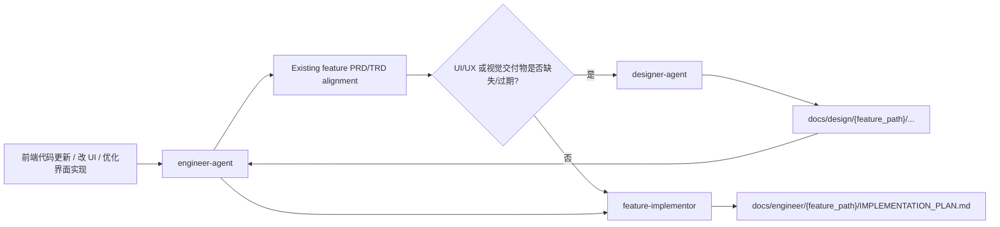

# 前端 UI 更新路由契约 TRD

## 1. 技术目标

本 TRD 承接 `docs/pm/frontend-ui-routing-contract/PRD.md` 和 GitHub issue #35。实现目标是用最小文档和 eval 变更，把前端 UI 更新请求的内部路由契约固化到 Engineer / Designer / Feature Implementor 三处入口。

本变更不引入运行时代码，不修改外部 `ui-ux-pro-max`，不改变 marketplace 插件结构。主要技术产物是 skill 文档、agent README、eval 定义、eval fixture / durable comparison，以及 `skills-lock.json` 的 metadata 同步。

## 2. 目标路由

## 3. 组件变更

| Component | Technical Change |
| --- | --- |
| `engineer-agent` | 增加 frontend / UI implementation routing rule：前端代码更新属于 Engineering request；先跑 existing feature alignment；必要时 handoff Designer 补设计。 |
| `feature-implementor` | 在 Phase 0 / Phase 1 增加 UI design handoff check；实施计划必须引用设计交付物或说明无需设计更新；缺失或冲突时 stop。 |
| `designer-agent` | 增加 Engineer 来源的 UI maintenance / frontend-update design request；输出设计文档后停止并 handoff 回 Engineer。 |
| Engineer README | 最小补充前端 UI 更新入口边界，避免把设计参考能力误认为实现入口。 |
| Designer README | 最小补充 Designer 只负责设计交付物，来自 Engineer 的 UI 维护请求完成后回交 Engineer。 |
| Eval definitions | 增加或扩展三组 eval，分别覆盖 Engineer 路由、Feature Implementor 计划门禁、Designer 回交边界。 |
| `skills-lock.json` | 反映 skill 文档 metadata/hash 更新。 |

## 4. 文件影响范围

### 4.1 必改文件

| Path | Operation | Purpose |
| --- | --- | --- |
| `docs/pm/agents/engineer-agent/PRD.md` | Modify | 在 agent 级 PRD 中补充前端 UI 更新属于 Engineer 入口的产品契约。 |
| `docs/pm/agents/engineer-agent/skills/engineer-agent/PRD.md` | Modify | 在 dispatcher skill PRD 中补充 frontend/UI routing 触发与 Designer handoff。 |
| `docs/pm/agents/engineer-agent/skills/feature-implementor/PRD.md` | Modify | 在 feature implementor PRD 中补充 UI design handoff gate。 |
| `docs/pm/agents/designer-agent/PRD.md` | Modify | 在 Designer agent PRD 中补充来自 Engineer 的 UI maintenance design request。 |
| `docs/pm/agents/designer-agent/skills/designer-agent/PRD.md` | Modify | 在 designer dispatcher PRD 中补充设计完成后回交 Engineer。 |
| `agents/engineer/skills/engineer-agent/SKILL.md` | Modify | 固化 Engineering 入口和 Designer handoff 规则。 |
| `agents/engineer/skills/feature-implementor/SKILL.md` | Modify | 固化实施计划前的 UI design handoff check。 |
| `agents/designer/skills/designer-agent/SKILL.md` | Modify | 固化 Engineer 来源设计请求和回交边界。 |
| `agents/engineer/test/engineer-agent/evals/evals.json` | Modify | 增加 Engineer 路由 eval。 |
| `agents/engineer/test/feature-implementor/evals/evals.json` | Modify | 增加 Feature Implementor UI design gate eval。 |
| `agents/designer/test/designer-agent/evals/evals.json` | Modify | 增加 Designer Engineer-handoff eval。 |
| `skills-lock.json` | Modify | 更新受影响 skill metadata/hash。 |

### 4.2 按需文件

| Path | Operation | Condition |
| --- | --- | --- |
| `agents/engineer/README.md` | Modify | 如果 SKILL 规则新增后 README 缺少入口边界说明。 |
| `agents/engineer/README_zh.md` | Modify | 与英文 Engineer README 保持一致。 |
| `agents/designer/README.md` | Modify | 如果 SKILL 规则新增后 README 缺少 Designer 回交边界说明。 |
| `agents/designer/README_zh.md` | Modify | 与英文 Designer README 保持一致。 |
| `AGENTS.md` | Modify | 只有当项目级指导也需要说明该边界时才最小扩展现有句子。 |
| `agents/*/test/*/evals/workspace/.../comparison.md` | Create / Modify | 只有实际新增 eval workspace 或执行 skill eval 后才更新 durable comparison。 |

## 5. 技术约束

- 不修改外部 `ui-ux-pro-max`。
- 不让 Designer 输出代码、测试、shell 命令、部署配置或工程实现清单。
- 不绕过 existing feature PRD/TRD alignment。
- 不绕过 `IMPLEMENTATION_PLAN.md` 用户确认门禁。
- 不把 README 写成第二事实源；README 只保留入口边界，细则保留在 SKILL.md。
- 修改 skill 文档后必须同步 `skills-lock.json`。
- 修改 skill 行为或 eval fixture 后，必须询问是否运行对应 skill eval；实际执行 eval 时同步更新 durable `comparison.md`。

## 6. 验证策略

确定性验证：

1. `git diff --check`
2. `uv run scripts/check_repository_contract.py`
3. `uv run scripts/check_eval_contract.py`
4. `uv run scripts/check_eval_artifacts.py`
5. 针对改动范围运行相关 pytest，例如 `uv run --with pytest pytest agents/test_eval_contract.py`

模型 eval 验证：

- 受影响 skill：`engineer-agent`、`feature-implementor`、`designer-agent`。
- 用户确认后执行对应 skill eval 或 fresh Codex subagent validation。
- 只要实际执行，就更新对应 durable `comparison.md`。
- 不提交运行期产物，例如 transcript、outputs、diagnostics、timing、run status。

## 7. 风险

| Risk | Impact | Mitigation |
| --- | --- | --- |
| 路由规则写得过宽，导致所有 UI 文案都强制进入 Designer | 增加不必要 handoff | 规则只覆盖前端代码更新、UI 实现、设计落地；纯设计建议仍走 Designer。 |
| Feature Implementor 因设计检查过严阻塞小 UI 修复 | 降低效率 | 允许计划中明确说明无需 Designer 更新，但必须给理由。 |
| Designer 输出工程实现清单 | 角色越界 | 在 Designer SKILL 和 eval 中明确禁止实现清单、代码、shell 命令。 |
| Eval 只检查关键词 | 回归覆盖弱 | 使用语义断言覆盖 routing、handoff、design-only、plan gate。 |
| README 与 SKILL 重复事实源 | 后续漂移 | README 只写一句入口边界，细节继续由 SKILL 和 eval 承担。 |
