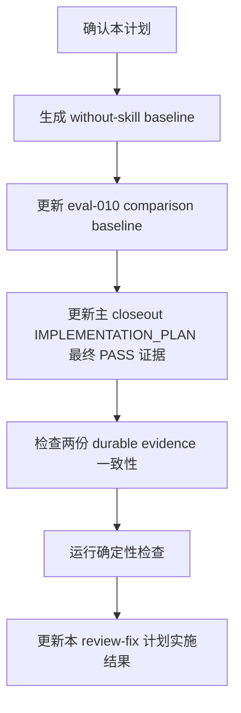

# IMPLEMENTATION_PLAN 收尾门禁 Review 修复实施计划

## 1. 实施上下文

PR #45 已完成 implementation plan closeout gate 主体实现，并通过 CI。当前
review 修复聚焦 durable evidence 补强，不改变 skill 行为。

本计划承接：

- PRD：`docs/pm/implementation-plan-closeout-gate-review-fix/PRD.md`
- TRD：`docs/engineer/implementation-plan-closeout-gate-review-fix/TRD.md`
- PR review：`https://github.com/Neplich/dev-agent-skills/pull/45#discussion_r3461935792`

### 1.1 当前门禁状态

| Gate | Status | Evidence |
| --- | --- | --- |
| PRD alignment | 已补齐 review-fix PRD | `docs/pm/implementation-plan-closeout-gate-review-fix/PRD.md` |
| TRD alignment | 已补齐 review-fix TRD | `docs/engineer/implementation-plan-closeout-gate-review-fix/TRD.md` |
| Implementation plan | 已确认并实施 | 本文件已更新为 `status: "Implemented"` |
| Code / document edits | 已完成 | 已更新 baseline evidence、主 closeout 计划和本 review-fix closeout |
| Validation | 已完成 | 本地完整检查 PASS；with-skill baseline 对照 PASS；without-skill baseline 对照 PASS |

## 2. 修复范围

| 来源 | 文件 | 问题 | 修复处理 | 验证方式 |
| --- | --- | --- | --- | --- |
| PR review 未解决线程 | `agents/engineer/test/feature-implementor/evals/workspace/eval-010-implementation-plan-closeout-sync/comparison.md` | `Without Skill / Baseline` 最初缺少真实 baseline；补成 blocked 后又与 `Latest result: PASS` 冲突。 | 生成实际 without-skill baseline 结果，并更新 `Without Skill / Baseline`、`Latest result`、`Failures` 和 `Next Steps`，让完整 PASS 有真实 baseline 支撑。 | `uv run scripts/check_eval_artifacts.py`；with-skill / without-skill subagent 对照；人工确认 comparison 不再出现 blocked baseline 与 PASS 冲突。 |
| 本地 review 补强项 | `docs/engineer/implementation-plan-closeout-gate/IMPLEMENTATION_PLAN.md` | closeout 证据只记录第一轮 subagent FAIL，未记录最终第二轮 PASS。 | 在 Fresh subagent validation / 实施结果中补充第二轮 subagent `019ef5a6-5558-7a02-a5e7-a14bd3c6e272` 的 PASS 结论和完整测试命令全绿结果。 | 人工确认 closeout plan 能支撑 `status: "Implemented"`。 |
| 一致性补强 | 同上两个文件 | 两处 durable evidence 应互相一致。 | 让 `IMPLEMENTATION_PLAN.md` 和 `comparison.md` 对 fresh validation、baseline / skipped、runtime artifact policy 的描述一致。 | `git diff --check`；人工 review 两个文件证据链。 |
| 回归检查 | 全仓库 | 文档和 eval fixture 修改可能影响契约。 | 修完后复跑完整确定性检查。 | repository contract、eval contract、eval artifacts、pytest。 |

## 3. 非目标

- 不修改 `feature-implementor` 的 SKILL.md 或 internal instructions。
- 不新增 eval item。
- 不刷新 `skills-lock.json`。
- 不提交 runtime transcript、diagnostics、outputs、timing 或 run status。
- 不关闭或回复 GitHub review thread，除非用户后续明确要求。

## 4. 实施顺序



### Step 1: 更新 `eval-010` baseline section

修改 `agents/engineer/test/feature-implementor/evals/workspace/eval-010-implementation-plan-closeout-sync/comparison.md`：

- 将 `Without Skill / Baseline` 从 blocked / skipped 改成实际 without-skill baseline 结果。
- 记录 baseline subagent id、PASS 结论和相对 with-skill 的弱化点。
- 明确 `Latest result: PASS` 由 with-skill 和 without-skill baseline 两侧实际结果支撑。

### Step 2: 更新主 closeout 实施计划

修改 `docs/engineer/implementation-plan-closeout-gate/IMPLEMENTATION_PLAN.md`：

- 在 Fresh subagent validation 中补充第二轮 subagent：
  `019ef5a6-5558-7a02-a5e7-a14bd3c6e272`。
- 记录最终结论 PASS。
- 记录完整确定性流程全 PASS。

### Step 3: 一致性检查

人工检查两份 durable evidence：

- 是否都说明第一轮 subagent 发现 stale closeout。
- 是否都说明第二轮 fresh validation PASS。
- 是否都说明 runtime artifacts 不入库。
- 是否没有互相矛盾的 baseline / skipped 描述。

### Step 4: 验证

```bash
git diff --check
uv run scripts/check_repository_contract.py
uv run scripts/check_eval_contract.py
uv run scripts/check_eval_artifacts.py
uv run --with pytest pytest agents/test_eval_contract.py
```

## 5. Sub-Agent 分工

本次只改两个 durable evidence 文件和本 review-fix 计划，默认不需要复杂 implementation / validation sub-agent 分工。

如用户要求额外验收，可使用 fresh subagent 只读复核：

- baseline 结果是否满足 PR review；
- closeout plan 是否包含最终 PASS；
- 确定性检查是否通过。

## 6. 风险与处理

| Risk | Impact | Mitigation |
| --- | --- | --- |
| 把缺失 baseline 写成 pass/fail | 伪造 eval 对比结论 | 已实际运行 without-skill baseline，并只记录真实结果。 |
| 只补 comparison，不补实施计划 | closeout 证据仍不完整 | 同步更新主 closeout IMPLEMENTATION_PLAN。 |
| 为修 review 改动 skill 行为 | 扩大 PR 范围 | 本轮只改 durable evidence 文档。 |

## 7. 实施结果

本计划已按确认范围实施：

- 已更新
  `agents/engineer/test/feature-implementor/evals/workspace/eval-010-implementation-plan-closeout-sync/comparison.md`，
  将 `Without Skill / Baseline` 更新为实际 without-skill baseline 结果，并同步 `Latest result`。
- 已更新
  `docs/engineer/implementation-plan-closeout-gate/IMPLEMENTATION_PLAN.md`，
  补充最终 subagent `019ef5a6-5558-7a02-a5e7-a14bd3c6e272` PASS 证据和 eval-010 with/baseline 对照证据。
- 已确认两份 durable evidence 均描述第一轮 subagent 发现 stale closeout，最终同步后 PASS，且完整 PASS 由实际 baseline 结果支撑。

已完成确定性校验：

```bash
git diff --check
uv run scripts/check_repository_contract.py
uv run scripts/check_eval_contract.py
uv run scripts/check_eval_artifacts.py
uv run --with pytest pytest agents/test_eval_contract.py
```

结果：

- `git diff --check`: PASS
- `uv run scripts/check_repository_contract.py`: PASS
- `uv run scripts/check_eval_contract.py`: PASS
- `uv run scripts/check_eval_artifacts.py`: PASS
- `uv run --with pytest pytest agents/test_eval_contract.py`: PASS, 29 passed

Fresh subagent validation：

- Subagent: `019ef5bb-27cd-7b22-b11b-cd9910c9457f`
- Result: PASS
- Coverage: subagent confirmed the first review-fix pass did not infer baseline pass/fail while the baseline was missing. The later review required an actual baseline for a full eval PASS, which is addressed by the baseline generation result below.

Baseline generation：

- With-skill subagent: `019ef5f3-bf60-7922-bcc0-2a296cd3be0b`, PASS.
- Without-skill baseline subagent: `019ef5f3-e0e2-7ef3-adb9-5f89535a79f3`, PASS.
- Result: `comparison.md` now records an actual baseline result; the previous `BLOCKED / not generated` state has been removed.

## 8. 残余风险

| Risk | Status | Note |
| --- | --- | --- |
| Separate without-skill baseline may be weaker than skill run | Accepted | baseline 已实际生成并通过；弱化点是未读取 `feature-implementor` 专属模板和内部规则。 |
| Runtime eval artifacts accidentally committed | Mitigated | `check_eval_artifacts.py` PASS；本轮未提交 runtime transcript、diagnostics、outputs、timing 或 run status。 |
