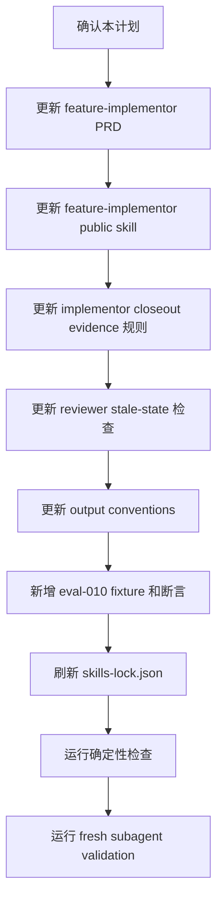

# IMPLEMENTATION_PLAN 收尾门禁实施计划

## 1. 实施上下文

本计划承接 GitHub issue #44、`docs/pm/implementation-plan-closeout-gate/PRD.md`
和 `docs/engineer/implementation-plan-closeout-gate/TRD.md`。目标是在
`feature-implementor` 的实现完成阶段增加 closeout gate，防止
`IMPLEMENTATION_PLAN.md` 出现 frontmatter 已完成但正文仍停留在计划期状态的矛盾。

### 1.1 当前门禁状态

| Gate | Status | Evidence |
| --- | --- | --- |
| PRD alignment | 已补齐 issue 级 PRD | `docs/pm/implementation-plan-closeout-gate/PRD.md` |
| TRD alignment | 已补齐 issue 级 TRD | `docs/engineer/implementation-plan-closeout-gate/TRD.md` |
| Implementation plan | 已确认并实施 | 本文件已更新为 `status: "Implemented"` |
| Code / skill edits | 已完成 | PRD、SKILL.md、internal instructions、eval fixture 和 `skills-lock.json` 已更新 |
| Deterministic checks | 已完成 | 见 `## 7. 实施结果` |
| Fresh subagent validation | 已完成并已处理反馈 | subagent `019ef5a2-e27a-7df2-8fd1-11614b8e8664` 完整测试命令 PASS，并指出 closeout durable 产物待同步；本节已完成该同步 |

### 1.2 成功标准

- `feature-implementor` 在实现和验证完成后必须同步更新 `IMPLEMENTATION_PLAN.md`。
- reviewer 能发现 `status: Implemented` 与正文计划期状态残留之间的矛盾。
- 已运行 deterministic checks 时记录实际命令和结果。
- 已运行 skill eval / fresh subagent validation 时引用 durable `comparison.md`。
- 未运行 eval 时记录 blocked / skipped 原因。
- 不提交 eval 运行期 transcript、diagnostics、outputs、timing 或 run status。

## 2. 范围

### 2.1 必改文件

| Path | Operation | Change |
| --- | --- | --- |
| `docs/pm/agents/engineer-agent/skills/feature-implementor/PRD.md` | Modify | 增加 `Implementation Plan Closeout Gate` 产品契约。 |
| `agents/engineer/skills/feature-implementor/SKILL.md` | Modify | 在 Phase 3 后、QA E2E handoff 前加入 closeout gate。 |
| `agents/engineer/skills/feature-implementor/_internal/implementor/INSTRUCTIONS.md` | Modify | 要求实现阶段收集 closeout evidence。 |
| `agents/engineer/skills/feature-implementor/_internal/reviewer/INSTRUCTIONS.md` | Modify | 增加 stale plan state 检查。 |
| `agents/engineer/skills/feature-implementor/_internal/_shared/output-conventions.md` | Modify | 增加 `IMPLEMENTATION_PLAN.md` 收尾写法。 |
| `agents/engineer/test/feature-implementor/evals/evals.json` | Modify | 新增 closeout sync 回归 eval。 |
| `agents/engineer/test/feature-implementor/evals/workspace/eval-010-implementation-plan-closeout-sync/` | Create | 新增 fixture、metadata 和 durable `comparison.md`。 |
| `skills-lock.json` | Modify | 刷新 `feature-implementor` computed hash。 |

### 2.2 非目标

- 不修改其他 agent 的 QA E2E 归档规则。
- 不改变实施前 PRD/TRD/IMPLEMENTATION_PLAN 确认门禁。
- 不批量迁移历史 `IMPLEMENTATION_PLAN.md`。
- 不提交模型 eval 运行期产物。

## 3. 实施流程



## 4. 文件级步骤

### Step 1: 更新 owning PRD

修改 `docs/pm/agents/engineer-agent/skills/feature-implementor/PRD.md`：

- 在功能需求中新增 closeout gate。
- 在当前实现工作流中加入“实现完成后同步 IMPLEMENTATION_PLAN 结果”。
- 在验收标准中加入 stale-state 检查。

验证：

- PRD 不把 closeout gate 写成每次必须运行模型 eval。
- PRD 允许 eval skipped / blocked，但必须记录原因。

### Step 2: 更新 `feature-implementor/SKILL.md`

修改 `agents/engineer/skills/feature-implementor/SKILL.md`：

- 在 Phase 3 自检之后增加 `Implementation Plan Closeout Gate`。
- 明确 closeout 必须发生在 QA E2E handoff 和 delivery 建议之前。
- 要求更新或确认以下内容：
  - frontmatter status；
  - 当前门禁状态表；
  - 实施结果；
  - deterministic checks 命令和结果；
  - skill eval / fresh subagent validation 的 durable `comparison.md`；
  - skipped / blocked 原因；
  - 运行期产物不提交策略。

验证：

- 不削弱 Phase 1 计划确认门禁。
- 不要求每次实现都必须运行模型 eval。

### Step 3: 更新 internal modules

修改 `implementor/INSTRUCTIONS.md`：

- 要求实现阶段保留 changed files、验证命令、命令结果、未执行原因和 eval 状态。
- 这些信息作为 closeout gate 输入。

修改 `reviewer/INSTRUCTIONS.md`：

- checklist 增加 `Implementation Plan Closeout`。
- 如果 `status: Implemented` 与正文计划期状态冲突，输出 blocking finding。

修改 `_shared/output-conventions.md`：

- 增加 `IMPLEMENTATION_PLAN.md` 收尾内容结构。
- 明确已执行 eval 引用 durable `comparison.md`，运行期产物不入库。

### Step 4: 新增 eval 覆盖

新增 `eval-010-implementation-plan-closeout-sync`：

- fixture 中包含一个矛盾的 `docs/engineer/sample-feature/IMPLEMENTATION_PLAN.md`。
- frontmatter 为 `status: Implemented`。
- 正文保留计划期状态残留，用于验证 closeout gate 能发现 durable plan 矛盾。

断言：

- skill 必须识别 stale closeout 状态。
- skill 必须要求更新实施结果和状态表。
- skill 必须要求记录 deterministic checks。
- skill 必须要求 eval 已执行时引用 durable `comparison.md`，未执行时说明原因。
- skill 不得直接建议 delivery 或 QA handoff。

### Step 5: 刷新 lockfile

修改 skill 文档后刷新 `skills-lock.json` 中 `feature-implementor` 的 computed hash。

### Step 6: 验证

确定性检查：

```bash
git diff --check
uv run scripts/check_repository_contract.py
uv run scripts/check_eval_contract.py
uv run scripts/check_eval_artifacts.py
uv run --with pytest pytest agents/test_eval_contract.py
```

Fresh subagent validation：

- 用户已要求实施完成后直接使用 subagent 运行完整测试流程。
- 已执行 fresh Codex subagent validation，并按反馈更新
  `eval-010-implementation-plan-closeout-sync/comparison.md` 和本 closeout。

## 5. Sub-Agent 分工

本次变更触及 skill 文档、internal instructions、eval fixture 和 lockfile，建议使用分工：

| Role | Scope | Output |
| --- | --- | --- |
| Implementation worker | 更新 feature-implementor PRD、SKILL、internal instructions、eval、lockfile。 | 变更文件清单和确定性检查结果。 |
| Validation worker | 对照 issue #44、PRD/TRD 和 eval 断言检查 closeout gate 是否完整。 | pass/fail、阻塞项和残余风险。 |
| Main process | 保留 issue、PRD/TRD、仓库规则和交付判断。 | 最终交付说明和是否请求运行 eval。 |

小范围串行实施也可接受，但必须保留独立自检。

## 6. 风险与处理

| Risk | Impact | Mitigation |
| --- | --- | --- |
| closeout 内容过多 | 实施计划变成流水账 | 只记录状态、结果、命令、eval 证据和风险摘要。 |
| 未执行 eval 被误判为失败 | 合理交付被阻塞 | 明确允许 skipped / blocked 原因。 |
| 只改 skill 不改 eval | 规则可能回退 | 新增 eval-010 固化回归场景。 |
| 历史计划存在旧格式 | 批量迁移范围扩大 | 本次不批量迁移，只约束后续实施收尾。 |

## 7. 实施结果

本计划已按确认范围实施：

- 已新增 issue 级 PRD / TRD / IMPLEMENTATION_PLAN：
  - `docs/pm/implementation-plan-closeout-gate/PRD.md`
  - `docs/engineer/implementation-plan-closeout-gate/TRD.md`
  - `docs/engineer/implementation-plan-closeout-gate/IMPLEMENTATION_PLAN.md`
- 已更新 `docs/pm/agents/engineer-agent/skills/feature-implementor/PRD.md`，新增 FR-S11 和 closeout workflow。
- 已更新 `agents/engineer/skills/feature-implementor/SKILL.md`，在 QA E2E handoff 和 delivery 前增加 closeout gate。
- 已更新 implementor、reviewer 和 output conventions，收集并检查 closeout evidence。
- 已新增 `eval-010-implementation-plan-closeout-sync` eval 定义和 fixture。
- 已更新 durable `comparison.md`，记录 fresh subagent validation 结论。
- 已刷新 `skills-lock.json` 中 `feature-implementor` 的 computed hash。

已完成确定性校验：

```bash
git diff --check
uv run scripts/check_repository_contract.py
uv run scripts/check_eval_contract.py
uv run scripts/check_eval_artifacts.py
uv run --with pytest pytest agents/test_eval_contract.py
```

结果：

- `git diff --check`: PASS
- `uv run scripts/check_repository_contract.py`: PASS
- `uv run scripts/check_eval_contract.py`: PASS
- `uv run scripts/check_eval_artifacts.py`: PASS
- `uv run --with pytest pytest agents/test_eval_contract.py`: PASS, 29 passed

Fresh subagent validation:

- Subagent: `019ef5a2-e27a-7df2-8fd1-11614b8e8664`
- Result: deterministic checks PASS; initial delivery verdict FAIL because this implementation plan and the new eval comparison were still in pre-closeout state.
- Resolution: this closeout update changes the plan to implemented state and updates the durable eval comparison.

## 8. 残余风险

| Risk | Status | Note |
| --- | --- | --- |
| Runtime eval artifacts accidentally committed | Mitigated | `check_eval_artifacts.py` PASS；runtime artifacts policy 已写入 skill 和 comparison。 |
| Closeout rule later regresses | Mitigated | `eval-010-implementation-plan-closeout-sync` 覆盖 stale closeout state。 |
| Model transcript not generated as separate artifact | Accepted | 本轮按用户要求使用 fresh subagent validation；未提交 runtime transcript。 |
