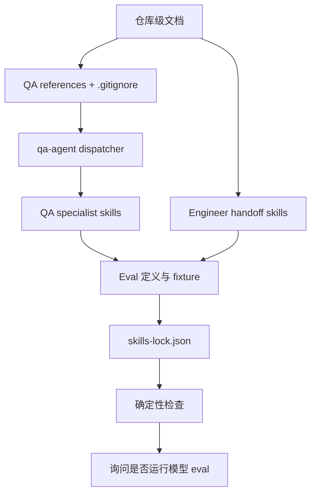

# QA Agent E2E 用例沉淀与复用实施计划

## 1. 实施上下文

本计划承接已确认的 PRD 和 TRD：

- PRD：`docs/pm/qa-e2e-case-memory/PRD.md`
- TRD：`docs/engineer/qa-e2e-case-memory/TRD.md`
- 功能：`qa-e2e-case-memory`
- 项目：`dev-agent-skills`，Markdown-first Agent skill marketplace

实现目标是更新 Agent 指导、QA E2E reference、eval fixture 和仓库规则，不新增运行时服务，不新增通用 E2E runner，不修改产品代码。

本计划确认后才能进入实现。实现过程中只修改本计划列出的文件；如发现 PRD/TRD 缺口或文件结构与计划冲突，应停止并回到 TRD 对齐。

## 2. 实施原则

- 保持最小改动，不重构无关 skill 文档。
- `AGENTS.md` 只扩展现有 QA 测试用例持久化规则，不新增重复章节。
- 不编辑 `CLAUDE.md`，它必须继续作为指向 `AGENTS.md` 的相对软链接。
- 不把真实账号、密码、token、cookie、session、SSH 密码或 SSH key 内容写入任何提交文件。
- `.qa/e2e/accounts.local.json` 只作为本地 ignore 文件路径写入规则和 reference，不创建真实账号文件。
- 修改 skill 文档后同步更新 `skills-lock.json` 的相关 skill hash。
- 修改 eval 定义或 fixture 后运行 eval 契约检查；实际执行 skill eval 或 fresh subagent validation 后，再更新对应 durable `comparison.md`。

## 3. 文件变更清单

### 3.1 仓库级文档

| 文件 | 操作 | 变更内容 | 来源 |
| --- | --- | --- | --- |
| `AGENTS.md` | 修改 | 将 QA 测试资产主路径从 `docs/qa/{feature}` 迁移为 `docs/qa/e2e/{一级功能}/{二级功能}/{三级功能}`；补充 repo harness > Chrome > Playwright、本地账号文件、平台版本 blocked、subagent 执行、报告路径和 PRD/TRD 对齐门禁。 | PRD FR-001、FR-007、FR-009、FR-016、FR-018、FR-020 |
| `README.md` | 修改 | 补充开发者维护说明：本地账号文件路径、ignore 规则、QA E2E references、eval 和 repository contract 命令。 | PRD FR-005、FR-018、FR-019 |
| `README_zh.md` | 修改 | 同步中文开发者维护说明。 | PRD FR-005、FR-018、FR-019 |
| `.gitignore` | 修改 | 默认忽略 `.qa/e2e/accounts.local.json`。 | PRD FR-005 |

### 3.2 QA Agent 文档与 reference

| 文件 | 操作 | 变更内容 | 来源 |
| --- | --- | --- | --- |
| `agents/qa/README.md` | 修改 | 同步 QA E2E 功能树、执行入口优先级、账号引用、报告归档和 subagent 模式。 | PRD FR-001 到 FR-019 |
| `agents/qa/README_zh.md` | 修改 | 同步中文说明。 | PRD FR-001 到 FR-019 |
| `agents/qa/skills/qa-agent/SKILL.md` | 修改 | 重写 Shared QA Document Contract：功能树目录、`TEST_SUITE.md`、`FLOW_INDEX.md`、`cases/`、`scripts/`、`results/`、`_reports/`；增加测试场景、平台版本 blocked、执行入口优先级、账号 upsert、PRD/TRD 对齐和实施计划门禁、subagent 汇总。 | PRD FR-001、FR-007、FR-009、FR-016、FR-020、FR-021 |
| `agents/qa/skills/qa-agent/references/e2e-credential-store.md` | 新增 | 定义 `.qa/e2e/accounts.local.json` schema、账号 ID 规则、自动 upsert、`chmod 600`、禁止回显敏感字段。 | PRD FR-004、FR-005 |
| `agents/qa/skills/qa-agent/references/e2e-test-report.md` | 新增 | 定义 E2E 汇总报告固定格式、结果枚举、P0 字段、功能更新和发版报告路径。 | PRD FR-018 |

### 3.3 QA specialist skill

| 文件 | 操作 | 变更内容 | 来源 |
| --- | --- | --- | --- |
| `agents/qa/skills/spec-based-tester/SKILL.md` | 修改 | 从 PRD/TRD 生成或更新 E2E TC 时直接写入功能树；执行前读取已有 TC；平台版本缺失 blocked；repo harness 优先；现有功能变更先检查 PRD/TRD 对齐。 | PRD FR-007、FR-009、FR-011、FR-020 |
| `agents/qa/skills/exploratory-tester/SKILL.md` | 修改 | 探索后沉淀可复用流程到功能树；已有流程增量更新；避免重复创建同义 TC。 | PRD FR-012、FR-013 |
| `agents/qa/skills/regression-suite/SKILL.md` | 修改 | 功能更新或修复验证时复用已有 TC；局部回归范围清晰；预期未对齐或版本缺失时 blocked；历史结果只追加。 | PRD FR-013、FR-017、FR-020 |
| `agents/qa/skills/bug-analyzer/SKILL.md` | 可选修改 | 仅在缺陷复现需要引用 E2E TC、本地账号 reference 或 PRD/TRD 预期判断时补充最小规则。 | TRD §4.3 |

### 3.4 Engineer handoff skill

| 文件 | 操作 | 变更内容 | 来源 |
| --- | --- | --- | --- |
| `agents/engineer/skills/engineer-agent/SKILL.md` | 修改 | 现有功能变更、小改动、bug fix 进入实现前先做 PRD/TRD 对齐；代码完成后检查 QA E2E 文档交接。 | PRD FR-014、FR-015、FR-020 |
| `agents/engineer/skills/feature-implementor/SKILL.md` | 修改 | 实现完成后输出 QA E2E 交接包；交接包必须包含 PRD、TRD、已确认 IMPLEMENTATION_PLAN、变更文件、验证命令、风险和建议功能目录；轻量变更不得跳过计划。 | PRD FR-014、FR-015、FR-021 |
| `agents/engineer/skills/debugger/SKILL.md` | 修改 | bug 修复前读取 PRD/TRD 和存在的产品决策记录；区分实现偏离、需求变更、文档缺失、TRD gap；修复计划确认前不更新 E2E TC。 | PRD FR-020、FR-021 |
| `agents/engineer/skills/trd-gen/SKILL.md` | 修改 | 支持 TRD gap packet：发现者说明缺口，`trd-gen` 补完整 TRD 或记录 open questions。 | PRD FR-020 |

### 3.5 Eval 定义、fixture 与 lock

| 文件 | 操作 | 变更内容 | 来源 |
| --- | --- | --- | --- |
| `agents/qa/test/qa-agent/evals/evals.json` | 修改 | 更新旧 `docs/qa/{feature}` 路径断言；覆盖功能树、账号 reference、报告 reference、版本 blocked、执行入口、双场景、PRD/TRD 对齐、subagent 汇总。 | PRD FR-019、FR-020 |
| `agents/qa/test/spec-based-tester/evals/evals.json` | 修改 | 覆盖 PRD/TRD 生成 TC、复用已有 TC、版本结果归档、预期不清 blocked、汇总报告。 | PRD FR-011、FR-019、FR-020 |
| `agents/qa/test/exploratory-tester/evals/evals.json` | 修改 | 覆盖探索沉淀功能树、增量更新已有流程、不重复创建同义 TC。 | PRD FR-012、FR-019 |
| `agents/qa/test/regression-suite/evals/evals.json` | 修改 | 覆盖功能更新局部回归、历史结果追加、PRD/TRD 对齐门禁。 | PRD FR-013、FR-017、FR-020 |
| `agents/engineer/test/engineer-agent/evals/evals.json` | 修改 | 覆盖现有功能变更进入实现前的 PRD/TRD 对齐路由。 | PRD FR-020 |
| `agents/engineer/test/feature-implementor/evals/evals.json` | 修改 | 覆盖 QA E2E 交接包、已确认 IMPLEMENTATION_PLAN、轻量变更不跳过计划。 | PRD FR-014、FR-015、FR-021 |
| `agents/engineer/test/debugger/evals/evals.json` | 修改 | 覆盖 bug 修复前 PRD/TRD 预期判断和修复计划门禁。 | PRD FR-020、FR-021 |
| `agents/engineer/test/trd-gen/evals/evals.json` | 修改 | 覆盖 TRD gap packet 补齐或 open questions。 | PRD FR-020 |
| `agents/**/test/**/workspace/...` | 修改或新增 | 按 eval 断言补齐最小 fixture，包括功能树目录、reference、报告路径、门禁上下文和 comparison。 | PRD FR-019 |
| `agents/**/test/**/comparison.md` | 条件修改 | 仅在实际执行 skill eval 或 fresh subagent validation 后更新 latest result、执行模式、行为结论、失败/next steps 和 runtime artifact policy。 | PRD FR-022 |
| `skills-lock.json` | 修改 | skill 文档变更后同步相关 skill 的 `computedHash`。 | 仓库契约 |

## 4. 实施顺序



### Step 1：更新仓库级文档

修改 `AGENTS.md`、`README.md`、`README_zh.md`、`.gitignore`。

验证：

- 旧 QA 目录规则不再作为新增 E2E 资产主路径。
- `.qa/e2e/accounts.local.json` 已被 ignore。
- `CLAUDE.md` 未被修改。

### Step 2：新增 QA reference

创建：

- `agents/qa/skills/qa-agent/references/e2e-credential-store.md`
- `agents/qa/skills/qa-agent/references/e2e-test-report.md`

验证：

- reference 中只定义格式和规则，不包含真实账号。
- 报告路径与 PRD/TRD 一致：
  - 功能更新：`docs/qa/e2e/{一级功能}/{二级功能}/{三级功能}/_reports/{platform-version}/test-reports-{test-time}.md`
  - 发版全量：`docs/qa/e2e/_reports/{platform-version}/test-reports-{test-time}.md`

### Step 3：更新 QA Agent 和 specialist skill

先改 `qa-agent` dispatcher，再改 `spec-based-tester`、`exploratory-tester`、`regression-suite`，最后判断是否需要对 `bug-analyzer` 做最小补充。

验证：

- E2E 执行入口顺序为 repo harness > Chrome > Playwright。
- 平台版本缺失必须 blocked。
- 所有 E2E 默认 subagent 执行。
- 现有功能变更或 bug 修复触发 E2E 更新前先检查 PRD/TRD 对齐。

### Step 4：更新 Engineer handoff skill

修改 `engineer-agent`、`feature-implementor`、`debugger`、`trd-gen`。

验证：

- `feature-implementor` 完成代码后输出 QA E2E 交接包。
- 交接包必须包含已确认 `IMPLEMENTATION_PLAN.md`。
- `debugger` 修复前先做 PRD/TRD 预期判断和修复计划门禁。
- `trd-gen` 能接收 TRD gap packet 并负责补齐或记录 open questions。

### Step 5：更新 eval 定义和 fixture

按 skill 分批更新 eval：

1. QA routing 和 E2E 功能树：`qa-agent`
2. PRD/TRD 生成和执行：`spec-based-tester`
3. 探索沉淀：`exploratory-tester`
4. 功能更新回归：`regression-suite`
5. Engineer handoff：`engineer-agent`、`feature-implementor`
6. 预期对齐和 TRD gap：`debugger`、`trd-gen`

验证：

- 所有 `evals.json` 仍符合 schema version `1.0`。
- 新增 assertion 使用 lower snake_case `id`。
- fixture 不提交运行期产物。

### Step 6：同步 `skills-lock.json`

在所有 skill 文档变更完成后，重新计算并更新被修改 skill 的 `computedHash`。

预计会变更的 lock entry：

- `qa-agent`
- `spec-based-tester`
- `exploratory-tester`
- `regression-suite`
- `bug-analyzer`，仅当 Step 3 判定需要修改
- `engineer-agent`
- `feature-implementor`
- `debugger`
- `trd-gen`

验证：

- `uv run scripts/check_repository_contract.py`

### Step 7：运行确定性检查

提交前运行：

```bash
uv run scripts/check_repository_contract.py
uv run scripts/check_eval_contract.py
uv run scripts/check_eval_artifacts.py
uv run --with pytest pytest agents/test_eval_contract.py
uv run --with pytest pytest agents/qa/test/test_qa_run_eval.py
```

如果某条命令因环境或依赖缺失失败，需要记录失败命令、失败原因和恢复条件，不能静默跳过。

### Step 8：询问是否运行模型 eval

由于本次会修改 skill 文档、eval 定义和 fixture，完成实现后必须主动询问是否运行相关 skill eval。

如果用户确认运行：

- 执行模型 transcript 生成/检查和 fresh Codex subagent validation。
- 按实际运行结果更新对应 durable `comparison.md`。
- 不提交 transcript、outputs、diagnostics、subagent verdict 等运行期产物。

如果用户暂不运行：

- 不更新 `comparison.md` 为通过结论。
- 在最终汇总中明确模型 eval 未执行。

## 5. Sub-Agent 分工判断

本次实现是多 skill、多 eval、多 fixture 的复杂文档和测试契约更新，实际实现阶段适合拆分 implementation / validation 分工。

当前实施计划文档由主进程编写，因为当前工具规则要求只有用户明确要求委派时才启动 sub-agent。后续进入实现前，如用户确认使用 sub-agent，可按以下方式拆分：

| 分工 | 范围 | 禁止事项 | 输出 |
| --- | --- | --- | --- |
| Implementation sub-agent A | QA docs、QA references、QA skills | 不修改 Engineer skill，不改 eval | 变更文件、摘要、未决问题 |
| Implementation sub-agent B | Engineer handoff skills | 不修改 QA skill，不改 eval | 变更文件、摘要、未决问题 |
| Implementation sub-agent C | Eval definitions、fixtures、comparison 更新准备 | 不修改 skill 行为文档 | 变更文件、摘要、验证命令 |
| Validation sub-agent | 基于 PRD/TRD/AGENTS 检查全部变更 | 不扩大实现范围，不改文件 | pass/fail、问题清单、残余风险 |

如果不使用 sub-agent，则主进程按 Step 1 到 Step 8 顺序实现，每个阶段结束后运行局部检查。

## 6. 不纳入本轮的事项

- 不创建真实 `.qa/e2e/accounts.local.json`。
- 不迁移真实历史 QA 资产，只更新规则、skills 和 eval fixture。
- 不新增通用 E2E runner 或 helper script。
- 不自动运行模型 eval；实现完成后先询问。
- 不创建 PR、不提交、不推送，除非用户明确要求。

## 7. 风险与处理

| 风险 | 处理 |
| --- | --- |
| `AGENTS.md` 新旧 QA 路径同时存在导致歧义。 | 只扩展现有 QA 测试用例持久化段落，明确旧路径不再作为新增 E2E 主入口。 |
| reference 规则过长导致 QA skill 难以执行。 | 将账号和报告格式放入独立 reference，`SKILL.md` 只保留读取和遵守 reference 的流程。 |
| eval fixture 改动范围过大。 | 优先更新现有 eval 的断言和最小 fixture；只在现有 fixture 无法表达新行为时新增 eval。 |
| `skills-lock.json` hash 遗漏。 | 所有 skill 文档改完后统一运行 repository contract，并根据失败项补 lock。 |
| durable `comparison.md` 与实际 eval 结论不一致。 | 只有实际执行 eval 或 fresh subagent validation 后才更新结论；最终汇总明确哪些 eval 未运行。 |

## 8. 确认后执行条件

用户确认本计划后，进入实现阶段。实现阶段应保持以下交付口径：

- 每批改动前先读对应文件。
- 每批改动只触碰计划内文件。
- 每次修改 skill 文档后，最终统一同步 `skills-lock.json`。
- 修改 eval 后运行 eval contract 和 artifact 检查。
- 实现完成后先汇总变更和测试，不自动提交。
