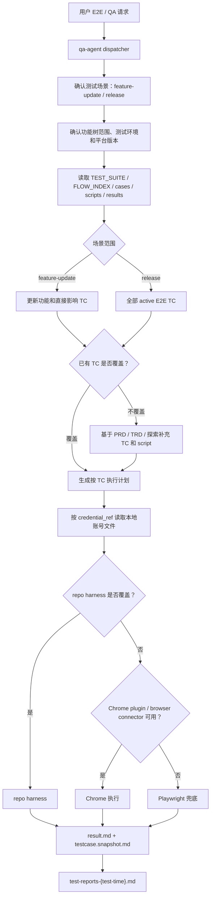
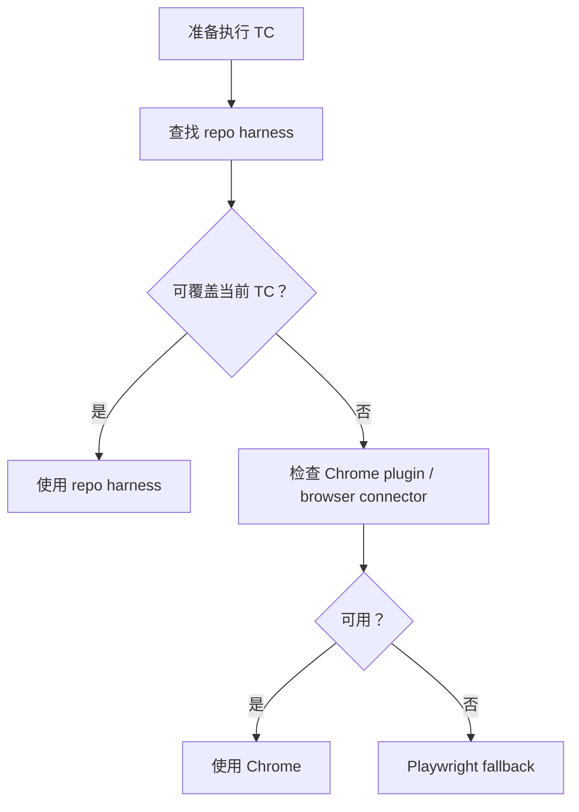
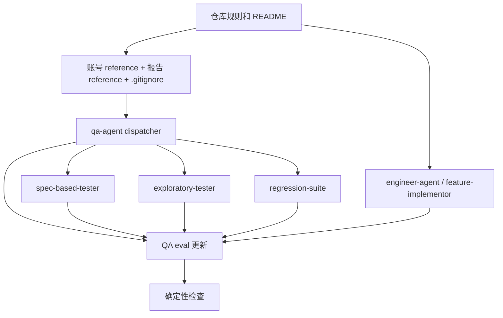

# QA Agent E2E 用例沉淀与复用 TRD

## 1. 概览

本 TRD 承接 `docs/pm/qa-e2e-case-memory/PRD.md`，目标是在现有 Agent skill marketplace 中落地 QA Agent 的 E2E 用例沉淀、复用、执行入口选择、版本归档和本地账号引用协议。

本轮不新增运行时服务、不新增通用 E2E runner，也不修改产品代码。实现重点是更新仓库指导、QA skill 文档、Engineer handoff 文档、reference 文档、`.gitignore` 和 eval fixture，让 QA Agent 在后续使用时按统一协议生成、更新和执行 E2E 测试资产。

PRD 当前已确认的关键决策：

- E2E 测试资产统一迁移到 `docs/qa/e2e/{一级功能}/{二级功能}/{三级功能}/`。
- 执行入口优先级为 repo harness > Chrome plugin / browser connector > Playwright fallback。
- 测试平台版本缺失时必须 blocked，不允许写入 `unknown`。
- 所有 E2E 测试任务默认由 subagent 执行，主 agent 汇总结果。
- `scripts/*.spec.md` 允许保存可执行脚本片段，但不得包含明文凭据。
- 平台账号和 SSH 账号统一落到 `.qa/e2e/accounts.local.json`，该文件必须被 ignore；测试文档只引用账号 ID。
- E2E 测试分为 `feature-update` 和 `release` 两类场景：功能更新在开发环境本地执行局部 E2E，发版在发版版本测试环境执行全量 active E2E。
- 主 agent 必须按测试项生成汇总报告，并使用 `e2e-test-report.md` reference 固定格式。
- 功能更新报告路径为功能目录 `_reports/{platform-version}/test-reports-{test-time}.md`，发版全量报告路径为 `docs/qa/e2e/_reports/{platform-version}/test-reports-{test-time}.md`。

## 2. 架构设计



核心实现不引入新框架，只通过 Markdown skill contract 和 eval 约束改变 Agent 行为。技术上分为四层：

| 层级 | 责任 | 主要产物 |
| --- | --- | --- |
| 仓库规则层 | 给所有 Agent 提供统一约束 | `AGENTS.md`、README 维护说明 |
| QA skill 层 | 定义 QA 路由、验收、探索和回归行为 | `agents/qa/**/SKILL.md`、QA README |
| 本地账号 reference 层 | 定义测试账号落盘格式和引用规则 | `agents/qa/skills/qa-agent/references/e2e-credential-store.md`、`.gitignore` |
| 测试报告 reference 层 | 定义主 agent 汇总报告格式和路径规则 | `agents/qa/skills/qa-agent/references/e2e-test-report.md` |
| Eval 守护层 | 防止行为回退 | `agents/qa/test/*/evals/evals.json`、fixture、`comparison.md` |

## 3. 技术约束

| 约束 | 技术处理 |
| --- | --- |
| 不新增运行时服务 | 所有能力通过 skill 文档、reference 文档和 eval 固化。 |
| 不提交真实账号 | `.qa/e2e/accounts.local.json` 写入 `.gitignore`，文档只引用账号 ID。 |
| 不把 E2E 绑定到 Playwright | skill 明确 repo harness 优先，其次 Chrome，最后 Playwright。 |
| 不覆盖历史结果 | 结果按 `results/TC-NNN-*/{platform-version}/` 追加。 |
| 不混淆测试场景 | `feature-update` 只做开发环境本地局部 E2E；`release` 做发版版本测试环境全量 E2E。 |
| 不生成临时报告格式 | 主 agent 汇总报告必须使用 `e2e-test-report.md` reference 固定格式。 |
| 不改变 PM 范围 | TRD 仅映射 PRD P0/P1 需求到实现文件，不新增产品目标。 |
| Eval 产物策略 | 提交 eval 定义、fixture、`comparison.md`，不提交运行期 transcript、outputs、diagnostics。 |

## 4. 文件变更计划

### 4.1 仓库级文档

| 路径 | 操作 | 内容 |
| --- | --- | --- |
| `AGENTS.md` | 修改 | 将 QA 测试用例持久化规则从旧 `docs/qa/{feature}` 更新为 E2E 功能树目录；补充 repo harness > Chrome > Playwright、本地账号文件、版本 blocked、subagent 执行等约束。 |
| `README.md` | 修改 | 在开发者维护说明中补充 E2E 账号文件路径、ignore 规则、reference 文档位置和 eval 验证命令。 |
| `README_zh.md` | 修改 | 同步中文开发者说明。 |

### 4.2 QA Agent 文档与 reference

| 路径 | 操作 | 内容 |
| --- | --- | --- |
| `agents/qa/README.md` | 修改 | 更新 QA E2E 用例持久化目录、执行入口和本地账号引用说明。 |
| `agents/qa/README_zh.md` | 修改 | 同步中文说明。 |
| `agents/qa/skills/qa-agent/SKILL.md` | 修改 | 更新 dispatcher：功能树读取、版本确认、执行入口选择、本地账号文件 upsert、subagent 汇总要求。 |
| `agents/qa/skills/qa-agent/references/e2e-credential-store.md` | 新增 | 定义 `.qa/e2e/accounts.local.json` schema、账号 ID 规则、平台账号/SSH 账号自动落盘、禁止回显和权限设置。 |
| `agents/qa/skills/qa-agent/references/e2e-test-report.md` | 新增 | 定义主 agent E2E 汇总报告的固定 Markdown 格式、结果枚举、必填字段和报告路径规则。 |
| `.gitignore` | 修改 | 默认忽略 `.qa/e2e/accounts.local.json`。 |

### 4.3 QA specialist skill

| 路径 | 操作 | 内容 |
| --- | --- | --- |
| `agents/qa/skills/spec-based-tester/SKILL.md` | 修改 | 按 PRD/TRD 生成或更新 E2E TC；执行已有 TC；区分功能更新局部 E2E 和发版全量 E2E；结果按平台版本归档。 |
| `agents/qa/skills/exploratory-tester/SKILL.md` | 修改 | 用户授权探索后，将可复用流程写入功能树；已有流程增量更新。 |
| `agents/qa/skills/regression-suite/SKILL.md` | 修改 | 功能更新或修复验证时优先复用已有 TC，并按版本追加结果；功能更新默认只覆盖变更功能和直接影响路径。 |
| `agents/qa/skills/bug-analyzer/SKILL.md` | 可选修改 | 仅在 bug 复现需要引用 E2E TC 或本地账号规则时补充说明，不强制纳入 MVP。 |

### 4.4 Engineer handoff

| 路径 | 操作 | 内容 |
| --- | --- | --- |
| `agents/engineer/skills/engineer-agent/SKILL.md` | 修改 | 在 PRD -> TRD -> IMPLEMENTATION_PLAN -> 代码完成链路中补充 QA E2E 文档检查点。 |
| `agents/engineer/skills/feature-implementor/SKILL.md` | 修改 | 功能代码完成后输出 QA E2E 文档交接包，包含 PRD、TRD、IMPLEMENTATION_PLAN、变更文件、验证命令、测试结果、风险和建议功能目录。 |

### 4.5 Eval 与 fixture

| 路径 | 操作 | 内容 |
| --- | --- | --- |
| `agents/qa/test/qa-agent/evals/evals.json` | 修改 | 更新旧路径断言，覆盖功能树路由、本地账号 reference、测试报告 reference、版本 blocked、执行入口优先级、双场景和 subagent 汇总。 |
| `agents/qa/test/spec-based-tester/evals/evals.json` | 修改 | 覆盖从 PRD/TRD 生成 TC、复用已有 TC、按版本归档结果、按 reference 生成测试汇总报告。 |
| `agents/qa/test/exploratory-tester/evals/evals.json` | 修改 | 覆盖探索后沉淀可复用流程，且不重复创建同义 TC。 |
| `agents/qa/test/regression-suite/evals/evals.json` | 修改 | 覆盖功能更新后增量更新已有 TC、局部回归范围和历史结果不覆盖。 |
| `agents/engineer/test/feature-implementor/evals/evals.json` | 修改 | 增加代码完成后输出 QA E2E 文档交接包的断言。 |
| `agents/qa/test/**/workspace/...` | 修改或新增 | 增加功能树目录、账号 reference、报告 reference、repo harness/Chrome/Playwright 环境说明和 durable `comparison.md`。 |

## 5. 数据模型

### 5.1 E2E 功能树目录

```text
docs/qa/e2e/
├── _shared/
│   ├── login-flows/
│   │   └── LF-001-admin-login.spec.md
│   └── data/
│       └── DS-001-admin-user.md
├── _reports/
│   └── {platform-version}/
│       └── test-reports-{YYYY-MM-DDTHH-mm-ss}.md
└── {一级功能}/
    └── {二级功能}/
        └── {三级功能}/
            ├── TEST_SUITE.md
            ├── FLOW_INDEX.md
            ├── _reports/
            │   └── {platform-version}/
            │       └── test-reports-{YYYY-MM-DDTHH-mm-ss}.md
            ├── cases/
            │   └── TC-NNN-<short-slug>.md
            ├── scripts/
            │   └── TC-NNN-<short-slug>.spec.md
            └── results/
                └── TC-NNN-<short-slug>/
                    └── {platform-version}/
                        ├── result.md
                        └── testcase.snapshot.md
```

### 5.2 本地账号文件

本地账号文件路径固定为：

```text
.qa/e2e/accounts.local.json
```

实现要求：

- `.gitignore` 默认屏蔽该文件。
- reference 文档定义平台账号和 SSH 账号 schema。
- QA Agent 收到用户提供的账号信息时按 `id` upsert。
- 写入后尽量执行 `chmod 600 .qa/e2e/accounts.local.json`。
- 任何 committed Markdown、eval fixture 和结果文档只写账号 ID。

建议 schema 由 reference 文档固化：

```json
{
  "schema_version": "1.0",
  "updated_at": "YYYY-MM-DDTHH:mm:ssZ",
  "platform_accounts": [],
  "ssh_accounts": []
}
```

账号 ID 规则：

- 平台账号：`platform.<platform-slug>.<role-slug>`
- SSH 账号：`ssh.<host-slug>.<role-slug>`

### 5.3 测试场景与报告

测试场景模型：

| 场景 | 环境 | 范围 | 报告路径 |
| --- | --- | --- | --- |
| `feature-update` | 开发环境本地测试环境 | 更新功能、直接影响路径和相关回归 TC | `docs/qa/e2e/{一级功能}/{二级功能}/{三级功能}/_reports/{platform-version}/test-reports-{test-time}.md` |
| `release` | 发版版本对应的测试环境 | 全部 active E2E TC | `docs/qa/e2e/_reports/{platform-version}/test-reports-{test-time}.md` |

测试报告格式由以下 reference 固化：

```text
agents/qa/skills/qa-agent/references/e2e-test-report.md
```

该 reference 必须定义：

- 报告路径规则和 `{test-time}` 格式。
- 基本信息字段：测试场景、平台版本、测试环境、测试时间、测试范围、整体结论。
- 测试项汇总表字段：测试项、功能目录、TC、执行入口、结果、证据、blocked 原因、风险。
- 结果枚举：`pass`、`fail`、`blocked`。
- P0 字段不得省略；无值时写明 `N/A` 或 blocked 原因。

## 6. 行为协议

### 6.1 QA dispatcher

`qa-agent` 的路由协议应调整为：

1. 判断是否为 E2E / QA 持久化请求。
2. 确认或推断测试场景：`feature-update` 或 `release`；无法判断时只问一个场景问题。
3. 确认或推断功能树范围；无法推断时只问一个范围问题。
4. E2E 执行前确认测试环境和平台版本；缺失则 blocked。
5. 读取目标目录 `TEST_SUITE.md`、`FLOW_INDEX.md`、`cases/`、`scripts/`、`results/` 和历史 `_reports/`。
6. `feature-update` 只选择更新功能、直接影响路径和相关回归 TC；`release` 选择全部 active E2E TC。
7. 发现用户提供账号密码或 SSH 凭据时，按 reference 自动 upsert 到 `.qa/e2e/accounts.local.json`。
8. 将单个 E2E TC 的执行交给 subagent；主 agent 只做拆分、统计、结果确认和汇总报告归档。

### 6.2 执行入口选择



规则：

- repo harness 存在且能覆盖 TC 时必须优先。
- Chrome 是 agent-driven 浏览器验证的首选，不应被 Playwright 替代。
- Playwright 仅作为 Chrome 不可用或独立运行环境缺少 Chrome 能力时的兜底。
- 输出必须说明选择原因。

### 6.3 代码完成后 QA E2E 文档交接

`feature-implementor` 完成实现后应输出交接包：

| 字段 | 内容 |
| --- | --- |
| 需求来源 | PRD、TRD、IMPLEMENTATION_PLAN 路径。 |
| 实现范围 | 变更文件、模块和主要行为。 |
| 验证证据 | 已运行命令、测试结果、未运行原因。 |
| E2E 影响 | 建议一级/二级/三级功能目录、需要新增或更新的 TC、登录方式或测试数据变化。 |
| 风险 | 已知缺口、环境前提、需要 QA 确认的范围。 |

主 agent 最终汇总阶段还需要再次检查该交接包是否存在，避免 feature-implementor 漏掉 QA E2E 文档补充。

### 6.4 主 agent 测试报告归档

所有 subagent 返回结果后，主 agent 负责生成测试报告：

1. 校验每个 TC 是否返回 `pass`、`fail` 或 `blocked`，并保留证据链接。
2. 按 `e2e-test-report.md` reference 生成 Markdown 报告，不临时增删 P0 字段。
3. 按测试场景选择写入路径：
   - `feature-update`：`docs/qa/e2e/{一级功能}/{二级功能}/{三级功能}/_reports/{platform-version}/test-reports-{test-time}.md`
   - `release`：`docs/qa/e2e/_reports/{platform-version}/test-reports-{test-time}.md`
4. 报告中的每个测试项必须链接到对应 TC 的 `result.md`，如果执行被 blocked，则写明 blocked 原因和恢复条件。
5. 主 agent 最终回复可以摘要报告，但不能以对话摘要替代报告文件。

## 7. Eval 设计

### 7.1 QA Agent eval

更新现有 QA Agent eval：

- 将旧 `docs/qa/{feature}/TEST_SPEC.md`、`test-cases/` 断言更新为功能树目录、`TEST_SUITE.md`、`FLOW_INDEX.md`、`cases/`、`scripts/` 和 `results/`。
- 增加账号 reference 断言：用户给出账号时要求写入 `.qa/e2e/accounts.local.json`，文档只引用账号 ID。
- 增加测试报告 reference 断言：主 agent 必须使用 `e2e-test-report.md` 固定格式生成报告。
- 增加双场景断言：功能更新走开发环境本地局部 E2E，发版走测试环境全量 active E2E。
- 增加平台版本断言：版本缺失必须 blocked。
- 增加执行入口断言：repo harness 优先，Chrome 其次，Playwright 兜底。
- 增加 subagent 汇总断言：所有 E2E 默认 subagent 执行。
- 增加报告路径断言：功能更新报告写入功能目录 `_reports/{platform-version}/test-reports-{test-time}.md`；发版报告写入 `docs/qa/e2e/_reports/{platform-version}/test-reports-{test-time}.md`。

### 7.2 Specialist eval

| Skill | Eval 重点 |
| --- | --- |
| `spec-based-tester` | 从 PRD/TRD 生成 TC；已有 TC 足够时直接执行；按场景选择局部或全量范围；结果写入版本目录并汇总报告。 |
| `exploratory-tester` | 探索后沉淀可复用流程；已有流程增量更新；不重复创建同义 TC。 |
| `regression-suite` | 基于功能更新调整已有 TC；局部回归范围清晰；历史结果只追加；blocked 原因明确。 |
| `feature-implementor` | 代码完成后输出 QA E2E 文档交接包。 |

### 7.3 确定性校验

涉及 skill、eval 或 fixture 变更后，提交前运行：

```bash
uv run scripts/check_repository_contract.py
uv run scripts/check_eval_contract.py
uv run scripts/check_eval_artifacts.py
uv run --with pytest pytest agents/qa/test/test_qa_run_eval.py
```

模型 eval 仍按仓库规则：修改 skill 文档或会影响 skill 行为的 fixture 后，主动询问维护者是否运行对应 skill eval，用户确认后再执行。

## 8. 实施顺序

1. 更新 `AGENTS.md`、README、QA README，先统一公开文档和仓库规则。
2. 新增 `e2e-credential-store.md` 和 `e2e-test-report.md` references，并更新 `.gitignore`。
3. 更新 `qa-agent` dispatcher 协议，包含双场景、报告格式和报告路径。
4. 更新 `spec-based-tester`、`exploratory-tester`、`regression-suite`。
5. 更新 `engineer-agent` 和 `feature-implementor` 的代码完成后 QA E2E 交接协议。
6. 更新 QA 与 Engineer eval 定义和 fixture。
7. 运行确定性检查。
8. 询问是否运行对应模型 eval。

依赖关系：



## 9. 风险与处理

| 风险 | 影响 | 处理 |
| --- | --- | --- |
| 本地账号文件虽然被 ignore，但仍是明文。 | 本地机器泄露会暴露测试账号。 | reference 明确仅用于测试账号，建议使用低权限账号；写入后 `chmod 600`；文档禁止真实生产凭据。 |
| 旧 `docs/qa/{feature}` eval 与新目录冲突。 | eval 可能继续守护旧行为。 | 同步更新 QA eval 断言和 fixture。 |
| 功能树目录过深导致选择困难。 | QA 可能无法自动分类。 | 允许无法推断时只问一个范围问题；PRD/TRD 生成 TC 时必须写明一级/二级/三级功能。 |
| 所有 E2E 默认 subagent 增加开销。 | 简单 TC 执行变慢。 | 仅 E2E 默认使用；非 E2E QA 不受影响。 |
| repo harness 判断不清。 | 可能误用 Chrome 或 Playwright。 | skill 要求先读取 repo 指令和测试命令，并在输出中说明选择理由。 |
| 功能更新和发版测试场景混淆。 | 局部开发验证可能被误当发版准入，或发版只测变更功能。 | `qa-agent` 必须确认 `feature-update` / `release` 场景，并由 eval 覆盖两类范围。 |
| 测试报告格式漂移。 | 后续报告难以汇总和比较。 | 新增 `e2e-test-report.md` reference，eval 检查 P0 字段和路径。 |

## 10. 需求追踪

| PRD 需求 | TRD 映射 |
| --- | --- |
| FR-001 功能树目录 | §5.1、§8 步骤 1、QA skill 更新 |
| FR-002 用例文件格式 | §5.1、QA specialist 更新 |
| FR-003 测试脚本引用 | §5.1、§6.2、spec/exploratory 更新 |
| FR-004 共享登录方式 | §5.1、§6.1 |
| FR-005 本地账号文件引用 | §5.2、§6.1、reference 文档、`.gitignore` |
| FR-006 测试数据引用 | §5.1 |
| FR-007 平台版本确认 | §6.1、§7.1 |
| FR-008 版本结果归档 | §5.1、§7.2 |
| FR-009 执行入口优先级 | §6.2、§7.1 |
| FR-010 范围确认 | §6.1 |
| FR-011 PRD/TRD 生成 TC | §6.1、§7.2 |
| FR-012 自主探索沉淀 | §7.2 |
| FR-013 已有 TC 更新 | §7.2 |
| FR-014 代码完成后 E2E 文档补充 | §6.3、Engineer handoff |
| FR-015 实施链路交接 | §6.3、§8 步骤 5 |
| FR-016 Subagent 执行 | §6.1、§7.1 |
| FR-017 E2E 测试场景 | §5.3、§6.1、§7.1 |
| FR-018 主 agent 汇总报告 | §5.3、§6.4、`e2e-test-report.md` |
| FR-019 Eval 覆盖 | §7 |

## 11. 开放问题

| 问题 | 建议处理 |
| --- | --- |
| 是否把 `bug-analyzer` 纳入本轮 E2E 功能树协议？ | MVP 可选；如果缺陷复现需要引用 TC，再补充最小说明。 |
| 是否为 `.qa/e2e/accounts.local.json` 提供 helper script？ | 本轮不新增脚本，先由 reference 约束 Agent 自动 upsert；如后续出现格式漂移再补工具。 |
| 是否为测试报告生成提供 helper script？ | 本轮不新增脚本，先由 `e2e-test-report.md` 固定格式；如果后续报告格式漂移，再考虑脚本化。 |
| 是否迁移历史 `docs/qa/{feature}` 资产？ | 本轮只更新规则和 eval；历史资产迁移可作为后续批处理任务。 |

## 12. Handoff 条件

TRD 确认后，移交 `feature-implementor` 编写：

```text
docs/engineer/qa-e2e-case-memory/IMPLEMENTATION_PLAN.md
```

实现计划应按本 TRD 的文件变更计划拆分步骤，进入实现前需要再次确认：

- 是否包含 `bug-analyzer` 的最小更新。
- 是否同步更新所有 QA eval fixture。
- 是否在实现阶段新增 helper script，或严格保持账号与报告 reference-only。
